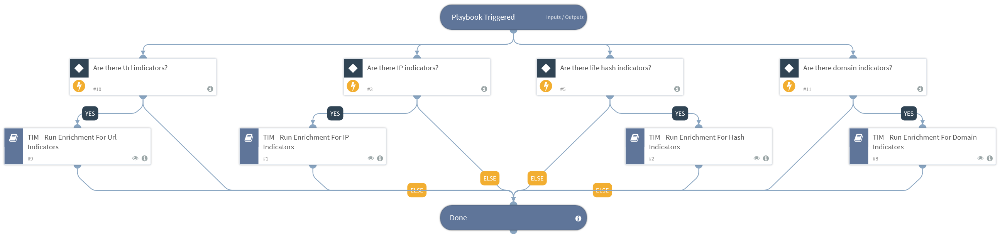

This playbook performs enrichment on indicators
  based on playbook query, as specified in the playbook
  inputs. This playbook needs to be used with caution as it might use up the user
  enrichment integration's API license when running enrichment for large amounts of
  indicators. Example queries can be "tags:example_tag" for indicators with a specific tag. For a specific feed name"
  the query will be "sourceBrands:example_feed". For a specifc reputation the query will be "reputation:None" etc.

## Dependencies
This playbook uses the following sub-playbooks, integrations, and scripts.

### Sub-playbooks
* TIM - Run Enrichment For Hash Indicators
* TIM - Run Enrichment For Domain Indicators
* TIM - Run Enrichment For IP Indicators
* TIM - Run Enrichment For Url Indicators

### Integrations
This playbook does not use any integrations.

### Scripts
This playbook does not use any scripts.

### Commands
This playbook does not use any commands.

## Playbook Inputs
---

| **Name** | **Description** | **Default Value** | **Required** |
| --- | --- | --- | --- |
| Indicator Query | Indicators matching the indicator query will be used as playbook input |  | Optional |

## Playbook Outputs
---
There are no outputs for this playbook.

## Playbook Image
---
