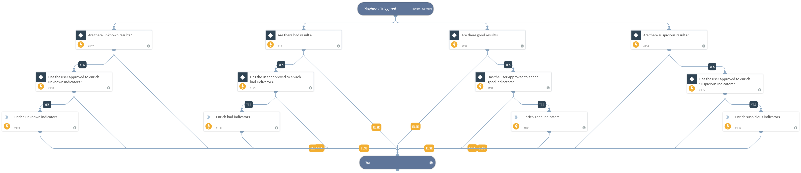

This playbook processes indicators by enriching indicators
based on the indicator feed's reputation, as specified in the playbook
inputs. This playbook needs to be used with caution as it might use up the user
enrichment integration's API license when running enrichment for large amounts of
indicators.

## Dependencies

This playbook uses the following sub-playbooks, integrations, and scripts.

### Sub-playbooks

This playbook does not use any sub-playbooks.

### Integrations

This playbook does not use any integrations.

### Scripts

This playbook does not use any scripts.

### Commands

* enrichIndicators

## Playbook Inputs

---

| **Name** | **Description** | **Default Value** | **Required** |
| --- | --- | --- | --- |
| Indicator Query | Indicators matching the indicator query will be used as playbook input |  | Optional |
| EnrichBadIndicators | Enter a value of true to enrich indicators whose reputation from the feed is bad. |  | Optional |
| EnrichGoodIndicators | Enter a value of true to enrich indicators whose reputation from the feed is good. |  | Optional |
| EnrichSuspiciousIndicators | Enter a value of true to enrich indicators whose reputation from the feed is suspicious. |  | Optional |
| EnrichUnknownIndicators | Enter a value of true to enrich indicators whose reputation from the feed is unknown. |  | Optional |

## Playbook Outputs

---
There are no outputs for this playbook.

## Playbook Image

---

