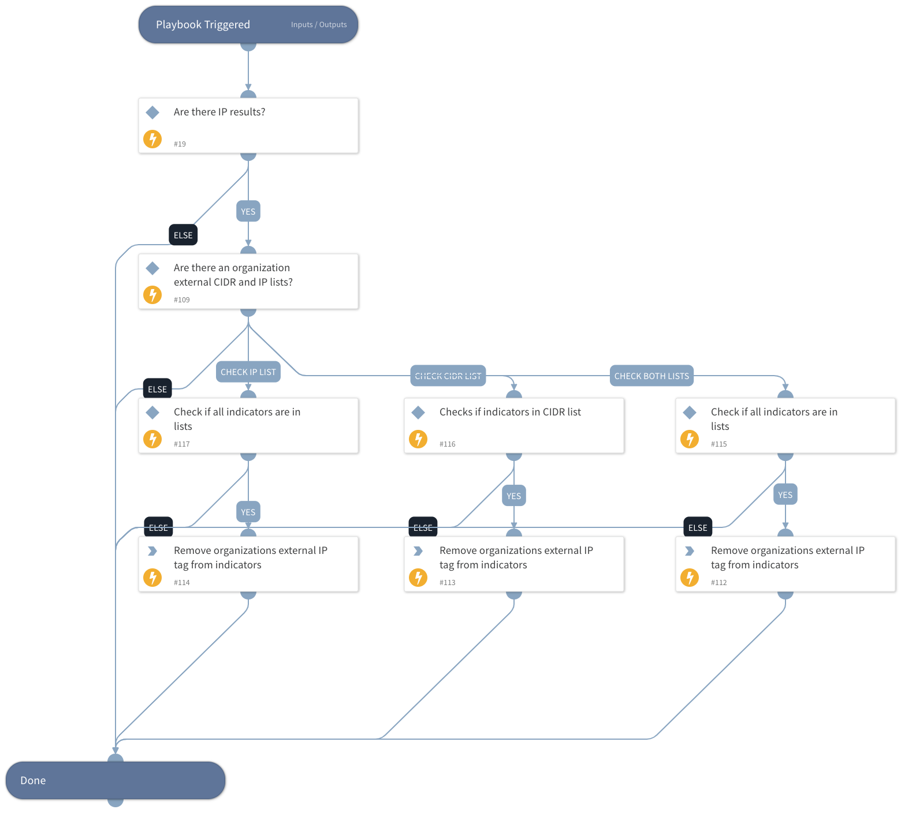

This playbook checks if an indicator with a tag of *organizational_external_ip* has been updated and keeps/removes the tag according to the check results.

## Dependencies
This playbook uses the following sub-playbooks, integrations, and scripts.

### Commands
* removeIndicatorField

## Playbook Inputs
---

| **Name** | **Description** | **Default Value** | **Required** |
| --- | --- | --- | --- |
| Indicator Query | Indicators matching the indicator query will be used as playbook input | type:IP tags:organizational_external_ip | Optional |
| OrganizationsExternalIPList | A Cortex XSOAR list containing the organization's External IP address values. The value should be taken from the Lists inputs. The list should be with comma-separated values. |  | Optional |
| OrganizationsExternalCIDRList | A Cortex XSOAR list containing the organizational External CIDR values. The value should be taken from the Lists inputs. The list should be with comma-separated values. |  | Optional |

## Playbook Outputs
---
There are no outputs for this playbook.

## Playbook Image
---

