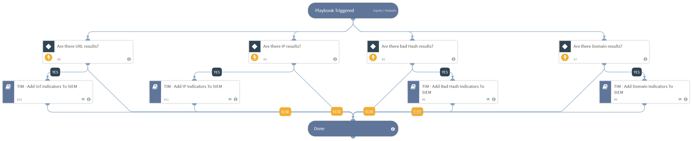

This playbook runs sub playbooks that send indicators to your SIEM. To select the indicators you want to add, go to playbook inputs, choose “from indicators” and set your query. For example tags:approved_black, approved_white etc. The purpose of the playbook is to send to SIEM only indicators that have been processed and tagged accordingly after an automatic or manual review process. The default playbook query is"
(type:ip or type:file or type:Domain or type:URL) -tags:pending_review and (tags:approved_black or tags:approved_white or tags:approved_watchlist)"
In case more indicator types need to be sent to the SIEM, the query must be edited accordingly.

## Dependencies
This playbook uses the following sub-playbooks, integrations, and scripts.

### Sub-playbooks
* TIM - Add IP Indicators To SIEM
* TIM - Add Bad Hash Indicators To SIEM
* TIM - Add Domain Indicators To SIEM
* TIM - Add Url Indicators To SIEM

### Integrations
This playbook does not use any integrations.

### Scripts
This playbook does not use any scripts.

### Commands
This playbook does not use any commands.

## Playbook Inputs
---

| **Name** | **Description** | **Default Value** | **Required** |
| --- | --- | --- | --- |
| Indicator Query | Indicators matching the indicator query will be used as playbook input | (type:ip or type:file or type:Domain or type:URL) -tags:pending_review and (tags:approved_black or tags:approved_white or tags:approved_watchlist) | Optional |

## Playbook Outputs
---
There are no outputs for this playbook.

## Playbook Image
---

