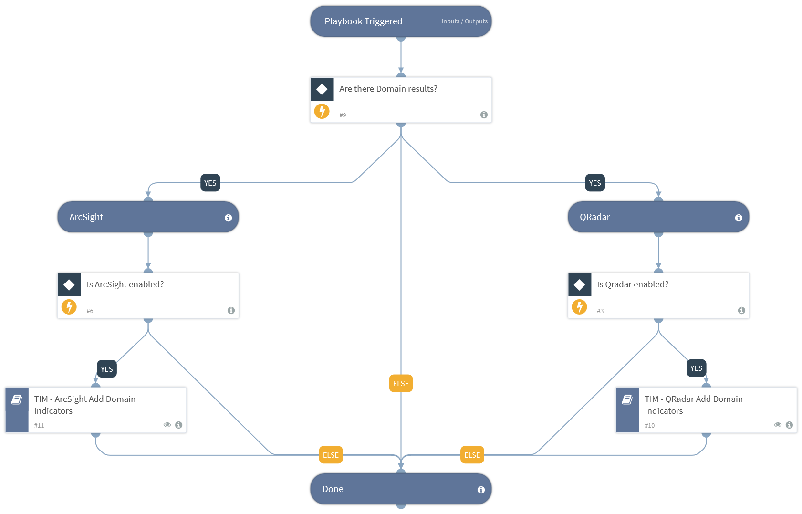

This playbook receives indicators from its parent playbook and provides the indicators as inputs for the sub-playbooks that push the indicators to the SIEM.

## Dependencies
This playbook uses the following sub-playbooks, integrations, and scripts.

### Sub-playbooks
* TIM - ArcSight Add Domain Indicators
* TIM - QRadar Add Domain Indicators

### Integrations
* ArcSight ESM v2
* QRadar

### Scripts
This playbook does not use any scripts.

### Commands
This playbook does not use any commands.

## Playbook Inputs
---

| **Name** | **Description** | **Default Value** | **Required** |
| --- | --- | --- | --- |
| Indicator Query | Indicators matching the indicator query will be used as playbook input |  | Optional |

## Playbook Outputs
---
There are no outputs for this playbook.

## Playbook Image
---
