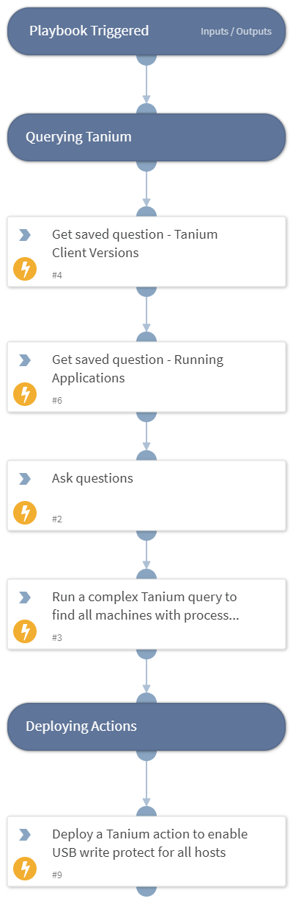

This playbook shows how to use automation scripts to interact with Tanium.

## Dependencies

This playbook uses the following sub-playbooks, integrations, and scripts.

### Sub-playbooks

This playbook does not use any sub-playbooks.

### Integrations

* Tanium
* Tanium_v2

### Scripts

This playbook does not use any scripts.

### Commands

* tn-get-saved-question-metadata
* tn-ask-question
* tn-deploy-package

## Playbook Inputs

---
There are no inputs for this playbook.

## Playbook Outputs

---
There are no outputs for this playbook.

## Playbook Image

---

