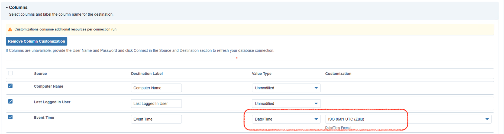

<~XSIAM>
# Tanium 
This pack includes Cortex XSIAM content.

## Configuration on Server Side

### Tanium Integrity Monitor logs
In order to forward Tanium Integrity Monitor logs, follow the steps below.

You will need to configure a Socket Receiver on the Tanium side.

1. Go to **Modules** > **Interact**.
2. Copy the following question to the "Ask a Question" box under **Explore Data** and run it.
```bash
Get Computer Name and Last Logged In User and Integrity Monitor - Monitor Events[10,0,360,15,0,""] from all machines
```
3. Click **Save** and configure the question as described in the next steps.
4. Under **Name**, write "XSIAM Integrity Montior".
5. From the **Content Set** dropdown, select **Base**.
6. Verify that the text under **Question Text** matches the question mentioned in step 2.
7. Check the "Reissue this question every" checkbox, and set it to 2 hours.
8. Go to **Modules** > **Connect**.
9. Enter a name and description for the connection.
10. From the **Source** dropdown, select **Saved Question**.
11. From the **Saved Question Name** dropdown, select **XSIAM Integrity Montior**.
12. From the **Destination** dropdown, select **Socket Receiver**.
13. Specify a unique name for the **Destination Name**.
14. Under **Host**, fill in the name or the IP address of the SIEM.
15. Specify the port number under **Port**.
16. Select **JSON** from the dropdown under **Format**.
17. Check the "Enable Schedule" checkbox under **Schedule**.
18. Set the **Timezone** to UTC.
19. From the **Frequency** dropdown, select **Multiple runs per day, every day**.
20. From the **Hour Interval** dropdown, select **Every 2nd hour**.
21. From the **Minute** dropdown, select **On the hour**.
22. Click **Save**.

More information can be found [here](https://docs.tanium.com/integrity_monitor/integrity_monitor/overview.html?cloud=false)

**Note:**
Make sure to send the logs in UTC time. 
Modify the value type of the "Event Time" field to "Date/Time" and select "ISO 8601 UTC (Zulu)".
The supported time format is yyyy-MM-ddThh:mm:ssZ (2021-01-15T10:00:00Z). The relevant field is "Event Time".


## Collect Events from Vendor
In order to use the collector, use the [Broker VM](#broker-vm) option.


### Broker VM
To create or configure the Broker VM, use the information described [here](https://docs-cortex.paloaltonetworks.com/r/Cortex-XDR/Cortex-XDR-Pro-Administrator-Guide/Configure-the-Broker-VM).

You can configure the specific vendor and product for this instance.

#### Tanium Integrity Monitor logs
1. Navigate to **Settings** > **Configuration** > **Data Broker** > **Broker VMs**. 
2. Go to the apps tab and add the **Syslog** app. If it already exists, click the **Syslog** app and then click **Configure**.
3. Click **Add New**.
4. When configuring the Syslog Collector, set the following values:
   - vendor as vendor - tanium
   - product as product - integrity_monitor
</~XSIAM>