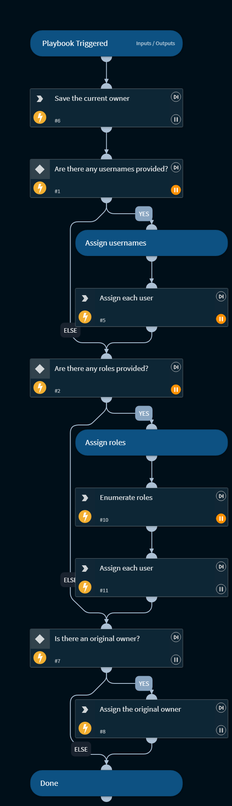

This playbook will accept a CSV of usernames and / or a CSV of role names (of which to enumerate for usernames) to add to the incidents team members.

The playbook will determine the existing owner and ensure that they are replaced as the owner once complete.

## Dependencies
This playbook uses the following sub-playbooks, integrations, and scripts.

### Sub-playbooks
This playbook does not use any sub-playbooks.

### Integrations
This playbook does not use any integrations.

### Scripts
* AssignAnalystToIncident
* EnumerateRoles
* Set

### Commands
This playbook does not use any commands.

## Playbook Inputs
---

| **Name** | **Description** | **Default Value** | **Required** |
| --- | --- | --- | --- |
| usernames | A CSV of usernames to add to the team of the incident. |  | Optional |
| roles | A CSV of role names to enumerate for usernames to add to the team of the incident. |  | Optional |

## Playbook Outputs
---
There are no outputs for this playbook.

## Playbook Image
---
![Set Team Members]
