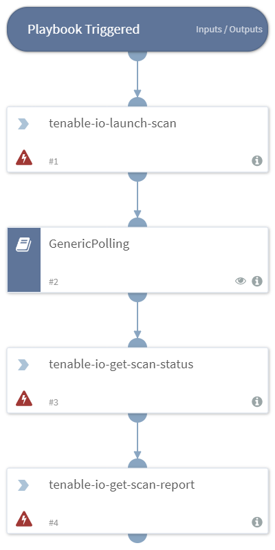

Runs a Tenable.io scan.

## Dependencies
This playbook uses the following sub-playbooks, integrations, and scripts.

### Sub-playbooks
* GenericPolling

### Integrations
This playbook does not use any integrations.

### Scripts
This playbook does not use any scripts.

### Commands
* tenable-io-get-scan-status
* tenable-io-get-scan-report
* tenable-io-launch-scan

## Playbook Inputs
---

| **Name** | **Description** | **Required** |
| --- | --- | --- | 
| scan-id | The ID of the tenable scan to run. | Required |
| targets | The alternative targets list to the scan's configured targets. | Optional |

## Playbook Outputs
---
There are no outputs for this playbook.

## Playbook Image
---

