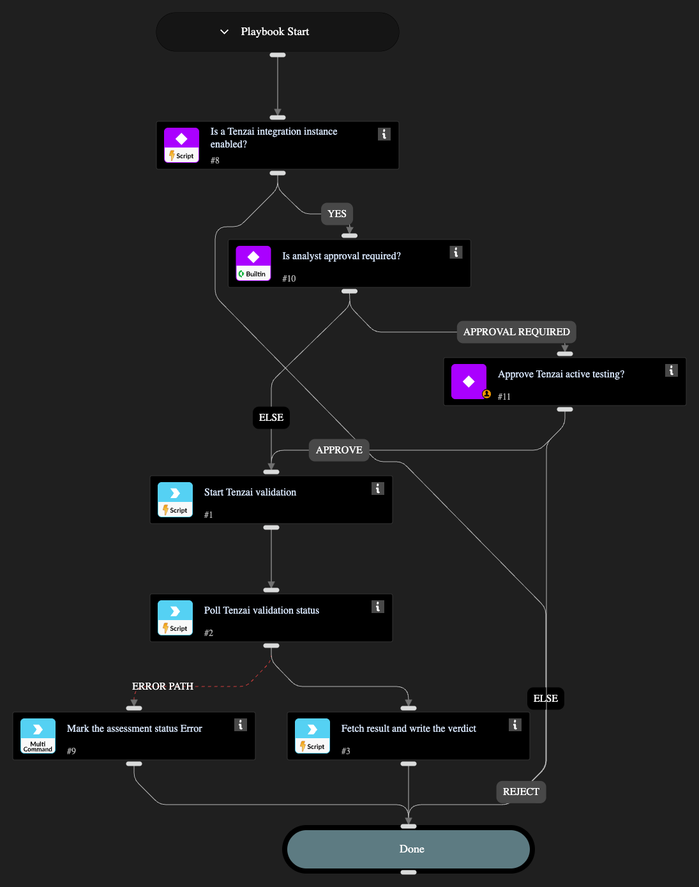

Validates an ASM-discovered exposure with Tenzai's agentic penetration testing.
Triggers a Tenzai validation assessment, polls until it completes, fetches the verdict,
and records the verdict in the Tenzai issue fields. It does not change the issue severity.

## Dependencies

This playbook uses the following sub-playbooks, integrations, and scripts.

### Sub-playbooks

This playbook does not use any sub-playbooks.

### Integrations

* Tenzai

### Scripts

* IsIntegrationAvailable
* StartAgenticValidation

### Commands

* setIncident
* tenzai-get-scan

## Playbook Inputs

---

| **Name** | **Description** | **Default Value** | **Required** |
| --- | --- | --- | --- |
| PollingInterval | The interval, in seconds, between Tenzai scan status polls. | 60 | Optional |
| PollingTimeout | The maximum time, in seconds, to wait for the Tenzai scan to reach a terminal state before giving up. | 3600 | Optional |

## Playbook Outputs

---
There are no outputs for this playbook.

## Playbook Image

---

