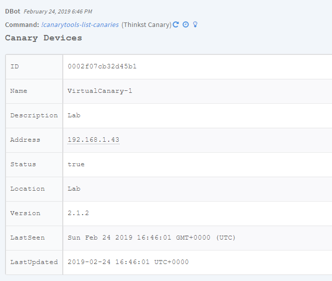
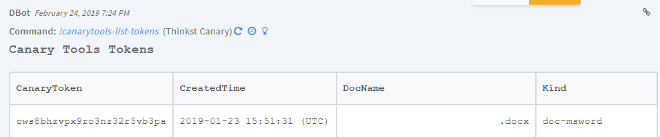
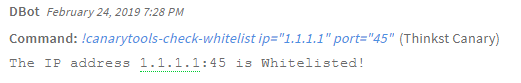
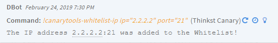
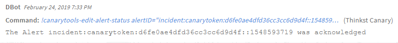
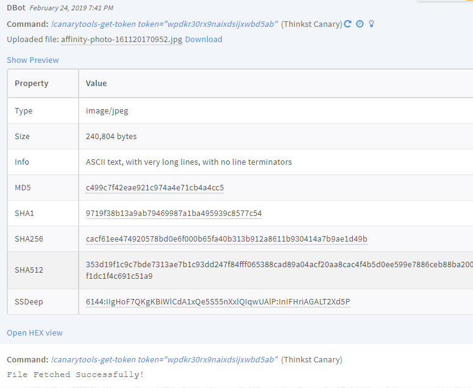

<!-- HTML_DOC -->

By presenting itself as an apparently benign and legitimate service(s), the canary draws the attention of unwanted activity. When someone trips one of the Canary’s triggers, an alert is sent to notify the responsible parties so that action can be taken before valuable systems in your network are compromised.

<h2 id="use-cases">Use Cases</h2>

<ul>
<li>Fetch alerts from CanaryTools as incidents in Cortex XSOAR and acknowledge them.</li>
<li>Get information about all registered Canaries.</li>
<li>Get information about Canary Tokens.</li>
<li>Add IP addresses to allow list.</li>
</ul>

<h2 id="configure-thinkst-canary-on-demisto">Configure Thinkst Canary on Cortex XSOAR</h2>

For information about how to get your Authentication Token, see the <a href="https://help.canary.tools/hc/en-gb/articles/360012727537-How-does-the-API-work-">Canary documentation</a>.

<ol>
<li>Navigate to <strong>Settings</strong> &gt; <strong>Integrations</strong> &gt; <strong>Servers &amp; Services</strong>.</li>
<li>Search for Thinkst Canary.</li>
<li>Click <strong>Add instance</strong> to create and configure a new integration instance.
<ul>
<li>
<strong>Name</strong>: A textual name for the integration instance.</li>
<li>
<strong>Fetch incidents</strong>: Should the instance fetch incidents or not</li>
<li>
<strong>Incident type</strong>: Choose a type for Canary Tools incidents</li>
<li><strong>Canary Server URL</strong></li>
<li><strong>API auth token</strong></li>
<li><strong>Trust any certificate (not secure)</strong></li>
<li><strong>Use system proxy settings</strong></li>
</ul>
</li>
<li>Click <strong>Test</strong> to validate the URLs, token, and connection.</li>
</ol>

<h2 id="commands">Commands</h2>

You can execute these commands from the Cortex XSOAR CLI, as part of an automation, or in a playbook. After you successfully execute a command, a DBot message appears in the War Room with the command details.

<ol>
<li><a href="#list-all-registered-canaries" target="_self">List all registered Canaries: canarytools-list-canaries</a></li>
<li><a href="#list-all-canary-tokens" target="_self">List all Canary tokens: canarytools-list-tokens</a></li>
<li><a href="#check-if-an-ip-address-is-whitelisted" target="_self">Check if an IP address is whitelisted: canarytools-check-whitelist</a></li>
<li><a href="#add-an-ip-address-to-the-whitelist" target="_self">Add an IP address to the allow list: canarytools-whitelist-ip</a></li>
<li><a href="#edit-an-alert-status" target="_self">Edit an alert status: canarytools-edit-alert-status</a></li>
<li><a href="#get-a-canary-token-file" target="_self">Get a Canary Token file: canarytools-get-token</a></li>
</ol>

<h3 id="list-all-registered-canaries">1. List all registered Canaries</h3>

Lists all registered Canaries.

<h5 id="base-command">Base Command</h5>

<code>canarytools-list-canaries</code>

<h5 id="input">Input</h5>

There are no input arguments for this command.

<h5 id="context-output">Context Output</h5>

<table style="width: 745px;">
<thead>
<tr>
<th style="width: 326px;"><strong>Path</strong></th>
<th style="width: 32px;"><strong>Type</strong></th>
<th style="width: 382px;"><strong>Description</strong></th>
</tr>
</thead>
<tbody>
<tr>
<td style="width: 326px;">CanaryTools.Device.ID</td>
<td style="width: 32px;">string</td>
<td style="width: 382px;">Device ID</td>
</tr>
<tr>
<td style="width: 326px;">CanaryTools.Device.Name</td>
<td style="width: 32px;">string</td>
<td style="width: 382px;">Device name</td>
</tr>
<tr>
<td style="width: 326px;">CanaryTools.Device.Description</td>
<td style="width: 32px;">string</td>
<td style="width: 382px;">Device description</td>
</tr>
<tr>
<td style="width: 326px;">CanaryTools.Device.Address</td>
<td style="width: 32px;">string</td>
<td style="width: 382px;">Device IP address</td>
</tr>
<tr>
<td style="width: 326px;">CanaryTools.Device.Status</td>
<td style="width: 32px;">boolean</td>
<td style="width: 382px;">Device status - Live (True/False)</td>
</tr>
<tr>
<td style="width: 326px;">CanaryTools.Device.Location</td>
<td style="width: 32px;">string</td>
<td style="width: 382px;">Device location</td>
</tr>
<tr>
<td style="width: 326px;">CanaryTools.Device.Version</td>
<td style="width: 32px;">string</td>
<td style="width: 382px;">Device version</td>
</tr>
<tr>
<td style="width: 326px;">CanaryTools.Device.LastSeen</td>
<td style="width: 32px;">date</td>
<td style="width: 382px;">Device last seen time</td>
</tr>
<tr>
<td style="width: 326px;">CanaryTools.Device.LastUpdated</td>
<td style="width: 32px;">date</td>
<td style="width: 382px;">Device last updated time</td>
</tr>
</tbody>
</table>

 

<h5 id="command-example">Command Example</h5>

<pre>!canarytools-list-canaries</pre>

<h5 id="context-example">Context Example</h5>

<pre>{  
   "CanaryTools":{  
      "Device":{  
         "Status":true,
         "Description":"Lab",
         "LastUpdated":"2019-02-24 16:46:01 UTC+0000",
         "Version":"2.1.2",
         "Location":"Lab",
         "Address":"192.168.1.43",
         "Name":"VirtualCanary-1",
         "ID":"0002f07cb32d45b1",
         "LastSeen":"Sun Feb 24 2019 16:46:01 GMT+0000 (UTC)"
      }
   }
}
</pre>

<h5 id="human-readable-output">Human Readable Output</h5>

<h3 id="list-all-canary-tokens">2. List all Canary tokens</h3>

Lists all Canary tokens.

<h5 id="base-command-1">Base Command</h5>

<code>canarytools-list-tokens</code>

<h5 id="input-1">Input</h5>

There are no input arguments for this command.

<h5 id="context-output-1">Context Output</h5>

<table style="width: 747px;">
<thead>
<tr>
<th style="width: 257px;"><strong>Path</strong></th>
<th style="width: 21px;"><strong>Type</strong></th>
<th style="width: 462px;"><strong>Description</strong></th>
</tr>
</thead>
<tbody>
<tr>
<td style="width: 257px;">CanaryTools.Tokens.CanaryToken</td>
<td style="width: 21px;">string</td>
<td style="width: 462px;">Canary Token</td>
</tr>
<tr>
<td style="width: 257px;">CanaryTools.Tokens.CreatedTime</td>
<td style="width: 21px;">date</td>
<td style="width: 462px;">Token Created time</td>
</tr>
<tr>
<td style="width: 257px;">CanaryTools.Tokens.Status</td>
<td style="width: 21px;">boolean</td>
<td style="width: 462px;">Token status - Enabled (True / False)</td>
</tr>
<tr>
<td style="width: 257px;">CanaryTools.Tokens.Kind</td>
<td style="width: 21px;">string</td>
<td style="width: 462px;">Token Kind</td>
</tr>
<tr>
<td style="width: 257px;">CanaryTools.Tokens.Triggered</td>
<td style="width: 21px;">number</td>
<td style="width: 462px;">Token triggered count</td>
</tr>
<tr>
<td style="width: 257px;">CanaryTools.Tokens.DocName</td>
<td style="width: 21px;">string</td>
<td style="width: 462px;">Token document name (If the token is from type document)</td>
</tr>
<tr>
<td style="width: 257px;">CanaryTools.Tokens.TokenURL</td>
<td style="width: 21px;">string</td>
<td style="width: 462px;">Token URL (How the token is presented)</td>
</tr>
</tbody>
</table>

 

<h5 id="command-example-1">Command Example</h5>

<pre>!canarytools-list-tokens</pre>

<h5 id="context-example-1">Context Example</h5>

<pre>{  
   "CanaryTools":{  
      "Tokens":[  
         {  
            "Status":true,
            "Kind":"doc-msword",
            "Triggered":16,
            "TokenURL":"http://e71ed0532685.o3n.io/cdn/ows8bhzvpx9ro3nz32r5vb3pa/logo.gif",
            "DocName":"token.docx",
            "CanaryToken":"ows8bhzvpx9ro3nz32t5vb3pa",
            "CreatedTime":"2019-01-23 15:51:31 (UTC)"
         }
      ]
   }
}
</pre>

<h5 id="human-readable-output-1">Human Readable Output</h5>

<h3 id="check-if-an-ip-address-is-whitelisted">3. Check if an IP address is on allow list</h3>

Checks whether a given IP address and port are on allow list.

<h5 id="base-command-2">Base Command</h5>

<code>canarytools-check-whitelist</code>

<h5 id="input-2">Input</h5>

<table style="width: 749px;">
<thead>
<tr>
<th style="width: 299px;"><strong>Argument Name</strong></th>
<th style="width: 272px;"><strong>Description</strong></th>
<th style="width: 169px;"><strong>Required</strong></th>
</tr>
</thead>
<tbody>
<tr>
<td style="width: 299px;">ip</td>
<td style="width: 272px;">IP address</td>
<td style="width: 169px;">Required</td>
</tr>
<tr>
<td style="width: 299px;">port</td>
<td style="width: 272px;">Destination port</td>
<td style="width: 169px;">Optional</td>
</tr>
</tbody>
</table>

 

<h5 id="context-output-2">Context Output</h5>

<table style="width: 749px;">
<thead>
<tr>
<th style="width: 275px;"><strong>Path</strong></th>
<th style="width: 66px;"><strong>Type</strong></th>
<th style="width: 399px;"><strong>Description</strong></th>
</tr>
</thead>
<tbody>
<tr>
<td style="width: 275px;">CanaryTools.IP.Address</td>
<td style="width: 66px;">string</td>
<td style="width: 399px;">IP address</td>
</tr>
<tr>
<td style="width: 275px;">CanaryTools.IP.Port</td>
<td style="width: 66px;">string</td>
<td style="width: 399px;">Destination port for the IP allow list</td>
</tr>
<tr>
<td style="width: 275px;">CanaryTools.IP.Whitelisted</td>
<td style="width: 66px;">boolean</td>
<td style="width: 399px;">Is the IP address on allow list (true/false)</td>
</tr>
</tbody>
</table>

 

<h5 id="command-example-2">Command Example</h5>

<pre>!canarytools-check-whitelist ip=1.1.1.1 port=45</pre>

<h5 id="context-example-2">Context Example</h5>

<pre>{  
   "CanaryTools":{  
      "IP":{  
         "Whitelisted":"True",
         "Port":"45",
         "Address":"1.1.1.1"
      }
   }
}
</pre>

<h5 id="human-readable-output-2">Human Readable Output</h5>

<h3 id="add-an-ip-address-to-the-whitelist">4. Add an IP address to the allow list</h3>

Adds an IP address to the allow list in Canary.

<h5 id="base-command-3">Base Command</h5>

<code>canarytools-whitelist-ip</code>

<h5 id="input-3">Input</h5>

<table style="width: 747px;">
<thead>
<tr>
<th style="width: 231px;"><strong>Argument Name</strong></th>
<th style="width: 493px;"><strong>Description</strong></th>
<th style="width: 16px;"><strong>Required</strong></th>
</tr>
</thead>
<tbody>
<tr>
<td style="width: 231px;">ip</td>
<td style="width: 493px;">IP address to allow list</td>
<td style="width: 16px;">Required</td>
</tr>
<tr>
<td style="width: 231px;">port</td>
<td style="width: 493px;">Destination port to allow list</td>
<td style="width: 16px;">Optional</td>
</tr>
</tbody>
</table>

 

<h5 id="context-output-3">Context Output</h5>

<table style="width: 748px;">
<thead>
<tr>
<th style="width: 266px;"><strong>Path</strong></th>
<th style="width: 39px;"><strong>Type</strong></th>
<th style="width: 435px;"><strong>Description</strong></th>
</tr>
</thead>
<tbody>
<tr>
<td style="width: 266px;">CanaryTools.IP.Address</td>
<td style="width: 39px;">string</td>
<td style="width: 435px;">IP address</td>
</tr>
<tr>
<td style="width: 266px;">CanaryTools.IP.Port</td>
<td style="width: 39px;">string</td>
<td style="width: 435px;">Destination port for the IP allow list</td>
</tr>
<tr>
<td style="width: 266px;">CanaryTools.IP.Whitelisted</td>
<td style="width: 39px;">boolean</td>
<td style="width: 435px;">Is the IP address on allow list (True/False)</td>
</tr>
</tbody>
</table>

 

<h5 id="command-example-3">Command Example</h5>

<pre>!canarytools-whitelist-ip ip=2.2.2.2 port=21</pre>

<h5 id="context-example-3">Context Example</h5>

<pre>{  
   "CanaryTools":{  
      "IP":{  
         "Whitelisted":"True",
         "Port":"21",
         "Address":"2.2.2.2"
      }
   }
}
</pre>

<h5 id="human-readable-output-3">Human Readable Output</h5>

<h3 id="edit-an-alert-status">5. Edit an alert status</h3>

Edits the status for an alert in Canary Tools.

<h5 id="base-command-4">Base Command</h5>

<code>canarytools-edit-alert-status</code>

<h5 id="input-4">Input</h5>

<table style="width: 749px;">
<thead>
<tr>
<th style="width: 155px;"><strong>Argument Name</strong></th>
<th style="width: 514px;"><strong>Description</strong></th>
<th style="width: 71px;"><strong>Required</strong></th>
</tr>
</thead>
<tbody>
<tr>
<td style="width: 155px;">alertID</td>
<td style="width: 514px;">Alert ID (e.g., incident:canarytoken:d6fe0ae4dfd36cc3cc6d9d4f::1548593719)</td>
<td style="width: 71px;">Required</td>
</tr>
<tr>
<td style="width: 155px;">status</td>
<td style="width: 514px;">Required status for the alert (Acknowledge, Unacknowledge)</td>
<td style="width: 71px;">Required</td>
</tr>
</tbody>
</table>

 

<h5 id="context-output-4">Context Output</h5>

<table style="width: 747px;">
<thead>
<tr>
<th style="width: 328px;"><strong>Path</strong></th>
<th style="width: 35px;"><strong>Type</strong></th>
<th style="width: 377px;"><strong>Description</strong></th>
</tr>
</thead>
<tbody>
<tr>
<td style="width: 328px;">CanaryTools.Alert.ID</td>
<td style="width: 35px;">string</td>
<td style="width: 377px;">Alert ID</td>
</tr>
<tr>
<td style="width: 328px;">CanaryTools.Alert.Status</td>
<td style="width: 35px;">string</td>
<td style="width: 377px;">Alert status</td>
</tr>
</tbody>
</table>

 

<h5 id="command-example-4">Command Example</h5>

<pre>!canarytools-edit-alert-status alertID=incident:canarytoken:d6fe0ae4dfd36cc3cc6d9d4f::1548593719 status=Acknowledge</pre>

<h5 id="context-example-4">Context Example</h5>

<pre>{  
   "CanaryTools":{  
      "Alert":{  
         "Status":"Acknowledge",
         "ID":"incident:canarytoken:d6fe0ae4dfd36cc3cc6d9d4f::1548593719"
      }
   }
}
</pre>

<h5 id="human-readable-output-4">Human Readable Output</h5>

<h3 id="get-a-canary-token-file">6. Get a Canary Token file</h3>

Fetches a Canary Token file from the Canary Tools server.

<h5 id="base-command-5">Base Command</h5>

<code>canarytools-get-token</code>

<h5 id="input-5">Input</h5>

<table style="width: 747px;">
<thead>
<tr>
<th style="width: 267px;"><strong>Argument Name</strong></th>
<th style="width: 434px;"><strong>Description</strong></th>
<th style="width: 39px;"><strong>Required</strong></th>
</tr>
</thead>
<tbody>
<tr>
<td style="width: 267px;">token</td>
<td style="width: 434px;">Canary Token</td>
<td style="width: 39px;">Required</td>
</tr>
</tbody>
</table>

 

<h5 id="context-output-5">Context Output</h5>

<table style="width: 743px;">
<thead>
<tr>
<th style="width: 295px;"><strong>Path</strong></th>
<th style="width: 31px;"><strong>Type</strong></th>
<th style="width: 414px;"><strong>Description</strong></th>
</tr>
</thead>
<tbody>
<tr>
<td style="width: 295px;">CanaryTools.Tokens.CanaryToken</td>
<td style="width: 31px;">string</td>
<td style="width: 414px;">Canary Token</td>
</tr>
<tr>
<td style="width: 295px;">File.Size</td>
<td style="width: 31px;">string</td>
<td style="width: 414px;">File Size</td>
</tr>
<tr>
<td style="width: 295px;">File.SHA1</td>
<td style="width: 31px;">string</td>
<td style="width: 414px;">File SHA-1</td>
</tr>
<tr>
<td style="width: 295px;">File.SHA256</td>
<td style="width: 31px;">string</td>
<td style="width: 414px;">File SHA-256</td>
</tr>
<tr>
<td style="width: 295px;">File.Name</td>
<td style="width: 31px;">string</td>
<td style="width: 414px;">File name</td>
</tr>
<tr>
<td style="width: 295px;">File.SSDeep</td>
<td style="width: 31px;">string</td>
<td style="width: 414px;">File SSDeep</td>
</tr>
<tr>
<td style="width: 295px;">File.EntryID</td>
<td style="width: 31px;">string</td>
<td style="width: 414px;">File EntryID</td>
</tr>
<tr>
<td style="width: 295px;">File.Info</td>
<td style="width: 31px;">string</td>
<td style="width: 414px;">File info</td>
</tr>
<tr>
<td style="width: 295px;">File.Type</td>
<td style="width: 31px;">string</td>
<td style="width: 414px;">File type</td>
</tr>
<tr>
<td style="width: 295px;">File.MD5</td>
<td style="width: 31px;">string</td>
<td style="width: 414px;">File MD5</td>
</tr>
<tr>
<td style="width: 295px;">File.Extension</td>
<td style="width: 31px;">string</td>
<td style="width: 414px;">File extension</td>
</tr>
</tbody>
</table>

 

<h5 id="command-example-5">Command Example</h5>

<pre>!canarytools-get-token token=wpdkr30rx9naixdsijxdbd5ab</pre>

<h5 id="context-example-5">Context Example</h5>

<pre>{  
   "CanaryTools":{  
      "Tokens":"wpdkr30rx9naixdsijxwbd5ab"
   },
   "File":{  
      "Info":"image/jpeg",
      "SHA1":"9719f38b13a9ab79469987a1ba495939c8577c54",
      "Name":"affinity-photo-161120170952.jpg",
      "Extension":"jpg",
      "Size":240804,
      "EntryID":"163@f7519b11-9105-4dd4-8036-fe2790f28ca6",
      "SSDeep":"6144:IIgHoF7QKgKBiWlCdA1xQe5S55nXxlQIqwUAlP:InIFHriAGALT2Xd5P",
      "SHA256":"cacf61ee474920578bd0e6f000b65fa40b313b912a8611b930414a7b9ae1d49b",
      "Type":"ASCII text, with very long lines, with no line terminators\n",
      "MD5":"c499c7f42eae921c974a4e71cb4a4cc5"
   }
}
</pre>

<h5 id="human-readable-output-5">Human Readable Output</h5>

