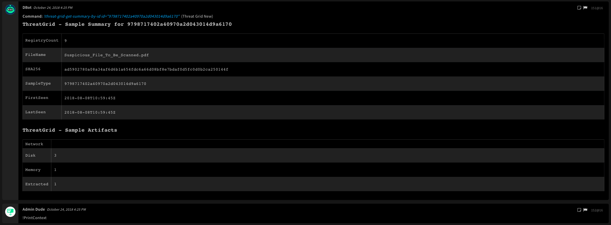

<!-- HTML_DOC -->
<h2>redOverview</h2>

Use the Cisco Threat Grid integration to manage and query threat feeds and samples.

This integration was integrated and tested with Cisco Threat Grid v3.5.10.

<h2>Threat Grid Playbook</h2>

<h2>Use cases</h2>

<h2>Configure Threat Grid on Cortex XSOAR</h2>

<ol>
<li>Navigate to <strong>Settings</strong> &gt; <strong>Integrations</strong> &gt; <strong>Servers &amp; Services</strong>.</li>
<li>Search for Threat Grid.</li>
<li>Click <strong>Add instance</strong> to create and configure a new integration instance. You should configure the following settings:</li>
</ol>
<ul>
<li>
<strong>Name</strong>: a textual name for the integration instance.</li>
<li><strong>Server URL (e.g. <a href="https://192.168.0.1/" rel="nofollow">https://192.168.0.1</a>)</strong></li>
<li><strong>API token</strong></li>
<li><strong>Trust any certificate (not secure)</strong></li>
<li><strong>Use system proxy settings</strong></li>
</ul>
<ol start="4">
<li>Click <strong>Test</strong> to validate the URLs, token, and connection.</li>
</ol>
<h2>Commands</h2>

You can execute these commands from the Cortex XSOAR CLI, as part of an automation, or in a playbook. After you successfully execute a command, a DBot message appears in the War Room with the command details.

<ol>
<li><a href="#h_16996161761540718403094">Get samples: threat-grid-get-samples</a></li>
<li><a href="#h_1561995056331540718972103">Get a sample by sample ID: threat-grid-get-sample-by-id</a></li>
<li><a href="#h_19882953012581540720706470">Get the states of samples by sample ID: threat-grid-get-sample-state-by-id</a></li>
<li><a href="#h_19278147818811540720826262">Submit a sample for analysis: threat-grid-upload-sample</a></li>
<li><a href="#h_94143499121961540721013239">Search submissions: threat-grid-search-submissions</a></li>
<li><a href="#h_81304179325101540721063469">Get a sample analysis video by ID: threat-grid-get-video-by-id</a></li>
<li><a href="#h_50927995434311540721171927">Get a detailed overview of a sample: threat-grid-get-analysis-by-id</a></li>
<li><a href="#h_72983432240461540721271350">Get processes by ID: threat-grid-get-processes-by-id</a></li>
<li><a href="#h_39054092746591540721396205">Get a PCAP file for a sample by sample ID: threat-grid-get-pcap-by-id</a></li>
<li><a href="#h_63774004052701540721494707">Get warnings for a sample by sample ID: threat-grid-get-warnings-by-id</a></li>
<li><a href="#h_2190211961791540721645652">Get a summary analysis for a sample by sample ID: threat-grid-get-summary-by-id</a></li>
<li><a href="#h_3510202267861540721749733">Get a summary of threats detected during an analysis: threat-grid-get-threat-summary-by-id</a></li>
<li><a href="#h_64622853270931540721845547">Get the HTML report for a sample by sample ID: threat-grid-get-html-report-by-id</a></li>
<li><a href="#h_98022694076961540722069916">Download a sample as a ZIP file: threat-grid-download-sample-by-id</a></li>
<li><a href="#h_22118886180011540722965084">Get a list of IOCs found during a sample run: threat-grid-get-analysis-iocs</a></li>
<li><a href="#h_86250776383051540723048488">Get information for the logged in user: threat-grid-who-am-i</a></li>
<li><a href="#h_14456317689011540723175792">Get the rate limit for a specified user: threat-grid-user-get-rate-limit</a></li>
<li><a href="#h_54946164292031540723340792">Get a specific threat feed: threat-grid-get-specific-feed</a></li>
<li><a href="#h_808021630100861540723744274">Convert a URL to a file for detonation: threat-grid-url-to-file</a></li>
<li><a href="#h_677431094103841540723877811">Get rate limits for an organization: threat-grid-organization-get-rate-limit</a></li>
<li><a href="#h_777805090106831540723972186">Search IP addresses: threat-grid-search-ips</a></li>
<li><a href="#h_260594164112681540724110178">Get annotation data for an analysis: threat-grid-get-analysis-annotations</a></li>
<li><a href="#h_59168991115651540724258610">Search samples: threat-grid-search-samples</a></li>
<li><a href="#h_507961918121481540724544988">Search URLs: threat-grid-search-urls</a></li>
<li><a href="#h_644064911124401540724766844">Get the states of samples: threat-grid-get-samples-state</a></li>
<li><a href="#h_218579845127351540724864745">Get the threat feed for artifacts: threat-grid-feeds-artifacts</a></li>
<li><a href="#h_917414666130261540724994579">Get the threat feed for a domain: threat-grid-feeds-domain</a></li>
<li><a href="#h_582901469136001540725233399">Get the threat feed for an IP address: threat-grid-feeds-ip</a></li>
<li><a href="#h_863465308141721540725372444">Get the threat feed for a network stream: threat-grid-feeds-network-stream</a></li>
<li><a href="#h_443858322147421540725717694">Get the threat feed for a path: threat-grid-feeds-path</a></li>
<li><a href="#h_15540268150301540725757215">Get the threat feed for a URL: threat-grid-feeds-url</a></li>
<li><a href="#h_119905262158771540726200222">Get the artifacts for a sample ID by artifact ID: threat-grid-get-analysis-artifact</a></li>
<li><a href="#h_545682989156031540726070486">Get artifacts for a sample ID: threat-grid-get-analysis-artifacts</a></li>
<li><a href="#h_668049232161671540726279174">Get analysis data for an IOC: threat-grid-get-analysis-ioc</a></li>
<li><a href="#h_682537753164501540726355577">Get metadata for an analysis: threat-grid-get-analysis-metadata</a></li>
<li><a href="#h_26151182170081540728061465">Get data for a network stream: threat-grid-get-analysis-network-stream</a></li>
<li><a href="#h_805126484175651540728192194">Get the analysis for a threat stream: threat-grid-get-analysis-network-streams</a></li>
<li><a href="#h_462852935181201540728608321">Get data for a process ID in an analysis: threat-grid-get-analysis-process</a></li>
<li><a href="#h_601161801186731540728863204">Get data for an analysis process: threat-grid-get-analysis-processes</a></li>
<li><a href="#h_601161801186731540728863304">Submit URL for analysis: threat-grid-submit-urls</a></li>
<li><a href="#h_601161801186731540728863404">Run advanced search using the ThreatGrid search query: threat-grid-advanced-search</a></li>
</ol>
<h3 id="h_16996161761540718403094">1. Get samples</h3>

Get samples on the Threat Grid platform. Input parameters are combined with <em>AND</em> statements. Only finished samples can be searched. Finished samples have a status of <em>succ</em> or <em>fail</em>.

<h5>Base Command</h5>
<pre><code>threat-grid-get-samples</code></pre>
<h5>Input</h5>
<table style="width: 746px;" border="2" cellpadding="6">
<thead>
<tr>
<th style="width: 166px;"><strong>Argument Name</strong></th>
<th style="width: 400px;"><strong>Description</strong></th>
<th style="width: 142px;"><strong>Required</strong></th>
</tr>
</thead>
<tbody>
<tr>
<td style="width: 166px;">limit</td>
<td style="width: 400px;">Maximum number of results to return in the response</td>
<td style="width: 142px;">Optional</td>
</tr>
<tr>
<td style="width: 166px;">offset</td>
<td style="width: 400px;">The number of records to skip</td>
<td style="width: 142px;">Optional</td>
</tr>
<tr>
<td style="width: 166px;">sha256</td>
<td style="width: 400px;">SHA-256 of the submitted sample (only matches samples, not their artifacts)</td>
<td style="width: 142px;">Optional</td>
</tr>
<tr>
<td style="width: 166px;">md5</td>
<td style="width: 400px;">An MD5 checksum of the submitted sample (only matches samples, not their artifacts)</td>
<td style="width: 142px;">Optional</td>
</tr>
<tr>
<td style="width: 166px;">sha1</td>
<td style="width: 400px;">SHA-1 of the submitted sample, only matches samples, not their artifacts</td>
<td style="width: 142px;">Optional</td>
</tr>
<tr>
<td style="width: 166px;">id</td>
<td style="width: 400px;">ID of a sample</td>
<td style="width: 142px;">Optional</td>
</tr>
<tr>
<td style="width: 166px;">ids</td>
<td style="width: 400px;">Comma-separated list of sample IDs</td>
<td style="width: 142px;">Optional</td>
</tr>
<tr>
<td style="width: 166px;">ioc</td>
<td style="width: 400px;">IOC name</td>
<td style="width: 142px;">Optional</td>
</tr>
<tr>
<td style="width: 166px;">before</td>
<td style="width: 400px;">A date/time (ISO 8601), restricting results to samples submitted before that time (YYYY-MM-DD Thhmmss+)</td>
<td style="width: 142px;">-hhmm e.g. : 2012-04-19T04:00:55-0500</td>
</tr>
<tr>
<td style="width: 166px;">after</td>
<td style="width: 400px;">A date/time (ISO 8601), restricting results to samples submitted after that time (YYYY-MM-DD Thhmmss+)</td>
<td style="width: 142px;">-hhmm e.g. : 2012-04-19T04:00:55-0500"</td>
</tr>
<tr>
<td style="width: 166px;">org-only</td>
<td style="width: 400px;">If “true”, will only match against samples submitted by your organization</td>
<td style="width: 142px;">Optional</td>
</tr>
<tr>
<td style="width: 166px;">user-only</td>
<td style="width: 400px;">If “true”, will only match against samples you submitted</td>
<td style="width: 142px;">Optional</td>
</tr>
</tbody>
</table>
<h5> </h5>
<h5>Context Output</h5>
<table style="width: 748px;" border="2" cellpadding="6">
<thead>
<tr>
<th style="width: 348px;"><strong>Path</strong></th>
<th style="width: 373px;"><strong>Description</strong></th>
</tr>
</thead>
<tbody>
<tr>
<td style="width: 348px;">ThreatGrid.Sample.ID</td>
<td style="width: 373px;">The sample ID</td>
</tr>
<tr>
<td style="width: 348px;">ThreatGrid.Sample.Filename</td>
<td style="width: 373px;">The sample filename</td>
</tr>
<tr>
<td style="width: 348px;">ThreatGrid.Sample.State</td>
<td style="width: 373px;">The sample state</td>
</tr>
<tr>
<td style="width: 348px;">ThreatGrid.Sample.Status</td>
<td style="width: 373px;">The sample status</td>
</tr>
<tr>
<td style="width: 348px;">ThreatGrid.Sample.MD5</td>
<td style="width: 373px;">The sample MD5</td>
</tr>
<tr>
<td style="width: 348px;">ThreatGrid.Sample.SHA1</td>
<td style="width: 373px;">The sample SHA-1</td>
</tr>
<tr>
<td style="width: 348px;">ThreatGrid.Sample.SHA256</td>
<td style="width: 373px;">The sample SHA-256</td>
</tr>
<tr>
<td style="width: 348px;">ThreatGrid.Sample.OS</td>
<td style="width: 373px;">The sample OS</td>
</tr>
<tr>
<td style="width: 348px;">ThreatGrid.Sample.SubmittedAt</td>
<td style="width: 373px;">The sample submission time</td>
</tr>
<tr>
<td style="width: 348px;">ThreatGrid.Sample.StartedAt</td>
<td style="width: 373px;">The sample analysis starting time</td>
</tr>
<tr>
<td style="width: 348px;">ThreatGrid.Sample.CompletedAt</td>
<td style="width: 373px;">The sample completion time</td>
</tr>
</tbody>
</table>
<h5> </h5>
<h5>Command Example</h5>
<pre>!threat-grid-feeds-ip after=2018-01-18T00:00:00 before=2018-01-18T01:00:00 confidence=75 severity=75</pre>
<h5>Context Output</h5>
<pre><code>{
    "ThreatGrid": {
        "Sample": [
            {
                "Status": "job_done", 
                "SHA1": "f6ed96430b54a52740d3f7a0a246d1053ba7d779", 
                "CompletedAt": "2018-09-23T08:18:20Z", 
                "Filename": "8d3a3c399ac61a1e7ae6f6c68c67f1db2e88985066463a5ffb3dae0d552a64a5.exe", 
                "State": "succ", 
                "SubmittedAt": "2018-09-23T08:12:05Z", 
                "StartedAt": "2018-09-23T08:12:06Z", 
                "SHA256": "8d3a3c399ac61a1e7ae6f6c68c67f1db2e88985066463a5ffb3dae0d552a64a5", 
                "OS": "7601.18798.amd64fre.win7sp1_gdr.150316-1654", 
                "ID": "4bb1e6eed595513b2c07ba9bd4598f37", 
                "MD5": "c6bdbf3765854eef4981721947beba5f"
            }, 
            {
                "Status": "job_done", 
                "SHA1": "6b7808dd69ff255e982f9940d067b356f030ff14", 
                "CompletedAt": "2018-09-23T08:18:28Z", 
                "Filename": "8a577adc1b387c0dfc445b4a6f9a5bb54de13018c960624c0dcf35145aa00b03.exe", 
                "State": "succ", 
                "SubmittedAt": "2018-09-23T08:12:07Z", 
                "StartedAt": "2018-09-23T08:12:08Z", 
                "SHA256": "8a577adc1b387c0dfc445b4a6f9a5bb54de13018c960624c0dcf35145aa00b03", 
                "OS": "7601.18798.amd64fre.win7sp1_gdr.150316-1654", 
                "ID": "b75b886bcd4b888c2c6a779736509b12", 
                "MD5": "eb6f2ad4dcba833fd4411301ed8ae40e"
            }
        ]
    }
}
</code></pre>
<h5>Human Readable Output</h5>

<h3 id="h_1561995056331540718972103">2. Get a sample by sample ID</h3>

Get a Threat Grid sample by sample ID.

<h5>Base Command</h5>
<pre><code>threat-grid-get-sample-by-id</code></pre>
<h5>Input</h5>
<table style="width: 748px;" border="2" cellpadding="6">
<thead>
<tr>
<th style="width: 290px;"><strong>Argument Name</strong></th>
<th style="width: 246px;"><strong>Description</strong></th>
<th style="width: 172px;"><strong>Required</strong></th>
</tr>
</thead>
<tbody>
<tr>
<td style="width: 290px;">id</td>
<td style="width: 246px;">The sample ID</td>
<td style="width: 172px;">Required</td>
</tr>
</tbody>
</table>
<h5> </h5>
<h5>Context Output</h5>
<table style="width: 748px;" border="2" cellpadding="6">
<thead>
<tr>
<th style="width: 347px;"><strong>Path</strong></th>
<th style="width: 374px;"><strong>Description</strong></th>
</tr>
</thead>
<tbody>
<tr>
<td style="width: 347px;">ThreatGrid.Sample.ID</td>
<td style="width: 374px;">The sample ID</td>
</tr>
<tr>
<td style="width: 347px;">ThreatGrid.Sample.Filename</td>
<td style="width: 374px;">The sample filename</td>
</tr>
<tr>
<td style="width: 347px;">ThreatGrid.Sample.State</td>
<td style="width: 374px;">The sample state</td>
</tr>
<tr>
<td style="width: 347px;">ThreatGrid.Sample.Status</td>
<td style="width: 374px;">The sample status</td>
</tr>
<tr>
<td style="width: 347px;">ThreatGrid.Sample.MD5</td>
<td style="width: 374px;">The sample MD5</td>
</tr>
<tr>
<td style="width: 347px;">ThreatGrid.Sample.SHA1</td>
<td style="width: 374px;">The sample SHA-1</td>
</tr>
<tr>
<td style="width: 347px;">ThreatGrid.Sample.SHA256</td>
<td style="width: 374px;">The sample SHA-256</td>
</tr>
<tr>
<td style="width: 347px;">ThreatGrid.Sample.OS</td>
<td style="width: 374px;">The sample OS</td>
</tr>
<tr>
<td style="width: 347px;">ThreatGrid.Sample.SubmittedAt</td>
<td style="width: 374px;">The sample submission time</td>
</tr>
<tr>
<td style="width: 347px;">ThreatGrid.Sample.StartedAt</td>
<td style="width: 374px;">The sample analysis starting time</td>
</tr>
<tr>
<td style="width: 347px;">ThreatGrid.Sample.CompletedAt</td>
<td style="width: 374px;">The sample completion time</td>
</tr>
</tbody>
</table>
<h5> </h5>
<h5>Command Example</h5>
<pre>!threat-grid-get-sample-by-id id=052de338e02c4e013a4e9f5da8a87d5b</pre>
<h5>Context Example</h5>
<pre><code>{
    "ThreatGrid": {
        "Sample": {
            "Status": "filetype_not_supported", 
            "SHA1": "a253ac433faa9ac59a9f73c540355bfe2f9fe708", 
            "CompletedAt": "2018-07-07T10:11:06Z", 
            "Filename": "WR Package(1).rar", 
            "State": "fail", 
            "SubmittedAt": "2018-07-07T10:11:04Z", 
            "StartedAt": "2018-07-07T10:11:05Z", 
            "SHA256": "9aa6f1189fa01f852e595d4c847a76613aa157d14addbdeb2ac011f443c811d7", 
            "OS": null, 
            "ID": "052de338e02c4e013a4e9f5da8a87d5b", 
            "MD5": "69e51e9f3a5ffbf6970a754ebda56edd"
        }
    }
}
</code></pre>
<h5>Human Readable Output</h5>

<h3 id="h_19882953012581540720706470">3. Get the states of samples by sample ID</h3>

Get threat grid sample state by id

<h5>Base Command</h5>
<pre><code>threat-grid-get-sample-state-by-id</code></pre>
<h5>Input</h5>
<table style="width: 748px;" border="2" cellpadding="6">
<thead>
<tr>
<th style="width: 189px;"><strong>Argument Name</strong></th>
<th style="width: 409px;"><strong>Description</strong></th>
<th style="width: 110px;"><strong>Required</strong></th>
</tr>
</thead>
<tbody>
<tr>
<td style="width: 189px;">id</td>
<td style="width: 409px;">The sample ID</td>
<td style="width: 110px;">Optional</td>
</tr>
<tr>
<td style="width: 189px;">ids</td>
<td style="width: 409px;">Comma-separated list of sample IDs</td>
<td style="width: 110px;">Optional</td>
</tr>
</tbody>
</table>
<h5> </h5>
<h5>Context Output</h5>
<table style="width: 748px;" border="2" cellpadding="6">
<thead>
<tr>
<th style="width: 183px;"><strong>Path</strong></th>
<th style="width: 538px;"><strong>Description</strong></th>
</tr>
</thead>
<tbody>
<tr>
<td style="width: 183px;">ThreatGrid.Sample.ID</td>
<td style="width: 538px;">The sample ID, globally unique, and the canonical identifier of this sample analysis</td>
</tr>
<tr>
<td style="width: 183px;">ThreatGrid.Sample.State</td>
<td style="width: 538px;">The state of the sample, one of a stable set of strings (“wait", "prep", "run", "proc", "succ", "fail”)</td>
</tr>
</tbody>
</table>
<h5> </h5>
<h5>Command Example</h5>
<pre>!threat-grid-get-sample-state-by-id id=052de338e02c4e013a4e9f5da8a87d5b</pre>
<h5>Context Example</h5>
<pre><code>{
    "ThreatGrid": {
        "Sample": {
            "State": "fail", 
            "ID": "052de338e02c4e013a4e9f5da8a87d5b"
        }
    }
}
</code></pre>
<h5>Human Readable Output</h5>

<h3 id="h_19278147818811540720826262">4. Submit a sample for analysis</h3>

Submits a sample to Threat Grid for analysis.

<h5>Base Command</h5>
<pre><code>threat-grid-upload-sample</code></pre>
<h5>Input</h5>
<table style="width: 746px;" border="2" cellpadding="6">
<thead>
<tr>
<th style="width: 161px;"><strong>Argument Name</strong></th>
<th style="width: 476px;"><strong>Description</strong></th>
<th style="width: 71px;"><strong>Required</strong></th>
</tr>
</thead>
<tbody>
<tr>
<td style="width: 161px;">file-id</td>
<td style="width: 476px;">The sample file. Click the chain icon after you upload a file in Cortex XSOAR to find the file-id. </td>
<td style="width: 71px;">Required</td>
</tr>
<tr>
<td style="width: 161px;">filename</td>
<td style="width: 476px;">The original file name of the sample (string)</td>
<td style="width: 71px;">Required</td>
</tr>
<tr>
<td style="width: 161px;">vm</td>
<td style="width: 476px;">A string identifying a specific VM to use. Options: win7-x64: Windows 7 64bit, win7-x64-2: Windows 7 64bit Profile 2, win7-x64-jp: Windows 7 64bit Japanese (Not available on Threat Grid appliances), win7-x64-kr: Windows 7 64bit Korean (Only available on Threat Grid appliances licensed for this VM), win10: Windows 10 (Not available on Threat Grid appliances). NOTE: The standard (English) VMs default to UTF-8 encoding. To support Korean and Japanese character sets, such as S-JIS, submit to the appropriate VM.</td>
<td style="width: 71px;">Optional</td>
</tr>
<tr>
<td style="width: 161px;">private</td>
<td style="width: 476px;">If specified and set to a value other than “false”, the sample will be marked private</td>
<td style="width: 71px;">Optional</td>
</tr>
<tr>
<td style="width: 161px;">tags</td>
<td style="width: 476px;">Comma-separated list of tags applied to this sample</td>
<td style="width: 71px;">Optional</td>
</tr>
<tr>
<td style="width: 161px;">playbook</td>
<td style="width: 476px;">Name of a playbook to apply to this sample run. none: Explicitly disables playbooks, default: Default Playbook, alt_tab_programs: Conduct Active Window Change, open_word_embedded_object: Open Embedded Object in Word Document, press_enter: Dialogue OK, visit_site: Visit Website Using Internet Explorer, close_file: Close Active Window, run_dialog_box_ie: Click Run on Internet Explorer Download Dialog Box, open_attachment_msg: Open Outlook Email Attachment, run_dialog_box_dde: Accept Microsoft Office Dialog Boxes to Open Dynamic Data Exchange Content. The current list of playbooks endpoints can be obtained by querying /api/v3/configuration/playbooks.</td>
<td style="width: 71px;">Optional</td>
</tr>
</tbody>
</table>
<h5> </h5>
<h5>Context Output</h5>
<table style="width: 748px;" border="2" cellpadding="6">
<thead>
<tr>
<th style="width: 367px;"><strong>Path</strong></th>
<th style="width: 354px;"><strong>Description</strong></th>
</tr>
</thead>
<tbody>
<tr>
<td style="width: 367px;">ThreatGrid.Sample.ID</td>
<td style="width: 354px;">The sample ID</td>
</tr>
<tr>
<td style="width: 367px;">ThreatGrid.Sample.Filename</td>
<td style="width: 354px;">The sample file name</td>
</tr>
<tr>
<td style="width: 367px;">ThreatGrid.Sample.State</td>
<td style="width: 354px;">The sample state</td>
</tr>
<tr>
<td style="width: 367px;">ThreatGrid.Sample.Status</td>
<td style="width: 354px;">The sample status</td>
</tr>
<tr>
<td style="width: 367px;">ThreatGrid.Sample.MD5</td>
<td style="width: 354px;">The sample MD5</td>
</tr>
<tr>
<td style="width: 367px;">ThreatGrid.Sample.SHA1</td>
<td style="width: 354px;">The sample SHA-1</td>
</tr>
<tr>
<td style="width: 367px;">ThreatGrid.Sample.SHA256</td>
<td style="width: 354px;">The sample SHA-256</td>
</tr>
<tr>
<td style="width: 367px;">ThreatGrid.Sample.OS</td>
<td style="width: 354px;">The sample OS</td>
</tr>
<tr>
<td style="width: 367px;">ThreatGrid.Sample.SubmittedAt</td>
<td style="width: 354px;">The sample submission time</td>
</tr>
</tbody>
</table>
<h5> </h5>
<h5>Command Example</h5>
<pre>!threat-grid-upload-sample file-id=98@16 filename=Suspicious_File_To_Be_Scanned</pre>
<h5>Context Example</h5>
<pre><code>{
    "ThreatGrid": {
        "Sample": {
            "Status": "pending", 
            "SHA1": "bd762a2d655e174fd935cc8a5e928bea738d666a", 
            "CompletedAt": null, 
            "Filename": "Suspicious_File_To_Be_Scanned", 
            "State": "wait", 
            "SubmittedAt": "2018-10-24T12:52:52Z", 
            "StartedAt": null, 
            "SHA256": "71a0ea5ebcc449feb2ab8954c239b89d9d629c77011b30f330bb61af091d2ad6", 
            "OS": "", 
            "ID": "ec7cb57929fdf3f313f3b1238ff042ca", 
            "MD5": "653e9905e882f44015e1023dcde66451"
        }
    }, 
    "File": {
        "Info": "image/jpeg", 
        "SHA1": "bd762a2d655e174fd935cc8a5e928bea738d666a", 
        "Name": "Image from iOS.jpg", 
        "Extension": "jpg", 
        "Size": 5405984, 
        "EntryID": "98@16", 
        "SSDeep": "98304:tSfriWHhyAU04siL8QOTgOZLG9CG6/2N76EUs0ELRd7xs6f2UXCpofGZ4oOBsU0:8W6B4siQtTR1GU/2No+fd2X/9J", 
        "SHA256": "71a0ea5ebcc449feb2ab8954c239b89d9d629c77011b30f330bb61af091d2ad6", 
        "Type": "JPEG image data, JFIF standard 1.01, aspect ratio, density 72x72, segment length 16, Exif Standard: [TIFF image data, big-endian, direntries=2, orientation=upper-left], baseline, precision 8, 4032x3024, frames 3\n", 
        "MD5": "653e9905e882f44015e1023dcde66451"
    }
}
</code></pre>
<h5>Human Readable Output</h5>

<h3 id="h_94143499121961540721013239">5. Search submissions</h3>

Search Threat Grid submissions.

<h5>Base Command</h5>
<pre><code>threat-grid-search-submissions</code></pre>
<h5>Input</h5>
<table style="width: 746px;" border="2" cellpadding="6">
<thead>
<tr>
<th style="width: 145px;"><strong>Argument Name</strong></th>
<th style="width: 492px;"><strong>Description</strong></th>
<th style="width: 71px;"><strong>Required</strong></th>
</tr>
</thead>
<tbody>
<tr>
<td style="width: 145px;">q</td>
<td style="width: 492px;">Query text</td>
<td style="width: 71px;">Optional</td>
</tr>
<tr>
<td style="width: 145px;">user-only</td>
<td style="width: 492px;">Only display submissions created by the current user, as determined by the value of api_key</td>
<td style="width: 71px;">Optional</td>
</tr>
<tr>
<td style="width: 145px;">org-only</td>
<td style="width: 492px;">Only display submissions created by the current user's organization, as determined by the value of api_key.</td>
<td style="width: 71px;">Optional</td>
</tr>
<tr>
<td style="width: 145px;">term</td>
<td style="width: 492px;">Restrict matches to a subset of submission fields. The value of 'term' is a comma-delimited list of strings which select groups of fields</td>
<td style="width: 71px;">Optional</td>
</tr>
<tr>
<td style="width: 145px;">before</td>
<td style="width: 492px;">Return submissions created before specified time. Value is a time string, either ISO-8601, or free-form (see the <a href="https://github.com/mojombo/chronic" target="_blank" rel="noopener">Chronic documentation</a>)</td>
<td style="width: 71px;">Optional</td>
</tr>
<tr>
<td style="width: 145px;">after</td>
<td style="width: 492px;">Return submissions created after specified time. Value is a time string, either ISO-8601, or free-form (see the <a href="https://github.com/mojombo/chronic" target="_blank" rel="noopener">Chronic documentation</a>)</td>
<td style="width: 71px;">Optional</td>
</tr>
<tr>
<td style="width: 145px;">state</td>
<td style="width: 492px;">Restrict match to submissions in specific state or states. Value is a comma-delimited string containing one or more of the values ("wait", "proc", "succ", "fail")</td>
<td style="width: 71px;">Optional</td>
</tr>
<tr>
<td style="width: 145px;">advanced</td>
<td style="width: 492px;">Interpret 'q' as an advanced elasticsearch query, allowing matches by specific field, for example: https:// ... /search/submissions?q=sha256:1b4468 ... &amp;advanced=true</td>
<td style="width: 71px;">Optional</td>
</tr>
<tr>
<td style="width: 145px;">sort_by</td>
<td style="width: 492px;">Sorts by "timestamp", "submitted_at", "analyzed_at", "filename", "type", "state", "threat" or "threat_score", or "login</td>
<td style="width: 71px;">Optional</td>
</tr>
<tr>
<td style="width: 145px;">sort_order</td>
<td style="width: 492px;">desc or asc</td>
<td style="width: 71px;">Optional</td>
</tr>
<tr>
<td style="width: 145px;">limit</td>
<td style="width: 492px;">Restrict the number of records returned</td>
<td style="width: 71px;">Optional</td>
</tr>
<tr>
<td style="width: 145px;">offset</td>
<td style="width: 492px;">Return matching submissions starting at the given offset</td>
<td style="width: 71px;">Optional</td>
</tr>
<tr>
<td style="width: 145px;">highlight</td>
<td style="width: 492px;">Provide a 'matches' field in results, indicating which fields were matched</td>
<td style="width: 71px;">Optional</td>
</tr>
</tbody>
</table>
<h5> </h5>
<h5>Context Output</h5>
<table style="width: 750px;" border="2" cellpadding="6">
<thead>
<tr>
<th><strong>Path</strong></th>
<th><strong>Description</strong></th>
</tr>
</thead>
<tbody>
<tr>
<td>ThreatGrid.Sample.ID</td>
<td>The sample ID</td>
</tr>
<tr>
<td>ThreatGrid.Sample.Filename</td>
<td>The name of the sample file</td>
</tr>
<tr>
<td>ThreatGrid.Sample.State</td>
<td>The state of the sample</td>
</tr>
<tr>
<td>ThreatGrid.Sample.Status</td>
<td>The status of the sample</td>
</tr>
<tr>
<td>ThreatGrid.Sample.MD5</td>
<td>The MD5 of the sample</td>
</tr>
<tr>
<td>ThreatGrid.Sample.SHA1</td>
<td>The SHA-1 of the sample</td>
</tr>
<tr>
<td>ThreatGrid.Sample.SHA256</td>
<td>The SHA-256 of the sample</td>
</tr>
<tr>
<td>ThreatGrid.Sample.SubmittedAt</td>
<td>Time of submission for the sample</td>
</tr>
<tr>
<td>ThreatGrid.Sample.ThreatScore</td>
<td>The threat score of the sample</td>
</tr>
</tbody>
</table>
<h5> </h5>
<h5>Command Example</h5>
<pre>!threat-grid-search-submissions limit=2</pre>
<h5>Context Example</h5>
<pre><code>{
    "ThreatGrid": {
        "Sample": [
            {
                "Status": "job_done", 
                "SHA1": "e823f52975e7b2dff0c5873973682dd5c2eb2464", 
                "CompletedAt": null, 
                "ThreatScore": 64, 
                "Filename": "url_as_file", 
                "State": "succ", 
                "SubmittedAt": "2018-07-04T10:25:53Z", 
                "StartedAt": null, 
                "SHA256": "da6de9ab720e1c763290fdad040113881e7d7443780283ff71970d3e160aa374", 
                "OS": null, 
                "ID": "47a9ca675ba509457bfd8cbe2a5b2189", 
                "MD5": "08db479ddee306addef0946194374795"
            }, 
            {
                "Status": "job_done", 
                "SHA1": "e823f52975e7b2dff0c5873973682dd5c2eb2464", 
                "CompletedAt": null, 
                "ThreatScore": 64, 
                "Filename": "url_as_file", 
                "State": "succ", 
                "SubmittedAt": "2018-07-03T20:29:04Z", 
                "StartedAt": null, 
                "SHA256": "da6de9ab720e1c763290fdad040113881e7d7443780283ff71970d3e160aa374", 
                "OS": null, 
                "ID": "18bbd9bd6bf3be6a2f842b72cc19668f", 
                "MD5": "08db479ddee306addef0946194374795"
            }
        ]
    }
}
</code></pre>
<h5>Human Readable Output</h5>

<h3 id="h_81304179325101540721063469">6. Get a sample analysis video by ID</h3>

Get the sample analysis video by ID.

<h5>Base Command</h5>
<pre><code>threat-grid-get-video-by-id</code></pre>
<h5>Input</h5>
<table style="width: 748px;" border="2" cellpadding="6">
<thead>
<tr>
<th style="width: 287px;"><strong>Argument Name</strong></th>
<th style="width: 247px;"><strong>Description</strong></th>
<th style="width: 174px;"><strong>Required</strong></th>
</tr>
</thead>
<tbody>
<tr>
<td style="width: 287px;">id</td>
<td style="width: 247px;">The sample ID</td>
<td style="width: 174px;">Required</td>
</tr>
</tbody>
</table>
<h5> </h5>
<h5>Context Output</h5>
<table style="width: 748px;" border="2" cellpadding="6">
<thead>
<tr>
<th style="width: 349px;"><strong>Path</strong></th>
<th style="width: 115px;"><strong>Type</strong></th>
<th style="width: 244px;"><strong>Description</strong></th>
</tr>
</thead>
<tbody>
<tr>
<td style="width: 349px;">ThreatGrid.Sample.Id</td>
<td style="width: 115px;">string</td>
<td style="width: 244px;">The sample ID</td>
</tr>
</tbody>
</table>
<h5> </h5>
<h5>Command Example</h5>
<pre>!threat-grid-get-video-by-id id=9798717402a40970a2d043014d9a6170</pre>
<h5>Context Example</h5>
<pre><code>{
    "ThreatGrid": {
        "Sample": {
            "Id": "9798717402a40970a2d043014d9a6170"
        }
    }, 
    "File": {
        "Info": "video/webm", 
        "SHA1": "28d2b83753b713e3fb40d896ca3cbff13735f8c0", 
        "Name": "9798717402a40970a2d043014d9a6170.webm", 
        "Extension": "webm", 
        "Size": 1038907, 
        "EntryID": "117@16", 
        "SSDeep": "24576:u5/QP+OM+62I73Hi6RQ7MM4uyeL+I2zcvu3AYApDl29d9xG:u/IM+6v3HpM4rI2L3jACLG", 
        "SHA256": "ce7c155cde9d2d637a8f0e48c5e9d183a7c9756bc02d6ee505bfcda19f01573e", 
        "Type": ", created: Thu Jul 11 00:22:26 1974, modified: Sun Jul 17 00:26:42 2033\n", 
        "MD5": "7aeb2b515af0c5e1c8cfca234377e44f"
    }
}
</code></pre>
<h5>Human Readable Output</h5>

<h3 id="h_50927995434311540721171927">7. Get a detailed overview of a sample</h3>

The detailed overview of dynamic and static analysis results for the sample.

<h5>Base Command</h5>
<pre><code>threat-grid-get-analysis-by-id</code></pre>
<h5>Input</h5>
<table style="width: 748px;" border="2" cellpadding="6">
<thead>
<tr>
<th style="width: 290px;"><strong>Argument Name</strong></th>
<th style="width: 244px;"><strong>Description</strong></th>
<th style="width: 174px;"><strong>Required</strong></th>
</tr>
</thead>
<tbody>
<tr>
<td style="width: 290px;">id</td>
<td style="width: 244px;">The sample ID</td>
<td style="width: 174px;">Required</td>
</tr>
<tr>
<td style="width: 290px;">limit</td>
<td style="width: 244px;">Limits the results, default is 20. To return all results, set the value to "".</td>
<td style="width: 174px;">Optional</td>
</tr>
</tbody>
</table>
<h5> </h5>
<h5> </h5>
<h5>Context Output</h5>
<table style="width: 748px;" border="2" cellpadding="6">
<thead>
<tr>
<th style="width: 264px;"><strong>Path</strong></th>
<th style="width: 457px;"><strong>Description</strong></th>
</tr>
</thead>
<tbody>
<tr>
<td style="width: 264px;">ThreatGrid.Sample.ID</td>
<td style="width: 457px;">The ID of the sample for which the report was downloaded</td>
</tr>
<tr>
<td style="width: 264px;">Demisto.File</td>
<td style="width: 457px;">File containing unfiltered result</td>
</tr>
<tr>
<td style="width: 264px;">ThreatGrid.Sample.VM.ID</td>
<td style="width: 457px;">The VM ID for the sample</td>
</tr>
<tr>
<td style="width: 264px;">ThreatGrid.Sample.VM.Name</td>
<td style="width: 457px;">The VM Name for the sample</td>
</tr>
<tr>
<td style="width: 264px;">ThreatGrid.Sample.StartedAt</td>
<td style="width: 457px;">Start time of the analysis</td>
</tr>
<tr>
<td style="width: 264px;">ThreatGrid.Sample.Runtime</td>
<td style="width: 457px;">Runtime of the analysis</td>
</tr>
<tr>
<td style="width: 264px;">ThreatGrid.Sample.FileName</td>
<td style="width: 457px;">File name of the sample</td>
</tr>
<tr>
<td style="width: 264px;">ThreatGrid.Sample.Size</td>
<td style="width: 457px;">Size of the sample</td>
</tr>
<tr>
<td style="width: 264px;">ThreatGrid.Sample.MD5</td>
<td style="width: 457px;">The sample MD5 value</td>
</tr>
<tr>
<td style="width: 264px;">ThreatGrid.Sample.SHA1</td>
<td style="width: 457px;">The sample's SHA-1 value</td>
</tr>
<tr>
<td style="width: 264px;">ThreatGrid.Sample.SHA256</td>
<td style="width: 457px;">The sample's SHA-256 value</td>
</tr>
<tr>
<td style="width: 264px;">ThreatGrid.Sample.MagicType</td>
<td style="width: 457px;">Sample magic type</td>
</tr>
<tr>
<td style="width: 264px;">ThreatGrid.Sample.Type</td>
<td style="width: 457px;">Sample's file type</td>
</tr>
<tr>
<td style="width: 264px;">ThreatGrid.Sample.ThreatScore</td>
<td style="width: 457px;">The threat score of the sample</td>
</tr>
<tr>
<td style="width: 264px;">ThreatGrid.Sample.HeuristicScore</td>
<td style="width: 457px;">The sample's heuristic score</td>
</tr>
<tr>
<td style="width: 264px;">ThreatGrid.Sample.FilesDeleted</td>
<td style="width: 457px;">The files that were created during the analysis</td>
</tr>
<tr>
<td style="width: 264px;">ThreatGrid.Sample.FileCreated</td>
<td style="width: 457px;">The files that were created during the analysis</td>
</tr>
<tr>
<td style="width: 264px;">ThreatGrid.Sample.FilesModified</td>
<td style="width: 457px;">The files that were modified during the analysis</td>
</tr>
<tr>
<td style="width: 264px;">ThreatGrid.Sample.Directory</td>
<td style="width: 457px;">The directory of the sample</td>
</tr>
<tr>
<td style="width: 264px;">ThreatGrid.Sample.CMD</td>
<td style="width: 457px;">The command line execution of the sample</td>
</tr>
<tr>
<td style="width: 264px;">ThreatGrid.Sample.ProcessName</td>
<td style="width: 457px;">The process name of the sample</td>
</tr>
<tr>
<td style="width: 264px;">ThreatGrid.Sample.Destination</td>
<td style="width: 457px;">The destination IP of the sample</td>
</tr>
<tr>
<td style="width: 264px;">ThreatGrid.Sample.DestinationPort</td>
<td style="width: 457px;">The destination port of the sample</td>
</tr>
<tr>
<td style="width: 264px;">ThreatGrid.Sample.PacketSize</td>
<td style="width: 457px;">Packet size in bytes</td>
</tr>
<tr>
<td style="width: 264px;">ThreatGrid.Sample.VT.Hits</td>
<td style="width: 457px;">Sample malicious hits in VirusTotal</td>
</tr>
<tr>
<td style="width: 264px;">ThreatGrid.Sample.VT.Engines</td>
<td style="width: 457px;">Number of engines that scanned the Sample on VirusTotal</td>
</tr>
<tr>
<td style="width: 264px;">ThreatGrid.Artifact.Yara</td>
<td style="width: 457px;">Artifact ID (yara signature name</td>
</tr>
<tr>
<td style="width: 264px;">ThreatGrid.Artifact.Tags</td>
<td style="width: 457px;">Artifact tags</td>
</tr>
<tr>
<td style="width: 264px;">ThreatGrid.Artifact.FamilyName</td>
<td style="width: 457px;">Artifact family name</td>
</tr>
<tr>
<td style="width: 264px;">ThreatGrid.Artifact.ThreatName</td>
<td style="width: 457px;">Artifact threat name</td>
</tr>
</tbody>
</table>
<h5> </h5>
<h5>Command Example</h5>
<pre>!threat-grid-get-analysis-by-id id=9798717402a40970a2d043014d9a6170</pre>
<h5>Context Example</h5>
<pre><code>{  "ThreatGrid": {  "Sample": {  "Id": "9798717402a40970a2d043014d9a6170"  }  },   "InfoFile": {  "Info": "application/json",   "Name": "9798717402a40970a2d043014d9a6170-analysis.json",   "Extension": "json",   "EntryID": "124@16",   "Type": "ASCII text, with very long lines\n",   "Size": 132549  }
</code></pre>
<h5>Human Readable Output</h5>

<h3 id="h_72983432240461540721271350">8. Get processes by ID</h3>

Returns a JSON object that contains a timeline of all process activities as determined by the dynamic analysis engine.

<h5>Base Command</h5>
<pre><code>threat-grid-get-processes-by-id</code></pre>
<h5>Input</h5>
<table style="width: 748px;" border="2" cellpadding="6">
<thead>
<tr>
<th style="width: 293px;"><strong>Argument Name</strong></th>
<th style="width: 241px;"><strong>Description</strong></th>
<th style="width: 174px;"><strong>Required</strong></th>
</tr>
</thead>
<tbody>
<tr>
<td style="width: 293px;">id</td>
<td style="width: 241px;">The sample ID</td>
<td style="width: 174px;">Required</td>
</tr>
</tbody>
</table>
<h5> </h5>
<h5>Context Output</h5>
<table style="width: 748px;" border="2" cellpadding="6">
<thead>
<tr>
<th style="width: 169px;"><strong>Path</strong></th>
<th style="width: 38px;"><strong>Type</strong></th>
<th style="width: 501px;"><strong>Description</strong></th>
</tr>
</thead>
<tbody>
<tr>
<td style="width: 169px;">ThreatGrid.Sample.Id</td>
<td style="width: 38px;">string</td>
<td style="width: 501px;">The ID of the sample that the PCAP needs to be downloaded for.</td>
</tr>
</tbody>
</table>
<h5> </h5>
<h5>Command Example</h5>
<pre>!threat-grid-get-processes-by-id id=9798717402a40970a2d043014d9a6170</pre>
<h5>Context Example</h5>
<pre><code>{
    "ThreatGrid": {
        "Sample": {
            "Id": "9798717402a40970a2d043014d9a6170"
        }
    }, 
    "File": {
        "Info": "application/json", 
        "SHA1": "365d2e8f7d25c24040a0ea92ae2f14a49cb3a683", 
        "Name": "9798717402a40970a2d043014d9a6170-processes.json", 
        "Extension": "json", 
        "Size": 526700, 
        "EntryID": "131@16", 
        "SSDeep": "1536:RWK0+6BL3y3bdvHruY3kvaRLERpXS2wsxWsw9I1O8PDHK1YR50l1n:RWK0+6BL3y3bdvHruY3kvaRLERpXS2w/", 
        "SHA256": "12f9c229f0eaa2629871db1f7f61e67fa8604ec5a6674378e14c7168f6b95201", 
        "Type": "ASCII text, with very long lines\n", 
        "MD5": "b586252a2a6b1681d07667a8c64daa70"
    }
}
</code></pre>
<h5>Human Readable Output</h5>

<h3 id="h_39054092746591540721396205">9. Get a PCAP file for a sample by sample ID</h3>

Get the tcpdump PCAP file for a specific sample ID, with all the network activity of the sample.

<h5>Base Command</h5>
<pre><code>threat-grid-get-pcap-by-id</code></pre>
<h5>Input</h5>
<table style="width: 748px;" border="2" cellpadding="6">
<thead>
<tr>
<th style="width: 292px;"><strong>Argument Name</strong></th>
<th style="width: 242px;"><strong>Description</strong></th>
<th style="width: 174px;"><strong>Required</strong></th>
</tr>
</thead>
<tbody>
<tr>
<td style="width: 292px;">id</td>
<td style="width: 242px;">The sample ID</td>
<td style="width: 174px;">Required</td>
</tr>
</tbody>
</table>
<h5> </h5>
<h5>Context Output</h5>
<table style="width: 748px;" border="2" cellpadding="6">
<thead>
<tr>
<th style="width: 166px;"><strong>Path</strong></th>
<th style="width: 41px;"><strong>Type</strong></th>
<th style="width: 501px;"><strong>Description</strong></th>
</tr>
</thead>
<tbody>
<tr>
<td style="width: 166px;">ThreatGrid.Sample.Id</td>
<td style="width: 41px;">string</td>
<td style="width: 501px;">The ID of the sample that the PCAP needs to be downloaded for.</td>
</tr>
</tbody>
</table>
<h5> </h5>
<h5>Command Example</h5>
<pre>!threat-grid-get-pcap-by-id id=a6cc7ae4e3318e98d94e8a053dd72c47</pre>
<h5>Context Example</h5>
<pre><code>{
    "ThreatGrid": {
        "Sample": {
            "Id": "a6cc7ae4e3318e98d94e8a053dd72c47"
        }
    }, 
    "File": {
        "Info": "application/json", 
        "SHA1": "21bcaf1f8cd8775225a44669f6aa41b9b926d00d", 
        "Name": "a6cc7ae4e3318e98d94e8a053dd72c47-pcap.json", 
        "Extension": "json", 
        "Size": 23804, 
        "EntryID": "138@16", 
        "SSDeep": "192:OH03L8c+0SDn9rLLqs6xeewPVtSRhe48CawloZ8XskD5ZdPQ:l+5LweewPHoeNCRloZ8ZD9PQ", 
        "SHA256": "23b70b0eb5e5d84b253173af6d1d4d955dd8521ff32ddbe3359ecb094d1563cb", 
        "Type": "tcpdump capture file (little-endian) - version 2.4 (Ethernet, capture length 65536)\n", 
        "MD5": "5e95685b998cc805183bc6ff17850594"
    }
}
</code></pre>
<h5>Human Readable Output</h5>

<h3 id="h_63774004052701540721494707">10. Get warnings for a sample by sample ID</h3>

Returns a JSON structure that describes warnings that occurred during the analysis.

<h5>Base Command</h5>
<pre><code>threat-grid-get-warnings-by-id</code></pre>
<h5>Input</h5>
<table style="width: 748px;" border="2" cellpadding="6">
<thead>
<tr>
<th style="width: 293px;"><strong>Argument Name</strong></th>
<th style="width: 241px;"><strong>Description</strong></th>
<th style="width: 174px;"><strong>Required</strong></th>
</tr>
</thead>
<tbody>
<tr>
<td style="width: 293px;">id</td>
<td style="width: 241px;">The sample ID</td>
<td style="width: 174px;">Required</td>
</tr>
</tbody>
</table>
<h5> </h5>
<h5>Context Output</h5>
<table style="width: 748px;" border="2" cellpadding="6">
<thead>
<tr>
<th style="width: 350px;"><strong>Path</strong></th>
<th style="width: 112px;"><strong>Type</strong></th>
<th style="width: 246px;"><strong>Description</strong></th>
</tr>
</thead>
<tbody>
<tr>
<td style="width: 350px;">ThreatGrid.Sample.Id</td>
<td style="width: 112px;">string</td>
<td style="width: 246px;">The sample ID</td>
</tr>
</tbody>
</table>
<h5> </h5>
<h5>Command Example</h5>
<pre>!threat-grid-get-warnings-by-id id=9798717402a40970a2d043014d9a6170</pre>
<h5>Context Example</h5>
<pre><code>{
    "ThreatGrid": {
        "Sample": {
            "Id": "9798717402a40970a2d043014d9a6170"
        }
    }, 
    "File": {
        "Info": "application/json", 
        "SHA1": "eac159abe40125ad1a3233ffcc127f534df7f629", 
        "Name": "9798717402a40970a2d043014d9a6170-warnings.json", 
        "Extension": "json", 
        "Size": 40, 
        "EntryID": "145@16", 
        "SSDeep": "3:YEm4ZBg/VB6n:YEm4ZBg/VB6n", 
        "SHA256": "1518d6dc7f181113c884b693f15ea4872fd0f1e738ddb1210016829638cd4c8a", 
        "Type": "ASCII text, with no line terminators\n", 
        "MD5": "f90b597ba419030d7d4bc97b21f79c90"
    }
}
</code></pre>
<h5>Human Readable Output</h5>

<h3 id="h_2190211961791540721645652">11. Get a summary analysis for a sample by sample ID</h3>

Returns summary analysis information.

<h5>Base Command</h5>
<pre><code>threat-grid-get-summary-by-id</code></pre>
<h5>Input</h5>
<table style="width: 748px;" border="2" cellpadding="6">
<thead>
<tr>
<th style="width: 297px;"><strong>Argument Name</strong></th>
<th style="width: 237px;"><strong>Description</strong></th>
<th style="width: 174px;"><strong>Required</strong></th>
</tr>
</thead>
<tbody>
<tr>
<td style="width: 297px;">id</td>
<td style="width: 237px;">The sample ID</td>
<td style="width: 174px;">Required</td>
</tr>
</tbody>
</table>
<h5> </h5>
<h5>Context Output</h5>
<table style="width: 748px;" border="2" cellpadding="6">
<thead>
<tr>
<th style="width: 370px;"><strong>Path</strong></th>
<th style="width: 52px;"><strong>Type</strong></th>
<th style="width: 286px;"><strong>Description</strong></th>
</tr>
</thead>
<tbody>
<tr>
<td style="width: 370px;">ThreatGrid.Sample.ID</td>
<td style="width: 52px;">string</td>
<td style="width: 286px;">The sample ID</td>
</tr>
<tr>
<td style="width: 370px;">ThreatGrid.Sample.AnalysisSummary.RegistryCount</td>
<td style="width: 52px;">number</td>
<td style="width: 286px;">The registry count of the sample</td>
</tr>
<tr>
<td style="width: 370px;">ThreatGrid.Sample.AnalysisSummary.FileName</td>
<td style="width: 52px;">string</td>
<td style="width: 286px;">The filename of the sample</td>
</tr>
<tr>
<td style="width: 370px;">ThreatGrid.Sample.AnalysisSummary.SHA256</td>
<td style="width: 52px;">string</td>
<td style="width: 286px;">The SHA-256 hash of the sample</td>
</tr>
<tr>
<td style="width: 370px;">ThreatGrid.Sample.AnalysisSummary.SampleType</td>
<td style="width: 52px;">string</td>
<td style="width: 286px;">The sample type</td>
</tr>
<tr>
<td style="width: 370px;">ThreatGrid.Sample.AnalysisSummary.FirstSeen</td>
<td style="width: 52px;">date</td>
<td style="width: 286px;">The timestamp when the sample was first seen</td>
</tr>
<tr>
<td style="width: 370px;">ThreatGrid.Sample.AnalysisSummary.LastSeen</td>
<td style="width: 52px;">date</td>
<td style="width: 286px;">The timestamp when the sample was last seen</td>
</tr>
</tbody>
</table>
<h5> </h5>
<h5>Command Example</h5>
<pre>!threat-grid-get-summary-by-id id=9798717402a40970a2d043014d9a6170</pre>
<h5>Context Example</h5>
<pre><code>{
    "ThreatGrid": {
        "Sample": {
            "ArtifactsCount": {
                "Extracted": 1, 
                "Disk": 3, 
                "Network": null, 
                "Memory": 1
            }, 
            "AnalysisSummary": {
                "RegistryCount": 9, 
                "SampleType": "9798717402a40970a2d043014d9a6170", 
                "FileName": "Suspicious_File_To_Be_Scanned.pdf", 
                "LastSeen": "2018-08-08T10:59:45Z", 
                "SHA256": "ad5902780a08a34af6d6b1a654fdc6a66d08bf8e7bdaf0d5fc0d0b2ca250144f", 
                "FirstSeen": "2018-08-08T10:59:45Z"
            }, 
            "ID": "9798717402a40970a2d043014d9a6170"
        }
    }
}
</code></pre>
<h5>Human Readable Output</h5>

<h3 id="h_3510202267861540721749733">12. Get a summary of threats detected during an analysis</h3>

Returns a summary of the threats detected during analysis

<h5>Base Command</h5>
<pre><code>threat-grid-get-threat-summary-by-id</code></pre>
<h5>Input</h5>
<table style="width: 748px;" border="2" cellpadding="6">
<thead>
<tr>
<th style="width: 298px;"><strong>Argument Name</strong></th>
<th style="width: 236px;"><strong>Description</strong></th>
<th style="width: 174px;"><strong>Required</strong></th>
</tr>
</thead>
<tbody>
<tr>
<td style="width: 298px;">id</td>
<td style="width: 236px;">The sample ID</td>
<td style="width: 174px;">Required</td>
</tr>
</tbody>
</table>
<h5> </h5>
<h5>Context Output</h5>
<table style="width: 748px;" border="2" cellpadding="6">
<thead>
<tr>
<th style="width: 331px;"><strong>Path</strong></th>
<th style="width: 100px;"><strong>Type</strong></th>
<th style="width: 277px;"><strong>Description</strong></th>
</tr>
</thead>
<tbody>
<tr>
<td style="width: 331px;">ThreatGrid.Sample.ID</td>
<td style="width: 100px;">string</td>
<td style="width: 277px;">The sample ID</td>
</tr>
<tr>
<td style="width: 331px;">ThreatGrid.Sample.MaxSeverity</td>
<td style="width: 100px;">number</td>
<td style="width: 277px;">The sample maximum severity</td>
</tr>
<tr>
<td style="width: 331px;">ThreatGrid.Sample.Score</td>
<td style="width: 100px;">number</td>
<td style="width: 277px;">The sample score</td>
</tr>
<tr>
<td style="width: 331px;">ThreatGrid.Sample.Count</td>
<td style="width: 100px;">number</td>
<td style="width: 277px;">The sample count</td>
</tr>
<tr>
<td style="width: 331px;">ThreatGrid.Sample.MaxConfidence</td>
<td style="width: 100px;">number</td>
<td style="width: 277px;">The sample maximum confidence</td>
</tr>
<tr>
<td style="width: 331px;">DBotScore.Indicator</td>
<td style="width: 100px;">string</td>
<td style="width: 277px;">The indicator value</td>
</tr>
<tr>
<td style="width: 331px;">DBotScore.Score</td>
<td style="width: 100px;">number</td>
<td style="width: 277px;">The indicator's score</td>
</tr>
<tr>
<td style="width: 331px;">DBotScore.Vendor</td>
<td style="width: 100px;">string</td>
<td style="width: 277px;">The indicator's vendor</td>
</tr>
<tr>
<td style="width: 331px;">DBotScore.Type</td>
<td style="width: 100px;">string</td>
<td style="width: 277px;">The indicator's type</td>
</tr>
<tr>
<td style="width: 331px;">ThreatGrid.Sample.ThreatFeeds</td>
<td style="width: 100px;">unknown</td>
<td style="width: 277px;">The sample threat feeds</td>
</tr>
</tbody>
</table>
<h5> </h5>
<h5>Command Example</h5>
<pre>!threat-grid-get-threat-summary-by-id id=58e5e66b31484a8529b80a18a33e0814</pre>
<h5>Context Example</h5>
<pre><code>{
    "DBotScore": {
        "Vendor": "ThreatGrid", 
        "Indicator": "58e5e66b31484a8529b80a18a33e0814", 
        "Score": 1, 
        "Type": "Sample ID"
    }, 
    "ThreatGrid": {
        "Sample": {
            "Count": 0, 
            "ThreatFeeds": [], 
            "MaxSeverity": 0, 
            "Score": 0, 
            "MaxConfidence": 0, 
            "ID": "58e5e66b31484a8529b80a18a33e0814"
        }
    }
}
</code></pre>
<h5>Human Readable Output</h5>

<h3 id="h_64622853270931540721845547">13. Get the HTML report for a sample by sample ID</h3>

Get the <em>report.html</em> file for a specific sample ID. This is a stand-alone file with a complete report on the sample run. It is designed to be emailed or printed.

<h5>Base Command</h5>
<pre><code>threat-grid-get-html-report-by-id</code></pre>
<h5>Input</h5>
<table style="width: 746px;" border="2" cellpadding="6">
<thead>
<tr>
<th style="width: 282px;"><strong>Argument Name</strong></th>
<th style="width: 252px;"><strong>Description</strong></th>
<th style="width: 174px;"><strong>Required</strong></th>
</tr>
</thead>
<tbody>
<tr>
<td style="width: 282px;">id</td>
<td style="width: 252px;">The sample ID</td>
<td style="width: 174px;">Required</td>
</tr>
</tbody>
</table>
<h5> </h5>
<h5>Context Output</h5>
<table style="width: 748px;" border="2" cellpadding="6">
<thead>
<tr>
<th style="width: 171px;"><strong>Path</strong></th>
<th style="width: 53px;"><strong>Type</strong></th>
<th style="width: 484px;"><strong>Description</strong></th>
</tr>
</thead>
<tbody>
<tr>
<td style="width: 171px;">ThreatGrid.Sample.Id</td>
<td style="width: 53px;">string</td>
<td style="width: 484px;">The ID of the sample that the report was downloaded for</td>
</tr>
</tbody>
</table>
<h5> </h5>
<h5>Command Example</h5>
<pre>!threat-grid-get-html-report-by-id id=6712d1b712dda4aa63d6073477c367c4</pre>
<h5>Context Example</h5>
<pre><code>{
    "ThreatGrid": {
        "Sample": {
            "Id": "6712d1b712dda4aa63d6073477c367c4"
        }
    }, 
    "InfoFile": {
        "Info": "text/html; charset=utf-8", 
        "Name": "6712d1b712dda4aa63d6073477c367c4-report.html", 
        "Extension": "html", 
        "EntryID": "175@16", 
        "Type": "HTML document text, UTF-8 Unicode text, with very long lines, with CRLF line terminators\n", 
        "Size": 771771
    }
}
</code></pre>
<h5>Human Readable Output</h5>

<h3 id="h_98022694076961540722069916">14. Download a sample as a ZIP file</h3>

Download a sample by using its ID. The downloaded file is an archive of the sample itself, in a zip format as a form of quarantine.

<h5>Base Command</h5>
<pre><code>threat-grid-download-sample-by-id</code></pre>
<h5>Input</h5>
<table style="width: 748px;" border="2" cellpadding="6">
<thead>
<tr>
<th style="width: 180px;"><strong>Argument Name</strong></th>
<th style="width: 420px;"><strong>Description</strong></th>
<th style="width: 108px;"><strong>Required</strong></th>
</tr>
</thead>
<tbody>
<tr>
<td style="width: 180px;">id</td>
<td style="width: 420px;">The ID of the sample to download</td>
<td style="width: 108px;">Required</td>
</tr>
</tbody>
</table>
<h5> </h5>
<h5>Context Output</h5>
<table style="width: 748px;" border="2" cellpadding="6">
<thead>
<tr>
<th style="width: 323px;"><strong>Path</strong></th>
<th style="width: 64px;"><strong>Type</strong></th>
<th style="width: 321px;"><strong>Description</strong></th>
</tr>
</thead>
<tbody>
<tr>
<td style="width: 323px;">ThreatGrid.DownloadedSamples.Id</td>
<td style="width: 64px;">string</td>
<td style="width: 321px;">The ID of the downloaded sample</td>
</tr>
</tbody>
</table>
<h5> </h5>
<h5>Command Example</h5>
<pre>!threat-grid-download-sample-by-id id=6712d1b712dda4aa63d6073477c367c4</pre>
<h5>Context Example</h5>
<pre><code>{
    "ThreatGrid": {
        "DownloadedSamples": {
            "Id": "6712d1b712dda4aa63d6073477c367c4"
        }
    }, 
    "File": {
        "Info": "application/zip", 
        "SHA1": "804ac7075ec66262cb267ad56acdff2f507e28a7", 
        "Name": "6712d1b712dda4aa63d6073477c367c4-sample.zip", 
        "Extension": "zip", 
        "Size": 6972, 
        "EntryID": "184@16", 
        "SSDeep": "192:R56It4RdYQq8ViAAybtWGIEOV2H6ryqvA7SI0p:/6IKRdYXnyboVMuAk", 
        "SHA256": "97ae6411493dea29497d94db876af85958d23cdccff574b86be96ad15a4a004a", 
        "Type": "Zip archive data, at least v2.0 to extract\n", 
        "MD5": "6dec1a3d1e4df557c2dba87c16f75542"
    }
}
</code></pre>
<h5>Human Readable Output</h5>

<h3 id="h_22118886180011540722965084">15. Get a list of IOCs found during a sample run</h3>

Returns a JSON list of the Indicators of Compromise identified in this sample run.

<h5>Base Command</h5>
<pre><code>threat-grid-get-analysis-iocs</code></pre>
<h5>Input</h5>
<table style="width: 750px;" border="2" cellpadding="6">
<thead>
<tr>
<th><strong>Argument Name</strong></th>
<th><strong>Description</strong></th>
<th><strong>Required</strong></th>
</tr>
</thead>
<tbody>
<tr>
<td>id</td>
<td>The sample ID</td>
<td>Required</td>
</tr>
<tr>
<td>ioc</td>
<td>The IOC name you want to fetch details for</td>
<td>Optional</td>
</tr>
<tr>
<td>limit</td>
<td>Limit the number of indicators you would like to see. The list is sorted by indicator severity in descending order. </td>
<td>Optional</td>
</tr>
</tbody>
</table>
<h5> </h5>
<h5>Context Output</h5>
<table style="width: 746px;" border="2" cellpadding="6">
<thead>
<tr>
<th style="width: 360px;"><strong>Path</strong></th>
<th style="width: 361px;"><strong>Description</strong></th>
</tr>
</thead>
<tbody>
<tr>
<td style="width: 360px;">ThreatGrid.IOCs.Title</td>
<td style="width: 361px;">The title of the IOC</td>
</tr>
<tr>
<td style="width: 360px;">ThreatGrid.IOCs.Confidence</td>
<td style="width: 361px;">The confidence of the IOC</td>
</tr>
<tr>
<td style="width: 360px;">ThreatGrid.IOCs.Severity</td>
<td style="width: 361px;">The severity of the IOC</td>
</tr>
<tr>
<td style="width: 360px;">ThreatGrid.IOCs.IOC</td>
<td style="width: 361px;">The Threat Grid IOC</td>
</tr>
<tr>
<td style="width: 360px;">ThreatGrid.IOCs.IOCCategory</td>
<td style="width: 361px;">The IOC category of the IOC</td>
</tr>
<tr>
<td style="width: 360px;">DBotScore.Indicator</td>
<td style="width: 361px;">The indicator value</td>
</tr>
<tr>
<td style="width: 360px;">DBotScore.Vendor</td>
<td style="width: 361px;">The indicator vendor</td>
</tr>
<tr>
<td style="width: 360px;">DBotScore.Type</td>
<td style="width: 361px;">The indicator type</td>
</tr>
<tr>
<td style="width: 360px;">DBotScore.Score</td>
<td style="width: 361px;">The indicator score</td>
</tr>
<tr>
<td style="width: 360px;">ThreatGrid.IOCs.Data.IP</td>
<td style="width: 361px;">The IP of the IOC</td>
</tr>
<tr>
<td style="width: 360px;">ThreatGrid.IOCs.Data.URL</td>
<td style="width: 361px;">The URL of the IOC</td>
</tr>
<tr>
<td style="width: 360px;">ThreatGrid.IOCs.Data.Domain</td>
<td style="width: 361px;">The domain of the IOC</td>
</tr>
<tr>
<td style="width: 360px;">ThreatGrid.IOCs.Data.Path</td>
<td style="width: 361px;">The path of the IOC</td>
</tr>
<tr>
<td style="width: 360px;">ThreatGrid.IOCs.Data.SHA256</td>
<td style="width: 361px;">SHA-256 value of the IOC</td>
</tr>
<tr>
<td style="width: 360px;">ThreatGrid.IOCs.Tags</td>
<td style="width: 361px;">IOC tags</td>
</tr>
</tbody>
</table>
<h5> </h5>
<h5>Command Example</h5>
<pre>!threat-grid-get-analysis-iocs id=a6cc7ae4e3318e98d94e8a053dd72c47</pre>
<h5>Context Example</h5>
<pre><code>{
    "DBotScore": [
        {
            "Vendor": "ThreatGrid", 
            "Indicator": "antivirus-flagged-artifact", 
            "Score": 2, 
            "Type": "IOC"
        }, 
        {
            "Vendor": "ThreatGrid", 
            "Indicator": "pe-uses-dot-net", 
            "Score": 1, 
            "Type": "IOC"
        }, 
        {
            "Vendor": "ThreatGrid", 
            "Indicator": "dns-dynamic-domain", 
            "Score": 1, 
            "Type": "IOC"
        }, 
        {
            "Vendor": "ThreatGrid", 
            "Indicator": "memory-execute-readwrite", 
            "Score": 1, 
            "Type": "IOC"
        }, 
        {
            "Vendor": "ThreatGrid", 
            "Indicator": "modified-executable", 
            "Score": 1, 
            "Type": "IOC"
        }, 
        {
            "Vendor": "ThreatGrid", 
            "Indicator": "netsh-firewall-generic", 
            "Score": 1, 
            "Type": "IOC"
        }, 
        {
            "Vendor": "ThreatGrid", 
            "Indicator": "network-snort-malware", 
            "Score": 3, 
            "Type": "IOC"
        }, 
        {
            "Vendor": "ThreatGrid", 
            "Indicator": "registry-autorun-key-data-dir", 
            "Score": 2, 
            "Type": "IOC"
        }, 
        {
            "Vendor": "ThreatGrid", 
            "Indicator": "firewall-exception-user-dir", 
            "Score": 3, 
            "Type": "IOC"
        }, 
        {
            "Vendor": "ThreatGrid", 
            "Indicator": "modified-file-in-user-dir", 
            "Score": 1, 
            "Type": "IOC"
        }, 
        {
            "Vendor": "ThreatGrid", 
            "Indicator": "netsh-firewall-add", 
            "Score": 1, 
            "Type": "IOC"
        }, 
        {
            "Vendor": "ThreatGrid", 
            "Indicator": "registry-autorun-key-modified", 
            "Score": 2, 
            "Type": "IOC"
        }, 
        {
            "Vendor": "ThreatGrid", 
            "Indicator": "malware-known-trojan-av", 
            "Score": 3, 
            "Type": "IOC"
        }, 
        {
            "Vendor": "ThreatGrid", 
            "Indicator": "feed-domain-rat", 
            "Score": 1, 
            "Type": "IOC"
        }, 
        {
            "Vendor": "ThreatGrid", 
            "Indicator": "network-fast-flux-domain", 
            "Score": 1, 
            "Type": "IOC"
        }, 
        {
            "Vendor": "ThreatGrid", 
            "Indicator": "artifact-flagged-anomaly", 
            "Score": 1, 
            "Type": "IOC"
        }
    ], 
    "ThreatGrid": {
        "IOCs": [
            {
                "Confidence": 80, 
                "Severity": 80, 
                "Tags": [
                    "file"
                ], 
                "IOCCategory": [
                    "forensics"
                ], 
                "Title": "Artifact Flagged by Antivirus", 
                "Data.Path": [
                    "\\TEMP\\2c0146af31a67ef3f8193761d710751641e67690df2599990e44af201dd71a1d.exe", 
                    "\\Users\\Administrator\\AppData\\Roaming\\Mmas.exe", 
                    "2c0146af31a67ef3f8193761d710751641e67690df2599990e44af201dd71a1d.exe", 
                    "\\TEMP\\2c0146af31a67ef3f8193761d710751641e67690df2599990e44af201dd71a1d.exe", 
                    "\\Users\\Administrator\\AppData\\Roaming\\Mmas.exe", 
                    "2c0146af31a67ef3f8193761d710751641e67690df2599990e44af201dd71a1d.exe", 
                    "\\TEMP\\2c0146af31a67ef3f8193761d710751641e67690df2599990e44af201dd71a1d.exe", 
                    "\\Users\\Administrator\\AppData\\Roaming\\Mmas.exe", 
                    "2c0146af31a67ef3f8193761d710751641e67690df2599990e44af201dd71a1d.exe", 
                    "\\TEMP\\2c0146af31a67ef3f8193761d710751641e67690df2599990e44af201dd71a1d.exe", 
                    "\\Users\\Administrator\\AppData\\Roaming\\Mmas.exe", 
                    "2c0146af31a67ef3f8193761d710751641e67690df2599990e44af201dd71a1d.exe"
                ], 
                "Data.URL": [
                    null
                ], 
                "Data.SHA256": [
                    null
                ], 
                "IOC": "antivirus-flagged-artifact"
            }, 
            {
                "Confidence": 60, 
                "Severity": 35, 
                "Tags": [
                    "artifact", 
                    "library", 
                    "PE"
                ], 
                "IOCCategory": [
                    "attribute"
                ], 
                "Title": "Executable Artifact Uses .NET", 
                "Data.Path": [
                    "2c0146af31a67ef3f8193761d710751641e67690df2599990e44af201dd71a1d.exe", 
                    "\\TEMP\\2c0146af31a67ef3f8193761d710751641e67690df2599990e44af201dd71a1d.exe", 
                    "\\Users\\Administrator\\AppData\\Roaming\\Mmas.exe"
                ], 
                "Data.URL": [
                    null, 
                    null, 
                    null
                ], 
                "Data.SHA256": [
                    null, 
                    null, 
                    null
                ], 
                "IOC": "pe-uses-dot-net"
            }, 
            {
                "Confidence": 60, 
                "Severity": 50, 
                "Tags": [
                    "evasion"
                ], 
                "IOCCategory": [
                    "network"
                ], 
                "Title": "Dynamic DNS Domain Detected", 
                "Data.Path": [
                    null, 
                    null
                ], 
                "Data.URL": [
                    null, 
                    null
                ], 
                "Data.SHA256": [
                    null, 
                    null
                ], 
                "IOC": "dns-dynamic-domain"
            }, 
            {
                "Confidence": 50, 
                "Severity": 50, 
                "Tags": [
                    "memory"
                ], 
                "IOCCategory": [
                    "evasion"
                ], 
                "Title": "Potential Code Injection Detected", 
                "Data.Path": [
                    null
                ], 
                "Data.URL": [
                    null
                ], 
                "Data.SHA256": [
                    null
                ], 
                "IOC": "memory-execute-readwrite"
            }, 
            {
                "Confidence": 100, 
                "Severity": 60, 
                "Tags": [
                    "executable", 
                    "file", 
                    "process", 
                    "PE"
                ], 
                "IOCCategory": [
                    "file", 
                    "persistence"
                ], 
                "Title": "Process Modified an Executable File", 
                "Data.Path": [
                    "\\Users\\Administrator\\AppData\\Roaming\\Mmas.exe"
                ], 
                "Data.URL": [
                    null
                ], 
                "Data.SHA256": [
                    null
                ], 
                "IOC": "modified-executable"
            }, 
            {
                "Confidence": 100, 
                "Severity": 70, 
                "Tags": [
                    "process", 
                    "firewall", 
                    "bypass", 
                    "networking"
                ], 
                "IOCCategory": [
                    "weakening"
                ], 
                "Title": "Netsh.exe Used to Alter Windows Firewall", 
                "Data.Path": [
                    null
                ], 
                "Data.URL": [
                    null
                ], 
                "Data.SHA256": [
                    null
                ], 
                "IOC": "netsh-firewall-generic"
            }, 
            {
                "Confidence": 95, 
                "Severity": 95, 
                "Tags": [
                    "snort", 
                    "malware"
                ], 
                "IOCCategory": [
                    "network"
                ], 
                "Title": "Network Stream Marked as Malware by Snort", 
                "Data.Path": [
                    null
                ], 
                "Data.URL": [
                    null
                ], 
                "Data.SHA256": [
                    null
                ], 
                "IOC": "network-snort-malware"
            }, 
            {
                "Confidence": 100, 
                "Severity": 90, 
                "Tags": [
                    "process", 
                    "autorun", 
                    "registry", 
                    "compound"
                ], 
                "IOCCategory": [
                    "persistence"
                ], 
                "Title": "Registry Persistence Mechanism Refers to an Executable in a User Data Directory", 
                "Data.Path": [
                    null, 
                    null
                ], 
                "Data.URL": [
                    null, 
                    null
                ], 
                "Data.SHA256": [
                    null, 
                    null
                ], 
                "IOC": "registry-autorun-key-data-dir"
            }, 
            {
                "Confidence": 95, 
                "Severity": 100, 
                "Tags": [
                    "file", 
                    "trojan", 
                    "artifact", 
                    "compound"
                ], 
                "IOCCategory": [
                    "weakening"
                ], 
                "Title": "User Directory FireWall Exception", 
                "Data.Path": [
                    "\\Users\\Administrator\\AppData\\Roaming\\Mmas.exe"
                ], 
                "Data.URL": [
                    null
                ], 
                "Data.SHA256": [
                    null
                ], 
                "IOC": "firewall-exception-user-dir"
            }, 
            {
                "Confidence": 80, 
                "Severity": 70, 
                "Tags": [
                    "executable", 
                    "file", 
                    "process"
                ], 
                "IOCCategory": [
                    "file"
                ], 
                "Title": "Process Modified File in a User Directory", 
                "Data.Path": [
                    "\\Users\\Administrator\\AppData\\Roaming\\Mmas.exe"
                ], 
                "Data.URL": [
                    null
                ], 
                "Data.SHA256": [
                    null
                ], 
                "IOC": "modified-file-in-user-dir"
            }, 
            {
                "Confidence": 100, 
                "Severity": 70, 
                "Tags": [
                    "process", 
                    "firewall", 
                    "bypass", 
                    "networking"
                ], 
                "IOCCategory": [
                    "weakening"
                ], 
                "Title": "Netsh.exe Used to Add Program to Firewall Allowed Program List", 
                "Data.Path": [
                    null
                ], 
                "Data.URL": [
                    null
                ], 
                "Data.SHA256": [
                    null
                ], 
                "IOC": "netsh-firewall-add"
            }, 
            {
                "Confidence": 60, 
                "Severity": 80, 
                "Tags": [
                    "process", 
                    "autorun", 
                    "registry"
                ], 
                "IOCCategory": [
                    "persistence"
                ], 
                "Title": "Process Modified Autorun Registry Key Value", 
                "Data.Path": [
                    null, 
                    null, 
                    null
                ], 
                "Data.URL": [
                    null, 
                    null, 
                    null
                ], 
                "Data.SHA256": [
                    null, 
                    null, 
                    null
                ], 
                "IOC": "registry-autorun-key-modified"
            }, 
            {
                "Confidence": 95, 
                "Severity": 100, 
                "Tags": [
                    "trojan", 
                    "RAT"
                ], 
                "IOCCategory": [
                    "malware"
                ], 
                "Title": "Artifact Flagged as Known Trojan by Antivirus", 
                "Data.Path": [
                    "\\TEMP\\2c0146af31a67ef3f8193761d710751641e67690df2599990e44af201dd71a1d.exe", 
                    "\\Users\\Administrator\\AppData\\Roaming\\Mmas.exe", 
                    "2c0146af31a67ef3f8193761d710751641e67690df2599990e44af201dd71a1d.exe", 
                    "\\TEMP\\2c0146af31a67ef3f8193761d710751641e67690df2599990e44af201dd71a1d.exe", 
                    "\\Users\\Administrator\\AppData\\Roaming\\Mmas.exe", 
                    "2c0146af31a67ef3f8193761d710751641e67690df2599990e44af201dd71a1d.exe", 
                    "\\TEMP\\2c0146af31a67ef3f8193761d710751641e67690df2599990e44af201dd71a1d.exe", 
                    "\\Users\\Administrator\\AppData\\Roaming\\Mmas.exe", 
                    "2c0146af31a67ef3f8193761d710751641e67690df2599990e44af201dd71a1d.exe"
                ], 
                "Data.URL": [
                    null
                ], 
                "Data.SHA256": [
                    null
                ], 
                "IOC": "malware-known-trojan-av"
            }, 
            {
                "Confidence": 25, 
                "Severity": 25, 
                "Tags": [
                    "communications", 
                    "command and control"
                ], 
                "IOCCategory": [
                    "network"
                ], 
                "Title": "RAT Queried Domain", 
                "Data.Path": [
                    null
                ], 
                "Data.URL": [
                    null
                ], 
                "Data.SHA256": [
                    null
                ], 
                "IOC": "feed-domain-rat"
            }, 
            {
                "Confidence": 20, 
                "Severity": 35, 
                "Tags": [
                    "network", 
                    "ttl", 
                    "dns", 
                    "fast flux", 
                    "command and control"
                ], 
                "IOCCategory": [
                    "network"
                ], 
                "Title": "DNS Response Contains Low Time to Live (TTL) Value", 
                "Data.Path": [
                    null
                ], 
                "Data.URL": [
                    null
                ], 
                "Data.SHA256": [
                    null
                ], 
                "IOC": "network-fast-flux-domain"
            }, 
            {
                "Confidence": 80, 
                "Severity": 60, 
                "Tags": [
                    "anomaly", 
                    "static"
                ], 
                "IOCCategory": [
                    "forensics"
                ], 
                "Title": "Static Analysis Flagged Artifact As Anomalous", 
                "Data.Path": [
                    "\\TEMP\\2c0146af31a67ef3f8193761d710751641e67690df2599990e44af201dd71a1d.exe", 
                    "\\Users\\Administrator\\AppData\\Roaming\\Mmas.exe", 
                    "2c0146af31a67ef3f8193761d710751641e67690df2599990e44af201dd71a1d.exe"
                ], 
                "Data.URL": [
                    null, 
                    null, 
                    null
                ], 
                "Data.SHA256": [
                    "2c0146af31a67ef3f8193761d710751641e67690df2599990e44af201dd71a1d", 
                    "2c0146af31a67ef3f8193761d710751641e67690df2599990e44af201dd71a1d", 
                    "2c0146af31a67ef3f8193761d710751641e67690df2599990e44af201dd71a1d"
                ], 
                "IOC": "artifact-flagged-anomaly"
            }
        ]
    }
}
</code></pre>
<h5>Human Readable Output</h5>

<h3 id="h_86250776383051540723048488">16. Get information for the logged in user</h3>

Return information for the logged in user.

<h5>Base Command</h5>
<pre><code>threat-grid-who-am-i</code></pre>
<h5>Input</h5>

There is no input for this command.

<h5>Context Output</h5>
<table style="width: 748px;" border="2" cellpadding="6">
<thead>
<tr>
<th style="width: 333px;"><strong>Path</strong></th>
<th style="width: 388px;"><strong>Description</strong></th>
</tr>
</thead>
<tbody>
<tr>
<td style="width: 333px;">ThreatGrid.User.Email</td>
<td style="width: 388px;">Email of the logged in user</td>
</tr>
<tr>
<td style="width: 333px;">ThreatGrid.User.Login</td>
<td style="width: 388px;">Login ID of the logged in user</td>
</tr>
<tr>
<td style="width: 333px;">ThreatGrid.User.Name</td>
<td style="width: 388px;">Name of the logged in user</td>
</tr>
<tr>
<td style="width: 333px;">ThreatGrid.User.OrganizationId</td>
<td style="width: 388px;">The Organization ID of the logged in user</td>
</tr>
<tr>
<td style="width: 333px;">ThreatGrid.User.Role</td>
<td style="width: 388px;">Role of the logged in user</td>
</tr>
</tbody>
</table>
<h5> </h5>
<h5>Command Example</h5>
<pre>!threat-grid-who-am-i</pre>
<h5>Context Example</h5>
<pre><code>{
    "ThreatGrid": {
        "User": {
            "Organization": 42, 
            "Login": "String", 
            "Role": "org-admin", 
            "Email": "String", 
            "Name": "String"
        }
    }
}
</code></pre>
<h5>Human Readable Output</h5>

<h3 id="h_14456317689011540723175792">17. Get the rate limit for a specified user</h3>

Get rate limit for a specific user name. ThreatGrid employs a simple rate limiting method for sample submissions by specifying the number of samples which can be submitted within some variable time period by a user. Multiple rate limits can be employed to form overlapping submission limits. For example, 20 submissions per hour AND 400 per day.

<h5>Base Command</h5>
<pre><code>threat-grid-user-get-rate-limit</code></pre>
<h5>Input</h5>
<table style="width: 748px;" border="2" cellpadding="6">
<thead>
<tr>
<th style="width: 280px;"><strong>Argument Name</strong></th>
<th style="width: 262px;"><strong>Description</strong></th>
<th style="width: 166px;"><strong>Required</strong></th>
</tr>
</thead>
<tbody>
<tr>
<td style="width: 280px;">login</td>
<td style="width: 262px;">User login name</td>
<td style="width: 166px;">Required</td>
</tr>
</tbody>
</table>
<h5> </h5>
<h5>Context Output</h5>
<table style="width: 748px;" border="2" cellpadding="6">
<thead>
<tr>
<th style="width: 362px;"><strong>Path</strong></th>
<th style="width: 50px;"><strong>Type</strong></th>
<th style="width: 296px;"><strong>Description</strong></th>
</tr>
</thead>
<tbody>
<tr>
<td style="width: 362px;">ThreatGrid.User.RateLimit.Minutes</td>
<td style="width: 50px;">number</td>
<td style="width: 296px;">Array of array(s) representing submission(s) per minute(s) or the string"nil" to clear the value. Example: [[5, 1440]] which represents 5 samples per day. This field represent the minutes.</td>
</tr>
<tr>
<td style="width: 362px;">ThreatGrid.User.RateLimit.Samples</td>
<td style="width: 50px;">number</td>
<td style="width: 296px;">Array of array(s) representing submission(s) per minute(s) or the string"nil" to clear the value. Example: [[5, 1440]] which represents 5 samples per day. This field represent the number of samples allowed.</td>
</tr>
<tr>
<td style="width: 362px;">ThreatGrid.User.RateLimit.SubmissionWaitSeconds</td>
<td style="width: 50px;">number</td>
<td style="width: 296px;">The number of seconds to wait for a submission to get uploaded on the platform.</td>
</tr>
<tr>
<td style="width: 362px;">ThreatGrid.User.RateLimit.SubmissionsAvailable</td>
<td style="width: 50px;">number</td>
<td style="width: 296px;">The number of submissions available for the specified username</td>
</tr>
</tbody>
</table>
<h5> </h5>
<h5>Command Example</h5>
<pre>!threat-grid-user-get-rate-limit login="user_name"</pre>
<h5>Context Example</h5>
<pre><code>{
    "ThreatGrid": {
        "User": {
            "RateLimit": [
                {
                    "SubmissionWaitSeconds": 0, 
                    "SubmissionsAvailable": null
                }
            ]
        }
    }
}
</code></pre>
<h5>Human Readable Output</h5>

<h3 id="h_54946164292031540723340792">18. Get a specific threat feed</h3>

Gets a specific threat feed.

<h5>Base Command</h5>
<pre><code>threat-grid-get-specific-feed</code></pre>
<h5>Input</h5>
<table style="width: 748px;" border="2" cellpadding="6">
<thead>
<tr>
<th style="width: 214px;"><strong>Argument Name</strong></th>
<th style="width: 368px;"><strong>Description</strong></th>
<th style="width: 126px;"><strong>Required</strong></th>
</tr>
</thead>
<tbody>
<tr>
<td style="width: 214px;">feed-name</td>
<td style="width: 368px;">The feed name</td>
<td style="width: 126px;">Required</td>
</tr>
<tr>
<td style="width: 214px;">feed-period</td>
<td style="width: 368px;">Feed daily date (YYYY-MM-DD)</td>
<td style="width: 126px;">Optional</td>
</tr>
<tr>
<td style="width: 214px;">output-type</td>
<td style="width: 368px;">The output type</td>
<td style="width: 126px;">Optional</td>
</tr>
</tbody>
</table>
<h5> </h5>
<h5>Context Output</h5>

There is no context output for this command.

<h5>Command Example</h5>
<pre>!threat-grid-get-specific-feed feed-name=rat-dns output-type=csv</pre>
<h5>Human Readable Output</h5>

<h3 id="h_808021630100861540723744274">19. Convert a URL to a file for detonation</h3>

Convert a URL into a file for Threat Grid file detonation.

<h5>Base Command</h5>
<pre><code>threat-grid-url-to-file</code></pre>
<h5>Input</h5>
<table style="width: 748px;" border="2" cellpadding="6">
<thead>
<tr>
<th style="width: 183px;"><strong>Argument Name</strong></th>
<th style="width: 418px;"><strong>Description</strong></th>
<th style="width: 107px;"><strong>Required</strong></th>
</tr>
</thead>
<tbody>
<tr>
<td style="width: 183px;">urls</td>
<td style="width: 418px;">Comma-separated list of URLs to convert</td>
<td style="width: 107px;">Required</td>
</tr>
</tbody>
</table>
<h5> </h5>
<h5>Context Output</h5>

There is no context output for this command.

<h5>Command Example</h5>
<pre>!threat-grid-url-to-file urls=www.google.com</pre>
<h5>Human Readable Output</h5>

<h3 id="h_677431094103841540723877811">20. Get rate limits for an organization</h3>

Get rate limits applied to an organization. ThreatGrid employs a simple rate limiting method for sample submissions by specifying the number of samples which can be submitted within some variable time period by an entire organization and/or per a license basis. Multiple rate limits can be employed to form overlapping submission limits. For example, 20 submissions per hour AND 400 per day.

<h5>Base Command</h5>
<pre><code>threat-grid-organization-get-rate-limit</code></pre>
<h5>Input</h5>
<table style="width: 748px;" border="2" cellpadding="6">
<thead>
<tr>
<th style="width: 142px;"><strong>Argument Name</strong></th>
<th style="width: 488px;"><strong>Description</strong></th>
<th style="width: 78px;"><strong>Required</strong></th>
</tr>
</thead>
<tbody>
<tr>
<td style="width: 142px;">adminLogin</td>
<td style="width: 488px;">The admin user login name to be used for getting the rate limits</td>
<td style="width: 78px;">Required</td>
</tr>
</tbody>
</table>
<h5> </h5>
<h5>Context Output</h5>
<table style="width: 748px;" border="2" cellpadding="6">
<thead>
<tr>
<th style="width: 360px;"><strong>Path</strong></th>
<th style="width: 52px;"><strong>Type</strong></th>
<th style="width: 296px;"><strong>Description</strong></th>
</tr>
</thead>
<tbody>
<tr>
<td style="width: 360px;">ThreatGrid.User.RateLimit.Minutes</td>
<td style="width: 52px;">number</td>
<td style="width: 296px;">Array of array(s) representing submission(s) per minute(s) or the string"nil" to clear the value. Example: [[5, 1440]], which represents 5 samples per day. This field represent the minutes.</td>
</tr>
<tr>
<td style="width: 360px;">ThreatGrid.User.RateLimit.Samples</td>
<td style="width: 52px;">number</td>
<td style="width: 296px;">Array of array(s) representing submission(s) per minute(s) or the string"nil" to clear the value. Example: [[5, 1440]], which represents 5 samples per day. This field represent the number of samples allowed.</td>
</tr>
<tr>
<td style="width: 360px;">ThreatGrid.User.RateLimit.SubmissionWaitSeconds</td>
<td style="width: 52px;">number</td>
<td style="width: 296px;">The number of seconds to wait for a submission to be uploaded on the platform</td>
</tr>
<tr>
<td style="width: 360px;">ThreatGrid.User.RateLimit.SubmissionsAvailable</td>
<td style="width: 52px;">number</td>
<td style="width: 296px;">The number of submissions available for the entire organization</td>
</tr>
</tbody>
</table>
<h5> </h5>
<h5>Command Example</h5>
<pre>!threat-grid-organization-get-rate-limit adminLogin="admin"</pre>
<h5>Context Example</h5>
<pre><code>{
    "ThreatGrid": {
        "User": {
            "RateLimit": [
                {
                    "SubmissionsAvailable": 47, 
                    "SubmissionWaitSeconds": 0, 
                    "Minutes": 1440, 
                    "Samples": 50
                }
            ]
        }
    }
}
</code></pre>
<h5>Human Readable Output</h5>

<h3 id="h_777805090106831540723972186">21. Search IP addresses</h3>

Search IPs.

<h5>Base Command</h5>
<pre><code>threat-grid-search-ips</code></pre>
<h5>Input</h5>
<table style="width: 748px;" border="2" cellpadding="6">
<thead>
<tr>
<th style="width: 195px;"><strong>Argument Name</strong></th>
<th style="width: 400px;"><strong>Description</strong></th>
<th style="width: 113px;"><strong>Required</strong></th>
</tr>
</thead>
<tbody>
<tr>
<td style="width: 195px;">network_dst</td>
<td style="width: 400px;">Destination IP</td>
<td style="width: 113px;">Optional</td>
</tr>
<tr>
<td style="width: 195px;">network_src</td>
<td style="width: 400px;">Source IP</td>
<td style="width: 113px;">Optional</td>
</tr>
<tr>
<td style="width: 195px;">artifact</td>
<td style="width: 400px;">Artifact SHA-256</td>
<td style="width: 113px;">Optional</td>
</tr>
<tr>
<td style="width: 195px;">domain</td>
<td style="width: 400px;">Domain name</td>
<td style="width: 113px;">Optional</td>
</tr>
<tr>
<td style="width: 195px;">url</td>
<td style="width: 400px;">URL</td>
<td style="width: 113px;">Optional</td>
</tr>
<tr>
<td style="width: 195px;">asn</td>
<td style="width: 400px;">IP asn</td>
<td style="width: 113px;">Optional</td>
</tr>
<tr>
<td style="width: 195px;">geo_location</td>
<td style="width: 400px;">IP geo-location information</td>
<td style="width: 113px;">Optional</td>
</tr>
<tr>
<td style="width: 195px;">cidr</td>
<td style="width: 400px;">IP/CIDR</td>
<td style="width: 113px;">Optional</td>
</tr>
<tr>
<td style="width: 195px;">ioc</td>
<td style="width: 400px;">IOC name</td>
<td style="width: 113px;">Optional</td>
</tr>
<tr>
<td style="width: 195px;">tag</td>
<td style="width: 400px;">Tag name</td>
<td style="width: 113px;">Optional</td>
</tr>
</tbody>
</table>
<h5> </h5>
<h5>Context Output</h5>

There is no context output for this command.

<h5>Command Example</h5>
<pre>!threat-grid-search-ips tag=malicious</pre>
<h5>Human Readable Output</h5>

<h3 id="h_260594164112681540724110178">22. Get annotation data for an analysis</h3>

Returns data about the annotations of the analysis.

<h5>Base Command</h5>
<pre><code>threat-grid-get-analysis-annotations</code></pre>
<h5>Input</h5>
<table style="width: 748px;" border="2" cellpadding="6">
<thead>
<tr>
<th style="width: 283px;"><strong>Argument Name</strong></th>
<th style="width: 256px;"><strong>Description</strong></th>
<th style="width: 169px;"><strong>Required</strong></th>
</tr>
</thead>
<tbody>
<tr>
<td style="width: 283px;">id</td>
<td style="width: 256px;">The sample ID</td>
<td style="width: 169px;">Optional</td>
</tr>
</tbody>
</table>
<h5> </h5>
<h5>Context Output</h5>
<table style="width: 748px;" border="2" cellpadding="6">
<thead>
<tr>
<th style="width: 451px;"><strong>Path</strong></th>
<th style="width: 270px;"><strong>Description</strong></th>
</tr>
</thead>
<tbody>
<tr>
<td style="width: 451px;">ThreatGrid.AnalysisResults.Sample.Id.Annotations.IP</td>
<td style="width: 270px;">IP address present in the annotation</td>
</tr>
<tr>
<td style="width: 451px;">ThreatGrid.AnalysisResults.Sample.Id.Annotations.IP.Asn</td>
<td style="width: 270px;">Autonomous system number of the IP</td>
</tr>
<tr>
<td style="width: 451px;">ThreatGrid.AnalysisResults.Sample.Id.Annotations.IP.City</td>
<td style="width: 270px;">IP city</td>
</tr>
<tr>
<td style="width: 451px;">ThreatGrid.AnalysisResults.Sample.Id.Annotations.IP.Country</td>
<td style="width: 270px;">IP country</td>
</tr>
<tr>
<td style="width: 451px;">ThreatGrid.AnalysisResults.Sample.Id.Annotations.IP.Org</td>
<td style="width: 270px;">IP Org</td>
</tr>
<tr>
<td style="width: 451px;">ThreatGrid.AnalysisResults.Sample.Id.Annotations.IP.Region</td>
<td style="width: 270px;">IP region</td>
</tr>
<tr>
<td style="width: 451px;">ThreatGrid.AnalysisResults.Sample.Id.Annotations.IP.Timestamp</td>
<td style="width: 270px;">IP timestamp</td>
</tr>
</tbody>
</table>
<h5> </h5>
<h5>Command Example</h5>
<pre>!threat-grid-get-analysis-annotations id=9798717402a40970a2d043014d9a6170</pre>
<h5>Context Example</h5>
<pre><code>{
    "ThreatGrid": {
        "AnalysisResults": {
            "Sample": {
                "Id": {
                    "Annotations": [
                        {
                            "IP": "192.168.1.11", 
                            "IP.Asn": null, 
                            "IP.Region": null, 
                            "IP.Timestamp": 1533726370, 
                            "IP.City": null, 
                            "IP.Country": null, 
                            "IP.Org": null
                        }, 
                        {
                            "IP": "255.255.255.255", 
                            "IP.Asn": null, 
                            "IP.Region": null, 
                            "IP.Timestamp": 1533726370, 
                            "IP.City": null, 
                            "IP.Country": null, 
                            "IP.Org": null
                        }, 
                        {
                            "IP": "0.0.0.0", 
                            "IP.Asn": null, 
                            "IP.Region": null, 
                            "IP.Timestamp": 1533726370, 
                            "IP.City": null, 
                            "IP.Country": null, 
                            "IP.Org": null
                        }, 
                        {
                            "IP": "192.168.1.1", 
                            "IP.Asn": null, 
                            "IP.Region": null, 
                            "IP.Timestamp": 1533726370, 
                            "IP.City": null, 
                            "IP.Country": null, 
                            "IP.Org": null
                        }, 
                        {
                            "IP": "192.168.1.255", 
                            "IP.Asn": null, 
                            "IP.Region": null, 
                            "IP.Timestamp": 1533726370, 
                            "IP.City": null, 
                            "IP.Country": null, 
                            "IP.Org": null
                        }
                    ]
                }
            }
        }
    }
}
</code></pre>
<h5>Human Readable Output</h5>

<h3 id="h_59168991115651540724258610">23. Search samples</h3>

Searches samples.

<h5>Base Command</h5>
<pre><code>threat-grid-search-samples</code></pre>
<h5>Input</h5>
<table style="width: 748px;" border="2" cellpadding="6">
<thead>
<tr>
<th style="width: 184px;"><strong>Argument Name</strong></th>
<th style="width: 433px;"><strong>Description</strong></th>
<th style="width: 91px;"><strong>Required</strong></th>
</tr>
</thead>
<tbody>
<tr>
<td style="width: 184px;">ioc</td>
<td style="width: 433px;">IOC name</td>
<td style="width: 91px;">Optional</td>
</tr>
<tr>
<td style="width: 184px;">checksum</td>
<td style="width: 433px;">Checksum (SHA-256, MD5, or SHA-1)</td>
<td style="width: 91px;">Optional</td>
</tr>
<tr>
<td style="width: 184px;">checksum_sample</td>
<td style="width: 433px;">Checksum of sample</td>
<td style="width: 91px;">Optional</td>
</tr>
<tr>
<td style="width: 184px;">path</td>
<td style="width: 433px;">Path name</td>
<td style="width: 91px;">Optional</td>
</tr>
<tr>
<td style="width: 184px;">path_sample</td>
<td style="width: 433px;">Sample path name</td>
<td style="width: 91px;">Optional</td>
</tr>
<tr>
<td style="width: 184px;">path_artifact</td>
<td style="width: 433px;">Artifact name</td>
<td style="width: 91px;">Optional</td>
</tr>
<tr>
<td style="width: 184px;">path_deleted</td>
<td style="width: 433px;">search by path names that were deleted</td>
<td style="width: 91px;">Optional</td>
</tr>
<tr>
<td style="width: 184px;">url</td>
<td style="width: 433px;">search by url</td>
<td style="width: 91px;">Optional</td>
</tr>
<tr>
<td style="width: 184px;">registry_key</td>
<td style="width: 433px;">search by registry key accessed</td>
<td style="width: 91px;">Optional</td>
</tr>
<tr>
<td style="width: 184px;">domain</td>
<td style="width: 433px;">search by domain name</td>
<td style="width: 91px;">Optional</td>
</tr>
<tr>
<td style="width: 184px;">domain_dns_lookup</td>
<td style="width: 433px;">search by domain name used for DNS lookups</td>
<td style="width: 91px;">Optional</td>
</tr>
<tr>
<td style="width: 184px;">domain_http_request</td>
<td style="width: 433px;">search by domain name used in HTTP request</td>
<td style="width: 91px;">Optional</td>
</tr>
<tr>
<td style="width: 184px;">ip</td>
<td style="width: 433px;">search by ip address</td>
<td style="width: 91px;">Optional</td>
</tr>
<tr>
<td style="width: 184px;">ip_dns_lookup</td>
<td style="width: 433px;">search by IP address returned in DNS lookup</td>
<td style="width: 91px;">Optional</td>
</tr>
<tr>
<td style="width: 184px;">ip_src</td>
<td style="width: 433px;">search by network stream source IP address</td>
<td style="width: 91px;">Optional</td>
</tr>
<tr>
<td style="width: 184px;">ip_dst</td>
<td style="width: 433px;">search by network stream destination IP address</td>
<td style="width: 91px;">Optional</td>
</tr>
<tr>
<td style="width: 184px;">tag</td>
<td style="width: 433px;">search by sample tag</td>
<td style="width: 91px;">Optional</td>
</tr>
</tbody>
</table>
<h5> </h5>
<h5>Context Output</h5>
<table style="width: 748px;" border="2" cellpadding="6">
<thead>
<tr>
<th style="width: 433px;"><strong>Path</strong></th>
<th style="width: 288px;"><strong>Description</strong></th>
</tr>
</thead>
<tbody>
<tr>
<td style="width: 433px;">ThreatGrid.Samples.Result</td>
<td style="width: 288px;">Result ID</td>
</tr>
<tr>
<td style="width: 433px;">ThreatGrid.Samples.Details</td>
<td style="width: 288px;">Detail of sample</td>
</tr>
</tbody>
</table>
<h5> </h5>
<h5>Command Example</h5>
<pre>!threat-grid-search-samples checksum=d3c852ed16a7e4a4cde88266c060ee064ed047a8a43685ae52ce6c82f40e5b3f</pre>
<h5>Context Example</h5>
<pre><code>{
    "ThreatGrid": {
        "Sample": {
            "Details": "/api/v2/samples/b9218ef55a1bc6d50456f32dc5e31fba", 
            "Result": "b9218ef55a1bc6d50456f32dc5e31fba"
        }
    }
}
</code></pre>
<h5>Human Readable Output</h5>

<h3 id="h_507961918121481540724544988">24. Search URLs</h3>

Search URLs.

<h5>Base Command</h5>
<pre><code>threat-grid-search-urls</code></pre>
<h5>Input</h5>
<table style="width: 748px;" border="2" cellpadding="6">
<thead>
<tr>
<th style="width: 182px;"><strong>Argument Name</strong></th>
<th style="width: 418px;"><strong>Description</strong></th>
<th style="width: 108px;"><strong>Required</strong></th>
</tr>
</thead>
<tbody>
<tr>
<td style="width: 182px;">url</td>
<td style="width: 418px;">URL pattern</td>
<td style="width: 108px;">Optional</td>
</tr>
<tr>
<td style="width: 182px;">sibling</td>
<td style="width: 418px;">URL pattern prefix</td>
<td style="width: 108px;">Optional</td>
</tr>
<tr>
<td style="width: 182px;">neighbor</td>
<td style="width: 418px;">Hostname of URL</td>
<td style="width: 108px;">Optional</td>
</tr>
<tr>
<td style="width: 182px;">sha256</td>
<td style="width: 418px;">SHA-56 of URL</td>
<td style="width: 108px;">Optional</td>
</tr>
<tr>
<td style="width: 182px;">md5</td>
<td style="width: 418px;">MD5 of URL</td>
<td style="width: 108px;">Optional</td>
</tr>
<tr>
<td style="width: 182px;">sha1</td>
<td style="width: 418px;">SHA-1 of URL</td>
<td style="width: 108px;">Optional</td>
</tr>
<tr>
<td style="width: 182px;">protocol</td>
<td style="width: 418px;">Protocol name</td>
<td style="width: 108px;">Optional</td>
</tr>
<tr>
<td style="width: 182px;">host</td>
<td style="width: 418px;">Hostname</td>
<td style="width: 108px;">Optional</td>
</tr>
<tr>
<td style="width: 182px;">port</td>
<td style="width: 418px;">Port number</td>
<td style="width: 108px;">Optional</td>
</tr>
<tr>
<td style="width: 182px;">path</td>
<td style="width: 418px;">Path name</td>
<td style="width: 108px;">Optional</td>
</tr>
<tr>
<td style="width: 182px;">query</td>
<td style="width: 418px;">Query</td>
<td style="width: 108px;">Optional</td>
</tr>
<tr>
<td style="width: 182px;">reference</td>
<td style="width: 418px;">Fragment identifier</td>
<td style="width: 108px;">Optional</td>
</tr>
<tr>
<td style="width: 182px;">ip</td>
<td style="width: 418px;">IP address of network stream</td>
<td style="width: 108px;">Optional</td>
</tr>
<tr>
<td style="width: 182px;">artifact</td>
<td style="width: 418px;">Artifact downloaded</td>
<td style="width: 108px;">Optional</td>
</tr>
<tr>
<td style="width: 182px;">tag</td>
<td style="width: 418px;">URL tag</td>
<td style="width: 108px;">Optional</td>
</tr>
</tbody>
</table>
<h5> </h5>
<h5>Context Output</h5>

There is no context output for this command.

<h5>Command Example</h5>
<pre>!threat-grid-search-urls ip=1.1.1.3</pre>
<h3 id="h_644064911124401540724766844">25. Get the states of samples</h3>

Returns Threat Grid samples state.

<h5>Base Command</h5>
<pre><code>threat-grid-get-samples-state</code></pre>
<h5>Input</h5>
<table style="width: 748px;" border="2" cellpadding="6">
<thead>
<tr>
<th style="width: 197px;"><strong>Argument Name</strong></th>
<th style="width: 395px;"><strong>Description</strong></th>
<th style="width: 116px;"><strong>Required</strong></th>
</tr>
</thead>
<tbody>
<tr>
<td style="width: 197px;">ids</td>
<td style="width: 395px;">Comma-separated list of sample IDs</td>
<td style="width: 116px;">Optional</td>
</tr>
</tbody>
</table>
<h5> </h5>
<h5>Context Output</h5>
<table style="width: 746px;" border="2" cellpadding="6">
<thead>
<tr>
<th style="width: 178px;"><strong>Path</strong></th>
<th style="width: 543px;"><strong>Description</strong></th>
</tr>
</thead>
<tbody>
<tr>
<td style="width: 178px;">ThreatGrid.Sample.ID</td>
<td style="width: 543px;">The sample ID, globally unique, and the canonical identifier of this sample analysis</td>
</tr>
<tr>
<td style="width: 178px;">ThreatGrid.Sample.State</td>
<td style="width: 543px;">The state of the sample, one of a stable set of strings “wait", "prep", "run", "proc", "succ", "fail”</td>
</tr>
</tbody>
</table>
<h5> </h5>
<h5>Command Example</h5>
<pre>!threat-grid-get-samples-state ids=9798717402a40970a2d043014d9a6170</pre>
<h5>Context Example</h5>
<pre><code>{
    "ThreatGrid": {
        "Sample": {
            "State": "succ", 
            "ID": "9798717402a40970a2d043014d9a6170"
        }
    }
}
</code></pre>
<h5>Human Readable Output</h5>

<h3 id="h_218579845127351540724864745">26. Get the threat feed for artifacts</h3>

Get the threat feed for artifacts.

<h5>Base Command</h5>
<pre><code>threat-grid-feeds-artifacts</code></pre>
<h5>Input</h5>
<table style="width: 748px;" border="2" cellpadding="6">
<thead>
<tr>
<th style="width: 130px;"><strong>Argument Name</strong></th>
<th style="width: 507px;"><strong>Description</strong></th>
<th style="width: 71px;"><strong>Required</strong></th>
</tr>
</thead>
<tbody>
<tr>
<td style="width: 130px;">sha256</td>
<td style="width: 507px;">Restrict returned records with this SHA-256</td>
<td style="width: 71px;">Optional</td>
</tr>
<tr>
<td style="width: 130px;">sha1</td>
<td style="width: 507px;">Restrict returned records with this SHA-1</td>
<td style="width: 71px;">Optional</td>
</tr>
<tr>
<td style="width: 130px;">md5</td>
<td style="width: 507px;">Restrict returned records with this MD5</td>
<td style="width: 71px;">Optional</td>
</tr>
<tr>
<td style="width: 130px;">path</td>
<td style="width: 507px;">Restrict returned records to this path or path fragment.</td>
<td style="width: 71px;">Optional</td>
</tr>
<tr>
<td style="width: 130px;">before</td>
<td style="width: 507px;">A date/time (ISO 8601), restricting results to samples submitted before it</td>
<td style="width: 71px;">Optional</td>
</tr>
<tr>
<td style="width: 130px;">after</td>
<td style="width: 507px;">A date/time (ISO 8601), restricting results to samples submitted after it</td>
<td style="width: 71px;">Optional</td>
</tr>
<tr>
<td style="width: 130px;">confidence</td>
<td style="width: 507px;">Restrict to IOCs with this confidence score or higher, defaults to 80</td>
<td style="width: 71px;">Optional</td>
</tr>
<tr>
<td style="width: 130px;">severity</td>
<td style="width: 507px;">Restrict to IOCs with this severity score or higher, defaults to 80</td>
<td style="width: 71px;">Optional</td>
</tr>
<tr>
<td style="width: 130px;">ioc</td>
<td style="width: 507px;">Restrict returned records to events of this type</td>
<td style="width: 71px;">Optional</td>
</tr>
<tr>
<td style="width: 130px;">org-only</td>
<td style="width: 507px;">If “true”, will only match against samples submitted by your organization</td>
<td style="width: 71px;">Optional</td>
</tr>
<tr>
<td style="width: 130px;">user-only</td>
<td style="width: 507px;">If “true”, will only match against samples you submitted</td>
<td style="width: 71px;">Optional</td>
</tr>
<tr>
<td style="width: 130px;">sample</td>
<td style="width: 507px;">A comma-separated list of sample IDs. Restrict results to these samples.</td>
<td style="width: 71px;">Optional</td>
</tr>
</tbody>
</table>
<h5> </h5>
<h5>Command Example</h5>
<pre>!threat-grid-feeds-artifacts after=2018-01-18T00:00:00 before=2018-01-18T00:02:07 confidence=75 severity=75</pre>
<h5>Human Readable Output</h5>

<h3 id="h_917414666130261540724994579">27. Get the threat feed for a domain</h3>

Get the threat feed for a domain.

<h5>Base Command</h5>
<pre><code>threat-grid-feeds-domain</code></pre>
<h5>Input</h5>
<table style="width: 746px;" border="2" cellpadding="6">
<thead>
<tr>
<th style="width: 162px;"><strong>Argument Name</strong></th>
<th style="width: 475px;"><strong>Description</strong></th>
<th style="width: 71px;"><strong>Required</strong></th>
</tr>
</thead>
<tbody>
<tr>
<td style="width: 162px;">domain</td>
<td style="width: 475px;">Restrict returned records to this domain or hostname</td>
<td style="width: 71px;">Optional</td>
</tr>
<tr>
<td style="width: 162px;">before</td>
<td style="width: 475px;">A date/time (ISO 8601), restricting results to samples submitted before it</td>
<td style="width: 71px;">Optional</td>
</tr>
<tr>
<td style="width: 162px;">after</td>
<td style="width: 475px;">A date/time (ISO 8601), restricting results to samples submitted after it</td>
<td style="width: 71px;">Optional</td>
</tr>
<tr>
<td style="width: 162px;">confidence</td>
<td style="width: 475px;">Restrict to IOCs with this confidence score or higher, defaults to 80</td>
<td style="width: 71px;">Optional</td>
</tr>
<tr>
<td style="width: 162px;">severity</td>
<td style="width: 475px;">Restrict to IOCs with this severity score or higher, defaults to 80</td>
<td style="width: 71px;">Optional</td>
</tr>
<tr>
<td style="width: 162px;">ioc</td>
<td style="width: 475px;">Restrict returned records to events of this type</td>
<td style="width: 71px;">Optional</td>
</tr>
<tr>
<td style="width: 162px;">org-only</td>
<td style="width: 475px;">If “true”, will only match against samples submitted by your organization</td>
<td style="width: 71px;">Optional</td>
</tr>
<tr>
<td style="width: 162px;">user-only</td>
<td style="width: 475px;">If “true”, will only match against samples you submitted</td>
<td style="width: 71px;">Optional</td>
</tr>
<tr>
<td style="width: 162px;">sample</td>
<td style="width: 475px;">A comma-separated list of sample IDs. Restrict results to these samples.</td>
<td style="width: 71px;">Optional</td>
</tr>
</tbody>
</table>
<h5> </h5>
<h5>Command Example</h5>
<pre>!threat-grid-feeds-domain after=2018-01-18T00:00:00 before=2018-01-18T00:10:00 confidence=75 severity=75</pre>
<h5>Human Readable Output</h5>

<h3 id="h_582901469136001540725233399">28. Get the threat feed for an IP address</h3>

Returns the threat feed for an IP address.

<h5>Base Command</h5>
<pre><code>threat-grid-feeds-ip</code></pre>
<h5>Input</h5>
<table style="width: 748px;" border="2" cellpadding="6">
<thead>
<tr>
<th style="width: 152px;"><strong>Argument Name</strong></th>
<th style="width: 485px;"><strong>Description</strong></th>
<th style="width: 71px;"><strong>Required</strong></th>
</tr>
</thead>
<tbody>
<tr>
<td style="width: 152px;">ip</td>
<td style="width: 485px;">Restrict returned records to this IP or CIDR block</td>
<td style="width: 71px;">Optional</td>
</tr>
<tr>
<td style="width: 152px;">before</td>
<td style="width: 485px;">A date/time (ISO 8601), restricting results to samples submitted before it</td>
<td style="width: 71px;">Optional</td>
</tr>
<tr>
<td style="width: 152px;">after</td>
<td style="width: 485px;">A date/time (ISO 8601), restricting results to samples submitted after it</td>
<td style="width: 71px;">Optional</td>
</tr>
<tr>
<td style="width: 152px;">confidence</td>
<td style="width: 485px;">Restrict to IOCs with this confidence score or higher, defaults to 80</td>
<td style="width: 71px;">Optional</td>
</tr>
<tr>
<td style="width: 152px;">severity</td>
<td style="width: 485px;">Restrict to IOCs with this severity score or higher, defaults to 80</td>
<td style="width: 71px;">Optional</td>
</tr>
<tr>
<td style="width: 152px;">ioc</td>
<td style="width: 485px;">Restrict returned records to events of this type</td>
<td style="width: 71px;">Optional</td>
</tr>
<tr>
<td style="width: 152px;">org-only</td>
<td style="width: 485px;">If “true”, will only match against samples submitted by your organization</td>
<td style="width: 71px;">Optional</td>
</tr>
<tr>
<td style="width: 152px;">user-only</td>
<td style="width: 485px;">If “true”, will only match against samples you submitted</td>
<td style="width: 71px;">Optional</td>
</tr>
<tr>
<td style="width: 152px;">sample</td>
<td style="width: 485px;">A comma-separated list of sample IDs. Restrict results to these samples.</td>
<td style="width: 71px;">Optional</td>
</tr>
</tbody>
</table>
<h5> </h5>
<h5>Command Example</h5>
<pre>!threat-grid-feeds-ip after=2018-01-18T00:00:00 before=2018-01-18T01:00:00 confidence=75 severity=75</pre>
<h5>Human Readable Output</h5>

<h3 id="h_863465308141721540725372444">29. Get the threat feed for a network stream</h3>

Get network stream threat feed

<h5>Base Command</h5>
<pre><code>threat-grid-feeds-network-stream</code></pre>
<h5>Input</h5>
<table style="width: 746px;" border="2" cellpadding="6">
<thead>
<tr>
<th style="width: 138px;"><strong>Argument Name</strong></th>
<th style="width: 499px;"><strong>Description</strong></th>
<th style="width: 71px;"><strong>Required</strong></th>
</tr>
</thead>
<tbody>
<tr>
<td style="width: 138px;">ip</td>
<td style="width: 499px;">Restrict returned records to this IP address</td>
<td style="width: 71px;">Optional</td>
</tr>
<tr>
<td style="width: 138px;">port</td>
<td style="width: 499px;">Restrict returned records to this port number</td>
<td style="width: 71px;">Optional</td>
</tr>
<tr>
<td style="width: 138px;">before</td>
<td style="width: 499px;">A date/time (ISO 8601), restricting results to samples submitted before it</td>
<td style="width: 71px;">Optional</td>
</tr>
<tr>
<td style="width: 138px;">after</td>
<td style="width: 499px;">A date/time (ISO 8601), restricting results to samples submitted after it</td>
<td style="width: 71px;">Optional</td>
</tr>
<tr>
<td style="width: 138px;">confidence</td>
<td style="width: 499px;">Restrict to IOCs with this confidence score or higher, defaults is 80</td>
<td style="width: 71px;">Optional</td>
</tr>
<tr>
<td style="width: 138px;">severity</td>
<td style="width: 499px;">Restrict to IOCs with this severity score or higher, defaults is 80</td>
<td style="width: 71px;">Optional</td>
</tr>
<tr>
<td style="width: 138px;">ioc</td>
<td style="width: 499px;">Restrict returned records to events of this type</td>
<td style="width: 71px;">Optional</td>
</tr>
<tr>
<td style="width: 138px;">org-only</td>
<td style="width: 499px;">If “true”, will only match against samples submitted by your organization</td>
<td style="width: 71px;">Optional</td>
</tr>
<tr>
<td style="width: 138px;">user-only</td>
<td style="width: 499px;">If “true”, will only match against samples you submitted</td>
<td style="width: 71px;">Optional</td>
</tr>
<tr>
<td style="width: 138px;">sample</td>
<td style="width: 499px;">A comma-separated list of sample IDs. Restrict results to these samples.</td>
<td style="width: 71px;">Optional</td>
</tr>
</tbody>
</table>
<h5> </h5>
<h5>Command Example</h5>
<pre>!threat-grid-feeds-network-stream after=2018-01-18T00:00:00 before=2018-01-18T00:02:10 confidence=75 severity=75</pre>
<h5>Human Readable Output</h5>

<h3 id="h_443858322147421540725717694">30. Get the threat feed for a path</h3>

Returns the threat feed for a path.

<h5>Base Command</h5>
<pre><code>threat-grid-feeds-path</code></pre>
<h5>Input</h5>
<table style="width: 748px;" border="2" cellpadding="6">
<thead>
<tr>
<th style="width: 141px;"><strong>Argument Name</strong></th>
<th style="width: 496px;"><strong>Description</strong></th>
<th style="width: 71px;"><strong>Required</strong></th>
</tr>
</thead>
<tbody>
<tr>
<td style="width: 141px;">path</td>
<td style="width: 496px;">Restrict returned records to this path or path fragment</td>
<td style="width: 71px;">Optional</td>
</tr>
<tr>
<td style="width: 141px;">before</td>
<td style="width: 496px;">A date/time (ISO 8601), restricting results to samples submitted before it</td>
<td style="width: 71px;">Optional</td>
</tr>
<tr>
<td style="width: 141px;">after</td>
<td style="width: 496px;">A date/time (ISO 8601), restricting results to samples submitted after it</td>
<td style="width: 71px;">Optional</td>
</tr>
<tr>
<td style="width: 141px;">confidence</td>
<td style="width: 496px;">Restrict to IOCs with this confidence score or higher, defaults to 80</td>
<td style="width: 71px;">Optional</td>
</tr>
<tr>
<td style="width: 141px;">severity</td>
<td style="width: 496px;">Restrict to IOCs with this severity score or higher, defaults to 80</td>
<td style="width: 71px;">Optional</td>
</tr>
<tr>
<td style="width: 141px;">ioc</td>
<td style="width: 496px;">Restrict returned records to events of this type</td>
<td style="width: 71px;">Optional</td>
</tr>
<tr>
<td style="width: 141px;">org-only</td>
<td style="width: 496px;">If “true”, will only match against samples submitted by your organization</td>
<td style="width: 71px;">Optional</td>
</tr>
<tr>
<td style="width: 141px;">user-only</td>
<td style="width: 496px;">If “true”, will only match against samples you submitted</td>
<td style="width: 71px;">Optional</td>
</tr>
<tr>
<td style="width: 141px;">sample</td>
<td style="width: 496px;">A comma-separated list of sample IDs. Restrict results to these samples.</td>
<td style="width: 71px;">Optional</td>
</tr>
</tbody>
</table>
<h5> </h5>
<h5>Context Output</h5>

There is no context output for this command.

<h5>Command Example</h5>
<pre>!threat-grid-feeds-path after=2018-01-18T00:00:00 before=2018-01-18T00:03:00 confidence=75 severity=75</pre>
<h5>Human Readable Output</h5>

<h3 id="h_15540268150301540725757215">31. Get the threat feed for URL</h3>

Returns the threat feed for a URL.

<h5>Base Command</h5>
<pre><code>threat-grid-feeds-url</code></pre>
<h5>Input</h5>
<table style="width: 748px;" border="2" cellpadding="6">
<thead>
<tr>
<th style="width: 142px;"><strong>Argument Name</strong></th>
<th style="width: 495px;"><strong>Description</strong></th>
<th style="width: 71px;"><strong>Required</strong></th>
</tr>
</thead>
<tbody>
<tr>
<td style="width: 142px;">url</td>
<td style="width: 495px;">Restrict returned records to this URL or URL fragment</td>
<td style="width: 71px;">Optional</td>
</tr>
<tr>
<td style="width: 142px;">before</td>
<td style="width: 495px;">A date/time (ISO 8601), restricting results to samples submitted before it</td>
<td style="width: 71px;">Optional</td>
</tr>
<tr>
<td style="width: 142px;">after</td>
<td style="width: 495px;">A date/time (ISO 8601), restricting results to samples submitted after it</td>
<td style="width: 71px;">Optional</td>
</tr>
<tr>
<td style="width: 142px;">confidence</td>
<td style="width: 495px;">Restrict to IOCs with this confidence score or higher, default is 80</td>
<td style="width: 71px;">Optional</td>
</tr>
<tr>
<td style="width: 142px;">severity</td>
<td style="width: 495px;">Restrict to IOCs with this severity score or higher, default is 80</td>
<td style="width: 71px;">Optional</td>
</tr>
<tr>
<td style="width: 142px;">ioc</td>
<td style="width: 495px;">Restrict returned records to events of this type</td>
<td style="width: 71px;">Optional</td>
</tr>
<tr>
<td style="width: 142px;">org-only</td>
<td style="width: 495px;">If “true”, will only match against samples submitted by your organization</td>
<td style="width: 71px;">Optional</td>
</tr>
<tr>
<td style="width: 142px;">user-only</td>
<td style="width: 495px;">If “true”, will only match against samples you submitted</td>
<td style="width: 71px;">Optional</td>
</tr>
<tr>
<td style="width: 142px;">sample</td>
<td style="width: 495px;">A comma-separated list of sample IDs. Restrict results to these samples.</td>
<td style="width: 71px;">Optional</td>
</tr>
</tbody>
</table>
<h5> </h5>
<h5>Context Output</h5>

There is no context output for this command.

<h5>Command Example</h5>
<pre>!threat-grid-feeds-url after=2018-01-18T00:00:00 before=2018-01-18T00:05:00 confidence=75 severity=75</pre>
<h5>Human Readable Output</h5>

<h3 id="h_119905262158771540726200222">32. Get the artifact for a sample ID by artifact ID</h3>

Returns the sample ID artifact with artifact id

<h5>Base Command</h5>
<pre><code>threat-grid-get-analysis-artifact</code></pre>
<h5>Input</h5>
<table style="width: 748px;" border="2" cellpadding="6">
<thead>
<tr>
<th style="width: 227px;"><strong>Argument Name</strong></th>
<th style="width: 342px;"><strong>Description</strong></th>
<th style="width: 139px;"><strong>Required</strong></th>
</tr>
</thead>
<tbody>
<tr>
<td style="width: 227px;">id</td>
<td style="width: 342px;">The sample ID</td>
<td style="width: 139px;">Required</td>
</tr>
<tr>
<td style="width: 227px;">aid</td>
<td style="width: 342px;">The artifact ID requested</td>
<td style="width: 139px;">Required</td>
</tr>
</tbody>
</table>
<h5> </h5>
<h5>Command Example</h5>
<pre>!threat-grid-get-analysis-artifact id=a6cc7ae4e3318e98d94e8a053dd72c47 aid=1</pre>
<h5>Human Readable Output</h5>

<h3 id="h_545682989156031540726070486">33. Get artifacts for a sample ID</h3>

Returns the sample id artifacts

<h5>Base Command</h5>
<pre><code>threat-grid-get-analysis-artifacts</code></pre>
<h5>Input</h5>
<table style="width: 748px;" border="2" cellpadding="6">
<thead>
<tr>
<th style="width: 295px;"><strong>Argument Name</strong></th>
<th style="width: 237px;"><strong>Description</strong></th>
<th style="width: 176px;"><strong>Required</strong></th>
</tr>
</thead>
<tbody>
<tr>
<td style="width: 295px;">id</td>
<td style="width: 237px;">The sample ID</td>
<td style="width: 176px;">Required</td>
</tr>
</tbody>
</table>
<h5> </h5>
<h5>Context Output</h5>

There is no context output for this command.

<h5>Command Example</h5>
<pre>!threat-grid-get-analysis-artifacts id=a6cc7ae4e3318e98d94e8a053dd72c47</pre>
<h5>Human Readable Output</h5>

<h3 id="h_668049232161671540726279174">34. Get analysis data for an IOC</h3>

Returns data for the specified IOC.

<h5>Base Command</h5>
<pre><code>threat-grid-get-analysis-ioc</code></pre>
<h5>Input</h5>
<table style="width: 748px;" border="2" cellpadding="6">
<thead>
<tr>
<th style="width: 276px;"><strong>Argument Name</strong></th>
<th style="width: 270px;"><strong>Description</strong></th>
<th style="width: 162px;"><strong>Required</strong></th>
</tr>
</thead>
<tbody>
<tr>
<td style="width: 276px;">id</td>
<td style="width: 270px;">The sample ID</td>
<td style="width: 162px;">Required</td>
</tr>
<tr>
<td style="width: 276px;">ioc</td>
<td style="width: 270px;">The requested IOC</td>
<td style="width: 162px;">Required</td>
</tr>
</tbody>
</table>
<h5> </h5>
<h5>Command Example</h5>
<pre>!threat-grid-get-analysis-ioc id=8ee72188b95b7d8f4e1a6c4842e98566 ioc=network-communications-http-get-url</pre>
<h5>Human Readable Output</h5>

<h3 id="h_682537753164501540726355577">35. Get metadata for an analysis</h3>

Returns metadata about the analysis.

<h5>Base Command</h5>
<pre><code>threat-grid-get-analysis-metadata</code></pre>
<h5>Input</h5>
<table style="width: 748px;" border="2" cellpadding="6">
<thead>
<tr>
<th style="width: 300px;"><strong>Argument Name</strong></th>
<th style="width: 232px;"><strong>Description</strong></th>
<th style="width: 176px;"><strong>Required</strong></th>
</tr>
</thead>
<tbody>
<tr>
<td style="width: 300px;">id</td>
<td style="width: 232px;">The sample ID</td>
<td style="width: 176px;">Required</td>
</tr>
</tbody>
</table>
<h5> </h5>
<h5>Command Example</h5>
<pre>!threat-grid-get-analysis-metadata id=58e5e66b31484a8529b80a18a33e0814</pre>
<h5>Human Readable Output</h5>

<h3 id="h_26151182170081540728061465">36. Get data for a network stream</h3>

Returns data regarding a specific network stream

<h5>Base Command</h5>
<pre><code>threat-grid-get-analysis-network-stream</code></pre>
<h5>Input</h5>
<table style="width: 748px;" border="2" cellpadding="6">
<thead>
<tr>
<th style="width: 246px;"><strong>Argument Name</strong></th>
<th style="width: 316px;"><strong>Description</strong></th>
<th style="width: 146px;"><strong>Required</strong></th>
</tr>
</thead>
<tbody>
<tr>
<td style="width: 246px;">id</td>
<td style="width: 316px;">The sample ID</td>
<td style="width: 146px;">Required</td>
</tr>
<tr>
<td style="width: 246px;">nsid</td>
<td style="width: 316px;">The network stream ID</td>
<td style="width: 146px;">Required</td>
</tr>
</tbody>
</table>
<h5> </h5>
<h5>Context Output</h5>

There is no context output for this command.

<h5>Command Example</h5>
<pre>!threat-grid-get-analysis-network-stream id=a6cc7ae4e3318e98d94e8a053dd72c47 nsid=1</pre>
<h5>Human Readable Output</h5>

<h3 id="h_805126484175651540728192194">37. Get the analysis for a network stream</h3>

Returns the network stream analysis.

<h5>Base Command</h5>
<pre><code>threat-grid-get-analysis-network-streams</code></pre>
<h5>Input</h5>
<table style="width: 748px;" border="2" cellpadding="6">
<thead>
<tr>
<th style="width: 295px;"><strong>Argument Name</strong></th>
<th style="width: 237px;"><strong>Description</strong></th>
<th style="width: 176px;"><strong>Required</strong></th>
</tr>
</thead>
<tbody>
<tr>
<td style="width: 295px;">id</td>
<td style="width: 237px;">The sample ID</td>
<td style="width: 176px;">Required</td>
</tr>
</tbody>
</table>
<h5> </h5>
<h5>Context Output</h5>

There is no context output for this command.

<h5>Command Example</h5>
<pre>!threat-grid-get-analysis-network-streams id=a6cc7ae4e3318e98d94e8a053dd72c47</pre>
<h5>Human Readable Output</h5>

<h3 id="h_462852935181201540728608321">38. Get data for a process ID in an analysis</h3>

Returns data regarding the specific process ID in the analysis.

<h5>Base Command</h5>
<pre><code>threat-grid-get-analysis-process</code></pre>
<h5>Input</h5>
<table style="width: 748px;" border="2" cellpadding="6">
<thead>
<tr>
<th style="width: 240px;"><strong>Argument Name</strong></th>
<th style="width: 328px;"><strong>Description</strong></th>
<th style="width: 140px;"><strong>Required</strong></th>
</tr>
</thead>
<tbody>
<tr>
<td style="width: 240px;">id</td>
<td style="width: 328px;">The sample ID</td>
<td style="width: 140px;">Required</td>
</tr>
<tr>
<td style="width: 240px;">pid</td>
<td style="width: 328px;">The requested process ID</td>
<td style="width: 140px;">Required</td>
</tr>
</tbody>
</table>
<h5> </h5>
<h5>Context Output</h5>

There is no context output for this command.

<h5>Command Example</h5>
<pre>!threat-grid-get-analysis-process id=9798717402a40970a2d043014d9a6170 pid=4</pre>
<h5>Human Readable Output</h5>

<h3 id="h_601161801186731540728863204">39. Get data for an analysis process</h3>

Returns data regarding the analysis processes.

<h5>Base Command</h5>
<pre><code>threat-grid-get-analysis-processes</code></pre>
<h5>Input</h5>
<table style="width: 748px;" border="2" cellpadding="6">
<thead>
<tr>
<th style="width: 297px;"><strong>Argument Name</strong></th>
<th style="width: 235px;"><strong>Description</strong></th>
<th style="width: 176px;"><strong>Required</strong></th>
</tr>
</thead>
<tbody>
<tr>
<td style="width: 297px;">id</td>
<td style="width: 235px;">The sample ID</td>
<td style="width: 176px;">Required</td>
</tr>
</tbody>
</table>
<h5> </h5>
<h5>Context Output</h5>

There is no context output for this command.

<h5>Command Example</h5>
<pre>!threat-grid-get-analysis-processes id=9798717402a40970a2d043014d9a6170</pre>
<h5>Human Readable Output</h5>

<h3 id="h_601161801186731540728863304">40. Submit URLs for analysis</h3>

Submit the URL for Threat analysis processes.

<h5>Base Command</h5>
<pre><code>threat-grid-submit-urls</code></pre>
<h5>Input</h5>
<table style="width: 748px;" border="2" cellpadding="6">
<thead>
<tr>
<th style="width: 297px;"><strong>Argument Name</strong></th>
<th style="width: 235px;"><strong>Description</strong></th>
<th style="width: 176px;"><strong>Required</strong></th>
</tr>
</thead>
<tbody>
<tr>
<td style="width: 297px;">url</td>
<td style="width: 235px;">The URL to submit to ThreatGrid</td>
<td style="width: 176px;">Required</td>
</tr>
</tbody>
</table>
<h5> </h5>
<h5>Context Output</h5>

There is no context output for this command.

<h5>Command Example</h5>
<pre>threat-grid-submit-urls url="www.example.com"</pre>
<h3 id="h_601161801186731540728863404">41. Advanced search for URLs/Samples already submitted for analysis</h3>

Perform advanced search on ThreatGrid

<h5>Base Command</h5>
<pre><code>threat-grid-advanced-search</code></pre>
<h5>Input</h5>
<table style="width: 748px;" border="2" cellpadding="6">
<thead>
<tr>
<th style="width: 297px;"><strong>Argument Name</strong></th>
<th style="width: 235px;"><strong>Description</strong></th>
<th style="width: 176px;"><strong>Required</strong></th>
</tr>
</thead>
<tbody>
<tr>
<td style="width: 297px;">query</td>
<td style="width: 235px;">ThreatGrid search query to run</td>
<td style="width: 176px;">Required</td>
</tr>
</tbody>
</table>
<h5> </h5>
<h5>Context Output</h5>

There is no context output for this command.

<h5>Command Example</h5>
<pre>!threat-grid-advanced-search query="{
\"query\": \"query get_sample($q_json:
String) {sample(, q_json: $q_json,limit: 3) {submitted_at id submitted_file_type status threat_score state login url}}\",\"variables\": {\"q_json\": \"{\\\"op\\\": \\\"and\\\",\\\"clauses\\\": [{\\\"op\\\": \\\"attr\\\",\\\"attr\\\": \\\"submitted_file_name\\\",\\\"comp_op\\\": \\\"eq\\\",\\\"value\\\": \\\"www.example.com_.url\\\"}]}\"}}"</pre>
