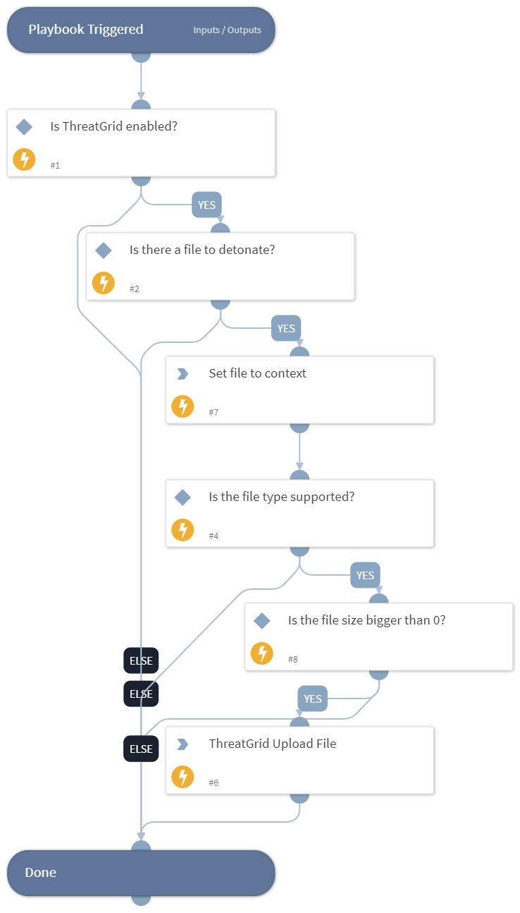

Detonate one or more files using the ThreatGrid integration. This playbook returns relevant reports to the War Room and file reputations to the context data. The detonation supports the following file types - EXE, DLL, JAR, JS, PDF, DOC, DOCX, RTF, XLS, PPT, PPTX, XML, ZIP, VBN, SEP, XZ, GZ, BZ2, TAR, MHTML, SWF, LNK, URL, MSI, JTD, JTT, JTDC, JTTC, HWP, HWT, HWPX, BAT, HTA, PS1, VBS, WSF, JSE, VBE, CHM

## Dependencies
This playbook uses the following sub-playbooks, integrations, and scripts.

### Sub-playbooks
This playbook does not use any sub-playbooks.

### Integrations
* ThreatGridv2

### Scripts
* Set

### Commands
* threat-grid-sample-upload

## Playbook Inputs
---

| **Name** | **Description** | **Default Value** | **Required** |
| --- | --- | --- | --- |
| File | File object of the file to detonate. | File | Required |

## Playbook Outputs
---

| **Path** | **Description** | **Type** |
| --- | --- | --- |
| File.Type | File type e.g. "PE" | string |
| File.Size | File Size | number |
| File.Extension | File Extension | string |

## Playbook Image
---
