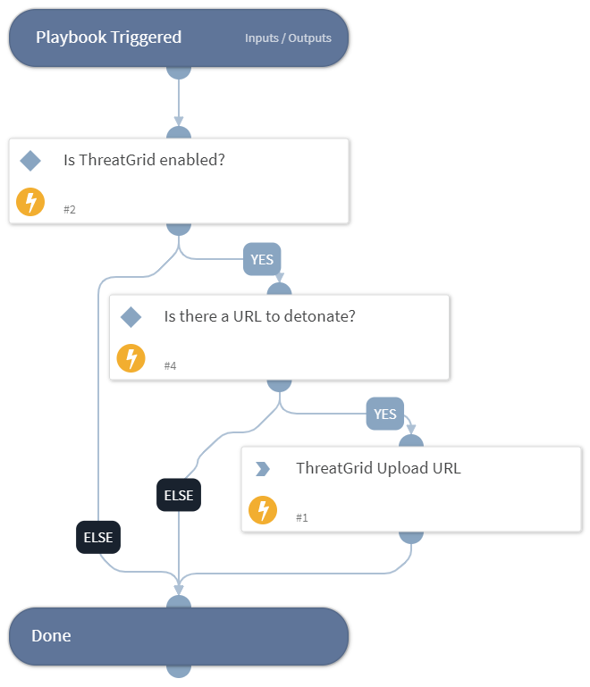

Detonates one or more URLs using the ThreatGrid integration. This playbook returns relevant reports to the War Room and URL reputations to the context data.

## Dependencies
This playbook uses the following sub-playbooks, integrations, and scripts.

### Sub-playbooks
This playbook does not use any sub-playbooks.

### Integrations
* ThreatGridv2

### Scripts
This playbook does not use any scripts.

### Commands
* threat-grid-sample-upload

## Playbook Inputs
---

| **Name** | **Description** | **Default Value** | **Required** |
| --- | --- | --- | --- |
| URL | URL of the sites to detonate. | URL.Data | Required |

## Playbook Outputs
---
There are no outputs for this playbook.

## Playbook Image
---
