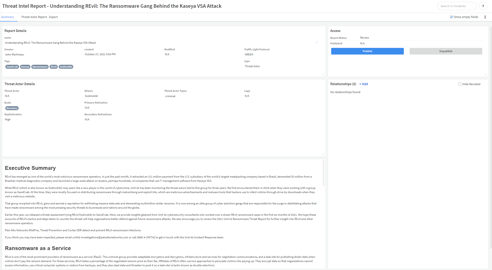
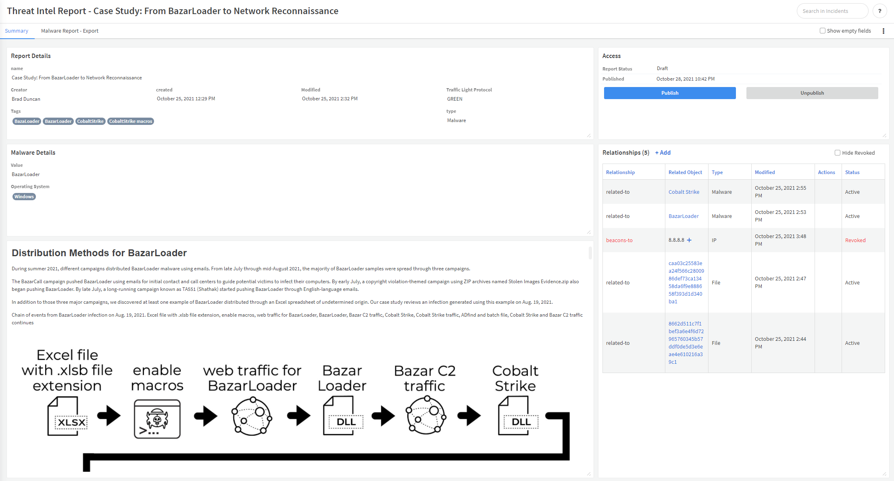
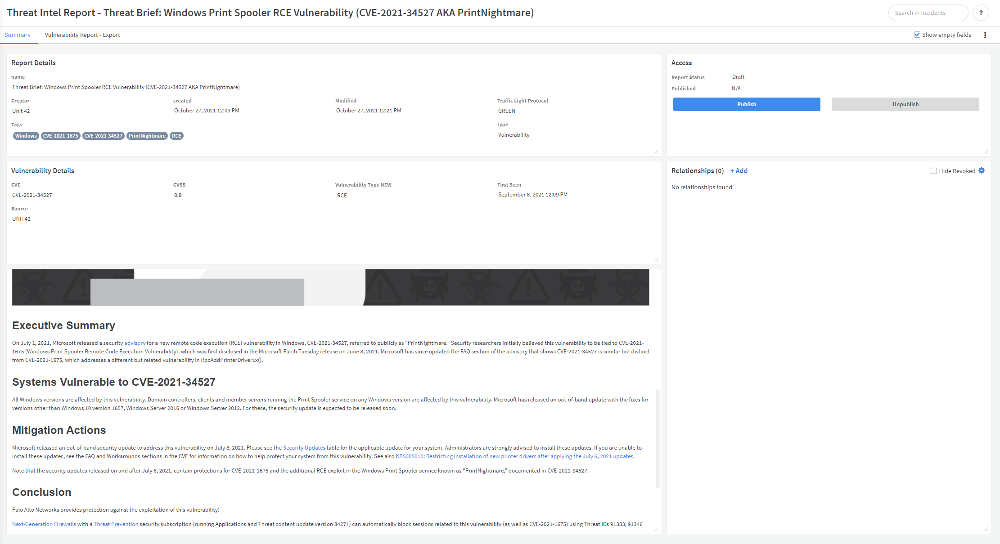

Threat intel reports summarize and share threat intelligence research conducted within your organization by threat analysts and threat hunters. Threat intelligence reports help you to communicate the current threat landscape to internal and external stakeholders, whether in the form of high-level summary reports for C-level executives, or detailed, tactical reports for the SOC and other security stakeholders.

## What does this pack do?

This pack lets you:
- Create threat intel reports based on out-of-the-box or customized layouts, while applying rich formatting to the body of the report.
- Publish a report within Cortex XSOAR to share with other users.
- Export a report to PDF format.

The pack comes with 5 out-of-the-box report layouts for easier use:
1. Executive Brief
2. Campaign Report
3. Threat actor report
4. Malware Report
5. Vulnerability Report

You can also add relationships between reports and indicators to add additional data to the report. Markdown is supported in the report body, allowing you to add formatting such as tables, images, and font/background color.

Executive brief report

Threat actor report

Malware report

Vulnerability report

