<!-- HTML_DOC -->

A threat intelligence platform that collects and interprets intelligence data from open sources and manages indicator scoring, types, and attributes.

This integration was integrated and tested with API versions 4 and 5 of ThreatQ.

<h2>Configure ThreatQ v2 on Cortex XSOAR</h2>
<ol>
<li>Navigate to <strong>Settings</strong> &gt; <strong>Integrations</strong>  &gt; <strong>Servers &amp; Services</strong>.</li>
<li>Search for ThreatQ v2.</li>
<li>Click <strong>Add instance</strong> to create and configure a new integration instance.
<ul>
<li>
<strong>Name</strong>: a textual name for the integration instance.</li>
<li><strong>ThreatQ server URL (e.g. https://192.168.1.136)</strong></li>
<li><strong>ThreatQ client ID</strong></li>
<li><strong>Email</strong></li>
<li><strong>Indicator threshold (minimum TQ score to consider the indicator malicious).</strong></li>
<li><strong>Trust any certificate (not secure)</strong></li>
<li><strong>Use system proxy settings</strong></li>
</ul>
</li>
<li>Click <strong>Test</strong> to validate the new instance.</li>
</ol>
<h2>Commands</h2>

You can execute these commands from the Cortex XSOAR CLI, as part of an automation, or in a playbook. After you successfully execute a command, a DBot message appears in the War Room with the command details.

<ol>
<li><a href="#h_3a7d7db8-675d-4bc0-bf4a-8c618f603caf" target="_self">threatq-search-by-name: threatq-search-by-name</a></li>
<li><a href="#h_5c96228f-eae9-4b47-81e4-c20a53bf1abb" target="_self">Check an IP address: ip</a></li>
<li>
<a href="#h_7f270f17-e535-4e39-b67c-fb5d1edd2f14" target="_self">Check a URL: url</a> </li>
<li><a href="#h_5b5547cf-b3da-4260-9a6c-bae7fca952f9" target="_self">Check a file: file</a></li>
<li><a href="#h_5e78e31d-2bf9-4abe-8e27-ee85872ad1fc" target="_self">Check an email: email</a></li>
<li><a href="#h_e60fe097-2ce1-4ec1-87da-d54bb142782f" target="_self">Check a domain: domain</a></li>
<li><a href="#h_c11d4407-2ffd-4a6b-8a33-8314dfd9bec8" target="_self">Create an indicator: threatq-create-indicator</a></li>
<li><a href="#h_cf2edcaf-a119-4fb5-b3f3-5086677de3f6" target="_self">Add an attribute: threatq-add-attribute </a></li>
<li><a href="#h_5a4ccc85-fdae-4228-9303-a4c138330cde" target="_self">Modify an attribute: threatq-modify-attribute</a></li>
<li><a href="#h_bb1fc6e4-bfff-4a16-8e14-16e1d2afe03c" target="_self">Link two objects: threatq-link-objects</a></li>
<li><a href="#h_b1e1201d-47ed-484d-b83f-a400214bd380" target="_self">Create an adversary: threatq-create-adversary</a></li>
<li><a href="#h_0b6f091e-b262-4b33-8e96-d287830fc660" target="_self">Create an event: threatq-create-event</a></li>
<li><a href="#h_2698ff3c-e47d-4f00-bd0c-76e92a7211de" target="_self">Get related indicators: threatq-get-related-indicators</a></li>
<li><a href="#h_132eb50e-014e-46e5-88a6-d21e6d5e9554" target="_self">Update an indicator status: threatq-update-status</a></li>
<li><a href="#h_8da98151-77a4-4f98-8e4e-6993182c9a75" target="_self">Get related events: threatq-get-related-events</a></li>
<li><a href="#h_65255efc-6d1e-4d5d-a94a-b92106b7e614" target="_self">Get related adversaries: threatq-get-related-adversaries</a></li>
<li><a href="#h_954537b3-b7ea-466b-b51e-752d67fe4281" target="_self">Upload a file: threatq-upload-file</a></li>
<li><a href="#h_3a356804-dbae-46a8-9185-2e7e74e1a81e" target="_self">Search by Object type and ID: threatq-search-by-id</a></li>
<li><a href="#h_58713dca-ce21-473b-9777-42ae33761cb5" target="_self">Unlink two objects: threatq-unlink-objects</a></li>
<li><a href="#h_f73a0c2a-eb69-42c2-992e-17a5dc6a5906" target="_self">Delete an object: threatq-delete-object</a></li>
<li><a href="#h_d51d027d-646e-4e39-a880-fe38347bce70" target="_self">Add a source to an object: threatq-add-source</a></li>
<li><a href="#h_85f58464-1e5c-4d3c-b735-77103ccf63a7" target="_self">Delete a source from an object: threatq-delete-source</a></li>
<li><a href="#h_f2e5a3eb-79bd-4d1d-ac57-9fd32dcb9866" target="_self">Delete an attribute: threatq-delete-attribute</a></li>
<li><a href="#h_ff4038d6-4c8b-4e89-a586-1d4a8c1168d6" target="_self">Edit an adversary: threatq-edit-adversary</a></li>
<li><a href="#h_49ca05ae-876c-486b-ac66-4fafc8411cd9" target="_self">Edit an indicator: threatq-edit-indicator</a></li>
<li><a href="#h_d4a85aa5-245f-4b06-bffc-632140561a98" target="_self">Edit an event: threatq-edit-event</a></li>
<li><a href="#h_7ed2b520-8db0-44e1-9e90-8f30463bd743" target="_self">Update a score of an indictor: threatq-update-score</a></li>
<li><a href="#h_eeb24165-a887-4df8-8b01-43a054abcedf" target="_self">Download a file to Cortex XSOAR: threatq-download-file</a></li>
<li><a href="#h_6b58f4f4-da5f-4f94-b9b6-2d4acf482aed" target="_self">Get all indicators: threatq-get-all-indicators:</a></li>
<li><a href="#h_4b89672e-4c43-4ebc-bd2b-c0ee3450df54" target="_self">Get a list of events: threatq-get-all-events</a></li>
<li><a href="#h_940ef125-9750-463d-8b8b-3a057eac841b" target="_self">Get a list of all adversaries: threatq-get-all-adversaries</a></li>
</ol>
<h3 id="h_3a7d7db8-675d-4bc0-bf4a-8c618f603caf">1. Search for object by name</h3>

Searches for objects by name in the ThreatQ repository.

<h5>Base Command</h5>

<code>threatq-search-by-name</code>

<h5>Input</h5>
<table style="width: 748px;" border="2" cellpadding="6">
<thead>
<tr>
<th style="width: 169px;"><strong>Argument Name</strong></th>
<th style="width: 439px;"><strong>Description</strong></th>
<th style="width: 100px;"><strong>Required</strong></th>
</tr>
</thead>
<tbody>
<tr>
<td style="width: 169px;">name</td>
<td style="width: 439px;">Name of the object to search.</td>
<td style="width: 100px;">Required</td>
</tr>
<tr>
<td style="width: 169px;">limit</td>
<td style="width: 439px;">The maximum number of records to retrieve.</td>
<td style="width: 100px;">Optional</td>
</tr>
</tbody>
</table>

 

<h5>Context Output</h5>
<table style="width: 748px;" border="2" cellpadding="6">
<thead>
<tr>
<th style="width: 282px;"><strong>Path</strong></th>
<th style="width: 105px;"><strong>Type</strong></th>
<th style="width: 321px;"><strong>Description</strong></th>
</tr>
</thead>
<tbody>
<tr>
<td style="width: 282px;">ThreatQ.Indicator.ID</td>
<td style="width: 105px;">Number</td>
<td style="width: 321px;">The ID of the Indicator.</td>
</tr>
<tr>
<td style="width: 282px;">ThreatQ.Indicator.Value</td>
<td style="width: 105px;">String</td>
<td style="width: 321px;">The value of the Indicator.</td>
</tr>
<tr>
<td style="width: 282px;">ThreatQ.Event.ID</td>
<td style="width: 105px;">Number</td>
<td style="width: 321px;">The ID of the Event.</td>
</tr>
<tr>
<td style="width: 282px;">ThreatQ.Event.Title</td>
<td style="width: 105px;">String</td>
<td style="width: 321px;">The title of the Event.</td>
</tr>
<tr>
<td style="width: 282px;">ThreatQ.Adversary.ID</td>
<td style="width: 105px;">Number</td>
<td style="width: 321px;">The ID of the Adversary.</td>
</tr>
<tr>
<td style="width: 282px;">ThreatQ.Adversary.Name</td>
<td style="width: 105px;">String</td>
<td style="width: 321px;">The name of the Adversary.</td>
</tr>
</tbody>
</table>

 

<h5>Command Example</h5>
<pre>  !threatq-search-by-name name=test limit=6</pre>
<h5>Human Readable Output</h5>

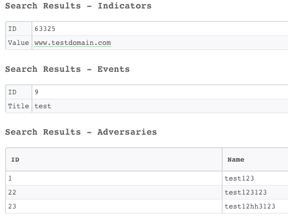

<h3 id="h_5c96228f-eae9-4b47-81e4-c20a53bf1abb">2. Check an IP address</h3>

Checks the reputation of an IP address in ThreatQ.

<h5>Base Command</h5>

<code>ip</code>

<h5>Input</h5>
<table style="width: 748px;" border="2" cellpadding="6">
<thead>
<tr>
<th style="width: 235px;"><strong>Argument Name</strong></th>
<th style="width: 333px;"><strong>Description</strong></th>
<th style="width: 140px;"><strong>Required</strong></th>
</tr>
</thead>
<tbody>
<tr>
<td style="width: 235px;">ip</td>
<td style="width: 333px;">The IP address to check.</td>
<td style="width: 140px;">Required</td>
</tr>
</tbody>
</table>

 

<h5>Context Output</h5>
<table style="width: 748px;" border="2" cellpadding="6">
<thead>
<tr>
<th style="width: 267px;"><strong>Path</strong></th>
<th style="width: 78px;"><strong>Type</strong></th>
<th style="width: 363px;"><strong>Description</strong></th>
</tr>
</thead>
<tbody>
<tr>
<td style="width: 267px;">DBotScore.Indicator</td>
<td style="width: 78px;">String</td>
<td style="width: 363px;">The value of the indicator.</td>
</tr>
<tr>
<td style="width: 267px;">DBotScore.Type</td>
<td style="width: 78px;">String</td>
<td style="width: 363px;">The type of the indicator.</td>
</tr>
<tr>
<td style="width: 267px;">DBotScore.Vendor</td>
<td style="width: 78px;">String</td>
<td style="width: 363px;">The vendor of the indicator.</td>
</tr>
<tr>
<td style="width: 267px;">DBotScore.Score</td>
<td style="width: 78px;">Number</td>
<td style="width: 363px;">The DBot Score of the indicator.</td>
</tr>
<tr>
<td style="width: 267px;">IP.Address</td>
<td style="width: 78px;">String</td>
<td style="width: 363px;">The IP Address.</td>
</tr>
<tr>
<td style="width: 267px;">IP.Malicious.Vendor</td>
<td style="width: 78px;">String</td>
<td style="width: 363px;">The IP address of the Vendor.</td>
</tr>
<tr>
<td style="width: 267px;">IP.Malicious.Description</td>
<td style="width: 78px;">String</td>
<td style="width: 363px;">The description of the Malicious IP address.</td>
</tr>
<tr>
<td style="width: 267px;">ThreatQ.Indicator.ID</td>
<td style="width: 78px;">Number</td>
<td style="width: 363px;">The ID of the Indicator.</td>
</tr>
<tr>
<td style="width: 267px;">ThreatQ.Indicator.Value</td>
<td style="width: 78px;">String</td>
<td style="width: 363px;">The value of the indicator.</td>
</tr>
<tr>
<td style="width: 267px;">ThreatQ.Indicator.Source.ID</td>
<td style="width: 78px;">Number</td>
<td style="width: 363px;">The source ID of the indicator.</td>
</tr>
<tr>
<td style="width: 267px;">ThreatQ.Indicator.Source.Name</td>
<td style="width: 78px;">String</td>
<td style="width: 363px;">The source name of the indicator.</td>
</tr>
<tr>
<td style="width: 267px;">ThreatQ.Indicator.Attribute.ID</td>
<td style="width: 78px;">Number</td>
<td style="width: 363px;">The attribute ID of the indicator.</td>
</tr>
<tr>
<td style="width: 267px;">ThreatQ.Indicator.Attribute.Value</td>
<td style="width: 78px;">String</td>
<td style="width: 363px;">The attribute value of the indicator.</td>
</tr>
<tr>
<td style="width: 267px;">ThreatQ.Indicator.Attribute.Name</td>
<td style="width: 78px;">String</td>
<td style="width: 363px;">The attribute name of the indicator.</td>
</tr>
<tr>
<td style="width: 267px;">ThreatQ.Indicator.CreatedAt</td>
<td style="width: 78px;">Date</td>
<td style="width: 363px;">The creation date of the indicator.</td>
</tr>
<tr>
<td style="width: 267px;">ThreatQ.Indicator.UpdatedAt</td>
<td style="width: 78px;">Date</td>
<td style="width: 363px;">The last update date of the indicator.</td>
</tr>
<tr>
<td style="width: 267px;">ThreatQ.Indicator.Status</td>
<td style="width: 78px;">String</td>
<td style="width: 363px;">The status of the indicator.</td>
</tr>
<tr>
<td style="width: 267px;">ThreatQ.Indicator.TQScore</td>
<td style="width: 78px;">Number</td>
<td style="width: 363px;">The ThreatQ score of the indicator.</td>
</tr>
<tr>
<td style="width: 267px;">ThreatQ.Indicator.Description</td>
<td style="width: 78px;">String</td>
<td style="width: 363px;">The description of the indicator.</td>
</tr>
<tr>
<td style="width: 267px;">ThreatQ.Indicator.Type</td>
<td style="width: 78px;">String</td>
<td style="width: 363px;">The type of the indicator.</td>
</tr>
</tbody>
</table>

 

<h5>Command Example</h5>
<pre>  !ip ip=91.140.64.113
</pre>
<h5>Human Readable Output</h5>

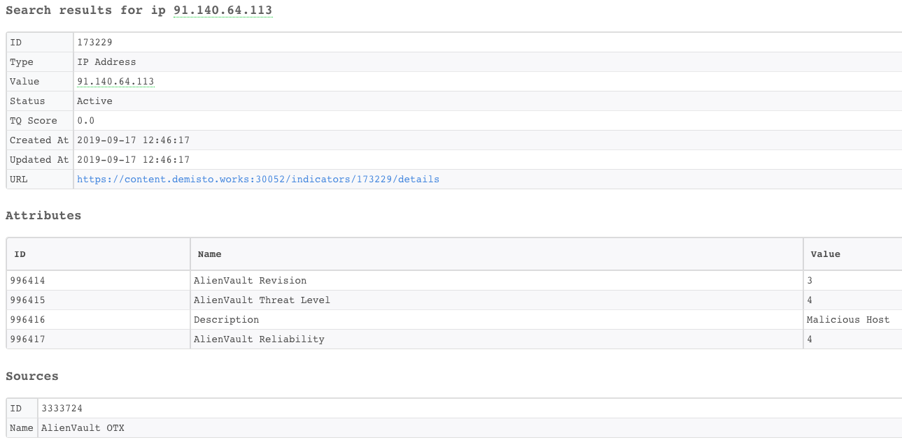

<h3 id="h_7f270f17-e535-4e39-b67c-fb5d1edd2f14">3. Check a URL</h3>

Checks the reputation of a URL in ThreatQ.

Notice: Submitting indicators using this command might make the indicator data publicly available. See the vendor’s documentation for more details.

<h5>Base Command</h5>

<code>url</code>

<h5>Input</h5>
<table style="width: 748px;" border="2" cellpadding="6">
<thead>
<tr>
<th style="width: 302px;"><strong>Argument Name</strong></th>
<th style="width: 228px;"><strong>Description</strong></th>
<th style="width: 178px;"><strong>Required</strong></th>
</tr>
</thead>
<tbody>
<tr>
<td style="width: 302px;">url</td>
<td style="width: 228px;">The URL to check.</td>
<td style="width: 178px;">Required</td>
</tr>
</tbody>
</table>

 

<h5>Context Output</h5>
<table style="width: 748px;" border="2" cellpadding="6">
<thead>
<tr>
<th style="width: 293px;"><strong>Path</strong></th>
<th style="width: 81px;"><strong>Type</strong></th>
<th style="width: 334px;"><strong>Description</strong></th>
</tr>
</thead>
<tbody>
<tr>
<td style="width: 293px;">DBotScore.Indicator</td>
<td style="width: 81px;">String</td>
<td style="width: 334px;">The value of the indicator.</td>
</tr>
<tr>
<td style="width: 293px;">DBotScore.Type</td>
<td style="width: 81px;">String</td>
<td style="width: 334px;">The type of the indicator.</td>
</tr>
<tr>
<td style="width: 293px;">DBotScore.Vendor</td>
<td style="width: 81px;">String</td>
<td style="width: 334px;">The vendor of the indicator.</td>
</tr>
<tr>
<td style="width: 293px;">DBotScore.Score</td>
<td style="width: 81px;">Number</td>
<td style="width: 334px;">The DBot Score of the indicator.</td>
</tr>
<tr>
<td style="width: 293px;">URL.Data</td>
<td style="width: 81px;">String</td>
<td style="width: 334px;">The URL.</td>
</tr>
<tr>
<td style="width: 293px;">URL.Malicious.Vendor</td>
<td style="width: 81px;">String</td>
<td style="width: 334px;">The vendor of the malicious URL.</td>
</tr>
<tr>
<td style="width: 293px;">URL.Malicious.Description</td>
<td style="width: 81px;">String</td>
<td style="width: 334px;">The description of the malicious URL.</td>
</tr>
<tr>
<td style="width: 293px;">ThreatQ.Indicator.ID</td>
<td style="width: 81px;">Number</td>
<td style="width: 334px;">The ID of the indicator.</td>
</tr>
<tr>
<td style="width: 293px;">ThreatQ.Indicator.Value</td>
<td style="width: 81px;">String</td>
<td style="width: 334px;">The value of the indicator.</td>
</tr>
<tr>
<td style="width: 293px;">ThreatQ.Indicator.Source.ID</td>
<td style="width: 81px;">Number</td>
<td style="width: 334px;">The source of the indicator.</td>
</tr>
<tr>
<td style="width: 293px;">ThreatQ.Indicator.Source.Name</td>
<td style="width: 81px;">String</td>
<td style="width: 334px;">The source of the indicator.</td>
</tr>
<tr>
<td style="width: 293px;">ThreatQ.Indicator.Attribute.ID</td>
<td style="width: 81px;">Number</td>
<td style="width: 334px;">The attribute ID of the indicator.</td>
</tr>
<tr>
<td style="width: 293px;">ThreatQ.Indicator.Attribute.Value</td>
<td style="width: 81px;">String</td>
<td style="width: 334px;">The attribute value of the indicator.</td>
</tr>
<tr>
<td style="width: 293px;">ThreatQ.Indicator.Attribute.Name</td>
<td style="width: 81px;">String</td>
<td style="width: 334px;">The attribute name of the indicator.</td>
</tr>
<tr>
<td style="width: 293px;">ThreatQ.Indicator.CreatedAt</td>
<td style="width: 81px;">Date</td>
<td style="width: 334px;">The creation date of the indicator.</td>
</tr>
<tr>
<td style="width: 293px;">ThreatQ.Indicator.UpdatedAt</td>
<td style="width: 81px;">Date</td>
<td style="width: 334px;">The last update date of the indicator.</td>
</tr>
<tr>
<td style="width: 293px;">ThreatQ.Indicator.Status</td>
<td style="width: 81px;">String</td>
<td style="width: 334px;">The status of the indicator.</td>
</tr>
<tr>
<td style="width: 293px;">ThreatQ.Indicator.TQScore</td>
<td style="width: 81px;">Number</td>
<td style="width: 334px;">The ThreatQ score of the indicator.</td>
</tr>
<tr>
<td style="width: 293px;">ThreatQ.Indicator.Description</td>
<td style="width: 81px;">String</td>
<td style="width: 334px;">The description of the indicator.</td>
</tr>
<tr>
<td style="width: 293px;">ThreatQ.Indicator.Type</td>
<td style="width: 81px;">String</td>
<td style="width: 334px;">The type of the indicator.</td>
</tr>
</tbody>
</table>

 

<h5>Command Example</h5>
<pre>  !url url=https://www.paloaltonetworks.com/
</pre>
<h5>Human Readable Output</h5>

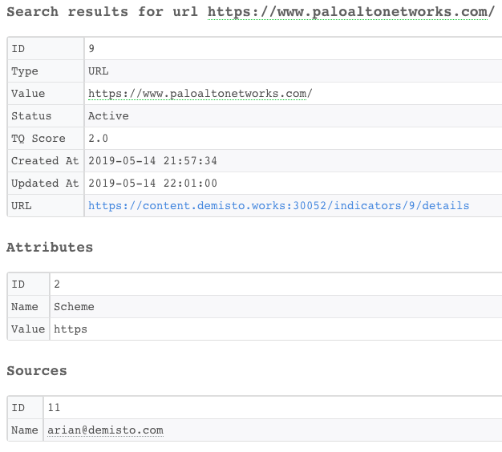

<h3 id="h_5b5547cf-b3da-4260-9a6c-bae7fca952f9">4. Check a file</h3>

Checks the reputation of a file in ThreatQ.

<h5>Base Command</h5>

<code>file</code>

<h5>Input</h5>
<table style="width: 748px;" border="2" cellpadding="6">
<thead>
<tr>
<th style="width: 213px;"><strong>Argument Name</strong></th>
<th style="width: 365px;"><strong>Description</strong></th>
<th style="width: 130px;"><strong>Required</strong></th>
</tr>
</thead>
<tbody>
<tr>
<td style="width: 213px;">file</td>
<td style="width: 365px;">The MD5, SHA-1 or SHA-256 file to check.</td>
<td style="width: 130px;">Required</td>
</tr>
</tbody>
</table>

 

<h5>Context Output</h5>
<table style="width: 748px;" border="2" cellpadding="6">
<thead>
<tr>
<th style="width: 294px;"><strong>Path</strong></th>
<th style="width: 81px;"><strong>Type</strong></th>
<th style="width: 333px;"><strong>Description</strong></th>
</tr>
</thead>
<tbody>
<tr>
<td style="width: 294px;">DBotScore.Indicator</td>
<td style="width: 81px;">String</td>
<td style="width: 333px;">The value of the indicator.</td>
</tr>
<tr>
<td style="width: 294px;">DBotScore.Type</td>
<td style="width: 81px;">String</td>
<td style="width: 333px;">The type of the indicator.</td>
</tr>
<tr>
<td style="width: 294px;">DBotScore.Vendor</td>
<td style="width: 81px;">String</td>
<td style="width: 333px;">The vendor of the indicator.</td>
</tr>
<tr>
<td style="width: 294px;">DBotScore.Score</td>
<td style="width: 81px;">Number</td>
<td style="width: 333px;">The DBot Score of the indicator.</td>
</tr>
<tr>
<td style="width: 294px;">File.Name</td>
<td style="width: 81px;">String</td>
<td style="width: 333px;">The name of the file.</td>
</tr>
<tr>
<td style="width: 294px;">File.MD5</td>
<td style="width: 81px;">String</td>
<td style="width: 333px;">The MD5 of the file.</td>
</tr>
<tr>
<td style="width: 294px;">File.SHA1</td>
<td style="width: 81px;">String</td>
<td style="width: 333px;">The SHA1 of the file.</td>
</tr>
<tr>
<td style="width: 294px;">File.SHA256</td>
<td style="width: 81px;">String</td>
<td style="width: 333px;">The SHA256 of the file.</td>
</tr>
<tr>
<td style="width: 294px;">File.SHA512</td>
<td style="width: 81px;">String</td>
<td style="width: 333px;">The SHA512 of the file.</td>
</tr>
<tr>
<td style="width: 294px;">File.Path</td>
<td style="width: 81px;">String</td>
<td style="width: 333px;">The path of the file.</td>
</tr>
<tr>
<td style="width: 294px;">File.Malicious.Vendor</td>
<td style="width: 81px;">String</td>
<td style="width: 333px;">The vendor of the malicious file.</td>
</tr>
<tr>
<td style="width: 294px;">File.Malicious.Description</td>
<td style="width: 81px;">String</td>
<td style="width: 333px;">The description of the malicious file.</td>
</tr>
<tr>
<td style="width: 294px;">ThreatQ.Indicator.ID</td>
<td style="width: 81px;">Number</td>
<td style="width: 333px;">The ID of the indicator.</td>
</tr>
<tr>
<td style="width: 294px;">ThreatQ.Indicator.Value</td>
<td style="width: 81px;">String</td>
<td style="width: 333px;">The value of the indicator.</td>
</tr>
<tr>
<td style="width: 294px;">ThreatQ.Indicator.Source.ID</td>
<td style="width: 81px;">Number</td>
<td style="width: 333px;">The source ID of the indicator.</td>
</tr>
<tr>
<td style="width: 294px;">ThreatQ.Indicator.Source.Name</td>
<td style="width: 81px;">String</td>
<td style="width: 333px;">The source name of the indicator.</td>
</tr>
<tr>
<td style="width: 294px;">ThreatQ.Indicator.Attribute.ID</td>
<td style="width: 81px;">Number</td>
<td style="width: 333px;">The attribute ID of the indicator.</td>
</tr>
<tr>
<td style="width: 294px;">ThreatQ.Indicator.Attribute.Value</td>
<td style="width: 81px;">String</td>
<td style="width: 333px;">The attribute value of the indicator.</td>
</tr>
<tr>
<td style="width: 294px;">ThreatQ.Indicator.Attribute.Name</td>
<td style="width: 81px;">String</td>
<td style="width: 333px;">The attribute name of the indicator.</td>
</tr>
<tr>
<td style="width: 294px;">ThreatQ.Indicator.CreatedAt</td>
<td style="width: 81px;">Date</td>
<td style="width: 333px;">The creation date of the indicator.</td>
</tr>
<tr>
<td style="width: 294px;">ThreatQ.Indicator.UpdatedAt</td>
<td style="width: 81px;">Date</td>
<td style="width: 333px;">The last update date of the indicator.</td>
</tr>
<tr>
<td style="width: 294px;">ThreatQ.Indicator.Status</td>
<td style="width: 81px;">String</td>
<td style="width: 333px;">The status of the indicator.</td>
</tr>
<tr>
<td style="width: 294px;">ThreatQ.Indicator.TQScore</td>
<td style="width: 81px;">Number</td>
<td style="width: 333px;">The ThreatQ score of the indicator.</td>
</tr>
<tr>
<td style="width: 294px;">ThreatQ.Indicator.Description</td>
<td style="width: 81px;">String</td>
<td style="width: 333px;">The description of the indicator.</td>
</tr>
<tr>
<td style="width: 294px;">ThreatQ.Indicator.Type</td>
<td style="width: 81px;">String</td>
<td style="width: 333px;">The type of the indicator.</td>
</tr>
</tbody>
</table>

 

<h5>Command Example</h5>
<pre>  !file file=a94a8fe5ccb19ba61c4c0873d391e987982fbbd3
</pre>
<h5>Human Readable Output</h5>

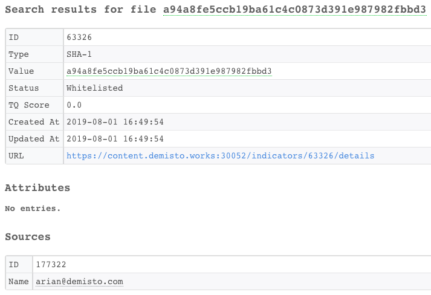

<h3 id="h_5e78e31d-2bf9-4abe-8e27-ee85872ad1fc">5. Check an email</h3>

Checks the reputation of an email in ThreatQ.

<h5>Base Command</h5>

<code>email</code>

<h5>Input</h5>
<table style="width: 748px;" border="2" cellpadding="6">
<thead>
<tr>
<th style="width: 219px;"><strong>Argument Name</strong></th>
<th style="width: 357px;"><strong>Description</strong></th>
<th style="width: 132px;"><strong>Required</strong></th>
</tr>
</thead>
<tbody>
<tr>
<td style="width: 219px;">email</td>
<td style="width: 357px;">The email address to check.</td>
<td style="width: 132px;">Required</td>
</tr>
</tbody>
</table>

 

<h5>Context Output</h5>
<table style="width: 748px;" border="2" cellpadding="6">
<thead>
<tr>
<th style="width: 279px;"><strong>Path</strong></th>
<th style="width: 77px;"><strong>Type</strong></th>
<th style="width: 352px;"><strong>Description</strong></th>
</tr>
</thead>
<tbody>
<tr>
<td style="width: 279px;">DBotScore.Indicator</td>
<td style="width: 77px;">String</td>
<td style="width: 352px;">The value of the indicator.</td>
</tr>
<tr>
<td style="width: 279px;">DBotScore.Type</td>
<td style="width: 77px;">String</td>
<td style="width: 352px;">The type of the indicator.</td>
</tr>
<tr>
<td style="width: 279px;">DBotScore.Vendor</td>
<td style="width: 77px;">String</td>
<td style="width: 352px;">The vendor of the indicator.</td>
</tr>
<tr>
<td style="width: 279px;">DBotScore.Score</td>
<td style="width: 77px;">Number</td>
<td style="width: 352px;">The DBot Score of the indicator.</td>
</tr>
<tr>
<td style="width: 279px;">Account.Email.Address</td>
<td style="width: 77px;">String</td>
<td style="width: 352px;">The Email Address.</td>
</tr>
<tr>
<td style="width: 279px;">Account.Malicious.Vendor</td>
<td style="width: 77px;">String</td>
<td style="width: 352px;">The vendor of the malicious account.</td>
</tr>
<tr>
<td style="width: 279px;">Account.Malicious.Description</td>
<td style="width: 77px;">String</td>
<td style="width: 352px;">The description of the malicious account.</td>
</tr>
<tr>
<td style="width: 279px;">ThreatQ.Indicator.ID</td>
<td style="width: 77px;">Number</td>
<td style="width: 352px;">The ID of the indicator.</td>
</tr>
<tr>
<td style="width: 279px;">ThreatQ.Indicator.Value</td>
<td style="width: 77px;">String</td>
<td style="width: 352px;">The value of the indicator.</td>
</tr>
<tr>
<td style="width: 279px;">ThreatQ.Indicator.Source.ID</td>
<td style="width: 77px;">Number</td>
<td style="width: 352px;">The source ID of the indicator.</td>
</tr>
<tr>
<td style="width: 279px;">ThreatQ.Indicator.Source.Name</td>
<td style="width: 77px;">String</td>
<td style="width: 352px;">The source name of the indicator.</td>
</tr>
<tr>
<td style="width: 279px;">ThreatQ.Indicator.Attribute.ID</td>
<td style="width: 77px;">Number</td>
<td style="width: 352px;">The attribute ID of the indicator.</td>
</tr>
<tr>
<td style="width: 279px;">ThreatQ.Indicator.Attribute.Value</td>
<td style="width: 77px;">String</td>
<td style="width: 352px;">The attribute value of the indicator.</td>
</tr>
<tr>
<td style="width: 279px;">ThreatQ.Indicator.Attribute.Name</td>
<td style="width: 77px;">String</td>
<td style="width: 352px;">The attribute name of the indicator.</td>
</tr>
<tr>
<td style="width: 279px;">ThreatQ.Indicator.CreatedAt</td>
<td style="width: 77px;">Date</td>
<td style="width: 352px;">The creation date of the indicator.</td>
</tr>
<tr>
<td style="width: 279px;">ThreatQ.Indicator.UpdatedAt</td>
<td style="width: 77px;">Date</td>
<td style="width: 352px;">The last update date of the indicator.</td>
</tr>
<tr>
<td style="width: 279px;">ThreatQ.Indicator.Status</td>
<td style="width: 77px;">String</td>
<td style="width: 352px;">The status of the indicator.</td>
</tr>
<tr>
<td style="width: 279px;">ThreatQ.Indicator.TQScore</td>
<td style="width: 77px;">Number</td>
<td style="width: 352px;">The ThreatQ score of the indicator.</td>
</tr>
<tr>
<td style="width: 279px;">ThreatQ.Indicator.Description</td>
<td style="width: 77px;">String</td>
<td style="width: 352px;">The description of the indicator.</td>
</tr>
<tr>
<td style="width: 279px;">ThreatQ.Indicator.Type</td>
<td style="width: 77px;">String</td>
<td style="width: 352px;">The type of the indicator.</td>
</tr>
</tbody>
</table>

 

<h5>Command Example</h5>
<pre>  !email email=example.gmail.com</pre>
<h5>Human Readable Output</h5>

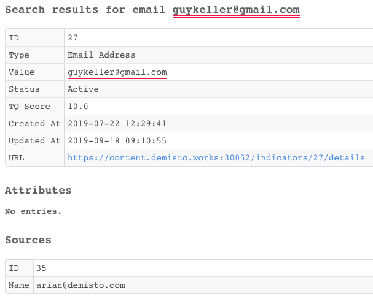

<h3 id="h_e60fe097-2ce1-4ec1-87da-d54bb142782f">6. Check a domain</h3>

Checks the reputation of a domain in ThreatQ.

Notice: Submitting indicators using this command might make the indicator data publicly available. See the vendor’s documentation for more details.

<h5>Base Command</h5>

<code>domain</code>

<h5>Input</h5>
<table style="width: 748px;" border="2" cellpadding="6">
<thead>
<tr>
<th style="width: 275px;"><strong>Argument Name</strong></th>
<th style="width: 269px;"><strong>Description</strong></th>
<th style="width: 164px;"><strong>Required</strong></th>
</tr>
</thead>
<tbody>
<tr>
<td style="width: 275px;">domain</td>
<td style="width: 269px;">The domain or FQDN to check.</td>
<td style="width: 164px;">Required</td>
</tr>
</tbody>
</table>

 

<h5>Context Output</h5>
<table style="width: 748px;" border="2" cellpadding="6">
<thead>
<tr>
<th style="width: 280px;"><strong>Path</strong></th>
<th style="width: 77px;"><strong>Type</strong></th>
<th style="width: 351px;"><strong>Description</strong></th>
</tr>
</thead>
<tbody>
<tr>
<td style="width: 280px;">DBotScore.Indicator</td>
<td style="width: 77px;">String</td>
<td style="width: 351px;">The value of the indicator.</td>
</tr>
<tr>
<td style="width: 280px;">DBotScore.Vendor</td>
<td style="width: 77px;">String</td>
<td style="width: 351px;">The vendor of the indicator.</td>
</tr>
<tr>
<td style="width: 280px;">DBotScore.Type</td>
<td style="width: 77px;">String</td>
<td style="width: 351px;">The type of the indicator.</td>
</tr>
<tr>
<td style="width: 280px;">DBotScore.Score</td>
<td style="width: 77px;">Number</td>
<td style="width: 351px;">The DBot Score of the indicator.</td>
</tr>
<tr>
<td style="width: 280px;">Domain.Name</td>
<td style="width: 77px;">String</td>
<td style="width: 351px;">The name of the domain.</td>
</tr>
<tr>
<td style="width: 280px;">Domain.Malicious.Vendor</td>
<td style="width: 77px;">String</td>
<td style="width: 351px;">The vendor of the malicious domain.</td>
</tr>
<tr>
<td style="width: 280px;">Domain.Malicious.Description</td>
<td style="width: 77px;">String</td>
<td style="width: 351px;">The description of the malicious domain.</td>
</tr>
<tr>
<td style="width: 280px;">ThreatQ.Indicator.ID</td>
<td style="width: 77px;">Number</td>
<td style="width: 351px;">The ID of the indicator.</td>
</tr>
<tr>
<td style="width: 280px;">ThreatQ.Indicator.Value</td>
<td style="width: 77px;">String</td>
<td style="width: 351px;">The value of the indicator.</td>
</tr>
<tr>
<td style="width: 280px;">ThreatQ.Indicator.Source.ID</td>
<td style="width: 77px;">Number</td>
<td style="width: 351px;">The source ID of the indicator.</td>
</tr>
<tr>
<td style="width: 280px;">ThreatQ.Indicator.Source.Name</td>
<td style="width: 77px;">String</td>
<td style="width: 351px;">The source name of the indicator.</td>
</tr>
<tr>
<td style="width: 280px;">ThreatQ.Indicator.Attribute.ID</td>
<td style="width: 77px;">Number</td>
<td style="width: 351px;">The attribute ID of the indicator.</td>
</tr>
<tr>
<td style="width: 280px;">ThreatQ.Indicator.Attribute.Value</td>
<td style="width: 77px;">String</td>
<td style="width: 351px;">The attribute value of the indicator.</td>
</tr>
<tr>
<td style="width: 280px;">ThreatQ.Indicator.Attribute.Name</td>
<td style="width: 77px;">String</td>
<td style="width: 351px;">The attribute name of the indicator.</td>
</tr>
<tr>
<td style="width: 280px;">ThreatQ.Indicator.CreatedAt</td>
<td style="width: 77px;">Date</td>
<td style="width: 351px;">The creation date of the indicator.</td>
</tr>
<tr>
<td style="width: 280px;">ThreatQ.Indicator.UpdatedAt</td>
<td style="width: 77px;">Date</td>
<td style="width: 351px;">The last update date of the indicator.</td>
</tr>
<tr>
<td style="width: 280px;">ThreatQ.Indicator.Status</td>
<td style="width: 77px;">String</td>
<td style="width: 351px;">The status of the indicator.</td>
</tr>
<tr>
<td style="width: 280px;">ThreatQ.Indicator.TQScore</td>
<td style="width: 77px;">Number</td>
<td style="width: 351px;">The ThreatQ score of the indicator.</td>
</tr>
<tr>
<td style="width: 280px;">ThreatQ.Indicator.Description</td>
<td style="width: 77px;">String</td>
<td style="width: 351px;">The description of the indicator.</td>
</tr>
<tr>
<td style="width: 280px;">ThreatQ.Indicator.Type</td>
<td style="width: 77px;">String</td>
<td style="width: 351px;">The type of the indicator.</td>
</tr>
</tbody>
</table>

 

<h5>Command Example</h5>
<pre>!domain domain=www.testdomain.com</pre>
<h5>Human Readable Output</h5>

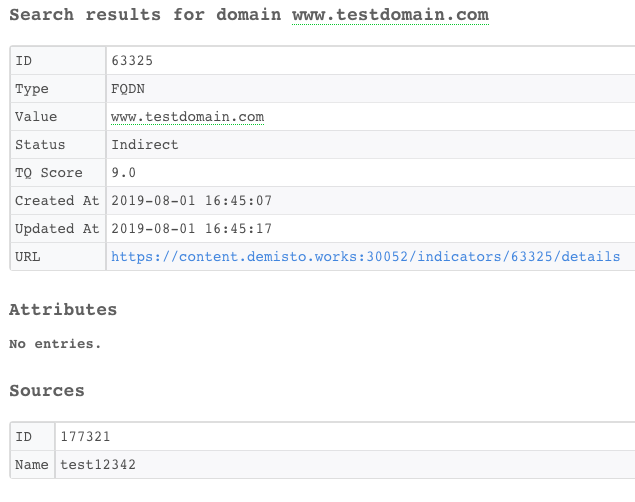

<h3 id="h_c11d4407-2ffd-4a6b-8a33-8314dfd9bec8">7. Create an indicator</h3>

Creates a new indicator in ThreatQ.

<h5>Base Command</h5>

<code>threatq-create-indicator</code>

<h5>Input</h5>
<table style="width: 746px;" border="2" cellpadding="6">
<thead>
<tr>
<th style="width: 100px;"><strong>Argument Name</strong></th>
<th style="width: 537px;"><strong>Description</strong></th>
<th style="width: 71px;"><strong>Required</strong></th>
</tr>
</thead>
<tbody>
<tr>
<td style="width: 100px;">type</td>
<td style="width: 537px;">The type of indicator, such as email address, IP address, Registry key, binary string, and so on.</td>
<td style="width: 71px;">Required</td>
</tr>
<tr>
<td style="width: 100px;">status</td>
<td style="width: 537px;">The status of the indicator. Can be: "Active", "Expired", "Indirect", "Review", or "Whitelisted".</td>
<td style="width: 71px;">Required</td>
</tr>
<tr>
<td style="width: 100px;">value</td>
<td style="width: 537px;">The value of the indicator.</td>
<td style="width: 71px;">Required</td>
</tr>
<tr>
<td style="width: 100px;">sources</td>
<td style="width: 537px;">List of Sources names, separated by commas.</td>
<td style="width: 71px;">Optional</td>
</tr>
<tr>
<td style="width: 100px;">attributes_names</td>
<td style="width: 537px;">Attributes names list, separated by commas. The i-th element in the attributes names list corresponds to the i-th element in the attributes values list.</td>
<td style="width: 71px;">Optional</td>
</tr>
<tr>
<td style="width: 100px;">attributes_values</td>
<td style="width: 537px;">Attributes values list, separated by commas. The i-th element in the attributes values list corresponds to the i-th element in the attributes names list.</td>
<td style="width: 71px;">Optional</td>
</tr>
</tbody>
</table>

 

<h5>Context Output</h5>
<table style="width: 748px;" border="2" cellpadding="6">
<thead>
<tr>
<th style="width: 293px;"><strong>Path</strong></th>
<th style="width: 82px;"><strong>Type</strong></th>
<th style="width: 333px;"><strong>Description</strong></th>
</tr>
</thead>
<tbody>
<tr>
<td style="width: 293px;">ThreatQ.Indicator.ID</td>
<td style="width: 82px;">Number</td>
<td style="width: 333px;">The ID of the indicator.</td>
</tr>
<tr>
<td style="width: 293px;">ThreatQ.Indicator.Value</td>
<td style="width: 82px;">String</td>
<td style="width: 333px;">The value of the indicator.</td>
</tr>
<tr>
<td style="width: 293px;">ThreatQ.Indicator.Source.ID</td>
<td style="width: 82px;">Number</td>
<td style="width: 333px;">The source ID of the indicator.</td>
</tr>
<tr>
<td style="width: 293px;">ThreatQ.Indicator.Source.Name</td>
<td style="width: 82px;">String</td>
<td style="width: 333px;">The source name of the indicator.</td>
</tr>
<tr>
<td style="width: 293px;">ThreatQ.Indicator.Attribute.ID</td>
<td style="width: 82px;">Number</td>
<td style="width: 333px;">The attribute ID of the indicator.</td>
</tr>
<tr>
<td style="width: 293px;">ThreatQ.Indicator.Attribute.Value</td>
<td style="width: 82px;">String</td>
<td style="width: 333px;">The attribute value of the indicator.</td>
</tr>
<tr>
<td style="width: 293px;">ThreatQ.Indicator.Attribute.Name</td>
<td style="width: 82px;">String</td>
<td style="width: 333px;">The attribute name of the indicator.</td>
</tr>
<tr>
<td style="width: 293px;">ThreatQ.Indicator.CreatedAt</td>
<td style="width: 82px;">Date</td>
<td style="width: 333px;">The creation date of the indicator.</td>
</tr>
<tr>
<td style="width: 293px;">ThreatQ.Indicator.UpdatedAt</td>
<td style="width: 82px;">Date</td>
<td style="width: 333px;">The last update date of the indicator.</td>
</tr>
<tr>
<td style="width: 293px;">ThreatQ.Indicator.Status</td>
<td style="width: 82px;">String</td>
<td style="width: 333px;">The status of the indicator.</td>
</tr>
<tr>
<td style="width: 293px;">ThreatQ.Indicator.TQScore</td>
<td style="width: 82px;">Number</td>
<td style="width: 333px;">The ThreatQ score of the indicator.</td>
</tr>
<tr>
<td style="width: 293px;">ThreatQ.Indicator.Description</td>
<td style="width: 82px;">String</td>
<td style="width: 333px;">The description of the indicator.</td>
</tr>
<tr>
<td style="width: 293px;">ThreatQ.Indicator.Type</td>
<td style="width: 82px;">String</td>
<td style="width: 333px;">The type of the indicator.</td>
</tr>
</tbody>
</table>

 

<h5>Command Example</h5>
<pre>  !threatq-create-indicator value=232.12.34.135 status=Review type="IP Address" attributes_names=TestAttr1,TestAttr2 attributes_values=Val1,Val2 sources=arian@demisto.com
</pre>
<h5>Human Readable Output</h5>

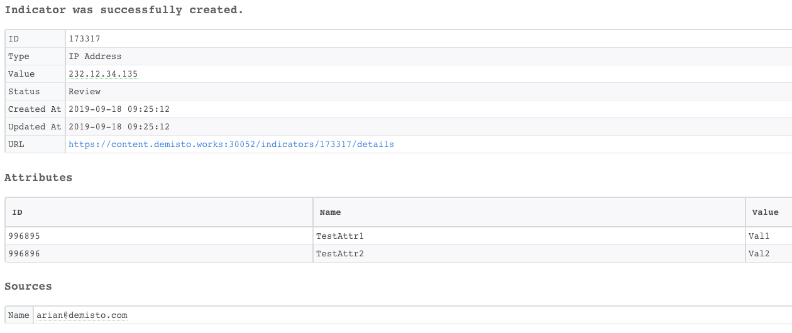

<h3 id="h_cf2edcaf-a119-4fb5-b3f3-5086677de3f6">8. Add an attribute </h3>

Adds an attribute to an object in ThreatQ.

<h5>Base Command</h5>

<code>threatq-add-attribute</code>

<h5>Input</h5>
<table style="width: 748px;" border="2" cellpadding="6">
<thead>
<tr>
<th style="width: 102px;"><strong>Argument Name</strong></th>
<th style="width: 535px;"><strong>Description</strong></th>
<th style="width: 71px;"><strong>Required</strong></th>
</tr>
</thead>
<tbody>
<tr>
<td style="width: 102px;">name</td>
<td style="width: 535px;">The name of the attribute to add.</td>
<td style="width: 71px;">Required</td>
</tr>
<tr>
<td style="width: 102px;">value</td>
<td style="width: 535px;">The value of the attribute to add.</td>
<td style="width: 71px;">Required</td>
</tr>
<tr>
<td style="width: 102px;">obj_type</td>
<td style="width: 535px;">The type of the object to add. Can be: "indicator", "event", "adversary", or "attachment".</td>
<td style="width: 71px;">Required</td>
</tr>
<tr>
<td style="width: 102px;">obj_id</td>
<td style="width: 535px;">The ID of the Object.</td>
<td style="width: 71px;">Required</td>
</tr>
</tbody>
</table>

 

<h5>Context Output</h5>

There are no context output for this command.

 

<h5>Command Example</h5>
<pre>  !threatq-add-attribute obj_type=indicator obj_id=173317 name=TestAttr3 value=Val3
</pre>
<h5>Human Readable Output</h5>

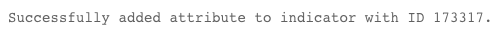

<h3 id="h_5a4ccc85-fdae-4228-9303-a4c138330cde">9. Modify an attribute</h3>

Modifies an attribute for an object in ThreatQ.

<h5>Base Command</h5>

<code>threatq-modify-attribute</code>

<h5>Input</h5>
<table style="width: 748px;" border="2" cellpadding="6">
<thead>
<tr>
<th style="width: 108px;"><strong>Argument Name</strong></th>
<th style="width: 529px;"><strong>Description</strong></th>
<th style="width: 71px;"><strong>Required</strong></th>
</tr>
</thead>
<tbody>
<tr>
<td style="width: 108px;">obj_type</td>
<td style="width: 529px;">The type of the object. Can be: "indicator", "event", "adversary", or "attachment".</td>
<td style="width: 71px;">Required</td>
</tr>
<tr>
<td style="width: 108px;">obj_id</td>
<td style="width: 529px;">The ID of the object.</td>
<td style="width: 71px;">Required</td>
</tr>
<tr>
<td style="width: 108px;">attribute_id</td>
<td style="width: 529px;">The ID of the attribute to modify.</td>
<td style="width: 71px;">Required</td>
</tr>
<tr>
<td style="width: 108px;">attribute_value</td>
<td style="width: 529px;">The new value of the attribute.</td>
<td style="width: 71px;">Required</td>
</tr>
</tbody>
</table>

 

<h5>Command Example</h5>
<pre>  !threatq-modify-attribute attribute_id=996895 attribute_value=NewVal obj_id=173317 obj_type=indicator
</pre>
<h5>Human Readable Output</h5>

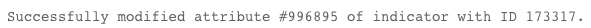

<h3 id="h_bb1fc6e4-bfff-4a16-8e14-16e1d2afe03c">10. Link two objects</h3>

Links two objects together in ThreatQ.

<h5>Base Command</h5>

<code>threatq-link-objects</code>

<h5>Input</h5>
<table style="width: 748px;" border="2" cellpadding="6">
<thead>
<tr>
<th style="width: 108px;"><strong>Argument Name</strong></th>
<th style="width: 529px;"><strong>Description</strong></th>
<th style="width: 71px;"><strong>Required</strong></th>
</tr>
</thead>
<tbody>
<tr>
<td style="width: 108px;">obj1_id</td>
<td style="width: 529px;">The ID of the first object.</td>
<td style="width: 71px;">Required</td>
</tr>
<tr>
<td style="width: 108px;">obj2_id</td>
<td style="width: 529px;">The ID of the second object.</td>
<td style="width: 71px;">Required</td>
</tr>
<tr>
<td style="width: 108px;">obj1_type</td>
<td style="width: 529px;">The type of the first object. Can be: "indicator", "adversary", or "event".</td>
<td style="width: 71px;">Required</td>
</tr>
<tr>
<td style="width: 108px;">obj2_type</td>
<td style="width: 529px;">The type of the second object. Can be: "indicator", "adversary", or "event".</td>
<td style="width: 71px;">Required</td>
</tr>
</tbody>
</table>

 

<h5>Command Example</h5>
<pre>  !threatq-link-objects obj1_id=173317 obj1_type=indicator obj2_id=1 obj2_type=adversary
</pre>
<h5>Human Readable Output</h5>

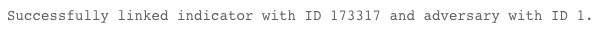

<h3 id="h_b1e1201d-47ed-484d-b83f-a400214bd380">11. Create an adversary</h3>

Creates a new adversary in ThreatQ.

<h5>Base Command</h5>

<code>threatq-create-adversary</code>

<h5>Input</h5>
<table style="width: 744px;" border="2" cellpadding="6">
<thead>
<tr>
<th style="width: 102px;"><strong>Argument Name</strong></th>
<th style="width: 541px;"><strong>Description</strong></th>
<th style="width: 65px;"><strong>Required</strong></th>
</tr>
</thead>
<tbody>
<tr>
<td style="width: 102px;">name</td>
<td style="width: 541px;">Name of the adversary to create.</td>
<td style="width: 65px;">Required</td>
</tr>
<tr>
<td style="width: 102px;">sources</td>
<td style="width: 541px;">List of sources names, separated by commas.</td>
<td style="width: 65px;">Optional</td>
</tr>
<tr>
<td style="width: 102px;">attributes_names</td>
<td style="width: 541px;">List of attributes names, separated by commas. The i-th element in the attributes names list corresponds to the i-th element in the attributes values list.</td>
<td style="width: 65px;">Optional</td>
</tr>
<tr>
<td style="width: 102px;">attributes_values</td>
<td style="width: 541px;">List of attributes values, separated by commas. The i-th element in the attributes values list corresponds to the i-th element in the attributes names list.</td>
<td style="width: 65px;">Optional</td>
</tr>
</tbody>
</table>

 

<h5>Context Output</h5>
<table style="width: 748px;" border="2" cellpadding="6">
<thead>
<tr>
<th style="width: 290px;"><strong>Path</strong></th>
<th style="width: 81px;"><strong>Type</strong></th>
<th style="width: 337px;"><strong>Description</strong></th>
</tr>
</thead>
<tbody>
<tr>
<td style="width: 290px;">ThreatQ.Adversary.Name</td>
<td style="width: 81px;">string</td>
<td style="width: 337px;">The name of the adversary.</td>
</tr>
<tr>
<td style="width: 290px;">ThreatQ.Adversary.ID</td>
<td style="width: 81px;">number</td>
<td style="width: 337px;">The ID of the adversary.</td>
</tr>
<tr>
<td style="width: 290px;">ThreatQ.Adversary.Source.ID</td>
<td style="width: 81px;">number</td>
<td style="width: 337px;">The source ID of the adversary.</td>
</tr>
<tr>
<td style="width: 290px;">ThreatQ.Adversary.Source.Name</td>
<td style="width: 81px;">string</td>
<td style="width: 337px;">The source name of the adversary.</td>
</tr>
<tr>
<td style="width: 290px;">ThreatQ.Adversary.Attribute.ID</td>
<td style="width: 81px;">number</td>
<td style="width: 337px;">The ID of the adversary's attribute.</td>
</tr>
<tr>
<td style="width: 290px;">ThreatQ.Adversary.Attribute.Name</td>
<td style="width: 81px;">string</td>
<td style="width: 337px;">The name of the adversary's attribute.</td>
</tr>
<tr>
<td style="width: 290px;">ThreatQ.Adversary.Attribute.Value</td>
<td style="width: 81px;">string</td>
<td style="width: 337px;">The value of the adversary's attribute.</td>
</tr>
<tr>
<td style="width: 290px;">ThreatQ.Adversary.UpdatedAt</td>
<td style="width: 81px;">date</td>
<td style="width: 337px;">The creation date of the adversary.</td>
</tr>
<tr>
<td style="width: 290px;">ThreatQ.Adversary.CreatedAt</td>
<td style="width: 81px;">date</td>
<td style="width: 337px;">The last update date of the adversary.</td>
</tr>
</tbody>
</table>

 

<h5>Command Example</h5>
<pre>  !threatq-create-adversary name="Reut Shalem"
</pre>
<h5>Human Readable Output</h5>

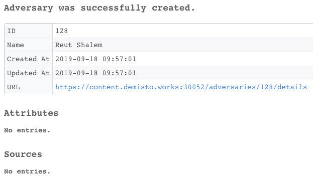

<h3 id="h_0b6f091e-b262-4b33-8e96-d287830fc660">12. Create an event</h3>

Creates a new event in ThreatQ.

<h5>Base Command</h5>

<code>threatq-create-event</code>

<h5>Input</h5>
<table style="width: 746px;" border="2" cellpadding="6">
<thead>
<tr>
<th style="width: 116px;"><strong>Argument Name</strong></th>
<th style="width: 528px;"><strong>Description</strong></th>
<th style="width: 64px;"><strong>Required</strong></th>
</tr>
</thead>
<tbody>
<tr>
<td style="width: 116px;">title</td>
<td style="width: 528px;">Title of the event.</td>
<td style="width: 64px;">Required</td>
</tr>
<tr>
<td style="width: 116px;">type</td>
<td style="width: 528px;">The type of the event, such as malware, watchlist, command and control, and so on.</td>
<td style="width: 64px;">Required</td>
</tr>
<tr>
<td style="width: 116px;">date</td>
<td style="width: 528px;">Date that event happened. Can be: YYYY-mm-dd HH:MM:SS, YYYY-mm-dd</td>
<td style="width: 64px;">Required</td>
</tr>
<tr>
<td style="width: 116px;">sources</td>
<td style="width: 528px;">List of sources names, separated by commas.</td>
<td style="width: 64px;">Optional</td>
</tr>
<tr>
<td style="width: 116px;">attributes_names</td>
<td style="width: 528px;">List of attributes names, separated by commas. The i-th element in the attributes names list corresponds to the i-th element in the attributes values list.</td>
<td style="width: 64px;">Optional</td>
</tr>
<tr>
<td style="width: 116px;">attributes_values</td>
<td style="width: 528px;">List of attributes values, separated by commas. The i-th element in the attributes values list corresponds to the i-th element in the attributes names list.</td>
<td style="width: 64px;">Optional</td>
</tr>
</tbody>
</table>

 

<h5>Context Output</h5>
<table style="width: 748px;" border="2" cellpadding="6">
<thead>
<tr>
<th style="width: 275px;"><strong>Path</strong></th>
<th style="width: 83px;"><strong>Type</strong></th>
<th style="width: 350px;"><strong>Description</strong></th>
</tr>
</thead>
<tbody>
<tr>
<td style="width: 275px;">ThreatQ.Event.ID</td>
<td style="width: 83px;">number</td>
<td style="width: 350px;">The ID of the event.</td>
</tr>
<tr>
<td style="width: 275px;">ThreatQ.Event.Source.ID</td>
<td style="width: 83px;">number</td>
<td style="width: 350px;">The source ID of the event.</td>
</tr>
<tr>
<td style="width: 275px;">ThreatQ.Event.Source.Name</td>
<td style="width: 83px;">string</td>
<td style="width: 350px;">The source name of the event.</td>
</tr>
<tr>
<td style="width: 275px;">ThreatQ.Event.Attribute.ID</td>
<td style="width: 83px;">number</td>
<td style="width: 350px;">The ID of the event attribute.</td>
</tr>
<tr>
<td style="width: 275px;">ThreatQ.Event.Attribute.Name</td>
<td style="width: 83px;">string</td>
<td style="width: 350px;">The name of the event attribute.</td>
</tr>
<tr>
<td style="width: 275px;">ThreatQ.Event.Attribute.Value</td>
<td style="width: 83px;">string</td>
<td style="width: 350px;">The attribute value of the event.</td>
</tr>
<tr>
<td style="width: 275px;">ThreatQ.Event.UpdatedAt</td>
<td style="width: 83px;">date</td>
<td style="width: 350px;">The last update date of the event.</td>
</tr>
<tr>
<td style="width: 275px;">ThreatQ.Event.CreatedAt</td>
<td style="width: 83px;">date</td>
<td style="width: 350px;">The creation date of the event.</td>
</tr>
<tr>
<td style="width: 275px;">ThreatQ.Event.Type</td>
<td style="width: 83px;">string</td>
<td style="width: 350px;">The type of the event.</td>
</tr>
<tr>
<td style="width: 275px;">ThreatQ.Event.Description</td>
<td style="width: 83px;">string</td>
<td style="width: 350px;">The description of the event.</td>
</tr>
<tr>
<td style="width: 275px;">ThreatQ.Event.Title</td>
<td style="width: 83px;">string</td>
<td style="width: 350px;">The title of the event.</td>
</tr>
<tr>
<td style="width: 275px;">ThreatQ.Event.Occurred</td>
<td style="width: 83px;">date</td>
<td style="width: 350px;">The date of the event that happened.</td>
</tr>
</tbody>
</table>

 

<h5>Command Example</h5>
<pre>  !threatq-create-event date="2019-09-30 20:00:00" title="Offra Alta" type=Incident</pre>
<h5>Human Readable Output</h5>

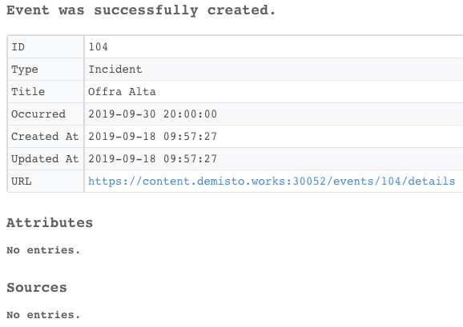

<h3 id="h_2698ff3c-e47d-4f00-bd0c-76e92a7211de">13. Get related indicators</h3>

Retrieves related indicators for an object in ThreatQ.

<h5>Base Command</h5>

<code>threatq-get-related-indicators</code>

<h5>Input</h5>
<table style="width: 748px;" border="2" cellpadding="6">
<thead>
<tr>
<th style="width: 129px;"><strong>Argument Name</strong></th>
<th style="width: 504px;"><strong>Description</strong></th>
<th style="width: 75px;"><strong>Required</strong></th>
</tr>
</thead>
<tbody>
<tr>
<td style="width: 129px;">obj_id</td>
<td style="width: 504px;">The ID of the object.</td>
<td style="width: 75px;">Required</td>
</tr>
<tr>
<td style="width: 129px;">obj_type</td>
<td style="width: 504px;">The type of the object. Can be: "indicator", "event", or "adversary".</td>
<td style="width: 75px;">Required</td>
</tr>
</tbody>
</table>

 

<h5>Context Output</h5>
<table style="width: 748px;" border="2" cellpadding="6">
<thead>
<tr>
<th style="width: 350px;"><strong>Path</strong></th>
<th style="width: 68px;"><strong>Type</strong></th>
<th style="width: 290px;"><strong>Description</strong></th>
</tr>
</thead>
<tbody>
<tr>
<td style="width: 350px;">ThreatQ.Indicator.RelatedIndicator.ID</td>
<td style="width: 68px;">number</td>
<td style="width: 290px;">The ID of the related indicator.</td>
</tr>
<tr>
<td style="width: 350px;">ThreatQ.Indicator.RelatedIndicator.Source.ID</td>
<td style="width: 68px;">number</td>
<td style="width: 290px;">The source ID of the related indicator.</td>
</tr>
<tr>
<td style="width: 350px;">ThreatQ.Indicator.RelatedIndicator.Source.Name</td>
<td style="width: 68px;">string</td>
<td style="width: 290px;">The source name of the related indicator.</td>
</tr>
<tr>
<td style="width: 350px;">ThreatQ.Indicator.RelatedIndicator.Attribute.ID</td>
<td style="width: 68px;">number</td>
<td style="width: 290px;">The attribute ID of the related indicator.</td>
</tr>
<tr>
<td style="width: 350px;">ThreatQ.Indicator.RelatedIndicator.Attribute.Name</td>
<td style="width: 68px;">string</td>
<td style="width: 290px;">The attribute name of the related indicator.</td>
</tr>
<tr>
<td style="width: 350px;">ThreatQ.Indicator.RelatedIndicator.Attribute.Value</td>
<td style="width: 68px;">string</td>
<td style="width: 290px;">The attribute value of the related indicator.</td>
</tr>
<tr>
<td style="width: 350px;">ThreatQ.Indicator.RelatedIndicator.UpdatedAt</td>
<td style="width: 68px;">date</td>
<td style="width: 290px;">The last update date of the related indicator.</td>
</tr>
<tr>
<td style="width: 350px;">ThreatQ.Indicator.RelatedIndicator.CreatedAt</td>
<td style="width: 68px;">date</td>
<td style="width: 290px;">The creation date of the related indicator.</td>
</tr>
<tr>
<td style="width: 350px;">ThreatQ.Indicator.RelatedIndicator.Type</td>
<td style="width: 68px;">string</td>
<td style="width: 290px;">The type of the related indicator.</td>
</tr>
<tr>
<td style="width: 350px;">ThreatQ.Indicator.RelatedIndicator.Description</td>
<td style="width: 68px;">string</td>
<td style="width: 290px;">The description of the related indicator.</td>
</tr>
<tr>
<td style="width: 350px;">ThreatQ.Indicator.RelatedIndicator.Value</td>
<td style="width: 68px;">string</td>
<td style="width: 290px;">The value of the related indicator.</td>
</tr>
<tr>
<td style="width: 350px;">ThreatQ.Indicator.RelatedIndicator.Status</td>
<td style="width: 68px;">string</td>
<td style="width: 290px;">The status of the related indicator.</td>
</tr>
<tr>
<td style="width: 350px;">ThreatQ.Indicator.RelatedIndicator.TQScore</td>
<td style="width: 68px;">number</td>
<td style="width: 290px;">The ThreatQ score of the related indicator.</td>
</tr>
<tr>
<td style="width: 350px;">ThreatQ.Indicator.ID</td>
<td style="width: 68px;">number</td>
<td style="width: 290px;">The ID of the indicator.</td>
</tr>
<tr>
<td style="width: 350px;">ThreatQ.Event.RelatedIndicator.ID</td>
<td style="width: 68px;">number</td>
<td style="width: 290px;">The ID of the related indicator.</td>
</tr>
<tr>
<td style="width: 350px;">ThreatQ.Event.RelatedIndicator.Source.ID</td>
<td style="width: 68px;">number</td>
<td style="width: 290px;">The source ID of the related indicator.</td>
</tr>
<tr>
<td style="width: 350px;">ThreatQ.Event.RelatedIndicator.Source.Name</td>
<td style="width: 68px;">string</td>
<td style="width: 290px;">The source name of the related indicator.</td>
</tr>
<tr>
<td style="width: 350px;">ThreatQ.Event.RelatedIndicator.Attribute.ID</td>
<td style="width: 68px;">number</td>
<td style="width: 290px;">The attribute ID of the related indicator.</td>
</tr>
<tr>
<td style="width: 350px;">ThreatQ.Event.RelatedIndicator.Attribute.Name</td>
<td style="width: 68px;">string</td>
<td style="width: 290px;">The attribute name of the related indicator.</td>
</tr>
<tr>
<td style="width: 350px;">ThreatQ.Event.RelatedIndicator.Attribute.Value</td>
<td style="width: 68px;">string</td>
<td style="width: 290px;">The attribute value of the related indicator.</td>
</tr>
<tr>
<td style="width: 350px;">ThreatQ.Event.RelatedIndicator.UpdatedAt</td>
<td style="width: 68px;">date</td>
<td style="width: 290px;">The last update date of the related indicator.</td>
</tr>
<tr>
<td style="width: 350px;">ThreatQ.Event.RelatedIndicator.CreatedAt</td>
<td style="width: 68px;">date</td>
<td style="width: 290px;">The creation date of the related indicator.</td>
</tr>
<tr>
<td style="width: 350px;">ThreatQ.Event.RelatedIndicator.Type</td>
<td style="width: 68px;">string</td>
<td style="width: 290px;">The type of the related indicator.</td>
</tr>
<tr>
<td style="width: 350px;">ThreatQ.Event.RelatedIndicator.Description</td>
<td style="width: 68px;">string</td>
<td style="width: 290px;">The description of the related indicator.</td>
</tr>
<tr>
<td style="width: 350px;">ThreatQ.Event.RelatedIndicator.Value</td>
<td style="width: 68px;">string</td>
<td style="width: 290px;">The value of the related indicator.</td>
</tr>
<tr>
<td style="width: 350px;">ThreatQ.Event.RelatedIndicator.Status</td>
<td style="width: 68px;">string</td>
<td style="width: 290px;">The status of the related indicator.</td>
</tr>
<tr>
<td style="width: 350px;">ThreatQ.Event.RelatedIndicator.TQScore</td>
<td style="width: 68px;">number</td>
<td style="width: 290px;">The ThreatQ score of the related indicator.</td>
</tr>
<tr>
<td style="width: 350px;">ThreatQ.Event.ID</td>
<td style="width: 68px;">number</td>
<td style="width: 290px;">ID of the Event.</td>
</tr>
<tr>
<td style="width: 350px;">ThreatQ.Adversary.RelatedIndicator.ID</td>
<td style="width: 68px;">number</td>
<td style="width: 290px;">ID of the related indicator.</td>
</tr>
<tr>
<td style="width: 350px;">ThreatQ.Adversary.RelatedIndicator.Source.ID</td>
<td style="width: 68px;">number</td>
<td style="width: 290px;">Source ID of the related indicator.</td>
</tr>
<tr>
<td style="width: 350px;">ThreatQ.Adversary.RelatedIndicator.Source.Name</td>
<td style="width: 68px;">string</td>
<td style="width: 290px;">Source name of the related indicator.</td>
</tr>
<tr>
<td style="width: 350px;">ThreatQ.Adversary.RelatedIndicator.Attribute.ID</td>
<td style="width: 68px;">number</td>
<td style="width: 290px;">ID attribute of the related indicator.</td>
</tr>
<tr>
<td style="width: 350px;">ThreatQ.Adversary.RelatedIndicator.Attribute.Name</td>
<td style="width: 68px;">string</td>
<td style="width: 290px;">Attribute name of the related indicator.</td>
</tr>
<tr>
<td style="width: 350px;">ThreatQ.Adversary.RelatedIndicator.Attribute.Value</td>
<td style="width: 68px;">string</td>
<td style="width: 290px;">Attribute value of the related indicator.</td>
</tr>
<tr>
<td style="width: 350px;">ThreatQ.Adversary.RelatedIndicator.UpdatedAt</td>
<td style="width: 68px;">date</td>
<td style="width: 290px;">The last update date of the related indicator.</td>
</tr>
<tr>
<td style="width: 350px;">ThreatQ.Adversary.RelatedIndicator.CreatedAt</td>
<td style="width: 68px;">date</td>
<td style="width: 290px;">The creation date of the related indicator.</td>
</tr>
<tr>
<td style="width: 350px;">ThreatQ.Adversary.RelatedIndicator.Type</td>
<td style="width: 68px;">string</td>
<td style="width: 290px;">The type of the related indicator.</td>
</tr>
<tr>
<td style="width: 350px;">ThreatQ.Adversary.RelatedIndicator.Description</td>
<td style="width: 68px;">string</td>
<td style="width: 290px;">Description of the related indicator.</td>
</tr>
<tr>
<td style="width: 350px;">ThreatQ.Adversary.RelatedIndicator.Value</td>
<td style="width: 68px;">string</td>
<td style="width: 290px;">The value of the related indicator.</td>
</tr>
<tr>
<td style="width: 350px;">ThreatQ.Adversary.RelatedIndicator.Status</td>
<td style="width: 68px;">string</td>
<td style="width: 290px;">The status of the related indicator.</td>
</tr>
<tr>
<td style="width: 350px;">ThreatQ.Adversary.RelatedIndicator.TQScore</td>
<td style="width: 68px;">number</td>
<td style="width: 290px;">The ThreatQ score of the related indicator.</td>
</tr>
<tr>
<td style="width: 350px;">ThreatQ.Adversary.ID</td>
<td style="width: 68px;">number</td>
<td style="width: 290px;">ID of the Adversary.</td>
</tr>
</tbody>
</table>

 

<h5>Command Example</h5>
<pre>  !threatq-get-related-indicators obj_id=1 obj_type=adversary</pre>
<h5>Human Readable Output</h5>

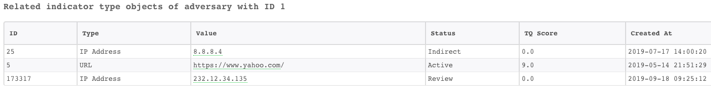

<h3 id="h_132eb50e-014e-46e5-88a6-d21e6d5e9554">14. Update an indicator status</h3>

Updates an indicator status in ThreatQ.

<h5>Base Command</h5>

<code>threatq-update-status</code>

<h5>Input</h5>
<table style="width: 748px;" border="2" cellpadding="6">
<thead>
<tr>
<th style="width: 91px;"><strong>Argument Name</strong></th>
<th style="width: 546px;"><strong>Description</strong></th>
<th style="width: 71px;"><strong>Required</strong></th>
</tr>
</thead>
<tbody>
<tr>
<td style="width: 91px;">id</td>
<td style="width: 546px;">The ID of the indicator.</td>
<td style="width: 71px;">Required</td>
</tr>
<tr>
<td style="width: 91px;">status</td>
<td style="width: 546px;">The new status of the indicator. Can be: "Active", "Expired", "Indirect", "Review", or "Whitelisted".</td>
<td style="width: 71px;">Required</td>
</tr>
</tbody>
</table>

 

<h5>Context Output</h5>
<table style="width: 748px;" border="2" cellpadding="6">
<thead>
<tr>
<th style="width: 302px;"><strong>Path</strong></th>
<th style="width: 115px;"><strong>Type</strong></th>
<th style="width: 291px;"><strong>Description</strong></th>
</tr>
</thead>
<tbody>
<tr>
<td style="width: 302px;">ThreatQ.Indicator.ID</td>
<td style="width: 115px;">Number</td>
<td style="width: 291px;">ID of the indicator.</td>
</tr>
<tr>
<td style="width: 302px;">ThreatQ.Indicator.Status</td>
<td style="width: 115px;">String</td>
<td style="width: 291px;">Status of the indicator.</td>
</tr>
</tbody>
</table>

 

<h5>Command Example</h5>
<pre>  !threatq-update-status id=173317 status=Whitelisted
</pre>
<h5>Human Readable Output</h5>

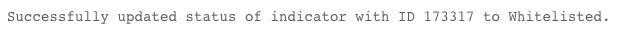

<h3 id="h_8da98151-77a4-4f98-8e4e-6993182c9a75">15. Get related events</h3>

Retrieves related events of an object in ThreatQ.

<h5>Base Command</h5>

<code>threatq-get-related-events</code>

<h5>Input</h5>
<table style="width: 748px;" border="2" cellpadding="6">
<thead>
<tr>
<th style="width: 129px;"><strong>Argument Name</strong></th>
<th style="width: 504px;"><strong>Description</strong></th>
<th style="width: 75px;"><strong>Required</strong></th>
</tr>
</thead>
<tbody>
<tr>
<td style="width: 129px;">obj_id</td>
<td style="width: 504px;">ID of the object.</td>
<td style="width: 75px;">Required</td>
</tr>
<tr>
<td style="width: 129px;">obj_type</td>
<td style="width: 504px;">The type of the object. Can be: "indicator", "event", or "adversary".</td>
<td style="width: 75px;">Required</td>
</tr>
</tbody>
</table>

 

<h5>Context Output</h5>
<table style="width: 748px;" border="2" cellpadding="6">
<thead>
<tr>
<th style="width: 325px;"><strong>Path</strong></th>
<th style="width: 72px;"><strong>Type</strong></th>
<th style="width: 311px;"><strong>Description</strong></th>
</tr>
</thead>
<tbody>
<tr>
<td style="width: 325px;">ThreatQ.Indicator.RelatedEvent.ID</td>
<td style="width: 72px;">number</td>
<td style="width: 311px;">ID of the related event.</td>
</tr>
<tr>
<td style="width: 325px;">ThreatQ.Indicator.RelatedEvent.Source.ID</td>
<td style="width: 72px;">number</td>
<td style="width: 311px;">Source ID of the related event.</td>
</tr>
<tr>
<td style="width: 325px;">ThreatQ.Indicator.RelatedEvent.Source.Name</td>
<td style="width: 72px;">string</td>
<td style="width: 311px;">Source name of the related event.</td>
</tr>
<tr>
<td style="width: 325px;">ThreatQ.Indicator.RelatedEvent.Attribute.ID</td>
<td style="width: 72px;">number</td>
<td style="width: 311px;">The attribute ID of the related event.</td>
</tr>
<tr>
<td style="width: 325px;">ThreatQ.Indicator.RelatedEvent.Attribute.Name</td>
<td style="width: 72px;">string</td>
<td style="width: 311px;">The attribute name of the related event.</td>
</tr>
<tr>
<td style="width: 325px;">ThreatQ.Indicator.RelatedEvent.Attribute.Value</td>
<td style="width: 72px;">string</td>
<td style="width: 311px;">The attribute value of the related event.</td>
</tr>
<tr>
<td style="width: 325px;">ThreatQ.Indicator.RelatedEvent.UpdatedAt</td>
<td style="width: 72px;">date</td>
<td style="width: 311px;">The last update date of the related event.</td>
</tr>
<tr>
<td style="width: 325px;">ThreatQ.Indicator.RelatedEvent.CreatedAt</td>
<td style="width: 72px;">date</td>
<td style="width: 311px;">The creation date of the related event.</td>
</tr>
<tr>
<td style="width: 325px;">ThreatQ.Indicator.RelatedEvent.Description</td>
<td style="width: 72px;">string</td>
<td style="width: 311px;">Description of the related event.</td>
</tr>
<tr>
<td style="width: 325px;">ThreatQ.Indicator.RelatedEvent.Title</td>
<td style="width: 72px;">string</td>
<td style="width: 311px;">The title of the related event.</td>
</tr>
<tr>
<td style="width: 325px;">ThreatQ.Indicator.RelatedEvent.Occurred</td>
<td style="width: 72px;">date</td>
<td style="width: 311px;">The date of occurrence of the related event.</td>
</tr>
<tr>
<td style="width: 325px;">ThreatQ.Indicator.RelatedEvent.Type</td>
<td style="width: 72px;">string</td>
<td style="width: 311px;">The type of the related event.</td>
</tr>
<tr>
<td style="width: 325px;">ThreatQ.Indicator.ID</td>
<td style="width: 72px;">number</td>
<td style="width: 311px;">The ID of the Indicator.</td>
</tr>
<tr>
<td style="width: 325px;">ThreatQ.Event.RelatedEvent.ID</td>
<td style="width: 72px;">number</td>
<td style="width: 311px;">The ID of the related event.</td>
</tr>
<tr>
<td style="width: 325px;">ThreatQ.Event.RelatedEvent.Source.ID</td>
<td style="width: 72px;">number</td>
<td style="width: 311px;">The source ID of the related event.</td>
</tr>
<tr>
<td style="width: 325px;">ThreatQ.Event.RelatedEvent.Source.Name</td>
<td style="width: 72px;">string</td>
<td style="width: 311px;">The source name of the related event.</td>
</tr>
<tr>
<td style="width: 325px;">ThreatQ.Event.RelatedEvent.Attribute.ID</td>
<td style="width: 72px;">number</td>
<td style="width: 311px;">The attribute ID of the related event.</td>
</tr>
<tr>
<td style="width: 325px;">ThreatQ.Event.RelatedEvent.Attribute.Name</td>
<td style="width: 72px;">string</td>
<td style="width: 311px;">The attribute name of the related event.</td>
</tr>
<tr>
<td style="width: 325px;">ThreatQ.Event.RelatedEvent.Attribute.Value</td>
<td style="width: 72px;">string</td>
<td style="width: 311px;">The attribute value of the related event.</td>
</tr>
<tr>
<td style="width: 325px;">ThreatQ.Event.RelatedEvent.UpdatedAt</td>
<td style="width: 72px;">date</td>
<td style="width: 311px;">The last update date of the related event.</td>
</tr>
<tr>
<td style="width: 325px;">ThreatQ.Event.RelatedEvent.CreatedAt</td>
<td style="width: 72px;">date</td>
<td style="width: 311px;">The creation date of the related event.</td>
</tr>
<tr>
<td style="width: 325px;">ThreatQ.Event.RelatedEvent.Description</td>
<td style="width: 72px;">string</td>
<td style="width: 311px;">The description of the related event.</td>
</tr>
<tr>
<td style="width: 325px;">ThreatQ.Event.RelatedEvent.Title</td>
<td style="width: 72px;">string</td>
<td style="width: 311px;">The title of the related event.</td>
</tr>
<tr>
<td style="width: 325px;">ThreatQ.Event.RelatedEvent.Occurred</td>
<td style="width: 72px;">date</td>
<td style="width: 311px;">The date of occurrence of the related event.</td>
</tr>
<tr>
<td style="width: 325px;">ThreatQ.Event.RelatedEvent.Type</td>
<td style="width: 72px;">string</td>
<td style="width: 311px;">The type of the related event.</td>
</tr>
<tr>
<td style="width: 325px;">ThreatQ.Event.ID</td>
<td style="width: 72px;">number</td>
<td style="width: 311px;">The ID of the Event.</td>
</tr>
<tr>
<td style="width: 325px;">ThreatQ.Adversary.RelatedEvent.ID</td>
<td style="width: 72px;">number</td>
<td style="width: 311px;">The ID of the related event.</td>
</tr>
<tr>
<td style="width: 325px;">ThreatQ.Adversary.RelatedEvent.Source.ID</td>
<td style="width: 72px;">number</td>
<td style="width: 311px;">The source ID of the related event.</td>
</tr>
<tr>
<td style="width: 325px;">ThreatQ.Adversary.RelatedEvent.Source.Name</td>
<td style="width: 72px;">string</td>
<td style="width: 311px;">The source name of the related event.</td>
</tr>
<tr>
<td style="width: 325px;">ThreatQ.Adversary.RelatedEvent.Attribute.ID</td>
<td style="width: 72px;">number</td>
<td style="width: 311px;">The attribute ID of the of the related event.</td>
</tr>
<tr>
<td style="width: 325px;">ThreatQ.Adversary.RelatedEvent.Attribute.Name</td>
<td style="width: 72px;">string</td>
<td style="width: 311px;">The attribute name of the related event.</td>
</tr>
<tr>
<td style="width: 325px;">ThreatQ.Adversary.RelatedEvent.Attribute.Value</td>
<td style="width: 72px;">string</td>
<td style="width: 311px;">The attribute value of the related event.</td>
</tr>
<tr>
<td style="width: 325px;">ThreatQ.Adversary.RelatedEvent.UpdatedAt</td>
<td style="width: 72px;">date</td>
<td style="width: 311px;">The last update date of the related event.</td>
</tr>
<tr>
<td style="width: 325px;">ThreatQ.Adversary.RelatedEvent.CreatedAt</td>
<td style="width: 72px;">date</td>
<td style="width: 311px;">The creation date of the related event.</td>
</tr>
<tr>
<td style="width: 325px;">ThreatQ.Adversary.RelatedEvent.Description</td>
<td style="width: 72px;">string</td>
<td style="width: 311px;">The description of the related event.</td>
</tr>
<tr>
<td style="width: 325px;">ThreatQ.Adversary.RelatedEvent.Title</td>
<td style="width: 72px;">string</td>
<td style="width: 311px;">The title of the related event.</td>
</tr>
<tr>
<td style="width: 325px;">ThreatQ.Adversary.RelatedEvent.Occurred</td>
<td style="width: 72px;">date</td>
<td style="width: 311px;">The date of occurrence of the related event.</td>
</tr>
<tr>
<td style="width: 325px;">ThreatQ.Adversary.RelatedEvent.Type</td>
<td style="width: 72px;">string</td>
<td style="width: 311px;">The type of the related event.</td>
</tr>
<tr>
<td style="width: 325px;">ThreatQ.Adversary.ID</td>
<td style="width: 72px;">number</td>
<td style="width: 311px;">ID of the Adversary.</td>
</tr>
</tbody>
</table>

 

<h5>Command Example</h5>
<pre>  !threatq-get-related-events obj_id=1 obj_type=adversary</pre>
<h5>Human Readable Output</h5>

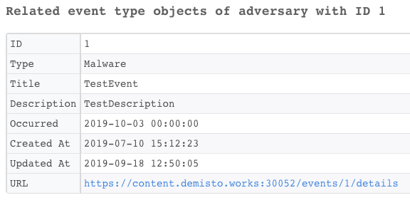

<h3 id="h_65255efc-6d1e-4d5d-a94a-b92106b7e614">16. Get related adversaries</h3>

Retrieve related adversaries from an object in ThreatQ.

<h5>Base Command</h5>

<code>threatq-get-related-adversaries</code>

<h5>Input</h5>
<table style="width: 748px;" border="2" cellpadding="6">
<thead>
<tr>
<th style="width: 125px;"><strong>Argument Name</strong></th>
<th style="width: 508px;"><strong>Description</strong></th>
<th style="width: 75px;"><strong>Required</strong></th>
</tr>
</thead>
<tbody>
<tr>
<td style="width: 125px;">obj_id</td>
<td style="width: 508px;">ID of the object.</td>
<td style="width: 75px;">Required</td>
</tr>
<tr>
<td style="width: 125px;">obj_type</td>
<td style="width: 508px;">The type of the object. Can be: "indicator", "event", or "adversary".</td>
<td style="width: 75px;">Required</td>
</tr>
</tbody>
</table>

 

<h5>Context Output</h5>
<table style="width: 748px;" border="2" cellpadding="6">
<thead>
<tr>
<th style="width: 349px;"><strong>Path</strong></th>
<th style="width: 77px;"><strong>Type</strong></th>
<th style="width: 282px;"><strong>Description</strong></th>
</tr>
</thead>
<tbody>
<tr>
<td style="width: 349px;">ThreatQ.Indicator.RelatedAdversary.ID</td>
<td style="width: 77px;">number</td>
<td style="width: 282px;">ID of the related adversary.</td>
</tr>
<tr>
<td style="width: 349px;">ThreatQ.Indicator.RelatedAdversary.Source.ID</td>
<td style="width: 77px;">number</td>
<td style="width: 282px;">Source ID of the related adversary.</td>
</tr>
<tr>
<td style="width: 349px;">ThreatQ.Indicator.RelatedAdversary.Source.Name</td>
<td style="width: 77px;">string</td>
<td style="width: 282px;">The Source name of the related adversary.</td>
</tr>
<tr>
<td style="width: 349px;">ThreatQ.Indicator.RelatedAdversary.Attribute.ID</td>
<td style="width: 77px;">number</td>
<td style="width: 282px;">The attribute ID of the related adversary.</td>
</tr>
<tr>
<td style="width: 349px;">ThreatQ.Indicator.RelatedAdversary.Attribute.Name</td>
<td style="width: 77px;">string</td>
<td style="width: 282px;">The attribute name of the related adversary.</td>
</tr>
<tr>
<td style="width: 349px;">ThreatQ.Indicator.RelatedAdversary.Attribute.Value</td>
<td style="width: 77px;">string</td>
<td style="width: 282px;">The attribute value of the related adversary.</td>
</tr>
<tr>
<td style="width: 349px;">ThreatQ.Indicator.RelatedAdversary.UpdatedAt</td>
<td style="width: 77px;">date</td>
<td style="width: 282px;">The last update date of the related adversary.</td>
</tr>
<tr>
<td style="width: 349px;">ThreatQ.Indicator.RelatedAdversary.CreatedAt</td>
<td style="width: 77px;">date</td>
<td style="width: 282px;">The creation date of the related adversary.</td>
</tr>
<tr>
<td style="width: 349px;">ThreatQ.Indicator.RelatedAdversary.Name</td>
<td style="width: 77px;">string</td>
<td style="width: 282px;">The name of the related adversary.</td>
</tr>
<tr>
<td style="width: 349px;">ThreatQ.Indicator.ID</td>
<td style="width: 77px;">number</td>
<td style="width: 282px;">The ID of the Indicator.</td>
</tr>
<tr>
<td style="width: 349px;">ThreatQ.Event.RelatedAdversary.ID</td>
<td style="width: 77px;">number</td>
<td style="width: 282px;">The ID of the related adversary.</td>
</tr>
<tr>
<td style="width: 349px;">ThreatQ.Event.RelatedAdversary.Source.ID</td>
<td style="width: 77px;">number</td>
<td style="width: 282px;">The source ID of the related adversary.</td>
</tr>
<tr>
<td style="width: 349px;">ThreatQ.Event.RelatedAdversary.Source.Name</td>
<td style="width: 77px;">string</td>
<td style="width: 282px;">The source name of the related adversary.</td>
</tr>
<tr>
<td style="width: 349px;">ThreatQ.Event.RelatedAdversary.Attribute.ID</td>
<td style="width: 77px;">number</td>
<td style="width: 282px;">The attribute ID of the related adversary.</td>
</tr>
<tr>
<td style="width: 349px;">ThreatQ.Event.RelatedAdversary.Attribute.Name</td>
<td style="width: 77px;">string</td>
<td style="width: 282px;">The Attribute name of the related adversary.</td>
</tr>
<tr>
<td style="width: 349px;">ThreatQ.Event.RelatedAdversary.Attribute.Value</td>
<td style="width: 77px;">string</td>
<td style="width: 282px;">The attribute value of the related adversary.</td>
</tr>
<tr>
<td style="width: 349px;">ThreatQ.Event.RelatedAdversary.UpdatedAt</td>
<td style="width: 77px;">date</td>
<td style="width: 282px;">The last update date of the related adversary.</td>
</tr>
<tr>
<td style="width: 349px;">ThreatQ.Event.RelatedAdversary.CreatedAt</td>
<td style="width: 77px;">date</td>
<td style="width: 282px;">The creation date of the related adversary.</td>
</tr>
<tr>
<td style="width: 349px;">ThreatQ.Event.RelatedAdversary.Name</td>
<td style="width: 77px;">string</td>
<td style="width: 282px;">The name of the related adversary.</td>
</tr>
<tr>
<td style="width: 349px;">ThreatQ.Event.ID</td>
<td style="width: 77px;">number</td>
<td style="width: 282px;">The ID of the Event.</td>
</tr>
<tr>
<td style="width: 349px;">ThreatQ.Adversary.RelatedAdversary.ID</td>
<td style="width: 77px;">number</td>
<td style="width: 282px;">The ID of the Related adversary.</td>
</tr>
<tr>
<td style="width: 349px;">ThreatQ.Adversary.RelatedAdversary.Source.ID</td>
<td style="width: 77px;">number</td>
<td style="width: 282px;">The source ID of the related adversary.</td>
</tr>
<tr>
<td style="width: 349px;">ThreatQ.Adversary.RelatedAdversary.Source.Name</td>
<td style="width: 77px;">string</td>
<td style="width: 282px;">The source name of the related adversary.</td>
</tr>
<tr>
<td style="width: 349px;">ThreatQ.Adversary.RelatedAdversary.Attribute.ID</td>
<td style="width: 77px;">number</td>
<td style="width: 282px;">The attribute ID of the related adversary.</td>
</tr>
<tr>
<td style="width: 349px;">ThreatQ.Adversary.RelatedAdversary.Attribute.Name</td>
<td style="width: 77px;">string</td>
<td style="width: 282px;">The attribute name of the related adversary.</td>
</tr>
<tr>
<td style="width: 349px;">ThreatQ.Adversary.RelatedAdversary.Attribute.Value</td>
<td style="width: 77px;">string</td>
<td style="width: 282px;">The attribute value of the related adversary.</td>
</tr>
<tr>
<td style="width: 349px;">ThreatQ.Adversary.RelatedAdversary.UpdatedAt</td>
<td style="width: 77px;">date</td>
<td style="width: 282px;">The last update date of the related adversary.</td>
</tr>
<tr>
<td style="width: 349px;">ThreatQ.Adversary.RelatedAdversary.CreatedAt</td>
<td style="width: 77px;">date</td>
<td style="width: 282px;">The creation date of the related adversary.</td>
</tr>
<tr>
<td style="width: 349px;">ThreatQ.Adversary.RelatedAdversary.Name</td>
<td style="width: 77px;">string</td>
<td style="width: 282px;">The name of the related adversary.</td>
</tr>
<tr>
<td style="width: 349px;">ThreatQ.Adversary.ID</td>
<td style="width: 77px;">number</td>
<td style="width: 282px;">The ID of the Adversary.</td>
</tr>
</tbody>
</table>

 

<h5>Command Example</h5>
<pre>  !threatq-get-related-adversaries obj_id=1 obj_type=adversary
</pre>
<h5>Human Readable Output</h5>

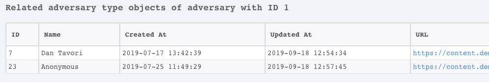

<h3 id="h_954537b3-b7ea-466b-b51e-752d67fe4281">17. Upload a-file</h3>

Uploads a file to ThreatQ.

<h5>Base Command</h5>

<code>threatq-upload-file</code>

<h5>Input</h5>
<table style="width: 748px;" border="2" cellpadding="6">
<thead>
<tr>
<th style="width: 141px;"><strong>Argument Name</strong></th>
<th style="width: 496px;"><strong>Description</strong></th>
<th style="width: 71px;"><strong>Required</strong></th>
</tr>
</thead>
<tbody>
<tr>
<td style="width: 141px;">entry_id</td>
<td style="width: 496px;">The file entry ID in Cortex XSOAR.</td>
<td style="width: 71px;">Required</td>
</tr>
<tr>
<td style="width: 141px;">file_category</td>
<td style="width: 496px;">Category of the file, such as CrowdStrike Intelligence, FireEye Analysis, PDF, and so on.</td>
<td style="width: 71px;">Required</td>
</tr>
<tr>
<td style="width: 141px;">malware_safety_lock</td>
<td style="width: 496px;">Zips malware files for safer downloading. Can be: "on", or "off". Default is off.</td>
<td style="width: 71px;">Optional</td>
</tr>
<tr>
<td style="width: 141px;">title</td>
<td style="width: 496px;">Title of the File. Default is the file name.</td>
<td style="width: 71px;">Optional</td>
</tr>
</tbody>
</table>

 

<h5>Context Output</h5>
<table style="width: 748px;" border="2" cellpadding="6">
<thead>
<tr>
<th style="width: 271px;"><strong>Path</strong></th>
<th style="width: 94px;"><strong>Type</strong></th>
<th style="width: 343px;"><strong>Description</strong></th>
</tr>
</thead>
<tbody>
<tr>
<td style="width: 271px;">ThreatQ.File.CreatedAt</td>
<td style="width: 94px;">Date</td>
<td style="width: 343px;">Date of the file upload.</td>
</tr>
<tr>
<td style="width: 271px;">ThreatQ.File.Size</td>
<td style="width: 94px;">Number</td>
<td style="width: 343px;">Size (in bytes) of the file.</td>
</tr>
<tr>
<td style="width: 271px;">ThreatQ.File.MD5</td>
<td style="width: 94px;">String</td>
<td style="width: 343px;">The MD5 of the file.</td>
</tr>
<tr>
<td style="width: 271px;">ThreatQ.File.ID</td>
<td style="width: 94px;">Number</td>
<td style="width: 343px;">The File ID in ThreatQ.</td>
</tr>
<tr>
<td style="width: 271px;">ThreatQ.File.Name</td>
<td style="width: 94px;">String</td>
<td style="width: 343px;">The name of the File.</td>
</tr>
<tr>
<td style="width: 271px;">ThreatQ.File.Title</td>
<td style="width: 94px;">String</td>
<td style="width: 343px;">The title of the file.</td>
</tr>
<tr>
<td style="width: 271px;">ThreatQ.File.UpdatedAt</td>
<td style="width: 94px;">Date</td>
<td style="width: 343px;">The last update of the file.</td>
</tr>
<tr>
<td style="width: 271px;">ThreatQ.File.MalwareLocked</td>
<td style="width: 94px;">Number</td>
<td style="width: 343px;">Whether malware files are zipped.</td>
</tr>
<tr>
<td style="width: 271px;">ThreatQ.File.ContentType</td>
<td style="width: 94px;">String</td>
<td style="width: 343px;">The content type of the file.</td>
</tr>
<tr>
<td style="width: 271px;">ThreatQ.File.Category</td>
<td style="width: 94px;">String</td>
<td style="width: 343px;">The type of the file.</td>
</tr>
<tr>
<td style="width: 271px;">ThreatQ.File.Source.ID</td>
<td style="width: 94px;">Number</td>
<td style="width: 343px;">The source of the file.</td>
</tr>
<tr>
<td style="width: 271px;">ThreatQ.File.Source.Name</td>
<td style="width: 94px;">String</td>
<td style="width: 343px;">The source name of the file.</td>
</tr>
<tr>
<td style="width: 271px;">ThreatQ.File.Attribute.ID</td>
<td style="width: 94px;">Number</td>
<td style="width: 343px;">The attribute ID of the file.</td>
</tr>
<tr>
<td style="width: 271px;">ThreatQ.File.Attribute.Name</td>
<td style="width: 94px;">String</td>
<td style="width: 343px;">The attribute name of the file.</td>
</tr>
<tr>
<td style="width: 271px;">ThreatQ.File.Attribute.Value</td>
<td style="width: 94px;">String</td>
<td style="width: 343px;">The attribute value of the file.</td>
</tr>
</tbody>
</table>

 

<h5>Command Example</h5>
<pre>  !threatq-upload-file entry_id=5379@9da8d636-cf30-42c2-8263-d09f5268be8a file_category="Generic Text" title="File Title"
</pre>
<h5>Human Readable Output</h5>

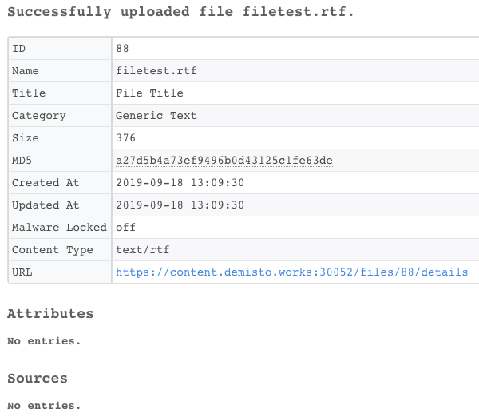

<h3 id="h_3a356804-dbae-46a8-9185-2e7e74e1a81e">18. Search by Object type and ID</h3>

Searches for an object by object type and ID. 

<h5>Base Command</h5>

<code>threatq-search-by-id</code>

<h5>Input</h5>
<table style="width: 748px;" border="2" cellpadding="6">
<thead>
<tr>
<th style="width: 106px;"><strong>Argument Name</strong></th>
<th style="width: 531px;"><strong>Description</strong></th>
<th style="width: 71px;"><strong>Required</strong></th>
</tr>
</thead>
<tbody>
<tr>
<td style="width: 106px;">obj_type</td>
<td style="width: 531px;">The type of the object. Can be: "indicator", "event", "attachment" or "adversary".</td>
<td style="width: 71px;">Required</td>
</tr>
<tr>
<td style="width: 106px;">obj_id</td>
<td style="width: 531px;">The ID of the Object.</td>
<td style="width: 71px;">Required</td>
</tr>
</tbody>
</table>

 

<h5>Context Output</h5>
<table style="width: 748px;" border="2" cellpadding="6">
<thead>
<tr>
<th style="width: 254px;"><strong>Path</strong></th>
<th style="width: 68px;"><strong>Type</strong></th>
<th style="width: 386px;"><strong>Description</strong></th>
</tr>
</thead>
<tbody>
<tr>
<td style="width: 254px;">ThreatQ.Indicator.ID</td>
<td style="width: 68px;">number</td>
<td style="width: 386px;">ID of the indicator.</td>
</tr>
<tr>
<td style="width: 254px;">ThreatQ.Indicator.Source.ID</td>
<td style="width: 68px;">number</td>
<td style="width: 386px;">Source ID of the indicator.</td>
</tr>
<tr>
<td style="width: 254px;">ThreatQ.Indicator.Source.Name</td>
<td style="width: 68px;">string</td>
<td style="width: 386px;">Source name of the indicator.</td>
</tr>
<tr>
<td style="width: 254px;">ThreatQ.Indicator.Attribute.ID</td>
<td style="width: 68px;">number</td>
<td style="width: 386px;">Attribute ID of the indicator.</td>
</tr>
<tr>
<td style="width: 254px;">ThreatQ.Indicator.Attribute.Name</td>
<td style="width: 68px;">string</td>
<td style="width: 386px;">Attribute name of the indicator.</td>
</tr>
<tr>
<td style="width: 254px;">ThreatQ.Indicator.Attribute.Value</td>
<td style="width: 68px;">string</td>
<td style="width: 386px;">Attribute value of the indicator.</td>
</tr>
<tr>
<td style="width: 254px;">ThreatQ.Indicator.CreatedAt</td>
<td style="width: 68px;">date</td>
<td style="width: 386px;">Creation date of the indicator.</td>
</tr>
<tr>
<td style="width: 254px;">ThreatQ.Indicator.UpdatedAt</td>
<td style="width: 68px;">date</td>
<td style="width: 386px;">Last update date of the indicator.</td>
</tr>
<tr>
<td style="width: 254px;">ThreatQ.Indicator.Description</td>
<td style="width: 68px;">string</td>
<td style="width: 386px;">Description of the indicator.</td>
</tr>
<tr>
<td style="width: 254px;">ThreatQ.Indicator.Value</td>
<td style="width: 68px;">string</td>
<td style="width: 386px;">The value of the indicator.</td>
</tr>
<tr>
<td style="width: 254px;">ThreatQ.Indicator.Status</td>
<td style="width: 68px;">string</td>
<td style="width: 386px;">The status of indicator.</td>
</tr>
<tr>
<td style="width: 254px;">ThreatQ.Indicator.Type</td>
<td style="width: 68px;">string</td>
<td style="width: 386px;">The type of the indicator. For example, IP Address.</td>
</tr>
<tr>
<td style="width: 254px;">ThreatQ.Indicator.TQScore</td>
<td style="width: 68px;">number</td>
<td style="width: 386px;">The ThreatQ Score of the indicator.</td>
</tr>
<tr>
<td style="width: 254px;">ThreatQ.Event.ID</td>
<td style="width: 68px;">number</td>
<td style="width: 386px;">The ID of the indicator.</td>
</tr>
<tr>
<td style="width: 254px;">ThreatQ.Event.Source.ID</td>
<td style="width: 68px;">number</td>
<td style="width: 386px;">The source ID of the indicator.</td>
</tr>
<tr>
<td style="width: 254px;">ThreatQ.Event.Source.Name</td>
<td style="width: 68px;">string</td>
<td style="width: 386px;">The source name of the indicator.</td>
</tr>
<tr>
<td style="width: 254px;">ThreatQ.Event.Attribute.ID</td>
<td style="width: 68px;">number</td>
<td style="width: 386px;">The attribute ID of the indicator.</td>
</tr>
<tr>
<td style="width: 254px;">ThreatQ.Event.Attribute.Name</td>
<td style="width: 68px;">string</td>
<td style="width: 386px;">The attribute name of the indicator.</td>
</tr>
<tr>
<td style="width: 254px;">ThreatQ.Event.Attribute.Value</td>
<td style="width: 68px;">string</td>
<td style="width: 386px;">The attribute value of the indicator.</td>
</tr>
<tr>
<td style="width: 254px;">ThreatQ.Event.UpdatedAt</td>
<td style="width: 68px;">date</td>
<td style="width: 386px;">The last update date of the event.</td>
</tr>
<tr>
<td style="width: 254px;">ThreatQ.Event.CreatedAt</td>
<td style="width: 68px;">date</td>
<td style="width: 386px;">The creation date of the event.</td>
</tr>
<tr>
<td style="width: 254px;">ThreatQ.Event.Type</td>
<td style="width: 68px;">string</td>
<td style="width: 386px;">The type of the event.</td>
</tr>
<tr>
<td style="width: 254px;">ThreatQ.Event.Description</td>
<td style="width: 68px;">string</td>
<td style="width: 386px;">Description of the event.</td>
</tr>
<tr>
<td style="width: 254px;">ThreatQ.Event.Title</td>
<td style="width: 68px;">string</td>
<td style="width: 386px;">The title of the event.</td>
</tr>
<tr>
<td style="width: 254px;">ThreatQ.Event.Occurred</td>
<td style="width: 68px;">date</td>
<td style="width: 386px;">The date that the event happened.</td>
</tr>
<tr>
<td style="width: 254px;">ThreatQ.Adversary.Name</td>
<td style="width: 68px;">string</td>
<td style="width: 386px;">The name of the adversary.</td>
</tr>
<tr>
<td style="width: 254px;">ThreatQ.Adversary.ID</td>
<td style="width: 68px;">number</td>
<td style="width: 386px;">The ID of the adversary.</td>
</tr>
<tr>
<td style="width: 254px;">ThreatQ.Adversary.Source.ID</td>
<td style="width: 68px;">number</td>
<td style="width: 386px;">The source of the adversary.</td>
</tr>
<tr>
<td style="width: 254px;">ThreatQ.Adversary.Source.Name</td>
<td style="width: 68px;">string</td>
<td style="width: 386px;">The source name of the adversary.</td>
</tr>
<tr>
<td style="width: 254px;">ThreatQ.Adversary.Attribute.ID</td>
<td style="width: 68px;">number</td>
<td style="width: 386px;">The attribute ID of the adversary.</td>
</tr>
<tr>
<td style="width: 254px;">ThreatQ.Adversary.Attribute.Name</td>
<td style="width: 68px;">string</td>
<td style="width: 386px;">The attribute name of the adversary.</td>
</tr>
<tr>
<td style="width: 254px;">ThreatQ.Adversary.Attribute.Value</td>
<td style="width: 68px;">string</td>
<td style="width: 386px;">The attribute value of the adversary.</td>
</tr>
<tr>
<td style="width: 254px;">ThreatQ.Adversary.UpdatedAt</td>
<td style="width: 68px;">date</td>
<td style="width: 386px;">The creation date of the adversary.</td>
</tr>
<tr>
<td style="width: 254px;">ThreatQ.Adversary.CreatedAt</td>
<td style="width: 68px;">date</td>
<td style="width: 386px;">The last update date of the adversary.</td>
</tr>
<tr>
<td style="width: 254px;">ThreatQ.File.CreatedAt</td>
<td style="width: 68px;">Date</td>
<td style="width: 386px;">Date of the file upload.</td>
</tr>
<tr>
<td style="width: 254px;">ThreatQ.File.Size</td>
<td style="width: 68px;">Number</td>
<td style="width: 386px;">Size (in bytes) of the file.</td>
</tr>
<tr>
<td style="width: 254px;">ThreatQ.File.MD5</td>
<td style="width: 68px;">String</td>
<td style="width: 386px;">The MD5 hash of the file.</td>
</tr>
<tr>
<td style="width: 254px;">ThreatQ.File.ID</td>
<td style="width: 68px;">Number</td>
<td style="width: 386px;">The File ID in ThreatQ.</td>
</tr>
<tr>
<td style="width: 254px;">ThreatQ.File.Name</td>
<td style="width: 68px;">String</td>
<td style="width: 386px;">The name of the File.</td>
</tr>
<tr>
<td style="width: 254px;">ThreatQ.File.Title</td>
<td style="width: 68px;">String</td>
<td style="width: 386px;">The title of the file.</td>
</tr>
<tr>
<td style="width: 254px;">ThreatQ.File.UpdatedAt</td>
<td style="width: 68px;">Date</td>
<td style="width: 386px;">The last update of the file.</td>
</tr>
<tr>
<td style="width: 254px;">ThreatQ.File.MalwareLocked</td>
<td style="width: 68px;">Number</td>
<td style="width: 386px;">Whether malware files are zipped.</td>
</tr>
<tr>
<td style="width: 254px;">ThreatQ.File.ContentType</td>
<td style="width: 68px;">String</td>
<td style="width: 386px;">The content type of the file.</td>
</tr>
<tr>
<td style="width: 254px;">ThreatQ.File.Category</td>
<td style="width: 68px;">String</td>
<td style="width: 386px;">The type of the file.</td>
</tr>
<tr>
<td style="width: 254px;">ThreatQ.File.Source.ID</td>
<td style="width: 68px;">Number</td>
<td style="width: 386px;">The source of the file.</td>
</tr>
<tr>
<td style="width: 254px;">ThreatQ.File.Source.Name</td>
<td style="width: 68px;">String</td>
<td style="width: 386px;">The source name of the file.</td>
</tr>
<tr>
<td style="width: 254px;">ThreatQ.File.Attribute.ID</td>
<td style="width: 68px;">Number</td>
<td style="width: 386px;">The attribute ID of the file.</td>
</tr>
<tr>
<td style="width: 254px;">ThreatQ.File.Attribute.Name</td>
<td style="width: 68px;">String</td>
<td style="width: 386px;">The attribute name of the file.</td>
</tr>
<tr>
<td style="width: 254px;">ThreatQ.File.Attribute.Value</td>
<td style="width: 68px;">String</td>
<td style="width: 386px;">The attribute value of the file.</td>
</tr>
</tbody>
</table>

 

<h5>Command Example</h5>
<pre>  !threatq-search-by-id obj_id=173317 obj_type=indicator
</pre>
<h5>Human Readable Output</h5>

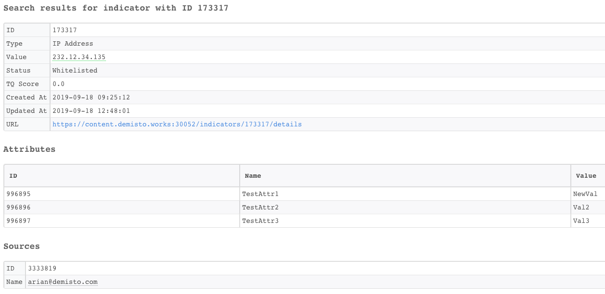

<h3 id="h_58713dca-ce21-473b-9777-42ae33761cb5">19. Unlink two objects</h3>

Unlinks two objects in ThreatQ.

<h5>Base Command</h5>

<code>threatq-unlink-objects</code>

<h5>Input</h5>
<table style="width: 748px;" border="2" cellpadding="6">
<thead>
<tr>
<th style="width: 114px;"><strong>Argument Name</strong></th>
<th style="width: 523px;"><strong>Description</strong></th>
<th style="width: 71px;"><strong>Required</strong></th>
</tr>
</thead>
<tbody>
<tr>
<td style="width: 114px;">obj1_id</td>
<td style="width: 523px;">The ID of the first object.</td>
<td style="width: 71px;">Required</td>
</tr>
<tr>
<td style="width: 114px;">obj1_type</td>
<td style="width: 523px;">The type of the first object. Can be: "adversary", "indicator", or "event".</td>
<td style="width: 71px;">Required</td>
</tr>
<tr>
<td style="width: 114px;">obj2_id</td>
<td style="width: 523px;">The ID of the second object.</td>
<td style="width: 71px;">Required</td>
</tr>
<tr>
<td style="width: 114px;">obj2_type</td>
<td style="width: 523px;">The type of the second object. Can be: "adversary", "indicator", or "event".</td>
<td style="width: 71px;">Required</td>
</tr>
</tbody>
</table>

 

<h5>Command Example</h5>
<pre>  !threatq-unlink-objects obj1_id=173317 obj1_type=indicator obj2_id=1 obj2_type=adversary
</pre>
<h5>Human Readable Output</h5>

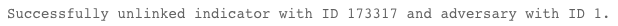

<h3 id="h_f73a0c2a-eb69-42c2-992e-17a5dc6a5906">20. Delete an object</h3>

Deletes an object in ThreatQ.

<h5>Base Command</h5>

<code>threatq-delete-object</code>

<h5>Input</h5>
<table style="width: 748px;" border="2" cellpadding="6">
<thead>
<tr>
<th style="width: 107px;"><strong>Argument Name</strong></th>
<th style="width: 530px;"><strong>Description</strong></th>
<th style="width: 71px;"><strong>Required</strong></th>
</tr>
</thead>
<tbody>
<tr>
<td style="width: 107px;">obj_id</td>
<td style="width: 530px;">ID of the Object.</td>
<td style="width: 71px;">Required</td>
</tr>
<tr>
<td style="width: 107px;">obj_type</td>
<td style="width: 530px;">The type of the object. Can be: "indicator", "event", "adversary" or "attachment".</td>
<td style="width: 71px;">Required</td>
</tr>
</tbody>
</table>

 

<h5>Command Example</h5>
<pre>  !threatq-delete-object obj_id=104 obj_type=event
</pre>
<h5>Human Readable Output</h5>

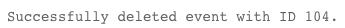

<h3 id="h_d51d027d-646e-4e39-a880-fe38347bce70">21. Add a source to an object</h3>

Adds a source to an object in ThreatQ.

<h5>Base Command</h5>

<code>threatq-add-source</code>

<h5>Input</h5>
<table style="width: 748px;" border="2" cellpadding="6">
<thead>
<tr>
<th style="width: 107px;"><strong>Argument Name</strong></th>
<th style="width: 530px;"><strong>Description</strong></th>
<th style="width: 71px;"><strong>Required</strong></th>
</tr>
</thead>
<tbody>
<tr>
<td style="width: 107px;">obj_id</td>
<td style="width: 530px;">ID of an Object.</td>
<td style="width: 71px;">Required</td>
</tr>
<tr>
<td style="width: 107px;">obj_type</td>
<td style="width: 530px;">The type of the object. Can be: "indicator", "event", "adversary", or "attachment".</td>
<td style="width: 71px;">Required</td>
</tr>
<tr>
<td style="width: 107px;">source</td>
<td style="width: 530px;">The source name.</td>
<td style="width: 71px;">Required</td>
</tr>
</tbody>
</table>

 

<h5>Command Example</h5>
<pre>  !threatq-add-source obj_id=173317 obj_type=indicator source="AlienVault OTX"
</pre>
<h5>Human Readable Output</h5>

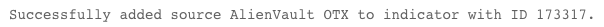

<h3 id="h_85f58464-1e5c-4d3c-b735-77103ccf63a7">22. Delete a source from an object</h3>

Deletes a source from an object in ThreatQ.

<h5>Base Command</h5>

<code>threatq-delete-source</code>

<h5>Input</h5>
<table style="width: 748px;" border="2" cellpadding="6">
<thead>
<tr>
<th style="width: 108px;"><strong>Argument Name</strong></th>
<th style="width: 529px;"><strong>Description</strong></th>
<th style="width: 71px;"><strong>Required</strong></th>
</tr>
</thead>
<tbody>
<tr>
<td style="width: 108px;">source_id</td>
<td style="width: 529px;">ID of the source.</td>
<td style="width: 71px;">Required</td>
</tr>
<tr>
<td style="width: 108px;">obj_id</td>
<td style="width: 529px;">ID of the object.</td>
<td style="width: 71px;">Required</td>
</tr>
<tr>
<td style="width: 108px;">obj_type</td>
<td style="width: 529px;">The type of the object. Can be: "indicator", "event", "adversary", or "attachment".</td>
<td style="width: 71px;">Required</td>
</tr>
</tbody>
</table>

 

<h5>Command Example</h5>
<pre>  !threatq-delete-source obj_id=173317 obj_type=indicator source_id=3333819
</pre>
<h5>Human Readable Output</h5>

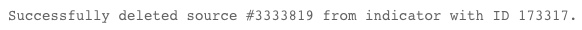

<h3 id="h_f2e5a3eb-79bd-4d1d-ac57-9fd32dcb9866">23. Delete an attribute</h3>

Deletes an attribute from an object in ThreatQ.

<h5>Base Command</h5>

<code>threatq-delete-attribute</code>

<h5>Input</h5>
<table style="width: 748px;" border="2" cellpadding="6">
<thead>
<tr>
<th style="width: 110px;"><strong>Argument Name</strong></th>
<th style="width: 527px;"><strong>Description</strong></th>
<th style="width: 71px;"><strong>Required</strong></th>
</tr>
</thead>
<tbody>
<tr>
<td style="width: 110px;">attribute_id</td>
<td style="width: 527px;">ID of the attribute.</td>
<td style="width: 71px;">Required</td>
</tr>
<tr>
<td style="width: 110px;">obj_id</td>
<td style="width: 527px;">ID of the object.</td>
<td style="width: 71px;">Required</td>
</tr>
<tr>
<td style="width: 110px;">obj_type</td>
<td style="width: 527px;">The type of the object. Can be: "indicator", "event", "adversary", or "attachment".</td>
<td style="width: 71px;">Required</td>
</tr>
</tbody>
</table>

 

<h5>Command Example</h5>
<pre>  !threatq-delete-attribute attribute_id=996896 obj_id=173317 obj_type=indicator
</pre>
<h5>Human Readable Output</h5>

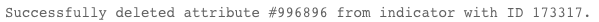

<h3 id="h_ff4038d6-4c8b-4e89-a586-1d4a8c1168d6">24. Edit an adversary</h3>

Updates an adversary name in ThreatQ.

<h5>Base Command</h5>

<code>threatq-edit-adversary</code>

<h5>Input</h5>
<table style="width: 748px;" border="2" cellpadding="6">
<thead>
<tr>
<th style="width: 210px;"><strong>Argument Name</strong></th>
<th style="width: 372px;"><strong>Description</strong></th>
<th style="width: 126px;"><strong>Required</strong></th>
</tr>
</thead>
<tbody>
<tr>
<td style="width: 210px;">id</td>
<td style="width: 372px;">ID of the Adversary to update.</td>
<td style="width: 126px;">Required</td>
</tr>
<tr>
<td style="width: 210px;">name</td>
<td style="width: 372px;">Name of the new adversary.</td>
<td style="width: 126px;">Required</td>
</tr>
</tbody>
</table>

 

<h5>Context Output</h5>
<table style="width: 748px;" border="2" cellpadding="6">
<thead>
<tr>
<th style="width: 293px;"><strong>Path</strong></th>
<th style="width: 79px;"><strong>Type</strong></th>
<th style="width: 336px;"><strong>Description</strong></th>
</tr>
</thead>
<tbody>
<tr>
<td style="width: 293px;">ThreatQ.Adversary.Name</td>
<td style="width: 79px;">string</td>
<td style="width: 336px;">The name of the adversary.</td>
</tr>
<tr>
<td style="width: 293px;">ThreatQ.Adversary.ID</td>
<td style="width: 79px;">number</td>
<td style="width: 336px;">The ID of the adversary.</td>
</tr>
<tr>
<td style="width: 293px;">ThreatQ.Adversary.Source.ID</td>
<td style="width: 79px;">number</td>
<td style="width: 336px;">The source ID of the adversary.</td>
</tr>
<tr>
<td style="width: 293px;">ThreatQ.Adversary.Source.Name</td>
<td style="width: 79px;">string</td>
<td style="width: 336px;">The source name of the adversary.</td>
</tr>
<tr>
<td style="width: 293px;">ThreatQ.Adversary.Attribute.ID</td>
<td style="width: 79px;">number</td>
<td style="width: 336px;">The attribute ID of the adversary.</td>
</tr>
<tr>
<td style="width: 293px;">ThreatQ.Adversary.Attribute.Name</td>
<td style="width: 79px;">string</td>
<td style="width: 336px;">The attribute name of the adversary.</td>
</tr>
<tr>
<td style="width: 293px;">ThreatQ.Adversary.Attribute.Value</td>
<td style="width: 79px;">string</td>
<td style="width: 336px;">The value of the adversary.</td>
</tr>
<tr>
<td style="width: 293px;">ThreatQ.Adversary.UpdatedAt</td>
<td style="width: 79px;">date</td>
<td style="width: 336px;">The creation date of the adversary.</td>
</tr>
<tr>
<td style="width: 293px;">ThreatQ.Adversary.CreatedAt</td>
<td style="width: 79px;">date</td>
<td style="width: 336px;">The last update date of the adversary.</td>
</tr>
</tbody>
</table>

 

<h5>Command Example</h5>
<pre>  !threatq-edit-adversary id=23 name="New Adversary Name"
</pre>
<h5>Human Readable Output</h5>

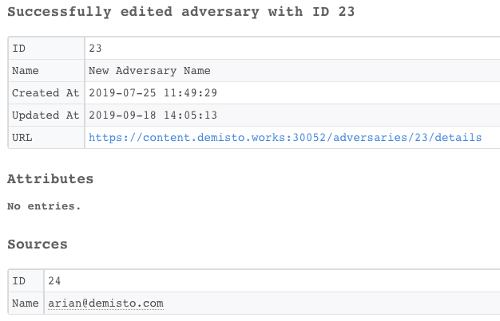

<h3 id="h_49ca05ae-876c-486b-ac66-4fafc8411cd9">25. Edit an indicator</h3>

Updates an indicator in ThreatQ.

<h5>Base Command</h5>

<code>threatq-edit-indicator</code>

<h5>Input</h5>
<table style="width: 748px;" border="2" cellpadding="6">
<thead>
<tr>
<th style="width: 100px;"><strong>Argument Name</strong></th>
<th style="width: 537px;"><strong>Description</strong></th>
<th style="width: 71px;"><strong>Required</strong></th>
</tr>
</thead>
<tbody>
<tr>
<td style="width: 100px;">id</td>
<td style="width: 537px;">The ID of the indicator.</td>
<td style="width: 71px;">Required</td>
</tr>
<tr>
<td style="width: 100px;">value</td>
<td style="width: 537px;">The value of the new indicator.</td>
<td style="width: 71px;">Optional</td>
</tr>
<tr>
<td style="width: 100px;">type</td>
<td style="width: 537px;">The type of the new indicator, such as email address, Filename, Binary string and so on.</td>
<td style="width: 71px;">Optional</td>
</tr>
<tr>
<td style="width: 100px;">description</td>
<td style="width: 537px;">The description of the indicator.</td>
<td style="width: 71px;">Optional</td>
</tr>
</tbody>
</table>

 

<h5>Context Output</h5>
<table style="width: 748px;" border="2" cellpadding="6">
<thead>
<tr>
<th style="width: 242px;"><strong>Path</strong></th>
<th style="width: 74px;"><strong>Type</strong></th>
<th style="width: 392px;"><strong>Description</strong></th>
</tr>
</thead>
<tbody>
<tr>
<td style="width: 242px;">ThreatQ.Indicator.ID</td>
<td style="width: 74px;">number</td>
<td style="width: 392px;">The ID of the indicator.</td>
</tr>
<tr>
<td style="width: 242px;">ThreatQ.Indicator.Source.ID</td>
<td style="width: 74px;">number</td>
<td style="width: 392px;">The source ID of the indicator.</td>
</tr>
<tr>
<td style="width: 242px;">ThreatQ.Indicator.Source.Name</td>
<td style="width: 74px;">string</td>
<td style="width: 392px;">The source name of the indicator.</td>
</tr>
<tr>
<td style="width: 242px;">ThreatQ.Indicator.Attribute.ID</td>
<td style="width: 74px;">number</td>
<td style="width: 392px;">The attribute ID of the indicator.</td>
</tr>
<tr>
<td style="width: 242px;">ThreatQ.Indicator.Attribute.Name</td>
<td style="width: 74px;">string</td>
<td style="width: 392px;">The attribute name of the indicator.</td>
</tr>
<tr>
<td style="width: 242px;">ThreatQ.Indicator.Attribute.Value</td>
<td style="width: 74px;">string</td>
<td style="width: 392px;">The attribute value of the indicator.</td>
</tr>
<tr>
<td style="width: 242px;">ThreatQ.Indicator.CreatedAt</td>
<td style="width: 74px;">date</td>
<td style="width: 392px;">The creation date of the indicator.</td>
</tr>
<tr>
<td style="width: 242px;">ThreatQ.Indicator.UpdatedAt</td>
<td style="width: 74px;">date</td>
<td style="width: 392px;">The last update date of the indicator.</td>
</tr>
<tr>
<td style="width: 242px;">ThreatQ.Indicator.Description</td>
<td style="width: 74px;">string</td>
<td style="width: 392px;">The description of the indicator.</td>
</tr>
<tr>
<td style="width: 242px;">ThreatQ.Indicator.Value</td>
<td style="width: 74px;">string</td>
<td style="width: 392px;">The value of the indicator.</td>
</tr>
<tr>
<td style="width: 242px;">ThreatQ.Indicator.Status</td>
<td style="width: 74px;">string</td>
<td style="width: 392px;">The status of the indicator.</td>
</tr>
<tr>
<td style="width: 242px;">ThreatQ.Indicator.Type</td>
<td style="width: 74px;">string</td>
<td style="width: 392px;">The type of the indicator. For example, IP Address.</td>
</tr>
<tr>
<td style="width: 242px;">ThreatQ.Indicator.TQScore</td>
<td style="width: 74px;">number</td>
<td style="width: 392px;">The ThreatQ Score of the indicator.</td>
</tr>
</tbody>
</table>

 

<h5>Command Example</h5>
<pre>  !threatq-edit-indicator id=173317 description="This is a new description" type="Email Address" value=goo@test.com
</pre>
<h5>Human Readable Output</h5>

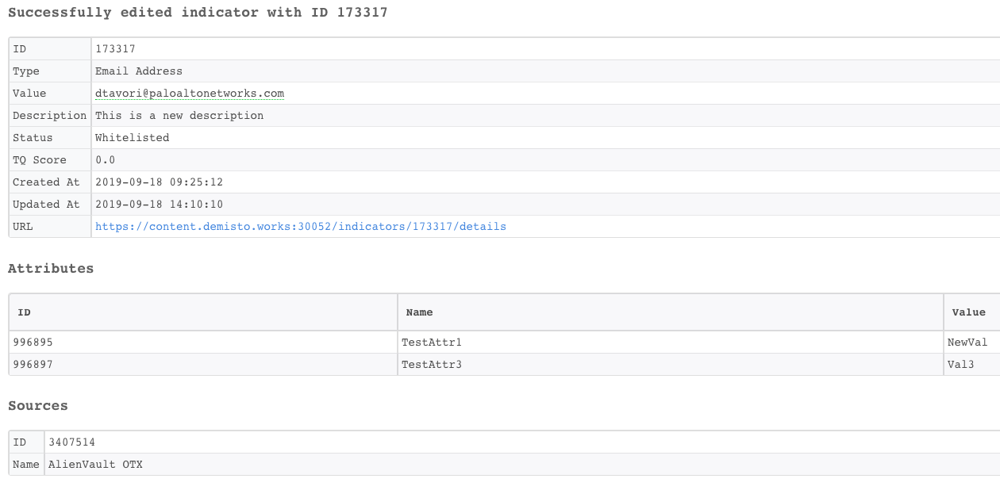

<h3 id="h_d4a85aa5-245f-4b06-bffc-632140561a98">26. Edit an event</h3>

Updates an event in ThreatQ.

<h5>Base Command</h5>

<code>threatq-edit-event</code>

<h5>Input</h5>
<table style="width: 748px;" border="2" cellpadding="6">
<thead>
<tr>
<th style="width: 117px;"><strong>Argument Name</strong></th>
<th style="width: 520px;"><strong>Description</strong></th>
<th style="width: 71px;"><strong>Required</strong></th>
</tr>
</thead>
<tbody>
<tr>
<td style="width: 117px;">id</td>
<td style="width: 520px;">The ID of the Event.</td>
<td style="width: 71px;">Required</td>
</tr>
<tr>
<td style="width: 117px;">title</td>
<td style="width: 520px;">The title of the new event.</td>
<td style="width: 71px;">Optional</td>
</tr>
<tr>
<td style="width: 117px;">date</td>
<td style="width: 520px;">Date that event happened. Can be: YYYY-mm-dd HH:MM:SS, YYYY-mm-dd</td>
<td style="width: 71px;">Optional</td>
</tr>
<tr>
<td style="width: 117px;">type</td>
<td style="width: 520px;">Type of the event, such as DoS Attack, Malware, Watchlist, and so on.</td>
<td style="width: 71px;">Optional</td>
</tr>
<tr>
<td style="width: 117px;">description</td>
<td style="width: 520px;">Description of the event.</td>
<td style="width: 71px;">Optional</td>
</tr>
</tbody>
</table>

 

<h5>Context Output</h5>
<table style="width: 748px;" border="2" cellpadding="6">
<thead>
<tr>
<th style="width: 280px;"><strong>Path</strong></th>
<th style="width: 91px;"><strong>Type</strong></th>
<th style="width: 337px;"><strong>Description</strong></th>
</tr>
</thead>
<tbody>
<tr>
<td style="width: 280px;">ThreatQ.Event.ID</td>
<td style="width: 91px;">number</td>
<td style="width: 337px;">The ID of the event.</td>
</tr>
<tr>
<td style="width: 280px;">ThreatQ.Event.Source.ID</td>
<td style="width: 91px;">number</td>
<td style="width: 337px;">The source ID of the event.</td>
</tr>
<tr>
<td style="width: 280px;">ThreatQ.Event.Source.Name</td>
<td style="width: 91px;">string</td>
<td style="width: 337px;">The source name of the event.</td>
</tr>
<tr>
<td style="width: 280px;">ThreatQ.Event.Attribute.ID</td>
<td style="width: 91px;">number</td>
<td style="width: 337px;">The attribute ID of the event.</td>
</tr>
<tr>
<td style="width: 280px;">ThreatQ.Event.Attribute.Name</td>
<td style="width: 91px;">string</td>
<td style="width: 337px;">The attribute name of the event.</td>
</tr>
<tr>
<td style="width: 280px;">ThreatQ.Event.Attribute.Value</td>
<td style="width: 91px;">string</td>
<td style="width: 337px;">The attribute value of the event.</td>
</tr>
<tr>
<td style="width: 280px;">ThreatQ.Event.UpdatedAt</td>
<td style="width: 91px;">date</td>
<td style="width: 337px;">The last update date of the event.</td>
</tr>
<tr>
<td style="width: 280px;">ThreatQ.Event.CreatedAt</td>
<td style="width: 91px;">date</td>
<td style="width: 337px;">The creation date of the event.</td>
</tr>
<tr>
<td style="width: 280px;">ThreatQ.Event.Type</td>
<td style="width: 91px;">string</td>
<td style="width: 337px;">The type of the event.</td>
</tr>
<tr>
<td style="width: 280px;">ThreatQ.Event.Description</td>
<td style="width: 91px;">string</td>
<td style="width: 337px;">The description of the event.</td>
</tr>
<tr>
<td style="width: 280px;">ThreatQ.Event.Title</td>
<td style="width: 91px;">string</td>
<td style="width: 337px;">The title of the event.</td>
</tr>
<tr>
<td style="width: 280px;">ThreatQ.Event.Occurred</td>
<td style="width: 91px;">date</td>
<td style="width: 337px;">The date that the event happened.</td>
</tr>
</tbody>
</table>

 

<h5>Command Example</h5>
<pre>  !threatq-edit-event id=1 date="2019-09-30 21:00:00" description="The event will take place in Expo Tel Aviv" type="Command and Control"
</pre>
<h5>Human Readable Output</h5>

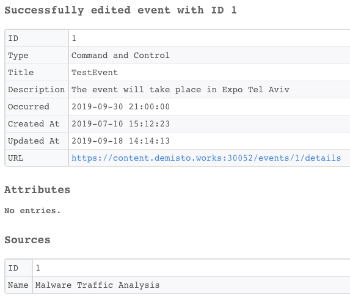

<h3 id="h_7ed2b520-8db0-44e1-9e90-8f30463bd743">27. Update a score of an indicator</h3>

Modifies an indicator's score in ThreatQ. The final indicator score is the highest of the manual and generated scores.

<h5>Base Command</h5>

<code>threatq-update-score</code>

<h5>Input</h5>
<table style="width: 748px;" border="2" cellpadding="6">
<thead>
<tr>
<th style="width: 85px;"><strong>Argument Name</strong></th>
<th style="width: 552px;"><strong>Description</strong></th>
<th style="width: 71px;"><strong>Required</strong></th>
</tr>
</thead>
<tbody>
<tr>
<td style="width: 85px;">id</td>
<td style="width: 552px;">The ID of the indicator.</td>
<td style="width: 71px;">Required</td>
</tr>
<tr>
<td style="width: 85px;">score</td>
<td style="width: 552px;">The manual indicator score. Can be: "Generated Score" or "1", "2", "3", "4", "5", "6", "7", "8", "9" or "10".</td>
<td style="width: 71px;">Required</td>
</tr>
</tbody>
</table>

 

<h5>Context Output</h5>
<table style="width: 748px;" border="2" cellpadding="6">
<thead>
<tr>
<th style="width: 242px;"><strong>Path</strong></th>
<th style="width: 74px;"><strong>Type</strong></th>
<th style="width: 392px;"><strong>Description</strong></th>
</tr>
</thead>
<tbody>
<tr>
<td style="width: 242px;">ThreatQ.Indicator.ID</td>
<td style="width: 74px;">number</td>
<td style="width: 392px;">The ID of the indicator.</td>
</tr>
<tr>
<td style="width: 242px;">ThreatQ.Indicator.Source.ID</td>
<td style="width: 74px;">number</td>
<td style="width: 392px;">The source ID of the indicator.</td>
</tr>
<tr>
<td style="width: 242px;">ThreatQ.Indicator.Source.Name</td>
<td style="width: 74px;">string</td>
<td style="width: 392px;">The source name of the indicator.</td>
</tr>
<tr>
<td style="width: 242px;">ThreatQ.Indicator.Attribute.ID</td>
<td style="width: 74px;">number</td>
<td style="width: 392px;">The attribute ID of the indicator.</td>
</tr>
<tr>
<td style="width: 242px;">ThreatQ.Indicator.Attribute.Name</td>
<td style="width: 74px;">string</td>
<td style="width: 392px;">The attribute name of the indicator.</td>
</tr>
<tr>
<td style="width: 242px;">ThreatQ.Indicator.Attribute.Value</td>
<td style="width: 74px;">string</td>
<td style="width: 392px;">The attribute value of the indicator.</td>
</tr>
<tr>
<td style="width: 242px;">ThreatQ.Indicator.CreatedAt</td>
<td style="width: 74px;">date</td>
<td style="width: 392px;">The creation date of the indicator.</td>
</tr>
<tr>
<td style="width: 242px;">ThreatQ.Indicator.UpdatedAt</td>
<td style="width: 74px;">date</td>
<td style="width: 392px;">The last update date of the indicator.</td>
</tr>
<tr>
<td style="width: 242px;">ThreatQ.Indicator.Description</td>
<td style="width: 74px;">string</td>
<td style="width: 392px;">The description of the indicator.</td>
</tr>
<tr>
<td style="width: 242px;">ThreatQ.Indicator.Value</td>
<td style="width: 74px;">string</td>
<td style="width: 392px;">The value of the indicator.</td>
</tr>
<tr>
<td style="width: 242px;">ThreatQ.Indicator.Status</td>
<td style="width: 74px;">string</td>
<td style="width: 392px;">The status of the Indicator.</td>
</tr>
<tr>
<td style="width: 242px;">ThreatQ.Indicator.Type</td>
<td style="width: 74px;">string</td>
<td style="width: 392px;">The type of the indicator. For example, IP Address.</td>
</tr>
<tr>
<td style="width: 242px;">ThreatQ.Indicator.TQScore</td>
<td style="width: 74px;">number</td>
<td style="width: 392px;">The ThreatQ Score of the indicator.</td>
</tr>
</tbody>
</table>

 

<h5>Command Example</h5>
<pre>  !threatq-update-score id=173317 score=2
</pre>
<h5>Human Readable Output</h5>

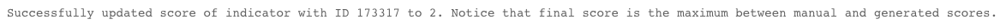

<h3 id="h_eeb24165-a887-4df8-8b01-43a054abcedf">28. Download a file to Cortex XSOAR</h3>

Downloads a file from ThreatQ to Cortex XSOAR.

<h5>Base Command</h5>

<code>threatq-download-file</code>

<h5>Input</h5>
<table style="width: 748px;" border="2" cellpadding="6">
<thead>
<tr>
<th style="width: 268px;"><strong>Argument Name</strong></th>
<th style="width: 279px;"><strong>Description</strong></th>
<th style="width: 161px;"><strong>Required</strong></th>
</tr>
</thead>
<tbody>
<tr>
<td style="width: 268px;">id</td>
<td style="width: 279px;">The ID of the file.</td>
<td style="width: 161px;">Required</td>
</tr>
</tbody>
</table>

 

<h5>Command Example</h5>
<pre>  !threatq-download-file id=88
</pre>
<h5>Human Readable Output</h5>

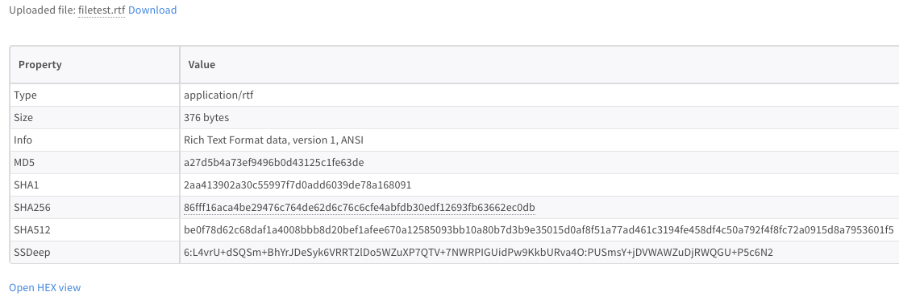

<h3 id="h_6b58f4f4-da5f-4f94-b9b6-2d4acf482aed">29. Get all indicators</h3>

Retrieves all indicators in ThreatQ.

<h5>Base Command</h5>

<code>threatq-get-all-indicators</code>

<h5>Input</h5>
<table style="width: 748px;" border="2" cellpadding="6">
<thead>
<tr>
<th style="width: 142px;"><strong>Argument Name</strong></th>
<th style="width: 481px;"><strong>Description</strong></th>
<th style="width: 85px;"><strong>Required</strong></th>
</tr>
</thead>
<tbody>
<tr>
<td style="width: 142px;">page</td>
<td style="width: 481px;">The result page number to return. Default is 0.</td>
<td style="width: 85px;">Optional</td>
</tr>
<tr>
<td style="width: 142px;">limit</td>
<td style="width: 481px;">The maximum number of indicators return. Default is 50.</td>
<td style="width: 85px;">Optional</td>
</tr>
</tbody>
</table>

 

<h5>Context Output</h5>
<table style="width: 748px;" border="2" cellpadding="6">
<thead>
<tr>
<th style="width: 244px;"><strong>Path</strong></th>
<th style="width: 72px;"><strong>Type</strong></th>
<th style="width: 392px;"><strong>Description</strong></th>
</tr>
</thead>
<tbody>
<tr>
<td style="width: 244px;">ThreatQ.Indicator.ID</td>
<td style="width: 72px;">number</td>
<td style="width: 392px;">ID of the indicator.</td>
</tr>
<tr>
<td style="width: 244px;">ThreatQ.Indicator.Source.ID</td>
<td style="width: 72px;">number</td>
<td style="width: 392px;">Source ID of the indicator.</td>
</tr>
<tr>
<td style="width: 244px;">ThreatQ.Indicator.Source.Name</td>
<td style="width: 72px;">string</td>
<td style="width: 392px;">Source name of the indicator.</td>
</tr>
<tr>
<td style="width: 244px;">ThreatQ.Indicator.Attribute.ID</td>
<td style="width: 72px;">number</td>
<td style="width: 392px;">Attribute ID of the of the indicator.</td>
</tr>
<tr>
<td style="width: 244px;">ThreatQ.Indicator.Attribute.Name</td>
<td style="width: 72px;">string</td>
<td style="width: 392px;">Attribute name of the indicator.</td>
</tr>
<tr>
<td style="width: 244px;">ThreatQ.Indicator.Attribute.Value</td>
<td style="width: 72px;">string</td>
<td style="width: 392px;">Attribute value of the indicator.</td>
</tr>
<tr>
<td style="width: 244px;">ThreatQ.Indicator.CreatedAt</td>
<td style="width: 72px;">date</td>
<td style="width: 392px;">The creation date of the indicator.</td>
</tr>
<tr>
<td style="width: 244px;">ThreatQ.Indicator.UpdatedAt</td>
<td style="width: 72px;">date</td>
<td style="width: 392px;">The last update date of the indicator.</td>
</tr>
<tr>
<td style="width: 244px;">ThreatQ.Indicator.Description</td>
<td style="width: 72px;">string</td>
<td style="width: 392px;">The description of the indicator.</td>
</tr>
<tr>
<td style="width: 244px;">ThreatQ.Indicator.Value</td>
<td style="width: 72px;">string</td>
<td style="width: 392px;">The value of the indicator.</td>
</tr>
<tr>
<td style="width: 244px;">ThreatQ.Indicator.Status</td>
<td style="width: 72px;">string</td>
<td style="width: 392px;">The status of the indicator.</td>
</tr>
<tr>
<td style="width: 244px;">ThreatQ.Indicator.Type</td>
<td style="width: 72px;">string</td>
<td style="width: 392px;">The type of the indicator. For example, IP Address.</td>
</tr>
<tr>
<td style="width: 244px;">ThreatQ.Indicator.TQScore</td>
<td style="width: 72px;">number</td>
<td style="width: 392px;">The ThreatQ Score of the indicator.</td>
</tr>
</tbody>
</table>

 

<h5>Command Example</h5>
<pre>  
  !threatq-get-all-indicators limit=30 page=10
</pre>
<h5>Human Readable Output</h5>

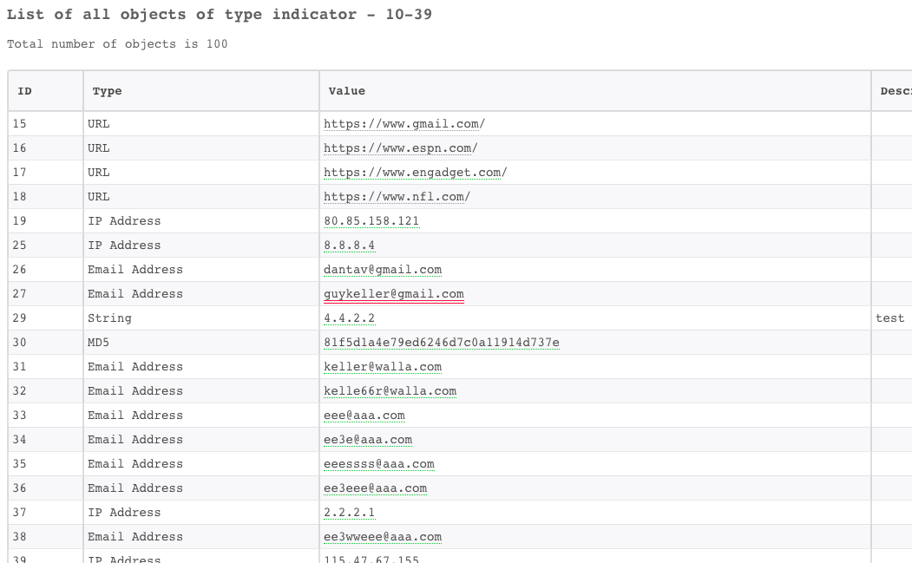

<h3 id="h_4b89672e-4c43-4ebc-bd2b-c0ee3450df54">30. Get a list of events</h3>

Retrieves all events in ThreatQ.

<h5>Base Command</h5>

<code>threatq-get-all-events</code>

<h5>Input</h5>
<table style="width: 748px;" border="2" cellpadding="6">
<thead>
<tr>
<th style="width: 141px;"><strong>Argument Name</strong></th>
<th style="width: 482px;"><strong>Description</strong></th>
<th style="width: 85px;"><strong>Required</strong></th>
</tr>
</thead>
<tbody>
<tr>
<td style="width: 141px;">page</td>
<td style="width: 482px;">The result page number to return. Default is 0.</td>
<td style="width: 85px;">Optional</td>
</tr>
<tr>
<td style="width: 141px;">limit</td>
<td style="width: 482px;">The maximum number of events to return. Default is 50.</td>
<td style="width: 85px;">Optional</td>
</tr>
</tbody>
</table>

 

<h5>Context Output</h5>
<table style="width: 746px;" border="2" cellpadding="6">
<thead>
<tr>
<th style="width: 282px;"><strong>Path</strong></th>
<th style="width: 93px;"><strong>Type</strong></th>
<th style="width: 333px;"><strong>Description</strong></th>
</tr>
</thead>
<tbody>
<tr>
<td style="width: 282px;">ThreatQ.Event.ID</td>
<td style="width: 93px;">number</td>
<td style="width: 333px;">The ID of the event.</td>
</tr>
<tr>
<td style="width: 282px;">ThreatQ.Event.Source.ID</td>
<td style="width: 93px;">number</td>
<td style="width: 333px;">The source ID of the event.</td>
</tr>
<tr>
<td style="width: 282px;">ThreatQ.Event.Source.Name</td>
<td style="width: 93px;">string</td>
<td style="width: 333px;">The source name of the event.</td>
</tr>
<tr>
<td style="width: 282px;">ThreatQ.Event.Attribute.ID</td>
<td style="width: 93px;">number</td>
<td style="width: 333px;">The attribute ID of the event.</td>
</tr>
<tr>
<td style="width: 282px;">ThreatQ.Event.Attribute.Name</td>
<td style="width: 93px;">string</td>
<td style="width: 333px;">The attribute name of the event.</td>
</tr>
<tr>
<td style="width: 282px;">ThreatQ.Event.Attribute.Value</td>
<td style="width: 93px;">string</td>
<td style="width: 333px;">The attribute value of the event.</td>
</tr>
<tr>
<td style="width: 282px;">ThreatQ.Event.UpdatedAt</td>
<td style="width: 93px;">date</td>
<td style="width: 333px;">The last update date of the event.</td>
</tr>
<tr>
<td style="width: 282px;">ThreatQ.Event.CreatedAt</td>
<td style="width: 93px;">date</td>
<td style="width: 333px;">The creation date of the event.</td>
</tr>
<tr>
<td style="width: 282px;">ThreatQ.Event.Type</td>
<td style="width: 93px;">string</td>
<td style="width: 333px;">The type of the event.</td>
</tr>
<tr>
<td style="width: 282px;">ThreatQ.Event.Description</td>
<td style="width: 93px;">string</td>
<td style="width: 333px;">The description of the event.</td>
</tr>
<tr>
<td style="width: 282px;">ThreatQ.Event.Title</td>
<td style="width: 93px;">string</td>
<td style="width: 333px;">The title of the event.</td>
</tr>
<tr>
<td style="width: 282px;">ThreatQ.Event.Occurred</td>
<td style="width: 93px;">date</td>
<td style="width: 333px;">The date the event happened.</td>
</tr>
</tbody>
</table>

 

<h5>Command Example</h5>
<pre>  !threatq-get-all-events limit=30 page=10
</pre>
<h5>Human Readable Output</h5>

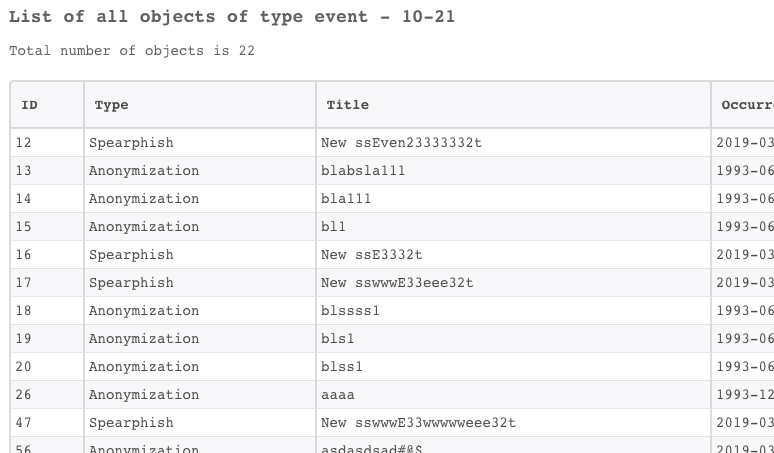

<h3 id="h_940ef125-9750-463d-8b8b-3a057eac841b">31. Get a list of all adversaries</h3>

Returns all adversaries in ThreatQ.

<h5>Base Command</h5>

<code>threatq-get-all-adversaries</code>

<h5>Input</h5>
<table style="width: 748px;" border="2" cellpadding="6">
<thead>
<tr>
<th style="width: 113px;"><strong>Argument Name</strong></th>
<th style="width: 524px;"><strong>Description</strong></th>
<th style="width: 71px;"><strong>Required</strong></th>
</tr>
</thead>
<tbody>
<tr>
<td style="width: 113px;">page</td>
<td style="width: 524px;">The result page number to return. Default is 0.</td>
<td style="width: 71px;">Optional</td>
</tr>
<tr>
<td style="width: 113px;">limit</td>
<td style="width: 524px;">The maximum number of objects to return in one response (maximum is 200).</td>
<td style="width: 71px;">Optional</td>
</tr>
</tbody>
</table>

 

<h5>Context Output</h5>
<table style="width: 748px;" border="2" cellpadding="6">
<thead>
<tr>
<th style="width: 296px;"><strong>Path</strong></th>
<th style="width: 76px;"><strong>Type</strong></th>
<th style="width: 336px;"><strong>Description</strong></th>
</tr>
</thead>
<tbody>
<tr>
<td style="width: 296px;">ThreatQ.Adversary.Name</td>
<td style="width: 76px;">string</td>
<td style="width: 336px;">The name of the adversary.</td>
</tr>
<tr>
<td style="width: 296px;">ThreatQ.Adversary.ID</td>
<td style="width: 76px;">number</td>
<td style="width: 336px;">The ID of the of the adversary.</td>
</tr>
<tr>
<td style="width: 296px;">ThreatQ.Adversary.Source.ID</td>
<td style="width: 76px;">number</td>
<td style="width: 336px;">The source ID of the adversary.</td>
</tr>
<tr>
<td style="width: 296px;">ThreatQ.Adversary.Source.Name</td>
<td style="width: 76px;">string</td>
<td style="width: 336px;">The source name of the adversary.</td>
</tr>
<tr>
<td style="width: 296px;">ThreatQ.Adversary.Attribute.ID</td>
<td style="width: 76px;">number</td>
<td style="width: 336px;">The attribute ID of the adversary.</td>
</tr>
<tr>
<td style="width: 296px;">ThreatQ.Adversary.Attribute.Name</td>
<td style="width: 76px;">string</td>
<td style="width: 336px;">The attribute name of the adversary.</td>
</tr>
<tr>
<td style="width: 296px;">ThreatQ.Adversary.Attribute.Value</td>
<td style="width: 76px;">string</td>
<td style="width: 336px;">The attribute value of the adversary.</td>
</tr>
<tr>
<td style="width: 296px;">ThreatQ.Adversary.UpdatedAt</td>
<td style="width: 76px;">date</td>
<td style="width: 336px;">The creation date of the adversary.</td>
</tr>
<tr>
<td style="width: 296px;">ThreatQ.Adversary.CreatedAt</td>
<td style="width: 76px;">date</td>
<td style="width: 336px;">The last update date of the adversary.</td>
</tr>
</tbody>
</table>

 

<h5>Command Example</h5>
<pre>  !threatq-get-all-events limit=30 page=10
</pre>
<h5>Human Readable Output</h5>

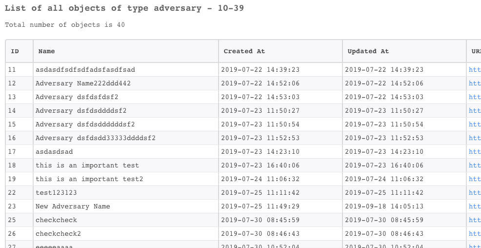

