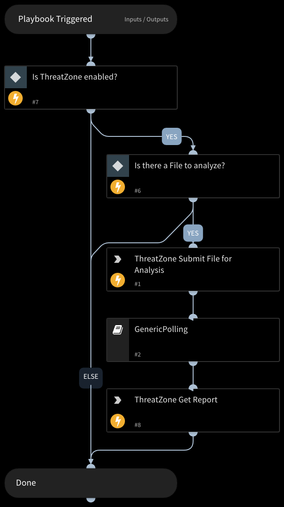

Analyzes one file using the ThreatZone sandbox integration.
Returns relevant reports to the War Room and file reputations to the context data.
Dynamic Scan Extensions: exe, docx, dochtml, docm, doc, rtf, ps1, bat, cmd, xlw, xltx, xltm, xls, xlsx, odc, csv, xlshtml

## Dependencies

This playbook uses the following sub-playbooks, integrations, and scripts.

### Sub-playbooks

* GenericPolling

### Integrations

* ThreatZone

### Scripts

This playbook does not use any scripts.

### Commands

* tz-get-result
* tz-sandbox-upload-sample

## Playbook Inputs

---

| **Name** | **Description** | **Default Value** | **Required** |
| --- | --- | --- | --- |
| File | File object of the file to analyze. The File is taken from the context. | File | Optional |
| Interval | Frequency \(in minutes\) between polling attempts. | 1 | Optional |
| Timeout | Maximum polling duration \(in minutes\) before the playbook resumes. | 15 | Optional |

## Playbook Outputs

---

| **Path** | **Description** | **Type** |
| --- | --- | --- |
| ThreatZone.Submission.Summary.STATUS | The status of the submission scanning process. | String |
| ThreatZone.Submission.Summary.LEVEL | Threat Level of the scanned file. \(malicious, suspicious or informative\). | String |
| ThreatZone.Submission.Summary.URL | The result page url of the submission. | String |
| ThreatZone.Submission.Summary.INFO | Contains the file name, scan process status and public status. | String |
| ThreatZone.Submission.Summary.REPORT | The analysis report of the submission. | String |
| ThreatZone.Submission.Summary.MD5 | The md5 hash of the submission. | String |
| ThreatZone.Submission.Summary.SHA1 | The sha1 hash of the submission. | String |
| ThreatZone.Submission.Summary.SHA256 | The sha256 hash of the submission. | String |
| ThreatZone.Submission.Summary.UUID | The UUID of the submission. | String |
| ThreatZone.Submission.Summary.SANITIZED | The url of the sanitized file. | String |

## Playbook Image

---

