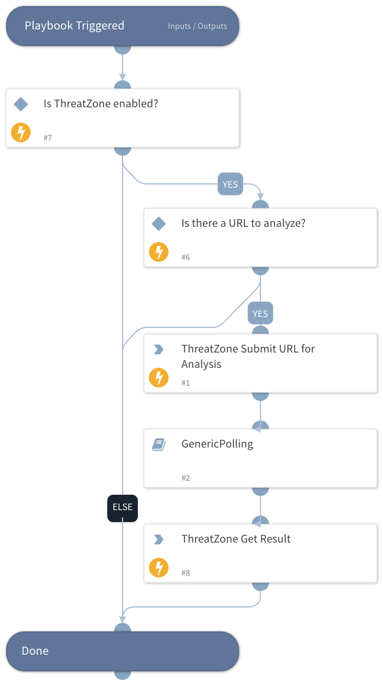

Analyzes a URL using the ThreatZone integration, submits it for detonation, and returns the resulting verdict, indicators, and telemetry to the War Room.

## Dependencies

This playbook uses the following sub-playbooks, integrations, and scripts.

### Sub-playbooks

* GenericPolling

### Integrations

* ThreatZone

### Scripts

This playbook does not use any scripts.

### Commands

* tz-url-analysis
* tz-get-result

## Playbook Inputs

---

| **Name** | **Description** | **Default Value** | **Required** |
| --- | --- | --- | --- |
| URL | URL to analyze. Provide via playbook input or ensure a URL exists in context. | URL.Data | Optional |
| Interval | Frequency \(in minutes\) between polling attempts. | 1 | Optional |
| Timeout | Maximum polling duration \(in minutes\) before the playbook resumes. | 15 | Optional |

## Playbook Outputs

---

| **Path** | **Description** | **Type** |
| --- | --- | --- |
| ThreatZone.Submission.Summary.STATUS | The status of the submission scanning process. | String |
| ThreatZone.Submission.Summary.LEVEL | Threat Level of the analyzed URL. | String |
| ThreatZone.Submission.Summary.INFO | Contains URL metadata and privacy status. | String |
| ThreatZone.Submission.Summary.REPORT | The analysis report of the submission. | String |
| ThreatZone.Submission.Summary.UUID | The UUID of the submission. | String |

## Playbook Image

---

