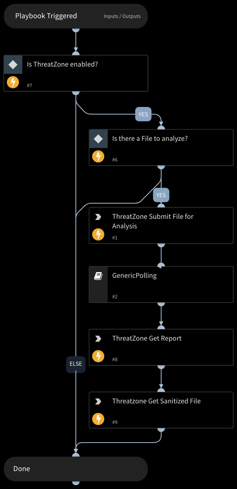

Sanitize one file using the ThreatZone CDR integration.
Returns relevant reports to the War Room and file reputations to the context data.
CDR Scan Extensions: doc, docm, docx, dotm, ppt, pptm, pptx, xls, xlsm, pdf, odc, odt, ott, odp, otp, ods, ots, rtf, tiff, jpeg, png, gif, bmp, webp, jpx, svg, zip, xml, ics, html, lnk, xlsx.

## Dependencies

This playbook uses the following sub-playbooks, integrations, and scripts.

### Sub-playbooks

* GenericPolling

### Integrations

* ThreatZone

### Scripts

This playbook does not use any scripts.

### Commands

* tz-get-result
* tz-cdr-upload-sample
* tz-get-sanitized

## Playbook Inputs

---

| **Name** | **Description** | **Default Value** | **Required** |
| --- | --- | --- | --- |
| File | File object of the file to analyze. The File is taken from the context. | File | Optional |
| Interval | Duration for executing the pooling \(in minutes\) | 1 | Optional |
| Timeout | The duration after which to stop pooling and to resume the playbook \(in minutes\) | 15 | Optional |

## Playbook Outputs

---

| **Path** | **Description** | **Type** |
| --- | --- | --- |
| ThreatZone.Analysis.STATUS | The status of the submission scanning process. | String |
| ThreatZone.Analysis.LEVEL | Threat Level of the scanned file. \(malicious, suspicious or informative\). | String |
| ThreatZone.Analysis.URL | The result page url of the submission. | String |
| ThreatZone.Analysis.INFO | Contains the file name, scan process status and public status. | String |
| ThreatZone.Analysis.REPORT | The analysis report of the submission. | String |
| ThreatZone.Analysis.MD5 | The md5 hash of the submission. | String |
| ThreatZone.Analysis.SHA1 | The sha1 hash of the submission. | String |
| ThreatZone.Analysis.SHA256 | The sha256 hash of the submission. | String |
| ThreatZone.Analysis.UUID | The UUID of the submission. | String |
| ThreatZone.Analysis.SANITIZED | The url of the sanitized file. | String |

## Playbook Image

---

