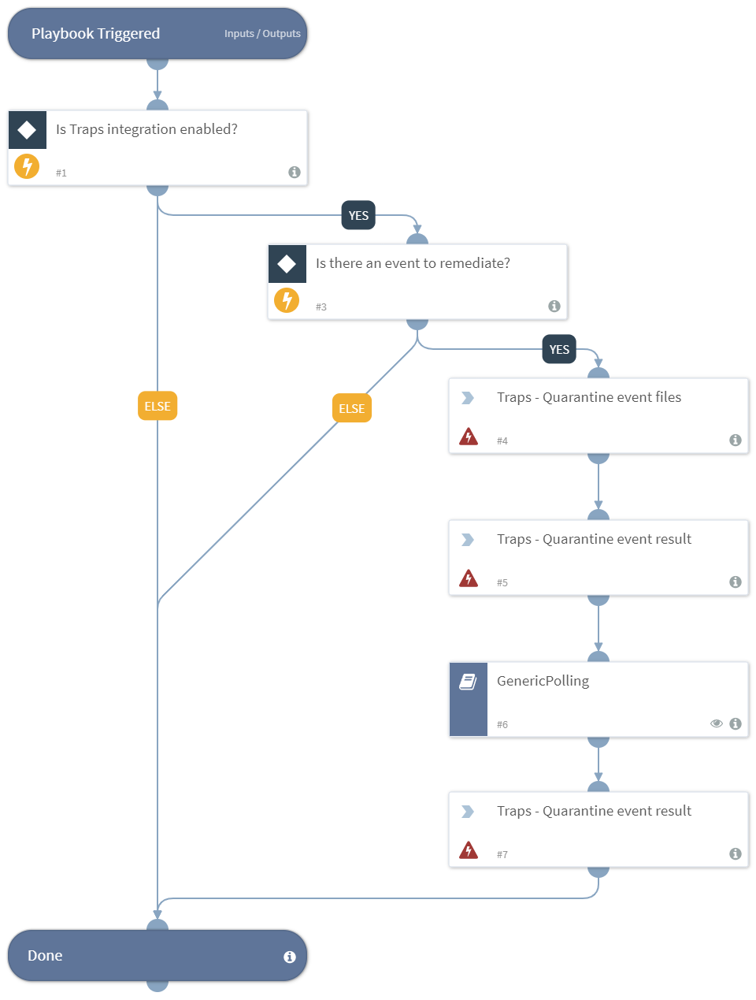

Accepts a hash of a file and quarantines it using Traps.

## Dependencies
This playbook uses the following sub-playbooks, integrations, and scripts.

## Sub-playbooks
* GenericPolling

## Integrations
* Traps

## Scripts
This playbook does not use any scripts.

## Commands
* traps-event-quarantine
* traps-event-quarantine-result

## Playbook Inputs
---

| **Name** | **Description** | **Required** |
| --- | --- | --- |
| EventId | The Traps event ID. | Optional |

## Playbook Outputs
---
There are no outputs for this playbook.

## Playbook Image
---

