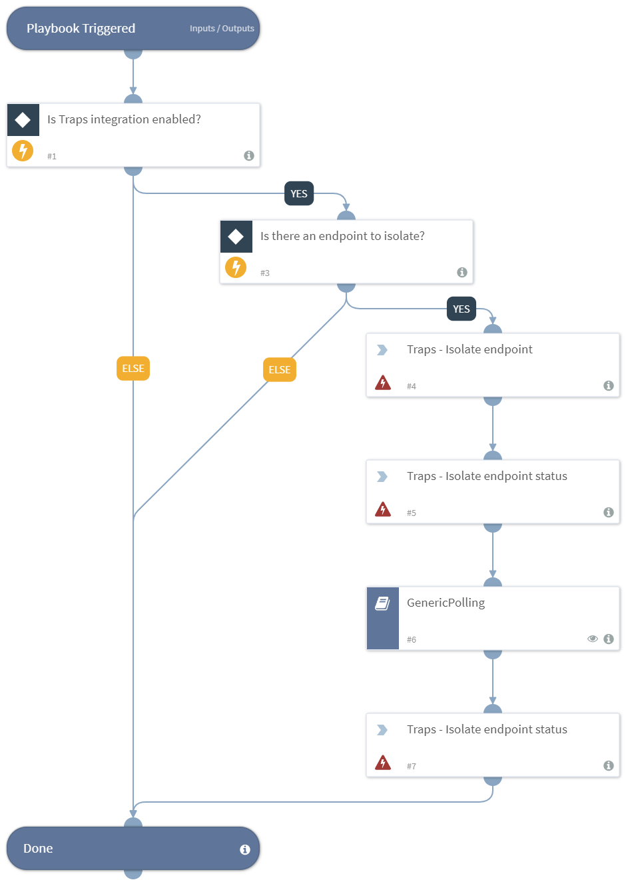

Accepts an endpoint ID from the Traps integration and performs isolation on this endpoint.

## Dependencies
This playbook uses the following sub-playbooks, integrations, and scripts.

### Sub-playbooks
* GenericPolling

### Integrations
* Traps

### Scripts
This playbook does not use any scripts.

### Commands
* traps-endpoint-isolate-status
* traps-endpoint-isolate

## Playbook Inputs
---

| **Name** | **Description** |**Required** |
| --- | --- | --- | 
| EndpointId | The Endpoint ID of the Endpoint to isolate, provided by the Palo Alto Networks Traps integration. |Optional |

## Playbook Outputs
---

| **Path** | **Description** | **Type** |
| --- | --- | --- |
| Traps.Isolate.EndpointID | The ID of the Endpoint. | unknown |
| Traps.IsolateResult.Status | The status of the isolation operation. | unknown |

## Playbook Image
---

