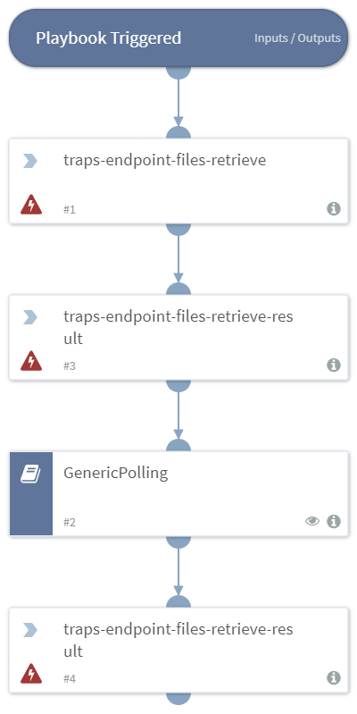

Retrieves and downloads files.

## Dependencies
This playbook uses the following sub-playbooks, integrations, and scripts.

### Sub-playbooks
* GenericPolling

### Integrations
* Traps

### Scripts
This playbook does not use any scripts.

### Commands
* traps-endpoint-files-retrieve
* traps-endpoint-files-retrieve-result

## Playbook Inputs
---

| **Name** | **Description** |  **Required** |
| --- | --- | --- |  
| endpoint_id | The ID of the endpoint. | Required |
| file_name | The name of the file to retrieve (including path). | Required |
| event_id | The ID of the Event. | Required |

## Playbook Outputs
---
There are no outputs for this playbook.

## Playbook Image
---

