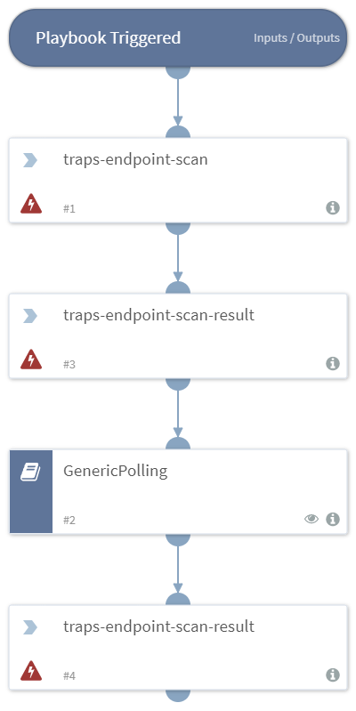

Initiates an endpoint scan and retrieve the scan results.

## Dependencies
This playbook uses the following sub-playbooks, integrations, and scripts.

### Sub-playbooks
* GenericPolling

### Integrations
This playbook does not use any integrations.

### Scripts
This playbook does not use any scripts.

### Commands
* traps-endpoint-scan
* traps-endpoint-scan-result

## Playbook Inputs
---

| **Name** | **Description** | **Required** |
| --- | --- | --- | 
| endpoint_id | The ID of the endpoint. | Required |

## Playbook Outputs
---
There are no outputs for this playbook.

## Playbook Image
---

