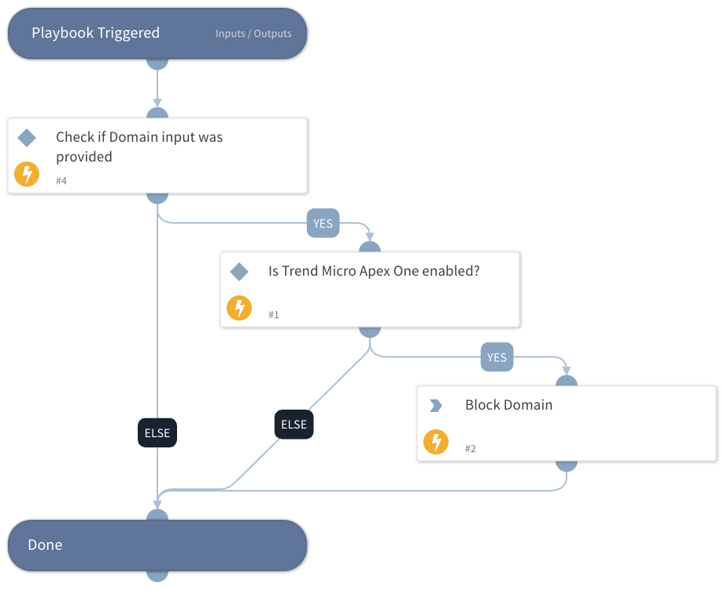

This playbook blocks domains using Trend Micro Apex One.
The playbook checks whether the Trend Micro Apex One integration is enabled, whether the Domain input has been provided and if so, blocks the domain.

## Dependencies

This playbook uses the following sub-playbooks, integrations, and scripts.

### Sub-playbooks

This playbook does not use any sub-playbooks.

### Integrations

* TrendMicroApex

### Scripts

This playbook does not use any scripts.

### Commands

* trendmicro-apex-udso-add

## Playbook Inputs

---

| **Name** | **Description** | **Default Value** | **Required** |
| --- | --- | --- | --- |
| Domain | The domain to block. |  | Optional |
| Expiration | The UTC expiration date and time of the suspicious object, for example: 2020-01-25T09:00:00Z. |  | Optional |

## Playbook Outputs

---
There are no outputs for this playbook.

## Playbook Image

---

