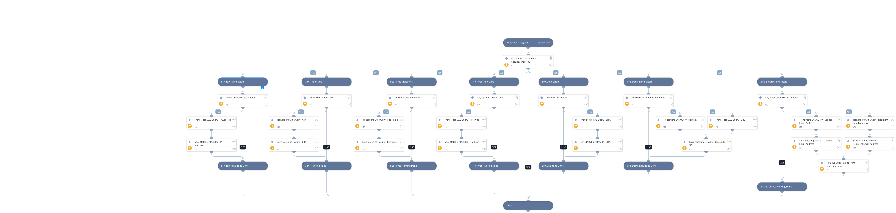

In this playbook, the 'trendmicro-cas-email-sweep' command is used to automatically hunt for and detect IOCs within email messages protected by Cloud App Security (CAS). 

Note that multiple search values should be separated by commas only (without spaces or any special characters).

Supported IOCs for this playbook:
- IP Addresses
- CIDR
- File Name
- File Type
- SHA1
- URL
- Domain
- Email Addresses

Separate searches are conducted for each type of indicator in the playbook.

## Dependencies
This playbook uses the following sub-playbooks, integrations, and scripts.

### Sub-playbooks
This playbook does not use any sub-playbooks.

### Integrations
* TrendMicro Cloud App Security

### Scripts
* IsIntegrationAvailable
* SetAndHandleEmpty

### Commands
* trendmicro-cas-email-sweep

## Playbook Inputs
---

| **Name** | **Description** | **Default Value** | **Required** |
| --- | --- | --- | --- |
| IPAddress | A single or multiple IP address to search for within TrendMicro CAS logs. Used for both source and destination IP addresses   Separate multiple search values by commas only \(without spaces or any special characters\). |  | Optional |
| CIDR | A single or multiple IP ranges to search for within TrendMicro CAS logs. Used for both source and destination IP addresses.  Separate multiple search values by commas only \(without spaces or any special characters\). |  | Optional |
| URLDomain | Single or multiple URLs and/or domains to search for within TrendMicro CAS logs.  Separate multiple search values by commas only \(without spaces or any special characters\). |  | Optional |
| FileName | Single or multiple file names to search for within TrendMicro CAS logs.  Separate multiple search values by commas only \(without spaces or any special characters\). |  | Optional |
| FileType | A single or multiple file types to search for within TrendMicro CAS logs.  Separate multiple search values by commas only \(without spaces or any special characters\). |  | Optional |
| SHA1 | Single or multiple SHA1 file hashes to search for within TrendMicro CAS logs.  Separate multiple search values by commas only \(without spaces or any special characters\). |  | Optional |
| EmailAddress | A single or multiple email addresses to search for within TrendMicro CAS logs. Used for both recipient and sender email addresses.  Separate multiple search values by commas only \(without spaces or any special characters\). |  | Optional |
| subject | Filter messages that should be retrieved from the TrendMicro CAS based on the email subject \(string\).  Use double quotes to search for an exact phrase, for example, "messageA messageB" otherwise, a partial match based on the phrase is performed. For example, a search is performed on a subject containing messageA, or messageB, or messageA message B.  Separate multiple search values by commas only \(without spaces or any special characters\). |  | Optional |
| start | The start date and time from which you would like to retrieve messages from TrendMicro CAS.  Use ISO 8601 time format, e.g. 2020-08-01T02:31:20Z, or 'human-readable' data, such as 1 day ago or 3 weeks ago.  For a complete time range, specify 'end' as well. If 'start' is not specified messages will be retrieved from TrendMicro CAS within seven days before the end time. In the absence of 'start' and 'end' inputs, the default value is 'last seven days' is set.  Do not configure 'lastndays' and 'start' or 'end' at the same time. |  | Optional |
| end | The end date and time specify the period of time in which messages should be retrieved from TrendMicro CAS.  Use ISO 8601 time format, e.g. 2020-08-01T02:31:20Z, or 'human-readable' data, such as 1 day ago or 3 weeks ago.  For a complete time range, specify 'start' as well. If 'end' is not specified messages will be retrieved from TrendMicro CAS within seven days after the start time. In the absence of 'start' and 'end' inputs, the default value is 'last seven days' is set.  Do not configure 'lastndays' and 'start' or 'end' at the same time. |  | Optional |
| lastndays | The number of days \(n × 24 hours\) before the request is sent to be examined.  An alternative filter to the 'start' and 'end' inputs. This filter specifies a time range that will determine the period of time in which messages should be retrieved from TrendMicro CAS.   Do not configure 'lastndays' and 'start' or 'end' at the same time. |  | Optional |
| limit | The maximum number of email messages to display. The maximum number of messages is 1,000. If not specified, a default value of 20 will be used. |  | Optional |
| next_link | The URL for the results page if the total number of email messages in a previous request exceeds the specified limit.   When the maximum limit has been exceeded, a URL is specified in the response. To retrieve the remaining email messages, use the URL from the response.	 |  | Optional |

## Playbook Outputs
---

| **Path** | **Description** | **Type** |
| --- | --- | --- |
| TrendMicroCAS.HuntingResults.value | Email message objects and fields that were retrieved from TrendMicro CAS. | string |
| TrendMicroCAS.HuntingResults.value.mail_message_delivery_time | The time and date when the email message was sent. | number |
| TrendMicroCAS.HuntingResults.value.mail_message_id | The Internet message ID of the email message. | string |
| TrendMicroCAS.HuntingResults.value.mail_unique_id | The ID of the email message. | string |
| TrendMicroCAS.HuntingResults.value.mailbox | The mailbox which contains the email message. | string |
| TrendMicroCAS.HuntingResults.value.source_ip | The source IP address of the email message. | string |
| TrendMicroCAS.HuntingResults.value.source_domain | The source domain of the email message. | string |
| TrendMicroCAS.HuntingResults.value.mail_urls | The URL contained in the email body or attachment. | string |
| TrendMicroCAS.HuntingResults.value.mail_message_subject | The subject of the email message. | string |
| TrendMicroCAS.HuntingResults.value.mail_message_sender | The email address of the sender. | string |
| TrendMicroCAS.HuntingResults.value.mail_message_recipient | A list of recipient email addresses of the email message. | string |
| TrendMicroCAS.HuntingResults.value.mail_internet_headers.Value | Sender's email address as displayed in the email header. | string |
| TrendMicroCAS.HuntingResults.value.mail_attachments | Email attachment objects that were retrieved from TrendMicro CAS. | string |
| TrendMicroCAS.HuntingResults.value.mail_attachments.file_sha1 | The SHA-1 hash value of the attachment file. | string |
| TrendMicroCAS.HuntingResults.value.mail_attachments.file_name | The name of the attachment file. | string |

## Playbook Image
---
