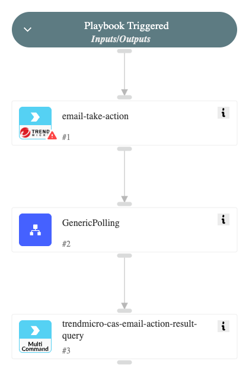

This playbook runs various actions on emails using TrendAI™ Cloud App Security, such as deleting and quarantine email messages, using the "trendmicro-cas-email-take-action" command and returns the results from the "trendmicro-cas-email-action-result-query" command.

## Dependencies

This playbook uses the following sub-playbooks, integrations, and scripts.

### Sub-playbooks

* GenericPolling

### Integrations

* TrendMicro Cloud App Security
* TrendMicroCAS

### Scripts

This playbook does not use any scripts.

### Commands

* trendmicro-cas-email-action-result-query
* trendmicro-cas-email-take-action

## Playbook Inputs

---

| **Name** | **Description** | **Default Value** | **Required** |
| --- | --- | --- | --- |
| action_type | The action to take on an email message, such as delete or quarantine. Can be: "MAIL_DELETE", or "MAIL_QUARANTINE". |  | Required |
| mailbox | The email address of an email message for which to take action. |  | Required |
| mail_messge_id | The Internet message ID of an email message for which to take action. To retrieve the ID use the "trendmicro-cas-email-sweep" command. |  | Required |
| mail_unique_id | The unique ID of an email message for which to take action. To retrieve the ID use the "trendmicro-cas-email-sweep" command. |  | Required |
| mail_message_delivery_time | The time and date when an email message is sent. To retrieve the information, use the "trendmicro-cas-email-sweep" command. |  | Required |
| Interval |  | 1 | Optional |
| Timeout |  | 15 | Optional |

## Playbook Outputs

---

| **Path** | **Description** | **Type** |
| --- | --- | --- |
| TrendMicroCAS.EmailActionResult.account_provider | The provider of the protected service. | string |
| TrendMicroCAS.EmailActionResult.account_user_email | The email address used to create the user account on which an action. | string |
| TrendMicroCAS.EmailActionResult.action_executed_at | The time and date when the action was processed. | date |
| TrendMicroCAS.EmailActionResult.action_id | The unique ID of a threat mitigation task. | string |
| TrendMicroCAS.EmailActionResult.action_requested_at | The time and date when the API request containing the action was received. | date |
| TrendMicroCAS.EmailActionResult.action_type | The action taken on an email message. | string |
| TrendMicroCAS.EmailActionResult.batch_id | The unique ID of the Threat Mitigation API request. | string |
| TrendMicroCAS.EmailActionResult.error_code | The result code of the action. | string |
| TrendMicroCAS.EmailActionResult.error_message | The string describing the result code. | number |
| TrendMicroCAS.EmailActionResult.status | The status of an action taken. Can be: "Created": The API request         containing the action was received. "Executing": The action is executing.         "Success": The action was successful. "Skipped": The action is skipped.         "Failed": The action failed. | string |
| TrendMicroCAS.EmailActionResult.service | The name of the protected service. | string |
| TrendMicroCAS.EmailActionResult.mail_unique_id | The Unique ID of an email message on which an action was taken. | string |
| TrendMicroCAS.EmailActionResult.mail_message_id | The Internet message ID of an email message on which an action was taken. | string |
| TrendMicroCAS.EmailActionResult.mailbox | The email address of an email message on which an action was taken. | string |

## Playbook Image

---

