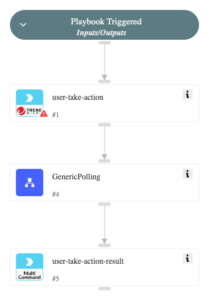

This playbook runs various actions on a user's account using TrendAI™ Cloud App Security, such as disabling accounts, requesting multi-factor authentication, and requesting a password, using the "trendmicro-cas-user-take-action" command and returns the result using the "trendmicro-cas-user-action-result-query" command.

## Dependencies

This playbook uses the following sub-playbooks, integrations, and scripts.

### Sub-playbooks

* GenericPolling

### Integrations

* TrendMicro Cloud App Security
* TrendMicroCAS

### Scripts

This playbook does not use any scripts.

### Commands

* trendmicro-cas-user-action-result-query
* trendmicro-cas-user-take-action

## Playbook Inputs

---

| **Name** | **Description** | **Default Value** | **Required** |
| --- | --- | --- | --- |
| action_type | Action to take on an email message. Options include: MAIL_DELETE: deletes an email message MAIL_QUARANTINE: quarantines an email message |  | Required |
| account_user_email | The account user email for which to take action. |  | Required |
| Interval |  | 1 | Optional |
| Timeout |  | 15 | Optional |

## Playbook Outputs

---

| **Path** | **Description** | **Type** |
| --- | --- | --- |
| TrendMicroCAS.UserActionResult.account_provider | The provider of the protected service. | String |
| TrendMicroCAS.UserActionResult.account_user_email | The email address used to create the user account on which an action was taken. | String |
| TrendMicroCAS.UserActionResult.action_executed_at | The time and date when the action was processed. | Date |
| TrendMicroCAS.UserActionResult.action_id | The unique ID of a threat mitigation task. | String |
| TrendMicroCAS.UserActionResult.action_requested_at | The time and date when the API request containing the action was received. | Date |
| TrendMicroCAS.UserActionResult.action_type | The action taken on a user's account. | String |
| TrendMicroCAS.UserActionResult.batch_id | The unique ID of a Threat Mitigation API request. | String |
| TrendMicroCAS.UserActionResult.error_code | The result code of the action. | Number |
| TrendMicroCAS.UserActionResult.error_message | The string describing the result code. | String |
| TrendMicroCAS.UserActionResult.service | The name of the protected service. | String |
| TrendMicroCAS.UserActionResult.status | Status of the action taken. Can be: "Created": The API request containing the action is received. "Executing": The action is executing. "Success": The action was successful. "Skipped": The action was skipped. "Failed": The action failed. | String |

## Playbook Image

---

