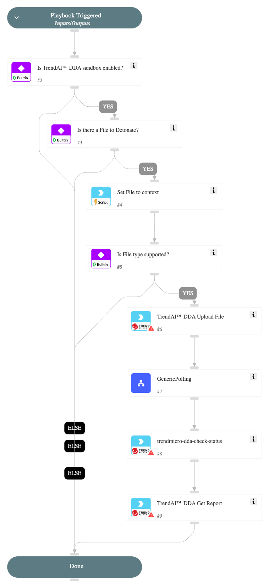

Detonates a File using the TrendAI™ Deep Discovery™ Analyzer sandbox.
Deep Discovery Analyzer(version 6.0.0) supports the following File Types:
bat, cell, chm, class, cmd, dll, doc, docx, exe, gul, hta, htm, html, hwp, hwpx, jar, js, jse, jtd, lnk, mov, pdf, ppt, pptx, ps1, pub, rtf, slk, svg, swf, vbe, vbs, 
wsf, xls, xlsx, xml

## Dependencies

This playbook uses the following sub-playbooks, integrations, and scripts.

### Sub-playbooks

* GenericPolling

### Integrations

* Trend Micro Deep Discovery Analyzer

### Scripts

* Set

### Commands

* trendmicro-dda-check-status
* trendmicro-dda-get-report
* trendmicro-dda-upload-file

## Playbook Inputs

---

| **Name** | **Description** | **Default Value** | **Required** |
| --- | --- | --- | --- |
| File | The file to detonate. File is taken from the context. | File | Required |
| interval | Polling frequency - how often the polling command should run \(minutes\) | 1 | Optional |
| timeout | How much time to wait before a timeout occurs \(minutes\) | 15 | Optional |

## Playbook Outputs

---

| **Path** | **Description** | **Type** |
| --- | --- | --- |
| DBotScore.Type | The type of the indicator | string |
| DBotScore.Vendor | Vendor used to calculate the score | string |
| TrendMicroDDA.Submissions.SHA1 | SHA1 of the submission | string |
| TrendMicroDDA.Submissions.RiskLevel | The Risk Level of the sample | number |
| DBotScore.Score | The actual score | number |
| TrendMicroDDA.Submissions.isCompleted | Stating if the detonation was complete or not | string |
| DBotScore.Indicator | The indicator we tested | string |
| TrendMicroDDA.Submissions.status | The status of the sample | string |
| InfoFile.MD5 | MD5 hash of the report file | string |
| InfoFile.SHA1 | SHA1 hash of the report file | string |
| InfoFile.SHA256 | SHA256 hash of the report  file | string |
| InfoFile.Name | Report file name | string |
| InfoFile.Type | Report file type e.g. "PE" | string |
| InfoFile.Size | Report file size  | number |
| File.Malicious.Vendor | For malicious files, the vendor that made the decision | string |
| File.Malicious.Description | For malicious files, the reason for the vendor to make the decision | string |
| IP.Address | IPs relevant to the submission | string |

## Playbook Image

---

