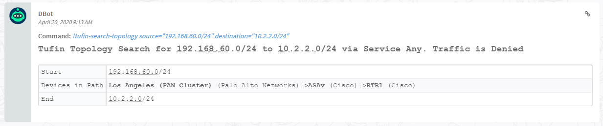
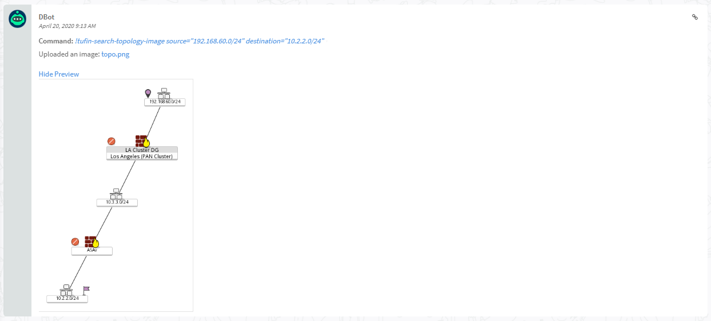
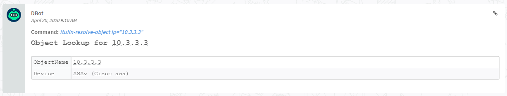
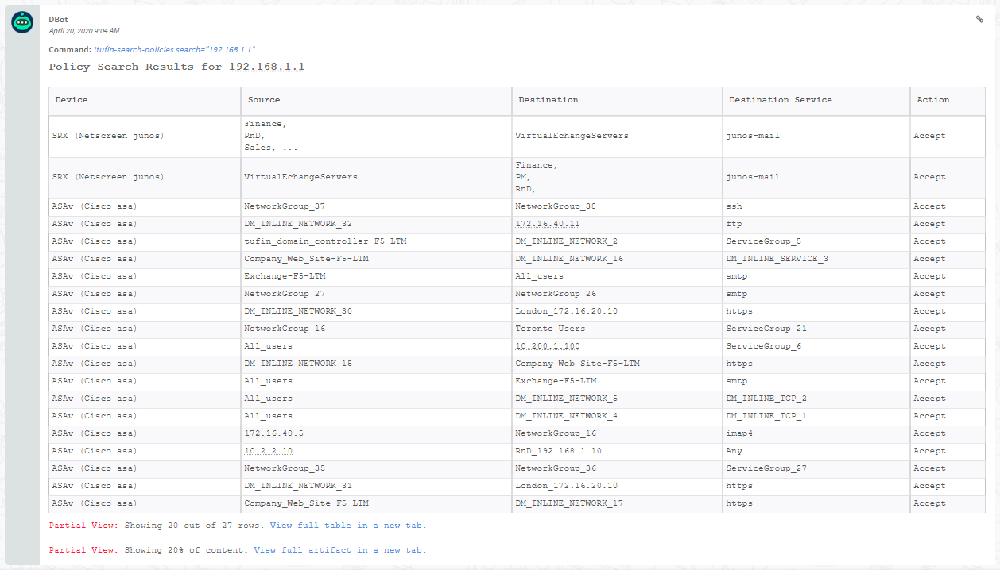
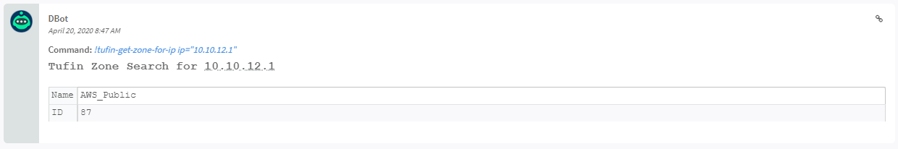
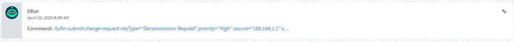
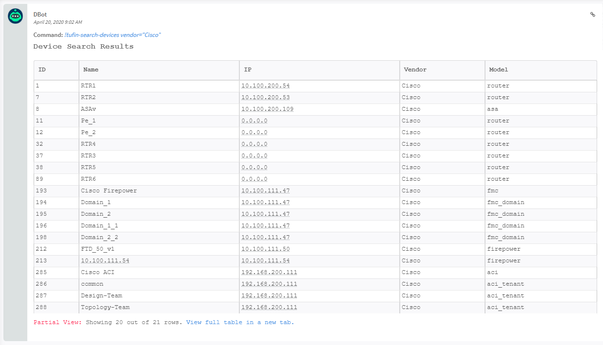
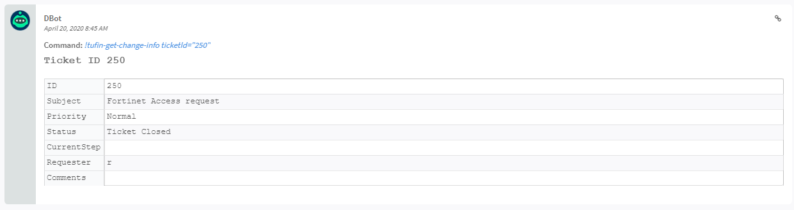
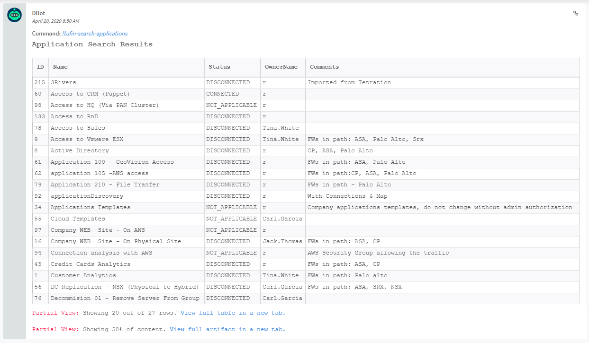
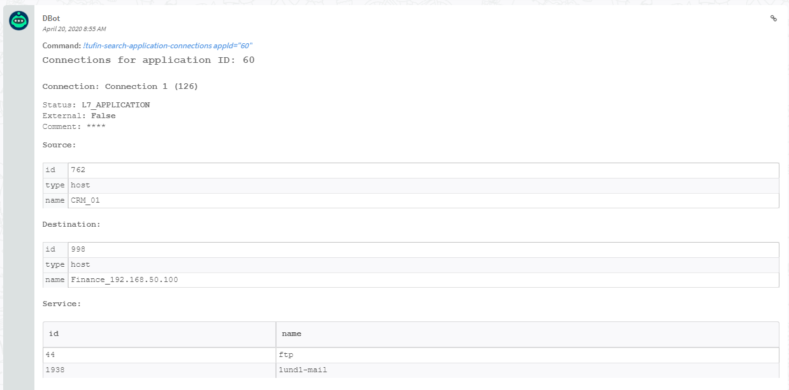

## Overview
---

Retrieve and analyze network access controls across Tufin-managed firewalls, SDN, and public cloud to identify vulnerable access paths of an attack
This integration was integrated and tested with version 19.3 of Tufin Orchestration Suite
## Tufin Playbook
---

## Use Cases
---
Gather network intelligence from SecureTrack and SecureApp, perform topology queries in SecureTrack, and submit change tickets from SecureChange.

## Configure Tufin on Cortex XSOAR
---

1. Navigate to __Settings__ > __Integrations__ > __Servers & Services__.
2. Search for Tufin.
3. Click __Add instance__ to create and configure a new integration instance.
    * __Name__: a textual name for the integration instance.
    * __TOS IP or FQDN__
    * __TOS User Credentials__
    * __Trust any certificate (not secure)__
    * __Use system proxy settings__
    * __Maximum number of rules returned from device durring a policy search__
4. Click __Test__ to validate the URLs, token, and connection.
## Fetched Incidents Data
---

## Commands
---
You can execute these commands from the Cortex XSOAR CLI, as part of an automation, or in a playbook.
After you successfully execute a command, a DBot message appears in the War Room with the command details.
1. tufin-search-topology
2. tufin-search-topology-image
3. tufin-object-resolve
4. tufin-policy-search
5. tufin-get-zone-for-ip
6. tufin-submit-change-request
7. tufin-search-devices
8. tufin-get-change-info
9. tufin-search-applications
10. tufin-search-application-connections
### 1. tufin-search-topology
---
Search the Tufin Topology Map

##### Base Command

`tufin-search-topology`
##### Input

| **Argument Name** | **Description** | **Required** |
| --- | --- | --- |
| source | Source address/addresses (may contain multiple, comma separated values) e.g. 192.168.100.32 or 192.168.100.32/32,192.168.100.33 | Required | 
| destination | Destination address/addresses (may contain multiple, comma separated values) e.g. 192.168.100.32 or 192.168.100.32/32,192.168.100.33 | Required | 
| service | Service parameter can be a port (for example, “tcp:80”, “any”) or an application (for example, “Skype”, “Facebook”). | Optional | 


##### Context Output

| **Path** | **Type** | **Description** |
| --- | --- | --- |
| Tufin.Topology.TrafficAllowed | boolean | Traffic Permitted | 
| Tufin.Topology.TrafficDevices | string | List of devices in path | 


##### Command Example
```!tufin-search-topology destination=10.2.2.0/24 source=192.168.60.0/24```

##### Human Readable Output


### 2. tufin-search-topology-image
---
Search the Tufin Topology Map, returning an image
##### Base Command

`tufin-search-topology-image`
##### Input

| **Argument Name** | **Description** | **Required** |
| --- | --- | --- |
| source | Source address/addresses (may contain multiple, comma separated values) | Required | 
| destination | Destination address/addresses (may contain multiple, comma separated values) | Required | 
| service | Service parameter can be a port (for example, “tcp:80”, “any”) or an application (for example, “Skype”, “Facebook”). | Optional | 


##### Context Output

There is no context output for this command.

##### Command Example
```!tufin-search-topology-image destination=10.2.2.0/24 source=192.168.60.0/24```

##### Human Readable Output


### 3. tufin-object-resolve
---
Resolve IP address to Network Object

##### Base Command

`tufin-object-resolve`
##### Input

| **Argument Name** | **Description** | **Required** |
| --- | --- | --- |
| ip | IP Address to Resolve to Network Object | Required | 


##### Context Output

| **Path** | **Type** | **Description** |
| --- | --- | --- |
| Tufin.ObjectResolve.NumberOfObjects | number | Number of objects that resolve to given IP address. | 


##### Command Example
```!tufin-object-resolve ip=10.3.3.3```

##### Human Readable Output


### 4. tufin-policy-search
---
Search the policies of all devices managed by Tufin

##### Base Command

`tufin-policy-search`
##### Input

| **Argument Name** | **Description** | **Required** |
| --- | --- | --- |
| search | The text format is for a field is fieldname:text for example source:192.168.1.1 or bareword for free text search. See the search info documentation in Securetrack Policy Browser page for more information. | Required | 


##### Context Output

| **Path** | **Type** | **Description** |
| --- | --- | --- |
| Tufin.Policysearch.NumberRulesFound | number | Number of rules found via search | 


##### Command Example
```!tufin-policy-search search="source:192.168.1.1"```

##### Human Readable Output


### 5. tufin-get-zone-for-ip
---
Match the IP address to the assigned Tufin Zone

##### Base Command

`tufin-get-zone-for-ip`
##### Input

| **Argument Name** | **Description** | **Required** |
| --- | --- | --- |
| ip | IP Address | Required | 


##### Context Output

| **Path** | **Type** | **Description** |
| --- | --- | --- |
| Tufin.Zone.ID | string | Tufin Zone ID | 
| Tufin.Zone.Name | unknown | Tufin Zone Name | 


##### Command Example
```!tufin-get-zone-for-ip ip=10.10.12.1```

##### Human Readable Output


### 6. tufin-submit-change-request
---
Submit a change request to SecureChange

##### Base Command

`tufin-submit-change-request`
##### Input

| **Argument Name** | **Description** | **Required** |
| --- | --- | --- |
| request-type | Request Type | Required | 
| priority | Request Priority | Required | 
| source | Source or Target | Required | 
| destination | Destination (Mandatory for FW Change) | Optional | 
| protocol | Protocol (Mandatory for FW Change) | Optional | 
| port | Port (Mandatory for FW Change) | Optional | 
| action | Action (Mandatory for FW Change) | Optional | 
| comment | Comment | Optional | 
| subject | Ticket Subject | Required | 


##### Context Output

| **Path** | **Type** | **Description** |
| --- | --- | --- |
| Tufin.Request.Status | unknown | Status of the request submission | 


##### Command Example
```!tufin-submit-change-request request-type="Decommission Request" priority=High source=192.168.1.1 subject="This host is infected with ransomware"```

##### Human Readable Output


### 7. tufin-search-devices
---
Search SecureTrack devices

##### Base Command

`tufin-search-devices`
##### Input

| **Argument Name** | **Description** | **Required** |
| --- | --- | --- |
| name | Device name | Optional | 
| ip | Device IP | Optional | 
| vendor | Device vendor | Optional | 
| model | Device model | Optional | 


##### Context Output

| **Path** | **Type** | **Description** |
| --- | --- | --- |
| Tufin.Device.ID | unknown | Device ID | 
| Tufin.Device.Name | unknown | Device name | 
| Tufin.Device.Vendor | unknown | Device vendor | 
| Tufin.Device.Model | unknown | Device model | 
| Tufin.Device.IP | unknown | Device IP | 


##### Command Example
```!tufin-search-devices vendor=Cisco```

##### Human Readable Output


### 8. tufin-get-change-info
---
Get information on a SecureChange Ticket (Ticket ID retrieved from Tufin UI)

##### Base Command

`tufin-get-change-info`
##### Input

| **Argument Name** | **Description** | **Required** |
| --- | --- | --- |
| ticket-id | SecureChange Ticket ID | Required | 


##### Context Output

| **Path** | **Type** | **Description** |
| --- | --- | --- |
| Tufin.Ticket.ID | unknown | Ticket ID | 
| Tufin.Ticket.Subject | unknown | Ticket subject | 
| Tufin.Ticket.Priority | unknown | Ticket priority | 
| Tufin.Ticket.Status | unknown | Ticket status | 
| Tufin.Ticket.Requester | unknown | Ticket requester | 
| Tufin.Ticket.WorkflowID | unknown | Ticket workflow ID | 
| Tufin.Ticket.WorkflowName | unknown | Ticket workflow name | 
| Tufin.Ticket.CurrentStep | unknown | Ticket current step | 


##### Command Example
```!tufin-get-change-info ticket-id=250```

##### Human Readable Output


### 9. tufin-search-applications
---
Search SecureApp applications

##### Base Command

`tufin-search-applications`
##### Input

| **Argument Name** | **Description** | **Required** |
| --- | --- | --- |
| name | Application name | Optional | 


##### Context Output

| **Path** | **Type** | **Description** |
| --- | --- | --- |
| Tufin.App.ID | unknown | Application ID | 
| Tufin.App.Name | unknown | Application name | 
| Tufin.App.Status | unknown | Application status | 
| Tufin.App.Decommissioned | unknown | Is the application decommissioned | 
| Tufin.App.OwnerID | unknown | Application owner ID | 
| Tufin.App.OwnerName | unknown | Application owner name | 
| Tufin.App.Comments | unknown | Application comments | 


##### Command Example
```!tufin-search-applications name="3Rivers"```

##### Human Readable Output


### 10. tufin-search-application-connections
---
Get SecureApp application connections

##### Base Command

`tufin-search-application-connections`
##### Input

| **Argument Name** | **Description** | **Required** |
| --- | --- | --- |
| application-id | Application ID | Required | 


##### Context Output

| **Path** | **Type** | **Description** |
| --- | --- | --- |
| Tufin.AppConnections.ID | unknown | Connection ID | 
| Tufin.AppConnections.Name | unknown | Connection name | 
| Tufin.AppConnections.Status | unknown | Connection status | 
| Tufin.AppConnections.Source.ID | unknown | Connection source ID | 
| Tufin.AppConnections.Source.Type | unknown | Connection source type | 
| Tufin.AppConnections.Source.Name | unknown | Connection source name | 
| Tufin.AppConnections.Destination.ID | unknown | Connection destination ID | 
| Tufin.AppConnections.Destination.Type | unknown | Connection destination type | 
| Tufin.AppConnections.Destination.Name | unknown | Connection destination name | 
| Tufin.AppConnections.Service.ID | unknown | Connection service ID | 
| Tufin.AppConnections.Service.Name | unknown | Connection service name | 
| Tufin.AppConnections.Comment | unknown | Connection comment | 
| Tufin.AppConnections.ApplicationID | unknown | Application ID | 


##### Command Example
```!tufin-search-application-connections app_id=215```

##### Human Readable Output


## Troubleshooting
---
Contact Tufin support via the Tufin User Portal, or by going to https://www.tufin.com/support
