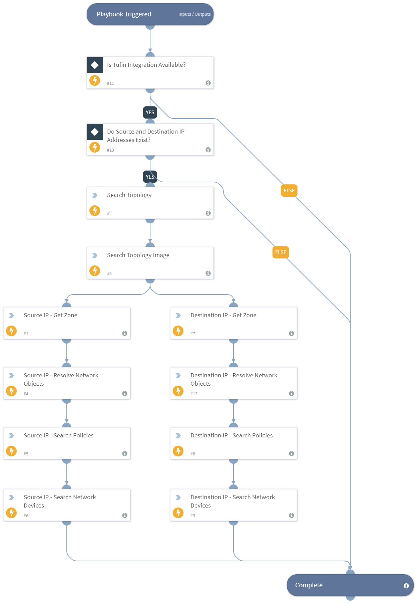

Enrich source and destination IP information using SecureTrack.  Returns information such as the associated zones, network objects and policies for the addresses, if the addresses are network devices, and a topology map from source to destination.

## Dependencies
This playbook uses the following sub-playbooks, integrations, and scripts.

### Sub-playbooks
This playbook does not use any sub-playbooks.

### Integrations
* Tufin

### Scripts
This playbook does not use any scripts.

### Commands
* tufin-search-devices
* tufin-search-topology
* tufin-get-zone-for-ip
* tufin-policy-search
* tufin-object-resolve
* tufin-search-topology-image

## Playbook Inputs
---

| **Name** | **Description** | **Default Value** | **Required** |
| --- | --- | --- | --- |
| SourceIP | Source IP address, including subnet mask \(ex: 192.168.1.1/32\) |  | Required |
| DestinationIP | Destination IP address, including subnet mask \(ex: 192.168.1.1/32\) |  | Required |

## Playbook Outputs
---

| **Path** | **Description** | **Type** |
| --- | --- | --- |
| Tufin.Zone.ID | Tufin Zone ID | unknown |
| Tufin.Zone.Name | Tufin Zone Name | unknown |
| Tufin.Topology.TrafficAllowed | Traffic Permitted | unknown |
| Tufin.Topology.TrafficDevices | List of devices in path | unknown |
| Tufin.ObjectResolve.NumberOfObjects | Number of objects that resolve to given IP address. | unknown |
| Tufin.Policysearch.NumberRulesFound | Number of rules found via search | unknown |
| Tufin.Device.ID | Device ID | unknown |
| Tufin.Device.Name | Device name | unknown |
| Tufin.Device.Vendor | Device vendor | unknown |
| Tufin.Device.Model | Device model | unknown |
| Tufin.Device.IP | Device IP | unknown |

## Playbook Image
---

