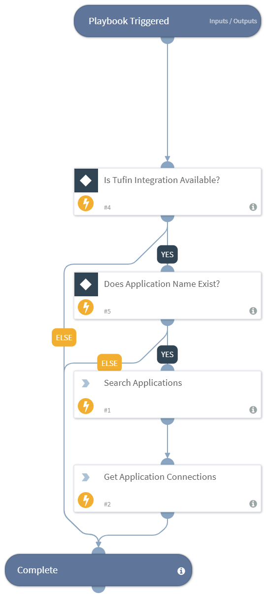

Search SecureApp by application name and retrieve basic application information and all application connections.

## Dependencies
This playbook uses the following sub-playbooks, integrations, and scripts.

### Sub-playbooks
This playbook does not use any sub-playbooks.

### Integrations
* Tufin

### Scripts
This playbook does not use any scripts.

### Commands
* tufin-search-application-connections
* tufin-search-applications

## Playbook Inputs
---

| **Name** | **Description** | **Default Value** | **Required** |
| --- | --- | --- | --- |
| ApplicationName | Name of the application to query |  | Required |

## Playbook Outputs
---

| **Path** | **Description** | **Type** |
| --- | --- | --- |
| Tufin.App.ID | Application ID | unknown |
| Tufin.App.Name | Application name | unknown |
| Tufin.App.Status | Application status | unknown |
| Tufin.App.Decommissioned | Is the application decommissioned | unknown |
| Tufin.App.OwnerID | Application owner ID | unknown |
| Tufin.App.OwnerName | Application owner name | unknown |
| Tufin.App.Comments | Application comments | unknown |
| Tufin.AppConnection.ID | Connection ID | unknown |
| Tufin.AppConnection.Name | Connection name | unknown |
| Tufin.AppConnection.AppID | Application ID | unknown |
| Tufin.AppConnection.Status | Connection status | unknown |
| Tufin.AppConnection.Source | Connection source list | unknown |
| Tufin.AppConnection.Destination | Connection destination list | unknown |
| Tufin.AppConnection.Service | Connection service list | unknown |
| Tufin.AppConnection.Comment | Connection comment | unknown |

## Playbook Image
---

