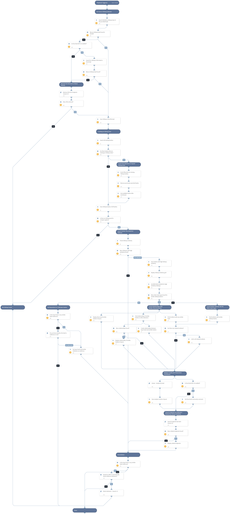

This playbook leverages the case management and TIM aspects of XSOAR to uncover unknown malware.
The playbook does the following:
- Gets the SSDeep hash of a known malicious MD5 or SHA256 hash by enriching the hash via VirusTotal, and attempting to retrieve the related file from an endpoint.
- Creates relationships between otherwise unknown indicators - based on their correspondence to the SSDeep that was deemed similar to the original SSDeep of the malicious hash.
- Links incidents that had any of the indicators which were found related based on the SSDeep hash similarity.
- Hunts for the presence of the related indicators across the different organization assets.
- Enriches the original hash to get the threat actor, malware family and VirusTotal community comments.

These steps allow the analyst to find new files, incidents and endpoints which could be related to the the original hash that was searched simply based on the similarity of SSDeep hashes.

## Dependencies
This playbook uses the following sub-playbooks, integrations, and scripts.

### Sub-playbooks
* Search Endpoints By Hash - Generic V2
* Intezer - Analyze by hash
* Retrieve File from Endpoint - Generic V3

### Integrations
* VirusTotal (API v3)

### Scripts
* SetAndHandleEmpty
* IsIntegrationAvailable
* SSDeepSimilarity
* CreateIndicatorRelationship
* DeleteContext
* SearchIncidentsV2
* Set
* SearchIndicatorRelationships
* SetGridField

### Commands
* setIncident
* vt-comments-get
* file
* findIndicators
* enrichIndicators
* linkIncidents

## Playbook Inputs
---

| **Name** | **Description** | **Default Value** | **Required** |
| --- | --- | --- | --- |
| fileHash | The file hash to hunt for. Supported hash types are MD5 and SHA256. | incident.filehash | Required |
| SimilarityThreshold | SSDeep hashes with a similarity value equal to or greater than the value specified, will be considered as similar hashes. The SSDeep hashes are given a similarity value between 0 and 100. The similarity is calculated based on the linux "ssdeep" command which is based on the SpamSum program. It basically calculates how many character edits are needed to reach from one hash to the other hash. More information can be found in: https://www.samba.org/ftp/unpacked/junkcode/spamsum/README | 50 | Required |
| SearchFromDate | When looking for existing hashes in the system, this is the date that it will look for hashes from. The value should be in YYYY-MM-DDTHH:MM:SS. For example: 2022-02-15T08:31:00 | 2020-01-01 00:00:00 | Optional |
| EnrichExistingIndicators | Whether indicators found in XSOAR will be enriched using the enrichIndicators command. Note: this may use up quota in your threat intelligence products. This is used to increase the SSDeep pool size to improve the coverage when comparing the input hash against other SSDeeps in the system. | False | Optional |

## Playbook Outputs
---
There are no outputs for this playbook.

## Playbook Image
---
