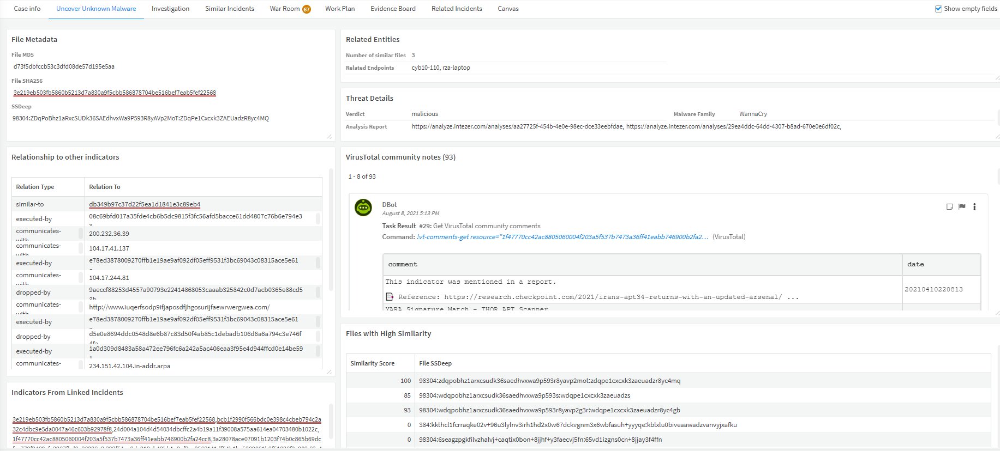

This pack allows you to uncover malware that was previously unknown to you, by comparing its SSDeep hash to other SSDeep hashes.
## What does this pack do?
Once the user creates an incident of type Uncover Unknown Malware Using SSDeep and provides an MD5 or SHA256 hash, or a file, the playbook will do the following:
- Enrich the input MD5 / SHA256 hash to get its respective other hash types, including its SSDeep hash, or retrieve the file from an endpoint to obtain those hashes.
- Enrich existing indicators in the system, and create a pool of known SSDeep hashes.
- Enrich the input hash to get the malware family, verdict and analysis report from Intezer, and the community comments from VirusTotal.
- Compare the SSDeep hash of the original hash against the pool of known SSDeep hashes to find similarities to other files.
- Create relationships between all other hash types of the SSDeep hashes that are similar to the orihinal hash.
- Search for incidents with any similar hashes which were detected based on the similarity of their SSDeep hashes, and link them.
- Aggregate the relationships of similar hashes to other indicators and display them in the layout.
- If the input hash or similar hashes were found as malicious - mark the rest of them as malicious too.
- Remediate the incident by blocking indicators that were found as malicious.

## Pack Image

