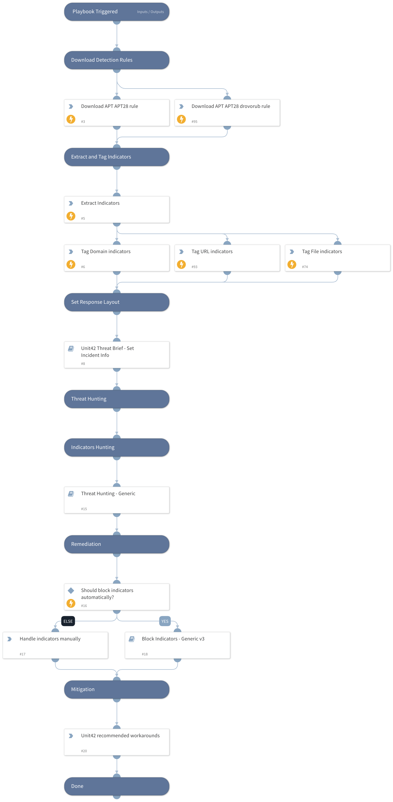

A Russian threat actor we track as Fighting Ursa advertised a car for sale as a lure to distribute HeadLace backdoor malware. The campaign likely targeted diplomats and began as early as March 2024. Fighting Ursa (aka APT28, Fancy Bear and Sofacy) has been associated with Russian military intelligence and classified as an advanced persistent threat (APT).

Diplomatic-car-for-sale phishing lure themes have been used by Russian threat actors for years. These lures tend to resonate with diplomats and get targets to click on the malicious content.

Unit 42 has previously observed other threat groups using this tactic. For example, in 2023, a different Russian threat group, Cloaked Ursa, repurposed an advertisement for a BMW for sale to target diplomatic missions within Ukraine. This campaign is not directly connected to the Fighting Ursa campaign described here. However, the similarity in tactics points to known behaviors of Fighting Ursa. The Fighting Ursa group is known for repurposing successful tactics – even continuously exploiting known vulnerabilities for 20 months after their cover was already blown.

The details of the March 2024 campaign, which we attribute to Fighting Ursa with a medium to high level of confidence, indicate the group targeted diplomats and relied on public and free services to host various stages of the attack. This article examines the infection chain from the attack.

Palo Alto Networks customers are better protected from the threats discussed in this article through our Network Security solutions, such as Advanced WildFire and Advanced URL Filtering, as well as our Cortex line of products.

If you think you might have been compromised or have an urgent matter, contact the Unit 42 Incident Response team.

## Dependencies

This playbook uses the following sub-playbooks, integrations, and scripts.

### Sub-playbooks

* Threat Hunting - Generic
* Block Indicators - Generic v3
* Rapid Breach Response - Set Incident Info

### Integrations

This playbook does not use any integrations.

### Scripts

* HttpV2

### Commands

* extractIndicators
* createNewIndicator

## Playbook Inputs

---

| **Name** | **Description** | **Default Value** | **Required** |
| --- | --- | --- | --- |
| PlaybookDescription | The playbook description to be used in the Rapid Breach Response - Set Incident Info sub-playbook. | A Russian threat actor we track as Fighting Ursa advertised a car for sale as a lure to distribute HeadLace backdoor malware. The campaign likely targeted diplomats and began as early as March 2024. Fighting Ursa (aka APT28, Fancy Bear and Sofacy) has been associated with Russian military intelligence and classified as an advanced persistent threat (APT).  Diplomatic-car-for-sale phishing lure themes have been used by Russian threat actors for years. These lures tend to resonate with diplomats and get targets to click on the malicious content.  Unit 42 has previously observed other threat groups using this tactic. For example, in 2023, a different Russian threat group, Cloaked Ursa, repurposed an advertisement for a BMW for sale to target diplomatic missions within Ukraine. This campaign is not directly connected to the Fighting Ursa campaign described here. However, the similarity in tactics points to known behaviors of Fighting Ursa. The Fighting Ursa group is known for repurposing successful tactics – even continuously exploiting known vulnerabilities for 20 months after their cover was already blown.  The details of the March 2024 campaign, which we attribute to Fighting Ursa with a medium to high level of confidence, indicate the group targeted diplomats and relied on public and free services to host various stages of the attack. This article examines the infection chain from the attack.  Palo Alto Networks customers are better protected from the threats discussed in this article through our Network Security solutions, such as Advanced WildFire and Advanced URL Filtering, as well as our Cortex line of products.  If you think you might have been compromised or have an urgent matter, contact the Unit 42 Incident Response team. | Optional |
| autoBlockIndicators | Whether to block the indicators automatically. | False | Optional |

## Playbook Outputs

---
There are no outputs for this playbook.

## Playbook Image

---

