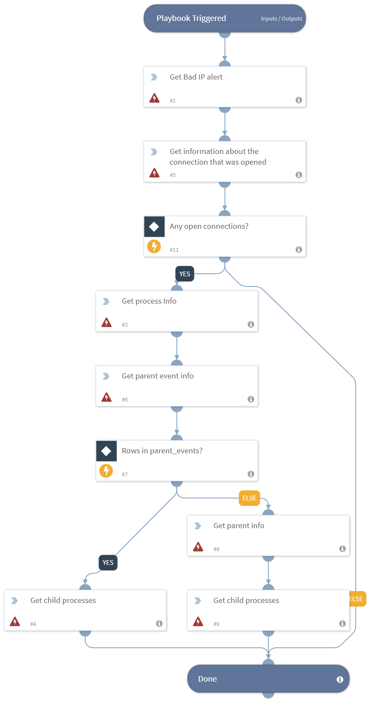

Gets information about connections from IOC incidents.

## Dependencies
This playbook uses the following sub-playbooks, integrations, and scripts.

### Sub-playbooks
This playbook does not use any sub-playbooks.

### Integrations
This playbook does not use any integrations.

### Scripts
This playbook does not use any scripts.

### Commands
* uptycs-get-alerts
* uptycs-get-socket-events
* uptycs-get-parent-information
* uptycs-get-parent-event-information
* uptycs-get-process-event-information
* uptycs-get-process-child-processes

## Playbook Inputs
---

| **Name** | **Description** | **Default Value** |  **Required** |
| --- | --- | --- | --- | 
| alert_id | The unique Uptycs ID for a particular alert. | ${incident.alertid} | Required |

## Playbook Outputs
---

| **Path** | **Description** | **Type** |
| --- | --- | --- |
| Uptycs.ProcEvent.pid | The PID for the process. | number |
| Uptycs.ProcEvent.upt_time | The time that the process was spawned. | date |
| Uptycs.ParentEvent.pid | The PID of the process (this is the same number as the input argument 'parent'). | number |
| Uptycs.ParentEvent.upt_time | The time that the process was spawned. | date |
| Uptycs.Children.pid | The PID of a child process. | number |
| Uptycs.Children.upt_add_time | The time that the process was spawned. | date |
| Uptycs.Children.upt_remove_time | The time that the process was removed. | date |

## Playbook Image
---

