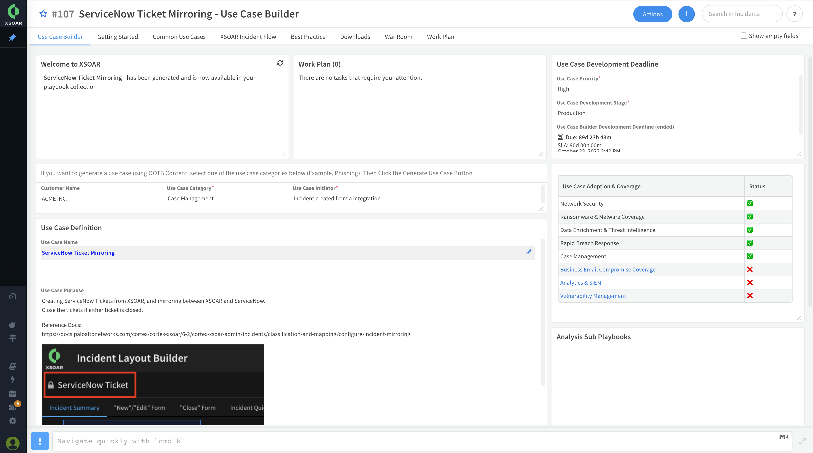
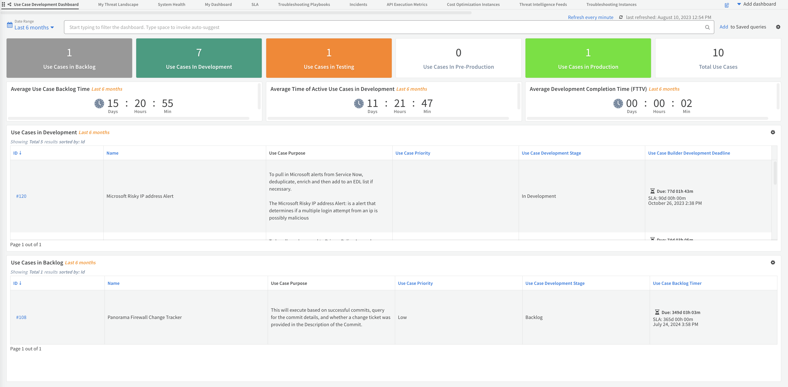

# Use Case Builder Implementation Guide

The Use Case builder contains tools to help you measure and track use cases through your automation journey, quickly autogenerate OOTB playbooks and custom workflows and more.

## Setup And Configuration

To run this content you will need to setup the **Cortex REST API** integration. To do this, simply download and install the content from the marketplace, generate a api key, then add your api key to the instance (Choosing the standard authentication method.) Once that is complete, you can start using the Use Case Builder!

## Default Incident Type

This Pack includes an Incident Type of '**Use Case Builder**', which is the starting point for creating new Use Cases.  To use this, navigate to the +New Incidents -> Select Type -> Use Case Builder+ and fill out the form to begin.

## Layouts

The Use Case type has an optimized layout for both the summary pages, and the new/edit screen.  This layout includes some useful information and dropdowns to kickstart your automation journey

## Playbook

The default playbook is **Use Case Builder**, this playbook is performs alot of complex task and time consuming actions for you. At it's core the playbook simply does the following:

- Provide important information to get you started.
- Clones and Autogenerates playbooks based off your selections
- Set SLAs and Timers for the development stages 
- Renders Markdown and HTML
- Generates the Use Case Defintion Document
- Evaluates XSOAR Usage and sets Adoption Metrics

### Timers

Optionally this playbook has built in Timers for adding metrics for time spent In Development, Testing, Backlog, Production,etc.  

## Dashboards

This pack includes 1 dashboards:

- **Use Case Development Dashboard**: High level summary of all Use Cases in Development and their associated metric data.

## Dynamic Sections

There are Several Dynamic sections in this pack such as the **Getting Started**, **Common Use Cases** and **Incident Flow** section which are your guide to following XSOAR Best Practices and creating great use cases
