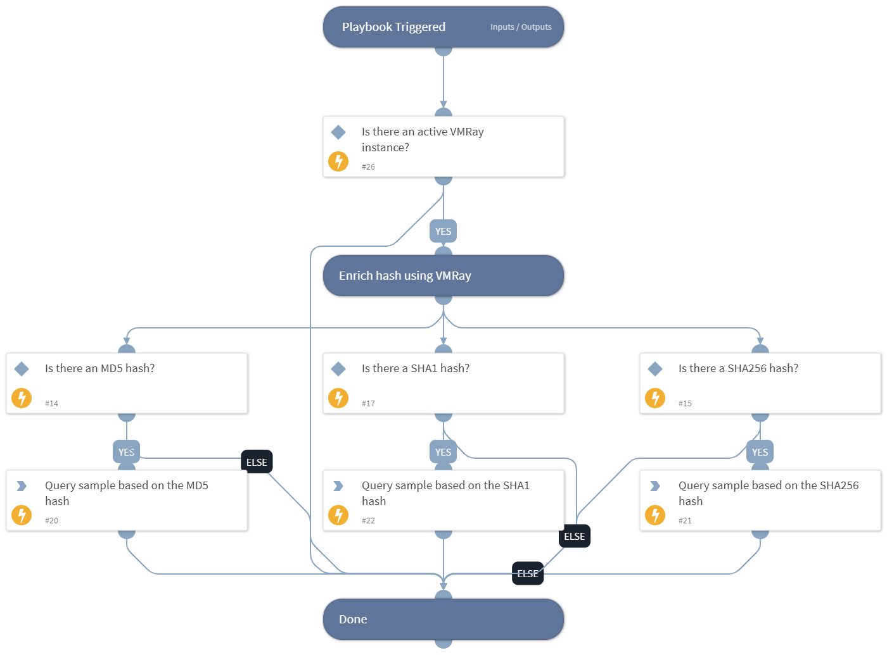

Get file information using the VMRay integration.

## Dependencies
This playbook uses the following sub-playbooks, integrations, and scripts.

### Sub-playbooks
This playbook does not use any sub-playbooks.

### Integrations
* VMRay

### Scripts
* IsIntegrationAvailable

### Commands
* vmray-get-sample-by-hash

## Playbook Inputs
---

| **Name** | **Description** | **Default Value** | **Required** |
| --- | --- | --- | --- |
| MD5 | File MD5 to enrich | File.MD5 | Optional |
| SHA256 | File SHA256 to enrich | File.SHA256 | Optional |
| SHA1 | File SHA1 to enrich | File.SHA1 | Optional |

## Playbook Outputs
---

| **Path** | **Description** | **Type** |
| --- | --- | --- |
| File.Name | The full file name \(including file extension\). | String |
| File.MD5 | The MD5 hash of the file. | String |
| File.SHA1 | The SHA1 hash of the file. | String |
| File.SHA256 | The SHA256 hash of the file. | String |
| File.SSDeep | The SSDeep hash of the file. | String |
| DBotScore.Indicator | The indicator that was tested. | String |
| DBotScore.Type | The indicator type. | String |
| DBotScore.Vendor | The vendor used to calculate the score. | String |
| DBotScore.Score | The actual score. | Number |
| DBotScore.Reliability | String | Reliability of the source providing the intelligence data. |
| VMRay.Sample.SampleID | ID of the sample. | Number |
| VMRay.Sample.SampleURL | URL to sample page. | String |
| VMRay.Sample.FileName | File name of the sample. | String |
| VMRay.Sample.MD5 | MD5 hash of the sample. | String |
| VMRay.Sample.SHA1 | SHA1 hash of the sample. | String |
| VMRay.Sample.SHA256 | SHA256 hash of the sample. | String |
| VMRay.Sample.SSDeep | ssdeep hash of the sample. | String |
| VMRay.Sample.Verdict | Verdict for the sample \(Malicious, Suspicious, Clean, Not Available\). | String |
| VMRay.Sample.VerdictReason | Description of the Verdict Reason. | String |
| VMRay.Sample.Severity | Severity of the sample in the submission \(Malicious, Suspicious, Good, Blacklisted, Whitelisted, Unknown\). Deprecated. | String |
| VMRay.Sample.Type | File type. | String |
| VMRay.Sample.Created | Timestamp of sample creation. | Date |
| VMRay.Sample.Classifications | Classifications of the sample. | String |
| VMRay.Sample.ChildSampleIDs | List of child sample IDs. | Number |
| VMRay.Sample.ParentSampleIDs | List of parent sample IDs. | Number |

## Playbook Image
---
