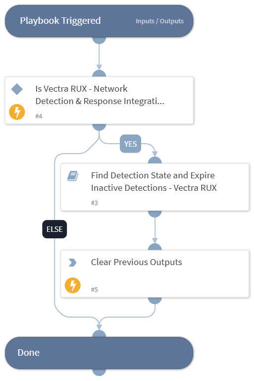

This playbook identifies incidents with inactive detections and updates their status to "expired".

## Dependencies

This playbook uses the following sub-playbooks, integrations, and scripts.

### Sub-playbooks

* Find Detection State and Expire Inactive Detections - Vectra RUX

### Integrations

This playbook does not use any integrations.

### Scripts

This playbook does not use any scripts.

### Commands

This playbook does not use any commands.

## Playbook Inputs

---

| **Name** | **Description** | **Default Value** | **Required** |
| --- | --- | --- | --- |
| incident_type | Provide the incident type. | Vectra RUX Events Detection | Optional |

## Playbook Outputs

---
There are no outputs for this playbook.

## Playbook Image

---

