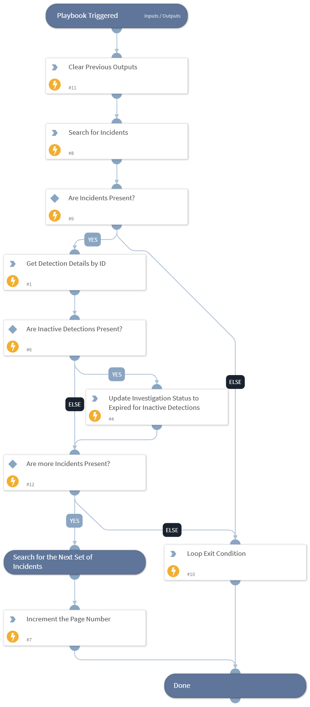

This playbook identifies the detection states of incidents and updates the investigation status of inactive detections to "expired".

## Dependencies

This playbook uses the following sub-playbooks, integrations, and scripts.

### Sub-playbooks

This playbook does not use any sub-playbooks.

### Integrations

This playbook does not use any integrations.

### Scripts

* DeleteContext
* Set
* VectraRUXGetIncidents

### Commands

* vectra-detection-describe
* vectra-detection-investigation-status-update

## Playbook Inputs

---

| **Name** | **Description** | **Default Value** | **Required** |
| --- | --- | --- | --- |
| incident_type | The XSOAR incident type to search for inactive detections. Default is 'Vectra RUX Events Detection'. | Vectra RUX Events Detection | Optional |

## Playbook Outputs

---
There are no outputs for this playbook.

## Playbook Image

---

