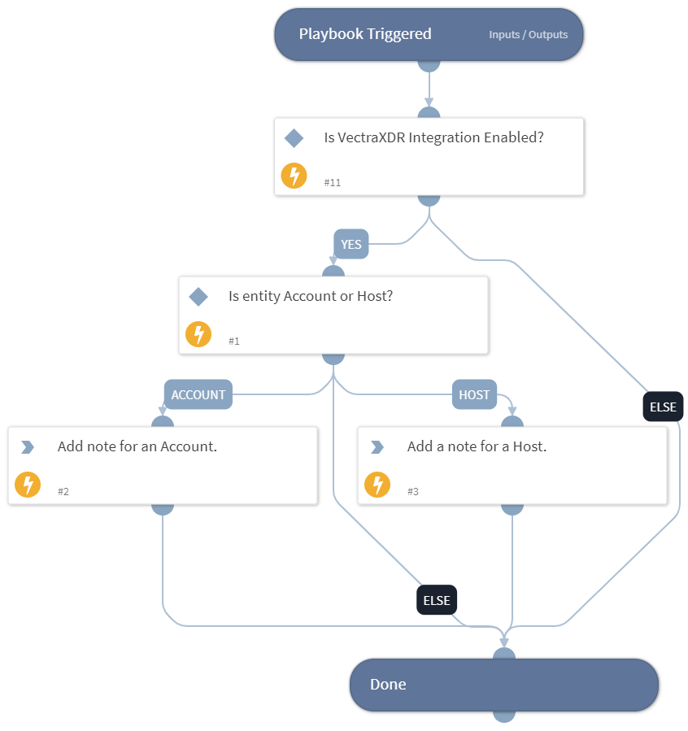

This playbook will add a note in Vectra for an entity based on its type.

## Dependencies

This playbook uses the following sub-playbooks, integrations, and scripts.

### Sub-playbooks

This playbook does not use any sub-playbooks.

### Integrations

* VectraXDR

### Scripts

This playbook does not use any scripts.

### Commands

* vectra-entity-note-add

## Playbook Inputs

---
There are no inputs for this playbook.

## Playbook Outputs

---
There are no outputs for this playbook.

## Playbook Image

---

