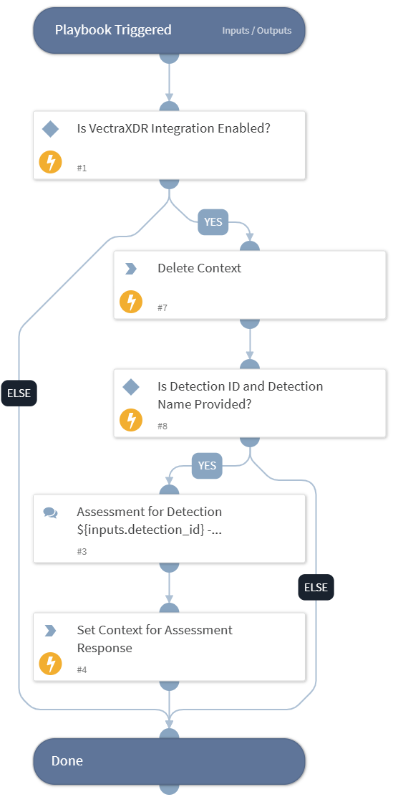

This playbook conducts a detection assessment and saves the result in context data.

## Dependencies

This playbook uses the following sub-playbooks, integrations, and scripts.

### Sub-playbooks

This playbook does not use any sub-playbooks.

### Integrations

This playbook does not use any integrations.

### Scripts

* DeleteContext
* Set

### Commands

This playbook does not use any commands.

## Playbook Inputs

---

| **Name** | **Description** | **Default Value** | **Required** |
| --- | --- | --- | --- |
| detection_id | ID of the Detection. |  | Optional |
| detection_name | Name of the Detection. |  | Optional |

## Playbook Outputs

---
There are no outputs for this playbook.

## Playbook Image

---

