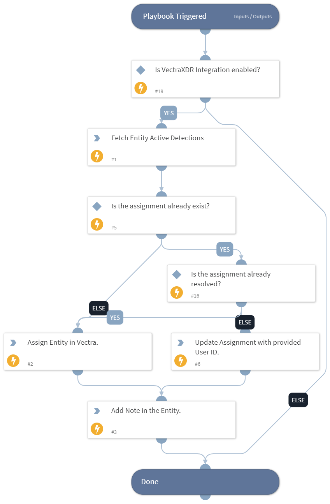

This playbook is called from the Process Incident - Vectra XDR playbook. It will fetch all active detections for the entity under investigation. It will then assign the entity to a user; if an assignment already exists, it will update that assignment and add a note in Vectra.

## Dependencies

This playbook uses the following sub-playbooks, integrations, and scripts.

### Sub-playbooks

This playbook does not use any sub-playbooks.

### Integrations

* VectraXDR

### Scripts

* DeleteContext

### Commands

* vectra-entity-assignment-update
* vectra-assignment-list
* vectra-entity-detection-list
* vectra-entity-note-add
* vectra-entity-assignment-add

## Playbook Inputs

---

| **Name** | **Description** | **Default Value** | **Required** |
| --- | --- | --- | --- |
| UserID | User ID for entity assignment. |  | Optional |

## Playbook Outputs

---
There are no outputs for this playbook.

## Playbook Image

---

