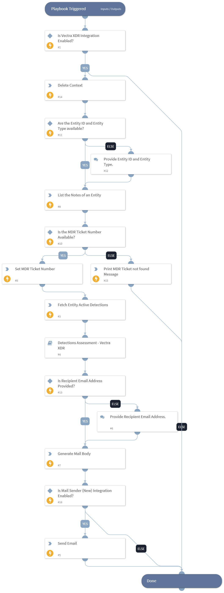

This playbook retrieves the MDR ticket number associated with the given entity by parsing its notes. It then collects the entity's active detections, performs a detection assessment, and sends the results to the designated recipient via email.

## Dependencies

This playbook uses the following sub-playbooks, integrations, and scripts.

### Sub-playbooks

* Detections Assessment - Vectra XDR

### Integrations

This playbook does not use any integrations.

### Scripts

* Set
* DeleteContext
* VectraXDRGenerateMailBody

### Commands

* vectra-entity-note-list
* send-mail
* vectra-entity-detection-list

## Playbook Inputs

---

| **Name** | **Description** | **Default Value** | **Required** |
| --- | --- | --- | --- |
| entity_id | The ID of the entity. | incident.vectraxdrentityid | Optional |
| entity_type | The type of the entity. | incident.vectraxdrentitytype | Optional |
| recipient_email | The recipient email address for MDR escalation process. |  | Optional |
| detection_assessment_limit | The number of the active detection to be assessed. | 50 | Optional |

## Playbook Outputs

---
There are no outputs for this playbook.

## Playbook Image

---

