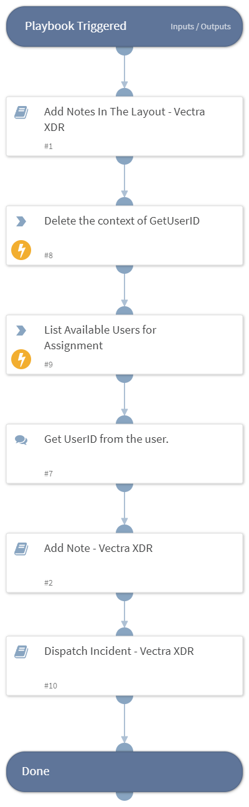

This playbook is used to initiate the processing of an incident. This playbook runs when a pending incident is selected for investigation. It will change the state from pending to active and it will list the available users in Vectra and request the user ID to use for assignment. Once the data collection is complete, it will call the Dispatch Incident - Vectra XDR playbook

## Dependencies

This playbook uses the following sub-playbooks, integrations, and scripts.

### Sub-playbooks

* Add Notes In The Layout - Vectra XDR
* Add Note - Vectra XDR 
* Dispatch Incident - Vectra XDR

### Integrations

This playbook does not use any integrations.

### Scripts

* DeleteContext

### Commands

* vectra-user-list

## Playbook Inputs

---
There are no inputs for this playbook.

## Playbook Outputs

---
There are no outputs for this playbook.

## Playbook Image

---

