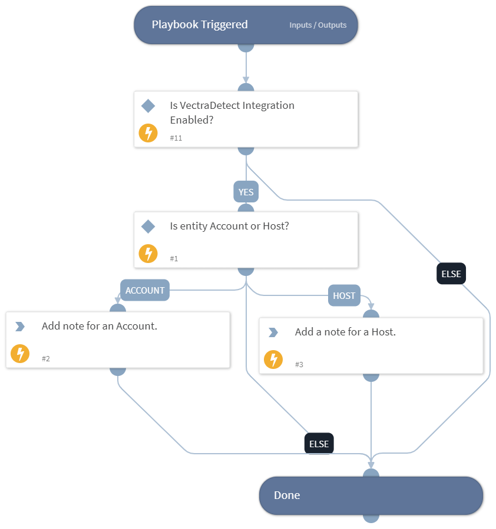

This playbook will add a note in Vectra for an entity based on its type.

## Dependencies

This playbook uses the following sub-playbooks, integrations, and scripts.

### Sub-playbooks

This playbook does not use any sub-playbooks.

### Integrations

This playbook does not use any integrations.

### Scripts

This playbook does not use any scripts.

### Commands

* vectra-account-note-add
* vectra-host-note-add

## Playbook Inputs

---

| **Name** | **Description** | **Default Value** | **Required** |
| --- | --- | --- | --- |
| entity_type | Type of the entity. | incident.vectraentitytype | Optional |
| entity_id | ID of the entity. | incident.accountid | Optional |

## Playbook Outputs

---
There are no outputs for this playbook.

## Playbook Image

---

