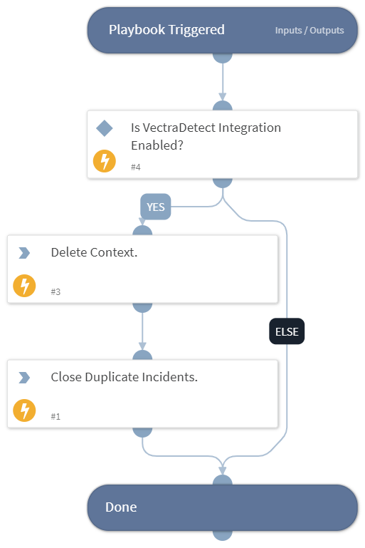

This playbook is called from the Close All Duplicate XSOAR Incidents - Vectra Detect playbook. It will close the duplicate incidents in XSOAR and resolve its assignment in Vectra.

## Dependencies

This playbook uses the following sub-playbooks, integrations, and scripts.

### Sub-playbooks

This playbook does not use any sub-playbooks.

### Integrations

This playbook does not use any integrations.

### Scripts

* DeleteContext
* VectraDetectCloseDuplicateIncidents

### Commands

This playbook does not use any commands.

## Playbook Inputs

---

| **Name** | **Description** | **Default Value** | **Required** |
| --- | --- | --- | --- |
| page_size | Specify the number of incidents to close during a single execution. | 50 | Optional |
| note | The note to add to the closed incidents. | Duplicate. Closed. | Optional |
| close_in_vectra | If set to true, the playbook will close the entity's assignment in Vectra platform. This option is supported only when instance of Vectra Detect integration is enabled. | True | Optional |
| incident_types | Specify the incident type(s) to close duplicate incidents. Supports comma-separated values. | Vectra Account, Vectra Host | Optional |

## Playbook Outputs

---
There are no outputs for this playbook.

## Playbook Image

---

