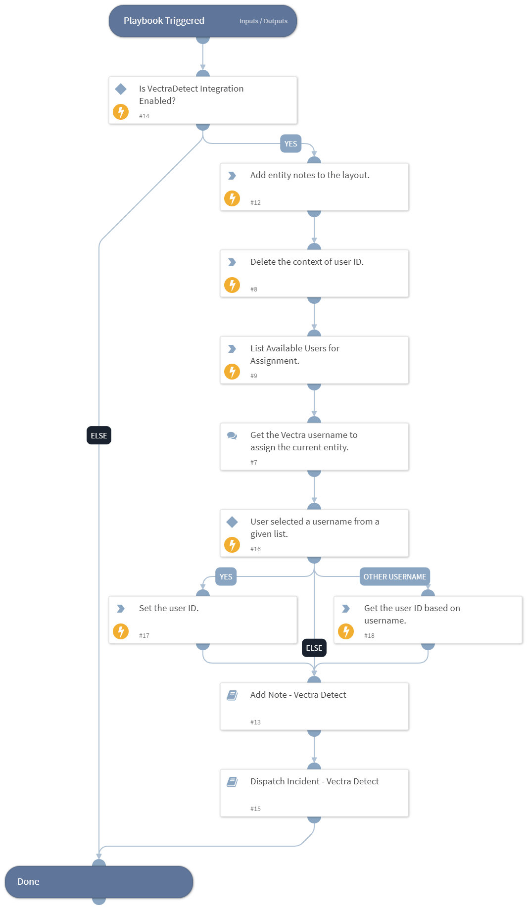

This playbook is used to initiate the processing of an incident. This playbook runs when a pending incident is selected for investigation. It will change the state from pending to active and it will list the available users in Vectra and request the user ID to use for assignment. Once the data collection is complete, it will call the Dispatch Incident - Vectra Detect playbook.

## Dependencies

This playbook uses the following sub-playbooks, integrations, and scripts.

### Sub-playbooks

* Add Note - Vectra Detect
* Dispatch Incident - Vectra Detect

### Integrations

This playbook does not use any integrations.

### Scripts

* VectraDetectAddNotesInLayouts
* Set
* DeleteContext

### Commands

* vectra-search-users

## Playbook Inputs

---

| **Name** | **Description** | **Default Value** | **Required** |
| --- | --- | --- | --- |
| entity_id | ID of the entity. | incident.accountid | Optional |
| entity_type | Type of the entity. | incident.vectraentitytype | Optional |

## Playbook Outputs

---
There are no outputs for this playbook.

## Playbook Image

---

