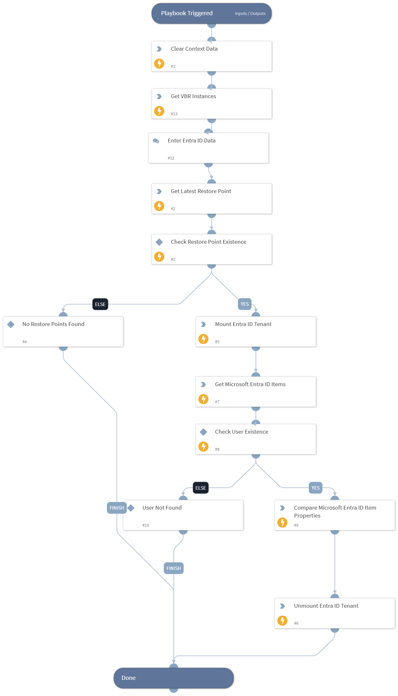

Compares Microsoft Entra ID item properties between a restore point and production.

## Dependencies

This playbook uses the following sub-playbooks, integrations, and scripts.

### Sub-playbooks

This playbook does not use any sub-playbooks.

### Integrations

* VBR REST API

### Scripts

* DeleteContext
* GetInstances

### Commands

* veeam-vbr-compare-entra-id-item-properties
* veeam-vbr-get-entra-id-items
* veeam-vbr-get-restore-points
* veeam-vbr-mount-entra-id-tenant
* veeam-vbr-unmount-entra-id-tenant

## Playbook Inputs

---

| **Name** | **Description** | **Default Value** | **Required** |
| --- | --- | --- | --- |
| Instance |  | incident.sourceInstance | Optional |

## Playbook Outputs

---

| **Path** | **Description** | **Type** |
| --- | --- | --- |
| Veeam.VBR.get_entra_id_item_restore_points.data.id | Restore point ID. | unknown |
| Veeam.VBR.get_entra_id_item_restore_points.data.creationTime | Date and time when the restore point was created. | unknown |

## Playbook Image

---

