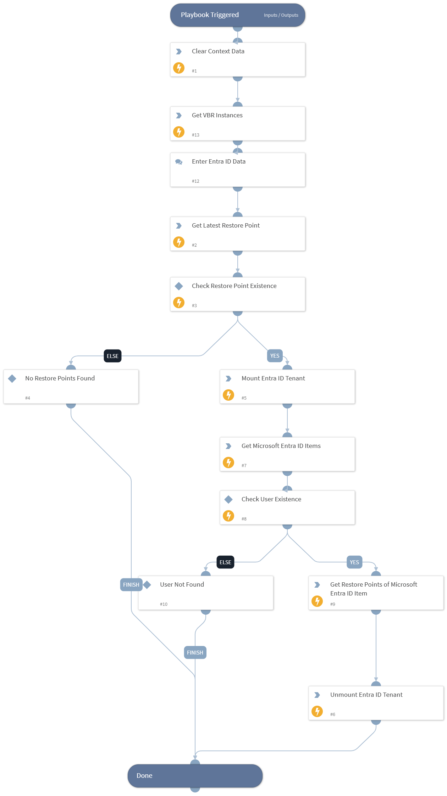

Checks if a user exists in a Microsoft Entra ID tenant backup.

## Dependencies

This playbook uses the following sub-playbooks, integrations, and scripts.

### Sub-playbooks

This playbook does not use any sub-playbooks.

### Integrations

* VBR REST API

### Scripts

* DeleteContext
* GetInstances

### Commands

* veeam-vbr-get-entra-id-item-restore-points
* veeam-vbr-get-entra-id-items
* veeam-vbr-get-restore-points
* veeam-vbr-mount-entra-id-tenant
* veeam-vbr-unmount-entra-id-tenant

## Playbook Inputs

---
There are no inputs for this playbook.

## Playbook Outputs

---

| **Path** | **Description** | **Type** |
| --- | --- | --- |
| Veeam.VBR.get_entra_id_item_restore_points.data.id | Restore point ID. | unknown |
| Veeam.VBR.get_entra_id_item_restore_points.data.creationTime | Date and time when the restore point was created. | unknown |

## Playbook Image

---

