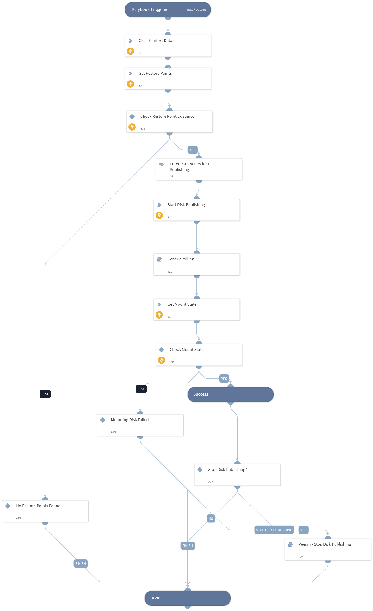

Starts a disk publishing session for a specific restore point.

## Dependencies

This playbook uses the following sub-playbooks, integrations, and scripts.

### Sub-playbooks

* GenericPolling
* Veeam - Stop Disk Publishing

### Integrations

* VBR REST API

### Scripts

* DeleteContext

### Commands

* veeam-vbr-get-disk-publishing-mount-point
* veeam-vbr-get-restore-points
* veeam-vbr-start-disk-publishing

## Playbook Inputs

---

| **Name** | **Description** | **Default Value** | **Required** |
| --- | --- | --- | --- |
| Instance |  | incident.sourceInstance | Optional |
| backupObjectId |  | incident.veeambackupobjectid | Optional |
| Indicator Query | Indicators matching the indicator query will be used as playbook input |  | Optional |

## Playbook Outputs

---
There are no outputs for this playbook.

## Playbook Image

---

